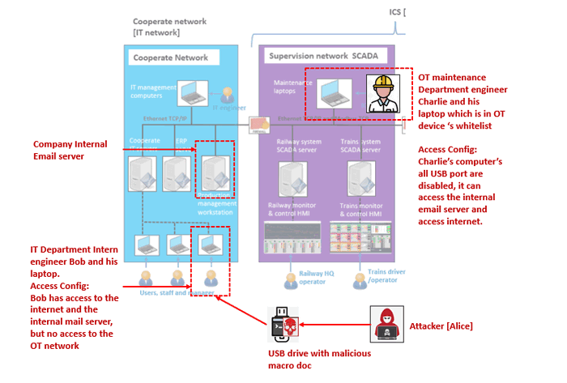
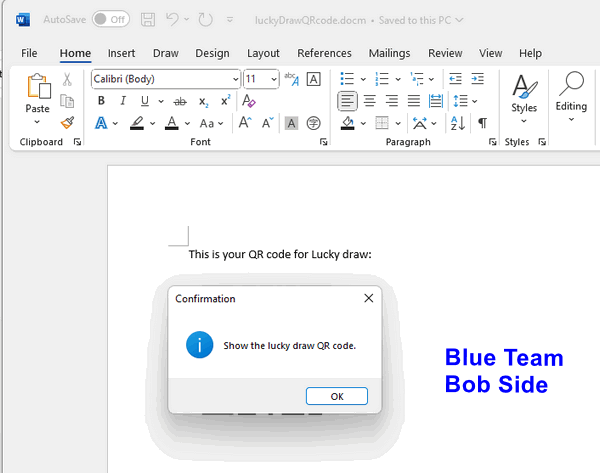

# IT System Cyber Attack Case Study 01 

### Malicious Macro and Backdoor Trojan Attack on IT-Network


**Project Design Purpose**: The objective of this cyber attack case study is to develop a workshop showcasing a practical demonstration of a red team attacker implementing an IT system/network attack via a Malicious Macro MS-Office-Word file (`CVE-2015-1641`) and phishing email generation program to penetrate multiple layers of firewall defenses and implant a backdoor trojan into the railway system's OT network.

**Related Links**:  [GitHub Project Link](https://github.com/LiuYuancheng/Cross-Sword-2023-Nato-Event/blob/main/attackDemos/IT_Attack_CaseStudy/IT_Attak_CaseStudy.md) , [LinkedIn Post Link](https://www.linkedin.com/pulse/it-ot-cyber-attack-workshop-case-study-00-malicious-macro-liu-eceyc/?trackingId=HsYMBsqEaFz5la2BnuiRyw%3D%3D)

**Attacker Vector**: `Malicious Macro Attack`, `Phishing Email Attack`, `Backdoor Trojan Attack`

**Matched MIRTE-CWD**: `CWE-94` , `CWE-827`, `CWE-494`, `CWE-829`, `CWE-840`

**Mapped MITRE-ATT&CK-TTP**: `T1204.002`, `T1027`, `T1566.001`, `T1204.002` , `T1021`, `T1573`

>  Important : The demonstrated attack case is used for education and training for different level of IT-OT cyber security ICS course, please don't apply it on any real world system.

```
# version:		v0.1.2
# Created:     	February 18, 2024
# Copyright:   	Copyright (c) 2024 LiuYuancheng
# License:     	MIT License
```

**Table of Contents**

[TOC]

- [IT-OT Cyber Attack Case Study [ Malicious Macro and Backdoor Trojan Attack on IT-network ]](#it-ot-cyber-attack-case-study---malicious-macro-and-backdoor-trojan-attack-on-it-network--)
    + [Introduction](#introduction)
      - [Introduction of Railway System Mini Cyber Range IT Network](#introduction-of-railway-system-mini-cyber-range-it-network)
      - [Introduction of Microsoft Word Malicious Macro Attack Emulation](#introduction-of-microsoft-word-malicious-macro-attack-emulation)
      - [Introduction of Automated Phishing Email Deployment Program](#introduction-of-automated-phishing-email-deployment-program)
      - [Introduction of Backdoor Trojan C2 System](#introduction-of-backdoor-trojan-c2-system)
    + [Background Knowledge](#background-knowledge)
        * [Microsoft Office Word Macro](#microsoft-office-word-macro)
        * [MS-Office Macro Security](#ms-office-macro-security)
        * [CVE-2015-1641](#cve-2015-1641)
    + [IT Cyber Attack Design](#it-cyber-attack-design)
      - [Attack Pre-condition Introduction](#attack-pre-condition-introduction)
      - [Attack Scenario Design](#attack-scenario-design)
    + [IT Cyber Attack Demo](#it-cyber-attack-demo)
      - [[Step 1] Building the Malicious Macro Word Document and the Attack USB Driver](#-step-1--building-the-malicious-macro-word-document-and-the-attack-usb-driver)
      - [[Step 2] Trojan installation and Critical Data Leakage](#-step-2--trojan-installation-and-critical-data-leakage)
      - [[Step 3] Remote Control Victim to Scan the Rail-Op Network](#-step-3--remote-control-victim-to-scan-the-rail-op-network)
      - [[Step 4] Steal Critical Files and Eavesdropping](#-step-4--steal-critical-files-and-eavesdropping)
    + [MITRE CWE Matching and ATT&CK Mapping](#mitre-cwe-matching-and-att-ck-mapping)
      - [MITRE CWE(Common Weakness Enumeration) Matching](#mitre-cwe-common-weakness-enumeration--matching)
      - [MITRE ATT&CK (Adversarial Tactics, Techniques, and Common Knowledge) Mapping](#mitre-att-ck--adversarial-tactics--techniques--and-common-knowledge--mapping)

------

### Introduction 

This case study aims to demonstrate how an unsuspecting staff member (blue team) can become a target of a red team attacker, showcasing the utilization of various attack vectors to bypass multiple security mechanisms and ultimately breach the railway OT network from an external source. The attack demonstration will encompass four primary projects:

- Railway [Metro] IT/OT System Cyber Security Test Platform (mini cyber range) IT Network.
- Emulation of a Microsoft Word Malicious Macro Attack (CVE-2015-1641).
- Deployment of an automated phishing email generation program.
- Implementation of a backdoor trojan command and control system.

**Attack Scenario Introduction**

Typically, in an IT-OT system, the OT network is isolated and protected by firewalls. It is inherently challenging for the attackers to directly break into the OT network from the outside. Hence, the attacker needs to exploit vulnerabilities in the IT network to establish a backdoor for intrusion into the OT network. This demonstration will utilize our railway company's cyber range to simulate the attack. The attack path is designed to overcome three common cybersecurity mechanisms in IT/OT networks:

1. The company's internal email service phishing, spam, and junk mail filter mechanism.
2. Network access control from the IT network to the OT network mechanism.
3. Hardware port control access limitation mechanism within the OT network.

The attack demo will illustrate how the red team attacker uses a USB drive containing the Malicious Macro MS-Word and hooked with a phishing email generation malware, to bypass the company's edge firewall. Subsequently, the attacker will employ the phishing email sender program to generate a seemingly legitimate email, sent from an authorized IT network laptop within the railway company internal network, thereby bypassing security mechanism-1. The phishing email will contain a fake update installer, allowing the implantation of a backdoor trojan into one of the OT network nodes, effectively bypassing security mechanism-3. Once the backdoor trojan is established on the victim, the attacker can initiate a reverse connection from the red team's attack node on the outside network, circumventing security mechanism-2, and enabling further attacks on the OT system. 

>  The IT attack can be combined with any one of our previous OT-Cyber attack case study 1- 4  to build an entire cyber range attack exercise. 
>
> - [OT-System Cyber Attack Case Study 1: False Data/Command Injection Attack](https://www.linkedin.com/pulse/ot-cyber-attack-workshop-case-study-01-false-data-command-liu-hqtac%3FtrackingId=28DxJBLUTguN0Q8tJUDMiQ%3D%3D/?trackingId=28DxJBLUTguN0Q8tJUDMiQ%3D%3D)
> - [OT-System Cyber Attack Case Study 2: OT-Network ARP Spoofing Attack](https://www.linkedin.com/pulse/ot-cyber-attack-workshop-case-study-02-arp-spoofing-hmi-yuancheng-liu-howzc%3FtrackingId=LuDJ7ZceQZ2t3HpUGkqCYA%3D%3D/?trackingId=LuDJ7ZceQZ2t3HpUGkqCYA%3D%3D)
> - [OT-System Cyber Attack Case Study 3: DDoS on Modbus Channel Attack](https://www.linkedin.com/pulse/ot-cyber-attack-workshop-case-study-03-ddos-plc-yuancheng-liu-yi2cc%3FtrackingId=%2FouNxvl8RLWQNWo53N6fdw%3D%3D/?trackingId=%2FouNxvl8RLWQNWo53N6fdw%3D%3D)
> - [OT-System Cyber Attack Case Study 4: Man-in-the-Middle Attack on HMI-PLC Control Chain](https://www.linkedin.com/pulse/ot-cyber-attack-workshop-case-study-04-mitm-hmi-plc-control-liu-wcobc%3FtrackingId=P3G86nPMSqOI6Fs%2FfuM%2BFw%3D%3D/?trackingId=P3G86nPMSqOI6Fs%2FfuM%2BFw%3D%3D)


#### Introduction of Railway System Mini Cyber Range IT Network

The Mini Cyber Range IT Network Part aims to simulate the normal corporate network of the railway company, along with part of the supervision network. The blue and purple network areas shown in the diagram below depict the simulated environment:


>  Project GitHub Link: https://github.com/LiuYuancheng/Railway_IT_OT_System_Cyber_Security_Platform

The IT network comprises various IT infrastructure components, such as email servers, ERP servers, and document servers, which support the daily operations of company officers. A common firewall is deployed between the company's IT network and the internet to safeguard the internal network, particularly the internal email service. The company's internal email server, located within the corporate network, is configured to block emails sent from unauthorized computers or IP addresses, effectively treating external phishing emails as spam.

Furthermore, between the IT corporate network and the OT supervision network, another firewall is implemented to isolate access from the IT network to the OT network. Within the OT network, several security mechanisms are in place:

- Devices in the IT network cannot directly access OT devices via IP addresses.
- All ports (USB, network ports, or COM ports) on company OT devices are secured, preventing physical access by unauthorized individuals.
- Only authorized (whitelisted) computers within the OT network are permitted to connect to OT devices. 

The demonstration will showcase how a red team attacker utilizes various attack techniques to bypass these security mechanisms.


#### Introduction of Microsoft Word Malicious Macro Attack Emulation

While macros can be a powerful tool for automating tasks and improving productivity in Word, they also present security risks, especially if they are used maliciously. Malicious macros embedded in Word documents can be used to execute harmful actions on the user's system, such as downloading and installing malware, stealing sensitive information, or performing unauthorized operations.


In our demonstration, we will simulate an attack scenario related to `CVE-2015-1641`, a vulnerability in Microsoft Office that permitted remote attackers to execute arbitrary code from hooked Macro Application. Since it is challenging to find old versions of MS-Office still susceptible to this vulnerability, we have opted to conceal and bind the attack executable program with Microsoft Word in the same location, then use the Macro to trigger the malware's execution, so when the attack happens, it will same as what described in the CVE-2015-1641's report.  

Ordinarily, users may hesitate to execute a suspicious executable file. However, they are less likely to consider the security risks when encountering a Word document. During the attack, the macro will initiate the execution of the hooked malware, facilitating the exploitation process.

> Introduction link of CVE-2015-1641: https://nvd.nist.gov/vuln/detail/CVE-2015-1641


#### Introduction of Automated Phishing Email Deployment Program

Additionally, we offer a phishing email deployment program that enables the red team attacker to integrate other malware as attachments within compiled phishing emails. Upon activation of the sender program, it scans the user's cache and history records to identify potential email addresses. Subsequently, it generates phishing emails with the attached malware. To avoid raising suspicion, the phishing emails are formatted to appear as forwarded emails with the malware attachment, blending seamlessly into typical email correspondence.

The Automated Phishing Email Deployment Program will be hooked with the Malicious Macro Word Document and be triggered when the user opened the document.

> Project GitHub Link https://github.com/LiuYuancheng/Python_Malwares_Repo/tree/main/src/phishingEmailSender)


#### Introduction of Backdoor Trojan C2 System

The backdoor Trojan system will start a backdoor on the victim machine so the red team attack can remote control the victim machine from the network outside the railway company. The system contents 3 main programs:

1. One **Backdoor Trojan** program running on victim open a backdoor to allow hacker to remote run commands, steal credential files, do harmful action to the host computer or insert other malware into a host without authorization.
2. One **P2P Trojan Connector** which is a console based peer to peer direct trojan remote connector for hacker used to remote control one of the backdoor trojan to do the harmful action such as rename all user's file, full fill user's home folder with garbage files. It allows multiple hackers to control one trojan at the same time.
3. One **Trojans Controller Hub** which is a UI based trojan management hub used for hacker to manage multiple trojan in different victim host or batch launch attack such as clear all files in every victim computer's home folder. It allows one hacker control multiple trojans at the same time.

> Project GitHub  Link: https://github.com/LiuYuancheng/Python_Malwares_Repo/tree/main/src/backdoorTrojan


------

### Background Knowledge

Within this section, we aim to provide fundamental, general knowledge about each respective system and elucidate the Tactics, Techniques, and Procedures (TTP) associated with the attack vectors.

##### Microsoft Office Word Macro

In Microsoft Word, a macro is a series of commands and instructions that are recorded and saved for later use to automate repetitive tasks or perform specific actions within a document. Macros in Word are typically written in Visual Basic for Applications (VBA), a scripting language integrated into Microsoft Office applications.

Users can also create macros manually by writing VBA code within the Visual Basic Editor (VBE), which is accessible from the Developer tab in Word. This allows for more customization and control over the actions performed by the macro. Once created, macros can be executed by selecting them from the list of available macros or by assigning them to keyboard shortcuts, buttons, or other user interface elements.

> Reference: https://support.microsoft.com/en-us/office/create-or-run-a-macro-c6b99036-905c-49a6-818a-dfb98b7c3c9c

##### MS-Office Macro Security

Due to the potential security risks associated with macros, Word includes built-in security features to help protect users from malicious macros. By default, macros are disabled, and users are prompted to enable them when opening a document containing macros. Additionally, Word includes macro security settings that allow users to specify the level of trust for macros from different sources.

To mitigate the risk of malicious macros, users should exercise caution when opening Word documents from unknown or untrusted sources, enable macro security settings to prevent automatic execution of macros, and keep their software up-to-date with the latest security patches and updates. Additionally, organizations can implement security policies and controls to restrict the use of macros and prevent the execution of macros from untrusted sources.

##### CVE-2015-1641

Aka "Microsoft Office Memory Corruption Vulnerability" This Common Vulnerabilities and Exposures(CVE) is related to a vulnerability in Microsoft Office that allowed remote attackers to execute arbitrary code via a crafted Word document containing a malicious macro. 

Specifically, an attacker could craft a malicious Word document containing specially crafted content that, when opened by a victim, triggers the vulnerability and allows the attacker to execute arbitrary code within the context of the user's account. This vulnerability affected various versions of Microsoft Office. The affect version of office are `Microsoft Word 2007 SP3`, `Office 2010 SP2`, `Word 2010 SP2`, `Word 2013 SP1`, `Word 2013 RT SP1`, `Word for Mac 2011`, `Office Compatibility Pack SP3`, `Word Automation Services` on SharePoint Server 2010 SP2 and 2013 SP1, and Office Web Apps Server 2010 SP2 and 2013 SP1 and This vulnerability has been modified since it was last analyzed by the NVD.

> Reference : https://nvd.nist.gov/vuln/detail/CVE-2015-1641

Exploiting CVE-2015-1641 could lead to various consequences, including the installation of malware, theft of sensitive information, or unauthorized access to the victim's system. Microsoft released security updates and patches to address this vulnerability and recommended that users apply the necessary updates to mitigate the risk of exploitation.


------

### IT Cyber Attack Design 

#### Attack Pre-condition Introduction

In this attack scenario (Red team VS Blue team), three individuals play critical roles :

- A hacker (named Alice belongs to the red team), situated outside the railway company's network, aims to infiltrate the internal network to either pilfer sensitive information or inflict damage.
- A regular company staff member (named Bob belongs to the blue team) operates within the company's corporation network, carrying out routine office tasks.
- An operation maintenance engineer (named Charlie belongs to the blue team) possesses crucial railway operation information and holds access to the OT-system.

The attacker's primary objective is to compromise Charlie's laptop, located within the firewall-protected ICS network, to execute their attack. The network location and access permission is shown below:



| individuals                    | Alice                    | Bob                         | Charlie                                      |
| ------------------------------ | ------------------------ | --------------------------- | -------------------------------------------- |
| **Team**                       | Red team                 | Blue Team                   | Blue Team                                    |
| **Role**                       | Attacker                 | IT Department Intern        | Maintenance Engineer                         |
| **Computer or VM**             | `yc-optiPlex-7040`       | `rail-staff04`              | `rail-op-victim`                             |
| **VM location**                | Internet                 | Railway corporation network | Railway SCADA network                        |
| **VM OS type**                 | Kali Linux               | Windows 10                  | Ubuntu 20.04                                 |
| **Internet access**            | Yes                      | Yes                         | Limited (All TCP/UDP one way out connection) |
| **Corporation network access** | No                       | Yes                         | Yes                                          |
| **SCADA network access**       | No                       | No                          | Yes                                          |
| **Email Type**                 | Gmail                    | Internal (railway.com)      | internal(railway.com)                        |
| **Email address**              | `redteamAlice@gmail.com` | `railwayBob@railway.com`    | `railwayCharlie@railway.com`                 |


#### Attack Scenario Design

The IT-System attack will demonstrate two scenarios targeting the railway company's corporate (IT) network:

**Scenario 1 :  MS-office Word Malicious Macro attack**

This scenario illustrates how the red team attacker, Alice, constructs a malicious macro within a MS-Office Word document (CVE-2015-1641). She then embeds an auto-phishing email malware into the document, disguising all malware as a harmless lucky draw USB driver. Subsequently, Alice sends this document to the unsuspecting blue team IT department intern, Bob.

**Scenario 2 : Backdoor trojan attack** 

This scenario showcases how a hacker utilizes a phishing email and fake software update installer to circumvent the company's firewall, gaining access to the internal network from the internet. The fake update installer deploys a trojan to pilfer security information and inject and execute other OT attack malware within the company's protected ICS network.

The workflow between Alice's VM (Attacker) and Charlie's VM (Victim) is depicted in the attack program:


The attack roadmap outlines four steps the hacker will take to execute the attack process, employing four distinct malware:

1. A phishing email generator camouflaged as a normal document.
2. A fake system software update installer designed to harvest user information and insert the backdoor trojan.
3. A backdoor trojan enabling remote control of the victim's VM.
4. A trojan connector facilitating connection to the trojan for remote control of the victim's VM.


------

### IT Cyber Attack Demo

The attack demo will contents 4 main steps and follow the below attack path:


1. Building the malicious macro word document and the attack USB driver.
2. Trojan installation and Critical Data Leakage.
3. Remote Control Victim to Scan the Rail-Op Network.
4. Steal Critical Files and Eavesdropping.


#### [Step 1] Building the Malicious Macro Word Document and the Attack USB Driver

**1.1 Creating the Malicious Macro Word Document**

Alice, the hacker, develops a program disguised as a phishing email generator and embeds it within a Word document. Her objective is to circumvent the firewall separating the internet from the company's internal network and activate the phishing email sender. Since the email server utilizes the company's private internal domain, sending emails directly to Charlie from an external source or from an unauthorized IP address would trigger the spam filter. To construct the Word Macro, Alice opens a Word document, navigates to `View` => `Macros` => `New` to access the Visual Basic Editor (VBE) for editing the macro. (As shown below)


To run a program under OS background in an independent sub process (The program will be executed without pop up the execution console) below is a sample example of the VB application code: 

```
Private Sub Document_Open()
    ' Get the current document folder
    Dim sDir As String
    sDir = CurDir
    MsgBox " Show the lucky draw QR code.", vbInformation, "Confirmation"
    OpenExeProgram()

Private Sub OpenExeProgram()
    Dim strProgramPath As String
    Dim strArguments As String
    Dim intReturnCode As Integer
    Dim objShell As Object
    Set objShell = CreateObject("WScript.Shell")
    ' Specify the path to the executable program
    strProgramPath = "phishingEmailSender.exe"
    ' Specify any command-line arguments (if needed)
    strArguments = ""
    ' Use the Shell function to execute the program
    intReturnCode = objShell.Run Shell(strProgramPath & " " & strArguments, vbNormalFocus) , 1, False
    ' Check if the program was successfully executed
    If intReturnCode <> 0 Then
        MsgBox "The program was successfully launched.", vbInformation
    Else
        MsgBox "Failed to launch the program.", vbExclamation
    End If
End Sub
```


**1.2 Concealing the Phishing Email Sender Program and Creating the Attack USB Drive**

Alice sends a USB flash drive to Bob, disguised as a gift, and mentions a lucky draw QR code in the MS-Word document contained within the drive. Alongside the Word document, the USB drive also houses a hidden phishing email sender program:


If Bob's computer has the Windows settings "`Show hidden files`" and "`Show file extensions`" disabled, as is common among typical users, he will not recognize that the Word document is macro-enabled (`.docm`) and contains the phishing email sender:


Upon opening the MS-Word document, a macro-triggered pop-up window prompts Bob to press a button to reveal the QR code:



If Bob clicks the button, the bind phishing email sender executes discreetly in the background:


The phishing email is then dispatched from Bob's company laptop to the company email server and subsequently deployed to Charlie. Since Bob's laptop is an authorized machine within the company's internal network, the email server does not flag it as spam or junk mail.


#### [Step 2] Trojan Installation and Critical Data Leakage

**2.1 Trojan Installation via Fake Software Update Installer**

Upon opening his company internal email on his laptop connected to the operation room network, Charlie encounters a phishing email purportedly from IT department Bob, urging him to update his software:


The phishing email contains the below details:


Charlie decides to proceed with the update as instructed. He downloads the `update_installer.zip` file, extracts its contents, and runs the `update_installer.sh` script within. In the demo, the file names are altered for clarity, but in a real attack, they would be obfuscated:


As the `update_installer.sh` script includes the command `apt-get update`, Charlie attempts to execute the installer with sudo permissions. He observes various files (in the demo, clearly named; in a real attack, they would have generic names like `updateFile1`, `updateFile2`, etc.) and a falsified execution log:


The execution log seen by Charlie presents false information, concealing the installer's true actions. Here's the log Charlie sees:


Upon enabling the "Real Action" flag of the fake update installer, the actual actions become visible:


Inspecting Charlie's computer's background processes (railway-op-victim), it's evident that upon the installer's completion and exit, the backdoor trojan is injected into the system's bootup auto-run and begins operating:


**2.2 Critical Information Leakage**

Following the execution of the fake software installer, the backdoor trojan operates in the background. It scans Charlie's computer's NIC configuration, network information, and commands typed by Charlie, transmitting this data to the attacker. Once the scanning is complete, Alice receives an email notification:


The contents of the scanned information log were sent to attacker Alice's email as attachment:


#### [Step 3] Remote Control Victim to Scan the Rail-Op Network

Having obtained Charlie's company internal IP address (10.107.107.6) and analyzed his executed commands, hacker Alice now seeks to gain control of Charlie's computer. She reviews the command log for valuable insights and opts to initiate the `trojanConnector` program to establish a connection with the trojan:


Utilizing an active code to transition the trojan from "sleep" to "active" mode, Alice ensures that the trojan remains undetected by security personnel conducting external server checks. When in "sleep" mode, the trojan remains silent, rendering it invisible during routine security audits.

With remote access to Charlie's computer in the Operation Room network, Alice executes the command `ip a` to configure the network state:


Given that the fake update installer has installed `nmap` and `ettercap` on Charlie's computer:


Alice deduces that Charlie's computer resides in the subnet 10.107.107.0/24. She proceeds to utilize `nmap` to scan the network for additional hosts within the subnet, such as the train control HMI IP addresses. Since network scanning requires time, Alice saves the scan results in a file named output.txt while assigning the scanning task to `nmap`:


#### [Step 4] Steal Critical Files and Eavesdropping

Alice utilizes the file stealing function of the trojan connector to transfer the entire network scanning result from Charlie's computer to her own for further analysis:


Upon reviewing Charlie's command history and the network scanning results, Alice identifies two hosts (10.107.107.4 and 10.107.107.5) engaged in continuous communication with VMs in another subnet. Suspecting these VMs may be the HMI computers for railway company operators, Alice seeks to investigate their communication details. She initiates Ettercap to perform an ARP spoofing attack, duplicating traffic packets from other IP addresses into 10.107.107.5 and saving them in a pcap file named `output.pcap` using the following command:


Alice then checks the execution results of Ettercap to verify whether the traffic duplication was successful or if Ettercap encountered firewall restrictions:


Following the successful eavesdropping of Charlie's network traffic, Alice proceeds to transfer the `output.pcap` file from the victim to her local machine for further analysis.

With access to the network traffic, Alice gains insight into potential vulnerabilities and avenues for further OT attacks.


------

### MITRE CWE Matching and ATT&CK Mapping

Massachusetts Institute of Technology Research and Engineering (MITRE) 


#### MITRE CWE(Common Weakness Enumeration) Matching


**CWE-94**

- **CWE Name**:  Improper Control of Generation of Code ('Code Injection')

- **CWE Match**: The CVE-2015-1641 can match to the `CWE-94: Improper Control of Generation of Code ('Code Injection')`. In the case study attack [MS-office Word Malicious Macro attack] scenario, the malicious macro within the MS-Office Word document serves as a form of code injection medium, where the attacker embeds auto-phishing email generation malware into the document to execute malicious actions on the victim's system.

- **CWD Detail**: This CWE relates to vulnerabilities where an attacker can cause the target system to generate or execute malicious code due to improper control over code generation. Link: https://cwe.mitre.org/data/definitions/94.html

  


**CWE-827**

- **CWE Name**: Improper Control of Document Type

- **CWE Match**: Victim Bob treat the macro enabled document `*.docm` as a normal `*.doc` , this weakness security action can match to the `CWE-827: Improper Control of Document Type`.  The phishing email generator camouflaged as a normal document may exploit this weakness to trick users into executing malicious actions by improperly controlling the document type.

- **CWE Detail**: This CWE relates to vulnerabilities where an attacker can control the type of document or file being processed, potentially leading to unintended actions or security issues. Link: https://cwe.mitre.org/data/definitions/827.html

  

**CWE-494**

- **CWE Name**: Download of Code Without Integrity Check

- **CWE Match**:  Victim user Charlie Download update installer from phishing email can match to the `CWE-494: Download of Code Without Integrity Check`. The fake system software update installer designed to harvest user information and insert the backdoor trojan may exploit this weakness.

- **CWE Detail**: This CWE relates to vulnerabilities where an attacker can cause the download of code from the internet without proper integrity checks, potentially allowing the execution of malicious code. Link: https://cwe.mitre.org/data/definitions/494.html

  


**CWE-829**

- **CWE Name**: Inclusion of Functionality from Untrusted Control Sphere

- **CWE Match**: Victim user Charlie run the fake update installer can match to `CWE-829: Inclusion of Functionality from Untrusted Control Sphere`. The executed backdoor trojan enabling remote control of the victim's VM, as well as the other OT attack malware, may exploit this weakness by including malicious functionality from an untrusted source.

- **CWE Detail**: This CWE relates to vulnerabilities where an attacker can include functionality from an untrusted source, such as executing code from a malicious DLL or executing commands from an external source. Link: https://cwe.mitre.org/data/definitions/829.html

  

**CWE-840**

- **CWE Name**: Business Logic Errors
- **CWE Match**: The network firewall policy control access which only block outside get in but allow the OT network nodes connect out can match to `CWE-840: Business Logic Errors`. This CWE relates to vulnerabilities where there are errors or flaws in the implementation of business logic, leading to security issues or unintended behavior. Link: https://cwe.mitre.org/data/definitions/840.html
- **CWE Detail**:  The trojan connector facilitating connection to the trojan for remote control of the victim's VM may exploit this weakness in the way it interacts with the trojan and the victim's system to maintain persistence and control.


#### MITRE ATT&CK (Adversarial Tactics, Techniques, and Common Knowledge) Mapping

For **Scenario 1: MS-Office Word Malicious Macro attack**, the MITRE ATT&CK techniques that closely match this scenario are:

**T1204.002: Malicious File**

- This technique involves adversaries using files with malicious code (MS-Word Macro) to establish initial access to a system. In this scenario, the MS-Office Word document containing the malicious macro serves as the malicious file used to initiate the attack.
- Link: https://attack.mitre.org/techniques/T1204/002/


**T1027: Obfuscated Files or Information**

- This technique involves adversaries using various methods to hide or obfuscate the content of files or information. In this scenario, the malicious macro may be obfuscated to evade detection by security tools in the MS-Office Word Malicious Macro attack and used to obfuscate the content of the fake software update installer to evade detection by security tools in the attack scenario2.
- Link: https://attack.mitre.org/techniques/T1027/


**T1566.001: Phishing**

- This technique involves adversaries sending phishing emails to trick users into performing actions, such as opening malicious attachments. In this scenario, the phishing email containing the malicious MS-Office Word document is used to lure the victim, Bob, into executing the malicious macro.
- Link: https://attack.mitre.org/techniques/T1566/001/


For **Scenario 2: Backdoor trojan attack**, the MITRE ATT&CK techniques that align with various stages of the attack are:

**T1204.002: Malicious File**

- Similar to Scenario 1, this technique involves the use of files with malicious code to establish initial access. The fake software update installer containing the backdoor trojan serves as the malicious file in this scenario.

- Link: https://attack.mitre.org/techniques/T1204/002/

  

**T1021: Remote Services**

- This technique involves adversaries using remote access mechanisms to control systems within a target network. The backdoor trojan enabling remote control of the victim's VM facilitates remote access to the compromised system.
- Link: https://attack.mitre.org/techniques/T1021/


**T1573: Encrypted Channel**

- This technique involves adversaries using encrypted channels to communicate with command and control infrastructure. The trojan connector facilitating connection to the trojan for remote control utilize an encrypted channel (https) to communicate with the attacker's C2 infrastructure.
- Link: https://attack.mitre.org/techniques/T1573/


------

> Last edit by LiuYuancheng(liu_yuan_cheng@hotmail.com) at 25/03/2024,  if you have any problem please free to message me.