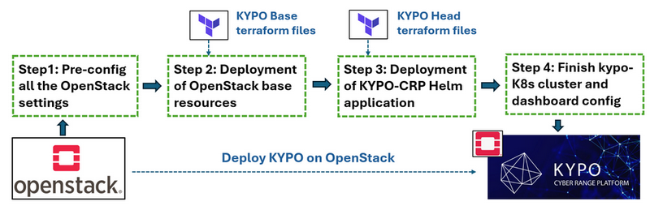

# How to Deploy KYPO_CRP on OpenStack-YOGA

**Design Purpose** : 

The KYPO Cyber Range Platform (KYPO CRP) is an open-source solution developed by Masaryk University to support cybersecurity training and exercises. Licensed under the MIT license, it offers flexibility for organizations to customize and extend the platform to meet specific training goals. KYPO CRP is built on a combination of OpenStack and Kubernetes technologies and integrates key functionalities such as Capture-the-Flag (CTF) scenario delivery and virtual instance management.

The official installation guide provides a streamlined deployment procedure ([official guide](https://gitlab.ics.muni.cz/muni-kypo-crp/devops/kypo-crp-tf-deployment)),  when I follow the instruction to deploying on OpenStack, I found it lacks some detailed configurations and especially some troubleshooting tips which caused people's deployment failed. The purpose of this article is to bridge that gap by presenting a comprehensive step-by-step guide to deploying KYPO CRP on OpenStack-YOGA. It includes necessary pre-configuration tasks, complete deployment instructions using Terraform and Helm, and common issues users may encounter, along with their practical solutions.

This article includes 3 main parts: 

- **OpenStack Pre-Configuration** : Essential setup required in your OpenStack-YOGA environment before deploying KYPO CRP.
- **KYPO Deployment Steps** : Detailed procedures to deploy KYPO-CRP using Terraform and deploy applications using Helm, modify the Kypo-K8s cluster and the Kypo-Web-dashboard. 
- **Troubleshooting and Usage** : How to access the platform post-deployment and resolve common issues encountered during the setup.

```
# Author:      Yuancheng Liu
# Created:     2023/02/20
# Version:     v_0.1.3
# Copyright:   Copyright (c) 2025 Liu Yuancheng
```

**Table of Contents** 

[TOC]

------

### Introduction

KYPO Cyber Range Platform (KYPO CRP) is an open-source platform for conducting cybersecurity training and exercises. Developed by Masaryk University, it's designed to be flexible, scalable, and cost-effective, leveraging technologies like containers, infrastructure as code, and microservices. KYPO CRP allows for the creation of both cloud-based and local sandboxes, enabling hands-on training for cybersecurity professionals and students. Below are 2 main link if you want to try KYPO-CRP:

- KYPO official web: https://crp.kypo.muni.cz/
- KYPO GitLab Repo link: https://gitlab.ics.muni.cz/muni-kypo-crp

This article will  show the 4 main steps to install Kypo Cyber Range Platform on OpenStack as shown below:



- Pre-config all the OpenStack setting. 
- Deployment of OpenStack base resources for install KYPO-CRP.
- Deployment of KYPO-CRP Helm application
- Finish Kypo-K8s cluster and dashboard config