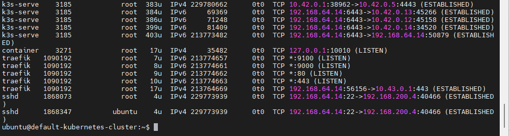

# How to Deploy KYPO_CRP on OpenStack-YOGA

**Design Purpose** : 

The KYPO Cyber Range Platform (KYPO CRP) is an open-source solution developed by Masaryk University to support cybersecurity training and exercises. Licensed under the MIT license, it offers flexibility for organizations to customize and extend the platform to meet specific training goals. KYPO CRP is built on a combination of OpenStack and Kubernetes technologies and integrates key functionalities such as Capture-the-Flag (CTF) scenario delivery and virtual instance management.

The official installation guide provides a streamlined deployment procedure ([official guide](https://gitlab.ics.muni.cz/muni-kypo-crp/devops/kypo-crp-tf-deployment)),  when I follow the instruction to deploying on OpenStack, I found it lacks some detailed configurations and especially some troubleshooting tips which caused people's deployment failed. The purpose of this article is to bridge that gap by presenting a comprehensive step-by-step guide to deploying KYPO CRP on OpenStack-YOGA. It includes necessary pre-configuration tasks, complete deployment instructions using Terraform and Helm, and common issues users may encounter, along with their practical solutions.

This article includes 3 main parts: 

- **OpenStack Pre-Configuration** : Essential setup required in your OpenStack-YOGA environment before deploying KYPO CRP.
- **KYPO Deployment Steps** : Detailed procedures to deploy KYPO-CRP using Terraform and deploy applications using Helm, modify the Kypo-K8s cluster and the Kypo-Web-dashboard. 
- **Troubleshooting and Usage** : How to access the platform post-deployment and resolve common issues encountered during the setup.

```
# Author:      Yuancheng Liu
# Created:     2023/02/20
# Version:     v_0.1.3
# Copyright:   Copyright (c) 2025 Liu Yuancheng
```

**Table of Contents** 

[TOC]

------

### Introduction

The KYPO Cyber Range Platform (KYPO CRP) is an open-source cybersecurity training platform developed by Masaryk University, designed to support both academic and professional training needs. It is built using modern technologies such as k8s , containers, microservices, and infrastructure as code, making it a flexible, scalable, and cost-effective solution for creating realistic cybersecurity scenarios.

KYPO CRP enables the creation of customizable sandboxes—both in the **cloud** and **on-premises**—allowing learners and professionals to engage in hands-on training exercises, such as Capture-the-Flag (CTF) challenges and cyber incident simulations. The platform is fully open source and available under the MIT license, allowing organizations to tailor deployments to their unique infrastructure and training goals.

- KYPO official web: https://crp.kypo.muni.cz/
- KYPO GitLab Repo link: https://gitlab.ics.muni.cz/muni-kypo-crp

This article provides a detailed, step-by-step guide to deploying KYPO CRP on OpenStack-YOGA, as illustrated in the diagram below. 


The deployment process is divided into four main stages:

- **Pre-configure OpenStack** – Set up required OpenStack configurations and prerequisites.

- **Deploy OpenStack Base Resources** – Use KYPO base Terraform files to deploy foundational infrastructure.

- **Deploy KYPO CRP Helm Application** – Deploy the application layer using Helm and KYPO head Terraform files.

- **Finalize Configuration** – Complete Kubernetes cluster setup and dashboard configuration.


------

### KYPO-CRP Technology Overview

The KYPO CRP is entirely based on state-of-the-art approaches such as containers, infrastructures as code, microservices, and open-source software, including cloud provider technology - OpenStack.  The system structure is shown below:


KYPO CRP uses the same open approach for the content as for its architecture to encourage creating a community of trainers and supporting the sharing of training building blocks. For that reason, virtual machines, networks, and trainings are entirely defined in human-readable data-serialization languages JSON and YAML or use open-source software Packer to build virtual machines and Ansible for describing machine content.

The Kypo control node is running a K8s cluster with different pods. In the node "default-kubernetes-cluster" you can get their state as shown blow:

```bash
ubuntu@default-kubernetes-cluster:~$ kubectl get pods
NAME                                                READY   STATUS    RESTARTS   AGE
postgres-7bfcbc4f85-dfd29                           1/1     Running   0          6d7h
guacamole-5bdfd984c6-p7zh8                          1/1     Running   0          6d7h
kypo-redis-76854b59f6-99gjm                         1/1     Running   0          6d7h
angular-frontend-64b6fbbbfd-5kzrl                   1/1     Running   0          6d7h
guacd-56b6cdd9f8-gwkm9                              1/1     Running   0          6d7h
kypo-syslog-ng-88ddbcd69-w88gx                      1/1     Running   0          6d7h
mitre-service-55ff5578b6-qlc88                      1/1     Running   0          6d7h
oidc-issuer-ldap-867758c7bb-2t6z5                   1/1     Running   0          6d7h
answers-storage-5b4db578ff-96fh2                    1/1     Running   0          6d7h
kypo-logstash-7b75dc8d4f-m94vv                      1/1     Running   0          6d7h
smart-assistant-688b8b4c75-hfqfg                    1/1     Running   0          6d7h
uag-service-5b4dbc95ff-glg6t                        1/1     Running   0          6d7h
sandbox-service-worker-ansible-5cd8b97694-pg7gr     1/1     Running   0          6d7h
sandbox-service-worker-openstack-6457799f98-275q2   1/1     Running   0          6d7h
sandbox-service-worker-default-864c85b46c-h6lrf     1/1     Running   0          6d7h
sandbox-service-worker-default-864c85b46c-dwjkc     1/1     Running   0          6d7h
sandbox-service-worker-openstack-6457799f98-zmx5z   1/1     Running   0          6d7h
sandbox-service-worker-ansible-5cd8b97694-8rvww     1/1     Running   0          6d7h
training-feedback-service-84c547d664-w4hjd          1/1     Running   0          6d7h
adaptive-training-service-59964c9778-v2gtk          1/1     Running   0          6d7h
kypo-elasticsearch-5c894f9b65-fw4q6                 1/1     Running   0          6d7h
sandbox-service-7cf4b8d7db-76s5n                    1/1     Running   0          6d7h
training-service-6699b78459-mvftz                   1/1     Running   0          6d7h
elasticsearch-service-7db4866fb6-bt5vt              1/1     Running   0          6d7h
oidc-issuer-app-fc9ff8856-db6jq                     1/1     Running   0          6d7h
git-internal-c959ccff5-c9xgq                        2/2     Running   0          2d11h
```


------

### OpenStack Preparation

Before deploying the KYPO Cyber Range Platform (KYPO CRP), you need to configure several settings in your OpenStack environment. This includes creating an application credential for KYPO and setting up required flavors to ensure the virtual machines (VMs) can be provisioned correctly.

#### Create OpenStack Application Credential for KYPO-CRP

**Step-1:** login the OpenStack-YOGA horizon dashboard as admin,  Under `Identity` -> `Application Credential` and create the credential as shown below: 


For the credentials roles select all 4 roles: `admin`, `user`, `member`, `reader`  , and check the `Unrestricted` check box.

**Step-2**: Download the `app-cred-xxx-open-rc.sh` and `clouds.yaml` file (as shown in the `file/app-cred-kypotest7-openrc.sh` and `files/clouds.yaml` )

Example of `app-cred-kypotest7-openrc.sh`:

```bash
#!/usr/bin/env bash
export OS_AUTH_TYPE=v3applicationcredential
export OS_AUTH_URL=http://controller2:5000/v3/
export OS_IDENTITY_API_VERSION=3
export OS_REGION_NAME="RegionOne"
export OS_INTERFACE=public
export OS_APPLICATION_CREDENTIAL_ID=9cd30053e56d4981806e83f08c2cb831
export OS_APPLICATION_CREDENTIAL_SECRET=kypotest7
```

Example of `clouds.yaml`: 

```yaml
clouds:
  openstack:
    auth:
      auth_url: http://controller2:5000/v3/
      application_credential_id: "9cd30053e56d4981806e83f08c2cb831"
      application_credential_secret: "kypotest7"
    region_name: "RegionOne"
    interface: "public"
    identity_api_version: 3
    auth_type: "v3applicationcredential"
```

You can also create the application credential in the OpenStack Controller node with below commends:

```
openstack application credential create --secret "kypotest7" --description "2nd Kypo installation" --role admin --role user --role reader --role member kypotest7
```

#### Configure Required OpenStack Flavors

Ensure that the following **VM flavors** are available in your OpenStack environment. These are used during KYPO-CRP deployment for allocating compute resources:

| Flavor          | VCPUs | Disk (GB) | RAM (MB) |
| --------------- | ----- | --------- | -------- |
| csirtmu.tiny1x2 | 1     | 20        | 1024     |
| standard.tiny   | 1     | 1         | 512      |
| standard.small  | 1     | 20        | 2048     |
| standard.medium | 2     | 40        | 4096     |
| standard.large  | 8     | 80        | 8192     |
| standard.xlarge | 16    | 160       | 32768    |

> Note: These flavor names must exactly match those referenced in KYPO’s Terraform scripts and for the standard.xlarge it will be good to use 16 vCPU and 32GB Ram, otherwise based on my test there will be high possibility the deployment will hang or fail if you use 8vCPU and 16GB.

Another very important thing is if your deployment progress fail and you want to re-deploy from beginning, you need to do blow clear up setting, otherwise there will be high possibility the redeploy will fail again: 

If you need to clear/remove all the kypo instance from Openstack, these are the parameter need to be removed: 

- Clear the keypair with the name '`<ProjectName>-kypo`' such as (Admin Kypo or kypo-kypo)

- Release 2 OpenStack float IP address Kypo used.

- Delete the kypo-public router.

- Delete all the kypo-instance : [ delete all `default-p000000000-*` ]

- Delete the kypo-base network: [ if got delete error, clean the port, subnetwork of the network and delete again] 

- Clear all the kypo-created security groups.

- Delete the "sandbox" subnet under "Provider" network


------

### Deployment of OpenStack Base Resources

This section follows the official deployment guide from the KYPO GitLab repository:🔗 [BASE.md Deployment Instructions](https://gitlab.ics.muni.cz/muni-kypo-crp/devops/kypo-crp-tf-deployment/-/blob/master/BASE.md)

#### Pre-configure Installation Files

**Step-1 Clone the KYPO CRP Deployment Repository**  

SSH into one of your OpenStack controller nodes and clone the official KYPO CRP deployment scripts (v1.1.4):

```
git clone -b v1.1.4 https://gitlab.ics.muni.cz/muni-kypo-crp/devops/kypo-crp-tf-deployment.git
```

**Step 2: Copy Credential Files to Controller**

Copy the previously generated `app-credxxx-open-rc.sh` and `clouds.yaml` Scp the OpenStack controller node, put the `clouds.yaml` file under the `tf-head-services` and `tf-openstac-base`folder as shown below:

```bash
kypo@controller2:~/kypoInstall/kypo-crp-tf-deployment/tf-head-services$ ls
clouds.yaml  kypo.tf  provider.tf  README.md  terraform.tfstate  terraform.tfstate.backup  tfvars  values.yaml  variables.tf
```

**Step-3: Step 3: Update Terraform Provider File**

Modify the `tf-openstack-base/provider.tf` file to define the OpenStack provider by append below 3 lines in the file.

```json
provider "openstack" {
  cloud = "openstack"
}
```

**Step 4: Update Base Variables**

Edit `tf-openstack-base/tfvars/vars-base.tfvars` with these parameters:

```t
deploy_flavors                      = false
deploy_kubernetes_cluster           = true
kypo_kubernetes_cluster_flavor_name = "standard.xlarge"
kypo_proxy_flavor_name              = "standard.medium"
```

> Note: When I follow the Kypo-Crp official web use the `vars-all.tfvars`, there will be high possibility the Kypo-k8s cluster `uag-service` container get crash during the deployment. 

**Step 5: Install Terraform**

```
sudo apt install snapd
sudo snap install terraform --classic
```


#### Deploy OpenStack Base Resources

**Step 1: Load Application Credential**

Activate the OpenStack application credential for Terraform by sourcing the script:

```bash
source /path/to/app-cred-<name>-openrc.sh
```

**Step 2: Configure External Network**

Copy and modify the deployment variable file:

```bash
cd tf-openstack-base
cp tfvars/deployment.tfvars-template tfvars/deployment.tfvars
```

Identify your external OpenStack network:

```
openstack network list --external --column Name
+----------+
| Name     |
+----------+
| provider |
+----------+
```

Add string `provider` to the `external_network_name` parameter in `deployment.tfvars` as shown below:

```
external_network_name = "provider"
```

**Step 3: Run Terraform Deployment**

Initialize and apply the Terraform configuration (recommend run under sudo and add auto-approve ):

```
sudo terraform init
terraform apply --auto-approve -var-file tfvars/deployment.tfvars -var-file tfvars/vars-base.tfvars
```

**Step 4: Record Output Information**

Upon successful deployment, Terraform will output key Kubernetes and proxy configuration data. Save this information for the next deployment step:

```verilog
cluster_ip = "192.168.200.207"
kubernetes_client_certificate = "LS0tLS1CRUdJTiBDRVJUSUZJQ0FURS0t...="
kubernetes_client_key = "LS0tLS1CRUdJTiBFQyBQUklWQVRFIEtFWS0tLS0..."
proxy_host = "192.168.200.216"
proxy_key = "LS0tLS1CRUdJTiBFQyBQUklWQVRFIEtFWS0tLS..."
```

**Step 5: Verify Connectivity**

Check that the required ports (e.g., SSH, HTTP, HTTPS) are open on the Kubernetes cluster IP:

```verilog
yuancheng@kcontroller1:~/kypoInstall/kypo-crp-tf-deployment/tf-openstack-base$ nmap -F 192.168.200.207
Starting Nmap 7.80 ( https://nmap.org ) at 2023-02-02 06:41 UTC
Nmap scan report for 192.168.200.207
Host is up (0.00018s latency).
Not shown: 95 filtered ports
PORT     STATE  SERVICE
22/tcp   open   ssh
80/tcp   open   http
443/tcp  open   https
515/tcp  closed printer
8443/tcp closed https-alt
```

**Important** :  All the 5 ports must be opened, otherwise mean the K8s cluster some pod got problem, and most of time it will be the problem of the traefik router init failed. If you login the KYPO controller node and list the process, the normal situation will be like this:



If the traefik  is not start, which mean the deploy has been failed (as shown below)


To solve this problem you need to change the version in file `deployment.tfvars` these 2 lines version are correct: 

```
kypo_crp_head_version         = "1.1.1"
kypo_postgres_version         = "1.0.0"
```

And we can see that in the KYPO repo commit version `4b3b918` , they also did the downgrade to fix this bug:


#### Deployment of KYPO-CRP Helm Application

With the OpenStack base infrastructure ready, the next phase is to deploy the KYPO Cyber Range Platform (CRP) application using Helm.

**Step 1: Configure Deployment Variables**

Navigate to the `tf-head-services` directory, which contains the Terraform configuration files for deploying KYPO CRP components:

```
cd tf-head-services
cp tfvars/deployment.tfvars-template tfvars/deployment.tfvars
```

Edit the `tfvars/deployment.tfvars` file and populate it with values captured from the previous infrastructure setup step. Below is a sample configuration:

```python
acme_contact = "demo@kypo.cz"
application_credential_id = "9cd30053e56d4981806e83f08c2cb831"
application_credential_secret = "kypotest7"
gen_user_count = "100"

git_config = {
  type                 = "INTERNAL"
  server               = "git-internal.kypo"
  sshPort              = 22
  restServerUrl        = "http://git-internal.kypo:5000/"
  user                 = "git"
  privateKey           = ""
  accessToken          = "no-gitlab-token"
  ansibleNetworkingUrl = "git@git-internal.kypo:/repos/backend-python/ansible-networking-stage/kypo-ansible-stage-one.git"
  ansibleNetworkingRev = "v1.0.10"
}

guacamole_admin_password = "password"
guacamole_user_password  = "password"

head_host = "192.168.200.207"
head_ip   = "192.168.200.207"

kubernetes_host                = "192.168.200.207"
kubernetes_client_certificate = "<Base64 Encoded Certificate>"
kubernetes_client_key         = "<Base64 Encoded Private Key>"

kypo_crp_head_version   = "1.1.1"
kypo_postgres_version   = "1.0.0"
os_auth_url             = "http://10.0.6.4:5000/v3/"

oidc_providers = [
  {
    url              = "https://192.168.200.207:443/csirtmu-dummy-issuer-server/"
    logoutUrl        = "https://192.168.200.207:443/csirtmu-dummy-issuer-server/endsession"
    clientId         = "bFkibCmIhdoJJjExCZzuKSeOfDdjYkJETIjn"
    label            = "Login with local issuer"
    issuerIdentifier = ""
    userInfoUrl      = ""
    responseType     = ""
  }
]

proxy_host = "192.168.200.216"
proxy_key  = "<Base64 Encoded Proxy Private Key>"

users = {
  "kypo-admin" = {
    iss        = "https://192.168.200.207:443/csirtmu-dummy-issuer-server/"
    password   = "password"
    email      = "kypo-admin@example.com"
    fullName   = "Demo Admin"
    givenName  = "Demo"
    familyName = "Admin"
    admin      = true
  }
}
```

Important note: For the `gen_user_count`, please set to a big number such as 300, otherwise you need to go to the K8s pod to add more new users after deploy finished. Later I will show how to add new users. 

**Step 2: Deploy KYPO CRP with Terraform**

With your `deployment.tfvars` file configured, initialize Terraform and apply the configuration to install the KYPO CRP Helm application:

```
terraform apply --auto-approve -var-file=tfvars/deployment.tfvars
```

Remark: If you want to start a clear new deployment, please remove the `terraform.tfstate`  file. 

The Installation process will take about 9 - 13 mins if no error happens.

```
module.kypo_crp.helm_release.kypo_crp_head: Still creating... [11m20s elapsed]
module.kypo_crp.helm_release.kypo_crp_head: Still creating... [11m30s elapsed]
module.kypo_crp.helm_release.kypo_crp_head: Creation complete after 11m34s [id=kypo-crp-head]
Apply complete! Resources: 6 added, 0 changed, 0 destroyed.
```

If you find the installation take more than half hour, there will be high possibility the deploy fail, base on my test some times it will time out , some times it will hang there. 

**Step-3: Test access the Kypo-dashboard and login**

Access the KYPO dashboard by the url `https://<head_host>` , if the dashboard below show up, which means the KYPO K8s cluster deployed successful as show below. Login with the admin user we configured just now.


But when you login to create sandbox, it will fail, you need to change some K8s setting then you can start to use. 


### Change Kypo-Kubernetes Cluster Configuration

If you are unable to successfully create sandboxes with the admin after installation. To address this, manual adjustments are required inside the KYPO Kubernetes cluster environment. The following steps detail how to configure the cluster to resolve the problem. 

**Step 1: Prepare the Kypo K8s Public Key to login the Kypo K8s-Node**

Visit: https://www.base64decode.org/ and cover the **proxy_key** string `proxy_key = "LS0tLS1CRUdJTiBFQyB..."` in the `deployment.tfvars` to key file and save the contents in `key.pem`

**Step 2: Log in to the KYPO Kubernetes Node**

scp the `key.pem` to OpenStack controller node and ssh to the k8s cluster vm with the key.

```
chmod 0600 key.pem
ssh ubuntu@192.168.200.207 -i key.pem 
```

**Step 3: Configure Host Aliases for Broken DNS Resolution**

If the OpenStack environment lacks DNS name resolution, manually edit the KYPO deployment files to use `hostAliases`. Run the below command one by one :

```
sudo kubectl edit deployment sandbox-service -n kypo
sudo kubectl edit deployment sandbox-service-worker-ansible -n kypo   
sudo kubectl edit deployment sandbox-service-worker-openstack -n kypo   
sudo kubectl edit deployment oidc-issuer-ldap -n kypo
sudo kubectl edit deployment sandbox-service-worker-default -n kypo
```

for each deployment add below content under `specs.template.specs`  after containers config :

```yaml
...
   - mountPath: /root/.ssh/kypo-crp-proxy-key  
      name: kypo-crp-proxy-key  
      subPath: kypo-crp-proxy-key    
    - mountPath: /var/opt/kypo/kypo-ansible-runner-volumes   
      name: ansible-runner-vol 
    - mountPath: /root/.ssh/git-ssh-key  
      name: git-ssh-key          
      subPath: git-ssh-key  
  dnsPolicy: ClusterFirst   
  # Add the below host aliases part:
  hostAliases:   
  - hostnames:   
    - controller2  
    ip: 10.0.6.4    
  # -------------------------------
  restartPolicy: Always                                                               
  schedulerName: default-scheduler                                                   
  securityContext: {}        
...              
```
Reference: https://serverfault.com/questions/895088/can-host-aliases-be-assigned-to-deployments-in-kubernetes-if-so-how

**Step 4: Fix Git Clone Bug (libguac install)**

The Kypo-Crp has one bug to install lib "guacamole guacd" by using apt install. After branch v1.0.10, they fix the bug. login the kypo-k8s cluster and edit the internal git pod:

```yaml
spec:
  template:
    spec:
      containers:
        - name: git-internal-ssh
          lifecycle:
            postStart:
              exec:
                command:
                - sh
                - -c
                - |
                  mkdir -p /assets/keys
                  ssh-keygen -y -f /tmp/keys/git-ssh-key > /assets/keys/git-ssh-key.pub
                  cat /assets/keys/git-ssh-key.pub > /home/git/.ssh/authorized_keys
                  git clone -q --bare https://gitlab.ics.muni.cz/muni-kypo-crp/prototypes-and-examples/sandbox-definitions/small-sandbox.git /repos/prototypes-and-examples/sandbox-definitions/small-sandbox.git
                  git clone -q --bare https://gitlab.ics.muni.cz/muni-kypo-crp/prototypes-and-examples/sandbox-definitions/kypo-crp-demo-training.git /repos/prototypes-and-examples/sandbox-definitions/kypo-crp-demo-training.git
                  git clone -q --bare https://gitlab.ics.muni.cz/muni-kypo-crp/prototypes-and-examples/sandbox-definitions/kypo-crp-demo-training-adaptive.git /repos/prototypes-and-examples/sandbox-definitions/kypo-crp-demo-training-adaptive.git
                  # Add the branch version as shown below: 
                  git clone -b v1.0.10 -q --bare https://gitlab.ics.muni.cz/muni-kypo-crp/backend-python /ansible-networking-stage/kypo-ansible-stage-one.git /repos/backend-python/ansible-networking-stage/kypo-ansible-stage-one.git
...
```

**Step 5: Test Sandbox Definition and Pool Allocation**

Now you can login the KYPO-dashboard to define a test sandbox by using the below git to do the test:

```
URL: git@git-internal.kypo:/repos/prototypes-and-examples/sandbox-definitions/kypo-crp-hack-training-linear.git
Revision: master
```

Then create a sand box pool to and allocate one sandbox to check whether kypo works:


If all 3 stage passed no error(as shown above), which means all the config are working normally and the KYPO deployment on OpensStack is successful. 


### Add Multiple New Users In KYPO-CRP

If you want to add more new users, you need to log in the KYPO K8s node as previous section with the key file: 

```
ssh ubuntu@192.168.200.207 -i key.pem 
```

Then use the KYPO users API, as shown in the deploy section, port 8084 is not opened to outside, so this can only be done inside the K8s node. 

```
https://localhost:8084/kypo-rest-user-and-group/api/v1/users
```

Create a simple `users.json` file with the new users you want to add: 

```json
{
  "users": [
    {
      "sub": "user301@example.com",
      "iss": "https://192.168.200.207:443/csirtmu-dummy-issuer-server/",
      "full_name": "user301",
      "given_name": "",
      "family_name": ""
    }, 
    {
      "sub": "user302@example.com",
      "iss": "https://192.168.200.207:443/csirtmu-dummy-issuer-server/",
      "full_name": "user302",
      "given_name": "",
      "family_name": ""
    }...
  ],
  "groupName": "group1"
}
```

The login username need to be the sub email name. Then use curl to post the new users information :

```bash
curl -X POST "http://localhost:8084/kypo-rest-user-and-group/api/v1/users" -H "accept: application/json" -H "Content-Type: application/json" -d "{ \"users\": [ { \"sub\": \"user301@example.com\", \"iss\": \"https://192.168.200.207:443/csirtmu-dummy-issuer-server/\", \"full_name\": \"user301\", \"given_name\": \"\", \"family_name\": \"\" }, { \"sub\": \"user302@example.com\", \"iss\": \"https://192.168.200.207:443/csirtmu-dummy-issuer-server/\", \"full_name\": \"user302\", \"given_name\": \"\", \"family_name\": \"\" } ], \"groupName\": \"group1\"}"
```

If you want to create 100 users, create a simple python program on the node and run:

```python
import requests
import json

url = "https://localhost:8084/kypo-rest-user-and-group/api/v1/users"
data = json.load(users.json)
response = requests.post(url, json=data) # Sends JSON in the body
print(response.status_code)
print(response.json())
```

After you add the users, go to the web to download the user information or use the curl GET the user information with the ID, assume there is already 300 users, then if I add one more user user-301, then the new user's ID is 301.

```
curl -X GET "http://localhost:8084/kypo-rest-user-and-group/api/v1/users/301" -H "accept: application/json"
```

Then we can get system generated password from the response data

```json
{
  "content": [
    {
      "sub": "user301@example.com",
      "iss": "https://192.168.200.207:443/csirtmu-dummy-issuer-server/",
      "fullName": "John Doe",
      "mail": "user301@example.com",
      "givenName": "",
      "familyName": "",
      "password": "ZLUyJJ62ej"
      "roles": [
        {
          "idOfMicroservice": 5,
          "nameOfMicroservice": "kypo-training",
          "description": "This role will allow you to create and delete groups.",
          "role_type": "ROLE_USER",
          "id": 301
        }
      ],
    }
  ],
}
```

Now you can start to use the KYPO to create the sandbox for testing. 

------

### Reference Link

- https://gitlab.ics.muni.cz/muni-kypo-crp/devops/kypo-lite

- https://gitlab.ics.muni.cz/muni-kypo-crp/devops/kypo-crp-tf-deployment

- https://gitlab.ics.muni.cz/muni-kypo-images/muni-kypo-images-wiki/-/wikis/How-to-build-an-image-locally


------

> Last edit by LiuYuancheng(liu_yuan_cheng@hotmail.com) at 19/07/2025, if you have any problem or find anu bug, please send me a message .