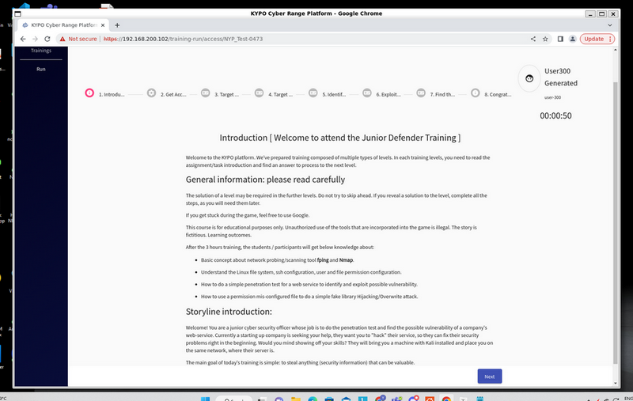

# Kypo-CRP CTF Challenge Write Up 02: The Secret Laboratory

**Project Design Purpose** : This article is the second write up of using the Kypo-CRP for building cyber security CTF challenges or hands on exams environment. I will use the s CTF game “The Secret Laboratory” from Masaryk University’s Spring 2020 semester course PV276 – Seminar on Simulation of Cyber Attacks and as a case study, this article demonstrates two key objectives:

- How to build and deploy a custom CTF or teaching-assignment sandbox on the KYPO-CRP platform.
- How to operate within the KYPO-CRP to solve the PV276 Secret Laboratory challenge step-by-step.

The Secret Laboratory CTF challenge is designed as an advanced web and information security exercise that introduces participants to the penetration testing workflow from a defender’s perspective. It emphasizes web service vulnerability identification and exploitation, CVE-based attacks, and data protection techniques taught in [Masaryk University’s PV276 Cybersecurity course](https://is.muni.cz/course/fi/autumn2020/PV276). The corresponding KYPO sandbox for this challenge is publicly available through KYPO’s official open-source repository on GitLab ([MUNI-KYPO-TRAININGS / games / secret-laboratory](https://gitlab.ics.muni.cz/muni-kypo-trainings/games/secret-laboratory)), allowing learners and professionals alike to practice hands-on cyber offense and defense skills in a realistic environment.


```python
# Author:      Yuancheng Liu
# Created:     2024/07/21
# Version:     v_0.1.2
# License:     MIT License
# Kypo-CRP Disclarmer: This training topic is for educational purposes only.The story is fictitious.
```

**Table of Contents**

[TOC]


------

### Introduction

Before diving into the technical details of how to solve the Secret Laboratory Challenge, I would like to acknowledge and express thanks to the CTF challenge authors - Stanislav Boboň, David Hofman, Jakub Smatana  for designing such an engaging and thought-provoking hands on assignment for cyber security education and contest. This challenge consists of six sequential tasks, each designed to test core cybersecurity skills across cybersecurity threats, network, Linux system security, encryption and decryption. After solve the challenge the participants will get below knowledge about: 

- Basic concept about network probing/scanning tools such as  **fping** and **Nmap**.

- Understand the Linux file system, ssh configuration, user and file permission configuration.

- How to do a simple penetration test for a web service to identify and exploit possible vulnerability by use the **CVE-2014-6271** information.

- How to use a permission mis-configured file to do  library hijacking/overwrite attack and privilege escalation


#### Challenge Background Story

Upon logging into the KYPO challenge page, participants are introduced to a narrative backdrop as shown below:




https://gitlab.ics.muni.cz/muni-kypo-images

