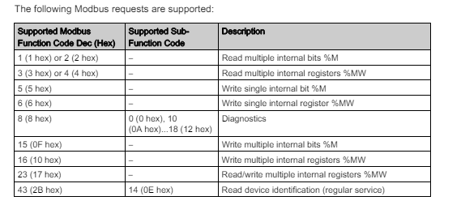

# Python and PLC Communication 

This article will introduce the detail steps about how to use Python Program to Communicate with two type Schneider M221 PLC or Siemens S7-1200 PLC via ethernet. We also provide the packaged python PLC client library so you can use them to build your own SCADA control program such as HMI.


[TOC]

------

### Communicate With Schneider M221 PLC

The Schneider Electric M221 PLC is a compact and versatile programmable logic controller designed for small to medium-sized automation projects. It is part of the Modicon M221 series with 16 IO, 7 relay outputs, known for its high performance and cost-effectiveness. The M221 PLC supports various communication protocols, including Modbus TCP/IP and serial communications, making it easy to integrate into existing systems. With its robust processing capabilities, extensive I/O options, and user-friendly programming via the SoMachine Basic software, the M221 PLC is ideal for controlling machinery, managing processes, and enhancing automation in industrial environments.

#### STEP1: Config the Schneider M221 PLC

Power up the connect the M221 in the network, use SoMachine editor to connect to the PLC unit, then config the fixed IP address and enable the Modbus communication of the PLC in the MyController > ETH1 as shown below:


Then the program in the same subnet can connect to the PLC via the ip address and the modbus server. 

#### STEP2: Config the Ladder Logic 

M221 supports normal Modbus TCP protocol communication, but if you don't use the soMachine SDK, your program can not read the contact "I0.X" or write the coil "Q0.X" directly. The solution is to link the contact "I0.X" or coil "Q0.X" to a PLC memory address, then read or write the memory address to get the contact input or set the coil output. The ladder logic can be draft as shown below:

```
[ I0.x ] --> | M1.x | 
| M1.x | --> | Your Ladder Logic | --> | M2.x |
| M2.x | --> ( Q0.x )
```

Open the SoMachine ladder config page and added the ladder logic as shown below:


Then in the commissioning page select the "PC to Controller" to commit the Ladder logic in to the PLC as shown below:


#### STEP3: Understand of Communication Protocol

The M221 communicate protocol is shown below, we need to use two Modbus function code: 

- `'0f'` : Memory access function code (write) multiple bit
- `'01'` : Memory state fetch internal multiple bits %M

To use more function, please refer to the function code table in page 196 of the [M221 Manual](https://media.distributordatasolutions.com/schneider2/2020q4/documents/fbb188fbd042afd838384db125b9dad1c2a6a9e9.pdf) 



The Modbus data sequence table is shown below:

 

**Modbus TCP Frame Structure:**

1. **Transaction Identifier (2 bytes)**: A unique identifier for the transaction. It is usually set by the client and echoed back by the server.
2. **Protocol Identifier (2 bytes)**: Always set to 0 for Modbus TCP.
3. **Length (2 bytes)**: The number of following bytes, including the Unit Identifier, Function Code, and Data.
4. **Unit Identifier (1 byte)**: The address of the remote server (PLC).
5. **Function Code (1 byte)**: Defines the operation to be performed (e.g., Read Holding Registers).
6. **Data**: This includes the specific details of the request or response (e.g., starting address, quantity of registers).

Modbus message sequence to read bit data from the memory 

| TID     | PROTOCOL_ID | Length  | UID    | Function Code | Memory Idx | Quantity of Bit |
| ------- | ----------- | ------- | ------ | ------------- | ---------- | --------------- |
| 2 bytes | 2 bytes     | 2 bytes | 1 byte | 1 byte        | 2bytes     | 2bytes          |
| `0000`  | `0000`      | `0006`  | `01`   | `01`          | `<0032>`   | `<0008>`        |

Modbus message sequence to write byte data to the memory 

| TID     | PROTOCOL_ID | Length  | UID    | Function Code | Memory Idx | Bit Index | Byte Index | Value Byte |
| ------- | ----------- | ------- | ------ | ------------- | ---------- | --------- | ---------- | ---------- |
| 2 bytes | 2 bytes     | 2 bytes | 1 byte | 1 byte        | 2bytes     | 1 byte    | 2bytes     | 1 byte     |
| `0000`  | `0000`      | `0008`  | `01`   | `0f`          | `<0032>`   | `<01>`    | `<0001>`   | `<01>`     |

For the memory tag `%MXX` to memory address, just convert the digital number to hex number (use lower case if to string) as shown example below:

```
MEM_ADDR_TAG_Example = {
    'M0':   '0000',
    'M1':   '0001',
    'M2':   '0002',
    'M3':   '0003',
    'M4':   '0004',
    'M5':   '0005',
    'M6':   '0006',
    'M10':  '000a',
    'M20':  '0014',
    'M30':  '001e',
    'M40':  '0028',
    'M50':  '0032',
    'M60':  '003c'
}
```


#### STEP 4: Use Python to Communicate with the PLC

**4.1 Init connection**

To communicate with the PLC, we need to fist init a TCP client which connect to the PLC's  IPaddress with port 502 as shown below: 

```
self.plcAgent = socket.socket(socket.AF_INET, socket.SOCK_STREAM)
try:
	self.plcAgent.connect((self.ip, self.port))
	if self.debug: print("M221Client: Connected to the PLC [%s]" % self.ip)
	self.connected = True
except Exception as error:
	print("M221Client: Can not access to the PLC [%s]" % str(self.plcAgent))
	print(error)
```

**4.2 Send message to PLC**

To send the message to PLC we need to convert the hex string to bytes type 

```
bdata = bytes.fromhex(modbusMsg)
try:
    self.plcAgent.send(bdata)
    respBytes = self.plcAgent.recv(BUFF_SZ)
    respStr = respBytes.dencode('hex') if DECODE_MD else respBytes.hex()
    self.connected = True
```

**4.3 Read the PLC memory data** 

Based on step3, build the memory read Modbus message and call the send function to read the memory bytes data from the PLC.

```
#-----------------------------------------------------------------------------
def readMem(self, memAddrTag, bitNum=8):
    if str(memAddrTag).startswith('M'):
        memoryDecimal = int(memAddrTag[1:])
        memoryHex = hex(memoryDecimal)[2:]
        bitNumHex = hex(bitNum)[2:]
        modbusMsg = ''.join((TID, PROTOCOL_ID, R_LENGTH, UID, M_RD, 
        		memoryHex, bitNumHex))
        response = self._getPlCRespStr(modbusMsg)
        return response
```

Input: 

- `memAddrTag`: (str) Memory tag in the ladder diagram we configured in step2, such as "M60". 
- `bitNum`: (int) How many bits we want to read from the memory if we want to read 1 byte bitNum =4. 

**4.4 Write the PLC memory data **  

Same as the data read, build the modbus message based on the byte sequence in step3: 

```
#-----------------------------------------------------------------------------
def writeMem(self, memAddrTag, val):
    if str(memAddrTag).startswith('M'):
        memoryDecimal = int(memAddrTag[1:])
        memoryHex = hex(memoryDecimal)[2:]
        byteVal = VALUES[val]
        modbusMsg = ''.join((TID, PROTOCOL_ID, W_LENGTH, UID, M_FC, memoryHex, 
        		BIT_COUNT, BYTE_COUNT, byteVal))
        response = self._getPlCRespStr(modbusMsg)
        return response
```


#### Full Python M221 PLC client program 

You can download the full python M221 PLC memory from this link: [M221PlcClient.py](https://github.com/LiuYuancheng/PLC_and_RTU_Simulator/blob/main/Physical_PLC_Client/M221PlcClient.py) It also provide the threading wrapper class so you can run the PLC reader parallel with your main program program to read the PLC state regularly. 

The lib also provide 3 test cases, you can follow test case 1 & 2 to read and write PLC memory and test case 3 to use the client thread wrapper class. 


------

### Communicate With Siemens S7-1200 PLC

The Siemens S7-1200 PLC is a compact and versatile programmable logic controller designed for a wide range of industrial automation applications. It belongs to the SIMATIC S7 family and is known for its robust performance, scalability, and ease of use. It has built-in PROFINET interface and support for various communication protocols, enabling seamless integration into industrial networks.

S7Comm is a proprietary communication protocol used by Siemens PLCs, including the S7-1200 series, to facilitate communication between devices and software. It operates over various physical layers, including Ethernet (via PROFINET), allowing for data exchange between PLCs, HMIs, and SCADA systems.

S7-1200 Manual: https://assets.new.siemens.com/siemens/assets/api/uuid:c7de7888-d24c-4e74-ad41-759e47e4e444/Programovani-S7-1200-1500-2018.pdf

To communicate S71200 we can use the the python snap-7 lib: https://python-snap7.readthedocs.io/en/latest/

#### STEP 1: Config the  Siemens S71200 

Lined the Siemens S71200 PLC in the network, the user the Siemens PLC editor program [siemens tia portal ](https://www.siemens.com/global/en/products/automation/industry-software/automation-software/tia-portal/software/step7-tia-portal.html) to config the IP address. You can follow this article to setup the IP address and the : 

https://www.geekering.com/categories/automation/rodrigovieira/siemens-tia-portal-s7-1200-plc-online-connection-2/

#### STEP 2 : Config the ladder Logic and memory area

S7-1200 support mapping memory area directly to read and write data on PLC contact, memory and coils. We use the snap7 library to communicate with the PLC via Siemens S7Comm protocol. The PLC ladder logic can be configure directly as: 

```
  | ix.x/mx.x | --> | Your Ladder Logic | --> | qx.x/mx.x |
```

Create a block and added the ladder logic as shown below:


If we use the default memory area, the memory are start address of of contact, coil and editable memory are : 

- PLC contact memory area (%i0.X) : `0x81`
- PLC editable storage memory area (%m0.x): `0x83` 
- PLC coils memory area (%q0.x): `0x82` 


#### STEP3: Understand of Communication Protocol

For detailed S7Comm packet, you can refer to this article: https://blog.viettelcybersecurity.com/security-wall-of-s7commplus-part-1/. The packet structure is shown below: 


We will use the python snap-7 lib to communicate with the PLC with S7Comm protocol then use the `read_area` and `write_area` to do the PLC data IO. 

#### STEP 4: Use Python to Communicate with the PLC

**4.1 Init connection**

To communicate with the PLC, we need to fist init a TCP client which connect to the PLC's  IPaddress with port 102 as shown below: 

```
 self.plcAgent = snap7.client.Client()        
 try:
     self.plcAgent.connect(self.ip, 0, 1, 502)
     if self.debug: print("S71200Client: Connected to the PLC [%s]" % self.ip)
     self.connected = True 
 except Exception as err:
     print("Error: S71200Client init Error: %s" % err)
     return None
```


**4.2 Read the  PLC memory**

For the data area read, the S71200 support 5 data types: 

| Data types           | Bytes number | Identify character | memory tab format                 |
| -------------------- | ------------ | ------------------ | --------------------------------- |
| BOOL_TYPE (bool)     | 1 bytes      | x                  | `m(i/q)x<start Byte>.<start bit>` |
| Byte_TYPE (byte/int) | 1 bytes      | b                  | `m(i/q)b<start Byte>`             |
| WORD_TYPE(char)      | 2bytes       | w                  | `m(i/q)w<start Byte>`             |
| Double_WORD_TYPE     | 4bytes       | d                  | `m(i/q)d<start Byte>`             |
| REAL_NUM_TYPE        | 4bytes       | freal              | `freal<start Byte>`               |

We use the snapy-util.get_* function to convert the read data to the related value as shown below:

```
    def _memByte2Value(self, mbyte, valType, startMIdx, bitIndex):
        """ Convert the memeory byte to the value of the specified type.
            Args:
                mbyte (bytes): data bytes. 
                valType (int): convert value's data type.
                startMIdx (int): start index of the memeory byte.
                bitIndex (_type_): start index of the memeory bit.
            Returns:
                _type_: _description_
        """
        data = None
        if valType == BOOL_TYPE:
            data = snap7.util.get_bool(mbyte, 0, bitIndex)
        elif valType == INT_TYPE:
            data = snap7.util.get_int(mbyte, startMIdx)
        elif valType == REAL_TYPE:
            data = snap7.util.get_real(mbyte, 0)
        elif valType == WORD_TYPE:
            data = snap7.util.get_word(mbyte, startMIdx)
        elif valType == DWORD_TYPE:
            data = snap7.util.get_dword(mbyte, 0)
        else:
            print("Error: _getMemValue()> input type invlided: %s" % str(valType))
        return data
```

Based on the read memory tag type config the start byte index and bit index then read the data: 

```
        if(memAddrTag[1].lower() == 'x'):
            # Config the bool type data tag 
            valLength = 1
            valType = BOOL_TYPE
            startMIdx = int(memAddrTag.split('.')[0][2:])
            bitIndex = int(memAddrTag.split('.')[1])
        elif(memAddrTag[1].lower() == 'b'):
            # Config the bype or integer type data tag
            valLength = 1
            valType = INT_TYPE
            startMIdx = int(memAddrTag[2:])
        elif(memAddrTag[1].lower() == 'w'):
            # Config the word type data tag
            valLength = 2
            valType = WORD_TYPE
            startMIdx = int(memAddrTag[2:])
        elif(memAddrTag[1].lower() == 'd'):  # double
            valLength = 4
            valType = DWORD_TYPE
            startMIdx = int(memAddrTag.split('.')[0][2:])
        elif('freal' in memAddrTag.lower()): # float real number
            valLength = 4
            valType = REAL_TYPE
            startMIdx = int(memAddrTag.lower().replace('freal', ''))
        else:
            print("Error: readMem()> input memory tag invlided: %s" %str(memAddrTag))
            return None
        # Init the memory start area.
        memoryArea = MEM_AREA_IDX[memType]
        try: 
            mbyte = self.plcAgent.read_area(memoryArea, 0, startMIdx, valLength)
```


**4.4 Write the PLC memory data **  

To write the bytes data to a PLC we don't want to overwrite the bit which we don't want to change, so we will read the data from the memory then change the related part wit the snapy-util.set_* functions, then write the data back to the memory. The simple memory write function is shown below:

```
    def writeMem(self, mem, value):
        """ Set the PLC state from related memeory address: IX0.N-input, QX0.N-output, 
            MX0.N-memory.
        """
        data = self.getMem(mem, True)
        start = bit = 0  # start position idx
        # get the area memory address
        memType = mem[0].lower()
        area = self.memAreaDict[memType]
        # Set the data lenght and start idx and call the utility functions from <snap7.util>
        if(mem[1].lower() == 'x'):  # bit
            start, bit = int(mem.split('.')[0][2:]), int(mem.split('.')[1])
            set_bool(data, 0, bit, int(value))
        elif(mem[1].lower() == 'b'):  # byte
            start = int(mem[2:])
            set_int(data, 0, value)
        elif(mem[1].lower() == 'w'):
            start = int(mem.split('.')[0][2:])
        elif(mem[1].lower() == 'd'):
            start = int(mem.split('.')[0][2:])
            set_dword(data, 0, value)
        elif('freal' in mem.lower()):  # double word (real numbers)
            start = int(mem.lower().replace('freal', ''))
            set_real(data, 0, value)
        # Call the write function and return the value.
        return self.plc.write_area(area, 0, start, data)
```


#### Full Python M221 PLC client program 

You can download the full python M221 PLC memory from this link: [S71200PlcClient.py](https://github.com/LiuYuancheng/PLC_and_RTU_Simulator/blob/main/Physical_PLC_Client/S71200PlcClient.py) It also provide the threading wrapper class so you can run the PLC reader parallel with your main program program to read the PLC state regularly. 

The lib also provide 3 test cases, you can follow test case 1 & 2 to read and write PLC memory and test case 3 to use the client thread wrapper class. 


------

### Multi thread wrapper


------

### Reference


`

------

> Last edit by LiuYuancheng(liu_yuan_cheng@hotmail.com) at 29/06/2024, if you have any problem please free to message me.