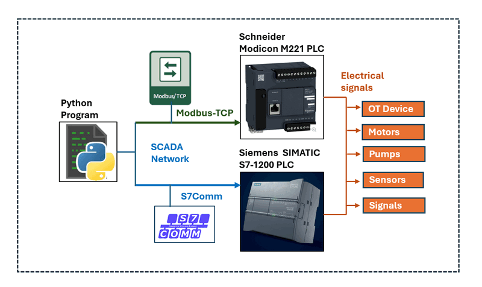

# Python and PLC Communication 

This article provides detailed steps on how to use Python to communicate with Schneider M221 and Siemens S7-1200 PLCs via Ethernet. Additionally, we offer a packaged Python PLC client library, enabling you to easily build your own SCADA control programs, such as Human-Machine Interfaces (HMI). The system overview is shown below:



To check the project detail please refer to [Python Physical PLC Communication Clients](https://github.com/LiuYuancheng/PLC_and_RTU_Simulator/tree/main/Physical_PLC_Client)

```
# Created:     2024/06/29
# Version:     v0.1.3
# Copyright:   Copyright (c) 2024 LiuYuancheng
# License:     MIT License
```

**Table of Contents** 

[TOC]

- [Python and PLC Communication](#python-and-plc-communication)
    + [Introduction](#introduction)
    + [Communicate With Schneider M221 PLC](#communicate-with-schneider-m221-plc)
      - [STEP 1: Configuring the Schneider M221 PLC](#step-1--configuring-the-schneider-m221-plc)
      - [STEP 2: Configuring the Ladder Logic](#step-2--configuring-the-ladder-logic)
      - [STEP 3: Understanding the Communication Protocol](#step-3--understanding-the-communication-protocol)
      - [STEP 4: Using Python to Communicate with the PLC](#step-4--using-python-to-communicate-with-the-plc)
      - [Full Python M221 PLC Client Program](#full-python-m221-plc-client-program)
    + [Communicate With Siemens S7-1200 PLC](#communicate-with-siemens-s7-1200-plc)
      - [STEP 1: Configuring the Siemens S7-1200](#step-1--configuring-the-siemens-s7-1200)
      - [Step 2: Configure Ladder Logic and Memory Areas](#step-2--configure-ladder-logic-and-memory-areas)
      - [Step 3: Understanding the Communication Protocol](#step-3--understanding-the-communication-protocol)
      - [Step 4: Using Python to Communicate with the PLC](#step-4--using-python-to-communicate-with-the-plc)
      - [Full Python S71200 PLC client program](#full-python-s71200-plc-client-program)
    + [Reference](#reference)


------

### Introduction

This article will introduce beginner OT engineers through four essential steps to configure a Programmable Logic Controller (PLC) within a SCADA network and to communicate with the PLC using Python script or user our Python Physical PLC Communication Clients library. The four steps include:

- **[STEP 1] Configuring the PLC**: Learn how to set the PLC's IP address using the PLC vendor's IDE, enabling network connectivity. Note that this section does not cover electrical wiring connections.
- **[STEP 2] Configuring Ladder Logic**: Understand how to configure the PLC's I/O and ladder logic diagram to link contacts, memory, and coils.
- **[STEP 3] Understanding PLC Communication Protocols**: Gain a brief overview of the communication protocols used to interact with the PLC. This section is optional.
- **[STEP 4] Using Python to Control the PLC**: Explain how to build a Python program to control the PLC, including code examples that shows how to use the Python Physical PLC Communication Clients API.


------

### Communicate With Schneider M221 PLC


**Introduction of PLC** : The Schneider Electric M221 PLC is a compact and versatile programmable logic controller designed for small to medium-sized automation projects. It is part of the Modicon M221 series with 16 IO, 7 relay outputs, known for its high performance and cost-effectiveness. The M221 PLC supports various communication protocols, including Modbus TCP/IP and serial communications, making it easy to integrate into existing systems. With its robust processing capabilities, extensive I/O options, and user-friendly programming via the SoMachine Basic software, the M221 PLC is ideal for controlling machinery, managing processes, and enhancing automation in industrial environments.


#### STEP 1: Configuring the Schneider M221 PLC

Power up the M221 PLC and connect it to the network. Use the SoMachine editor to search and connect to the PLC unit. Then configure a fixed IP address and enable Modbus communication for the PLC in the `MyController > ETH1` section as shown below:


` Figure-03: M221 PLC IP Config Page, version v1.3 (2024)`

Select the `Fixed IP address` and fill in the IP information, check the `EtherNet/IP protocol enabled` and `Modbus server enabled`. Then the program in the same subnet can connect to the PLC via the IP address and communicate to Modbus server. 


#### STEP 2: Configuring the Ladder Logic

While the M221 supports standard Modbus TCP protocol communication, without the SoMachine SDK, you cannot directly read the contact "I0.X" or write to the coil "Q0.X". The solution is to map the contact "I0.X" or coil "Q0.X" to a PLC memory address. You can then read or write to this memory address to get the contact input or set the coil output. The ladder logic can be drafted as shown below:

```
Rung 1: [ I0.x ] --> | M1x | 
Rung 2: | M1x | --> | Your Ladder Logic | --> | M2x |
Rung 3: | M2x | --> ( Q0.x )
```

Open the SoMachine ladder configuration page and add the ladder logic as shown below:


` Figure-04: SoMachine Edit the ladder logic rung, version v1.3 (2024)`

Then, in the commissioning page, select "PC to Controller (download)" to commit the ladder logic to the PLC, as shown below:


` Figure-05: SoMachine commit ladder diagram to PLC controller, version v1.3 (2024)`


#### STEP 3: Understanding the Communication Protocol

The M221 uses the Modbus TCP communication protocol. The Modbus TCP frame structure sequence is shown below:

1. **Transaction Identifier (2 bytes)**: A unique identifier for the transaction. It is usually set by the client and echoed back by the server.
2. **Protocol Identifier (2 bytes)**: Always set to 0 for Modbus TCP.
3. **Length (2 bytes)**: The number of following bytes, including the Unit Identifier, Function Code, and Data.
4. **Unit Identifier (1 byte)**: The address of the remote server (PLC).
5. **Function Code (1 byte)**: Defines the operation to be performed (e.g., Read Holding Registers).
6. **Data**: This includes the specific details of the request or response (e.g., starting address, quantity of registers).

To interact with the PLC, you need to use specific Modbus function codes:

- `'0f'`: Memory bits access function code for writing multiple bits.
- `'01'`: Memory bits state fetch function code for reading internal multiple bits `%M`.

To use more function, please refer to the function code table in page 196 of the [M221 Manual](https://media.distributordatasolutions.com/schneider2/2020q4/documents/fbb188fbd042afd838384db125b9dad1c2a6a9e9.pdf) 


` Figure-06: M221 Modbus function code table, version v1.3 (2024)`

The M221 Modbus-TCP data packet sequence table is shown below:

 

` Figure-07: M221 Modbus packet byte sequence map, version v1.3 (2024)`

Modbus Message Sequence to Read Bit Data from Memory:

| TID     | PROTOCOL_ID | Length  | UID    | Function Code | Memory Idx | Quantity of Bit |
| ------- | ----------- | ------- | ------ | ------------- | ---------- | --------------- |
| 2 bytes | 2 bytes     | 2 bytes | 1 byte | 1 byte        | 2bytes     | 2bytes          |
| `0000`  | `0000`      | `0006`  | `01`   | `01`          | `<0032>`   | `<0008>`        |

Modbus Message Sequence to Write Byte Data to Memory:

| TID     | PROTOCOL_ID | Length  | UID    | Function Code | Memory Idx | Bit Idx | Byte Idx | Value Byte |
| ------- | ----------- | ------- | ------ | ------------- | ---------- | ------- | -------- | ---------- |
| 2 bytes | 2 bytes     | 2 bytes | 1 byte | 1 byte        | 2bytes     | 1 byte  | 2bytes   | 1 byte     |
| `0000`  | `0000`      | `0008`  | `01`   | `0f`          | `<0032>`   | `<01>`  | `<0001>` | `<01>`     |

To convert memory tags `%MXX` to memory addresses, simply convert the decimal number to a hexadecimal number (use lowercase for the string). Examples are shown below:

```
MEM_ADDR_TAG_Example = {
    'M0':   '0000',
    'M1':   '0001',
    'M2':   '0002',
    'M3':   '0003',
    'M4':   '0004',
    'M5':   '0005',
    'M6':   '0006',
    'M10':  '000a',
    'M20':  '0014',
    'M30':  '001e',
    'M40':  '0028',
    'M50':  '0032',
    'M60':  '003c'
}
```


#### STEP 4: Using Python to Communicate with the PLC

**4.1 Initialize Connection**

To communicate with the PLC, first initialize a TCP client that connects to the PLC's IP address on port 502, as shown below:

```
self.plcAgent = socket.socket(socket.AF_INET, socket.SOCK_STREAM)
try:
	self.plcAgent.connect((self.ip, self.port))
	if self.debug: print("M221Client: Connected to the PLC [%s]" % self.ip)
	self.connected = True
except Exception as error:
	print("M221Client: Can not access to the PLC [%s]" % str(self.plcAgent))
	print(error)
```

**4.2 Send Messages to the PLC**

To send a message to the PLC, convert the hex string to bytes:

```
bdata = bytes.fromhex(modbusMsg)
try:
    self.plcAgent.send(bdata)
    respBytes = self.plcAgent.recv(BUFF_SZ)
    respStr = respBytes.dencode('hex') if DECODE_MD else respBytes.hex()
    self.connected = True
```

**4.3 Read PLC Memory Data** 

Based on Step 3, build the memory read Modbus message and call the send function to read the memory bytes from the PLC.

```
def readMem(self, memAddrTag, bitNum=8):
    if str(memAddrTag).startswith('M'):
        memoryDecimal = int(memAddrTag[1:])
        memoryHex = hex(memoryDecimal)[2:]
        bitNumHex = hex(bitNum)[2:]
        modbusMsg = ''.join((TID, PROTOCOL_ID, R_LENGTH, UID, M_RD, 
        		memoryHex, bitNumHex))
        response = self._getPlCRespStr(modbusMsg)
        return response
```

Input: 

- `memAddrTag`: (str) Memory tag in the ladder diagram we configured in step2, such as "M60". 
- `bitNum`: (int) How many bits we want to read from the memory if we want to read 1 byte bitNum =4. 

**4.4 Write PLC Memory Data** 

Same as the data read, build the modbus message based on the byte sequence in step3: 

```
def writeMem(self, memAddrTag, val):
    if str(memAddrTag).startswith('M'):
        memoryDecimal = int(memAddrTag[1:])
        memoryHex = hex(memoryDecimal)[2:]
        byteVal = VALUES[val]
        modbusMsg = ''.join((TID, PROTOCOL_ID, W_LENGTH, UID, M_FC, memoryHex, 
        		BIT_COUNT, BYTE_COUNT, byteVal))
        response = self._getPlCRespStr(modbusMsg)
        return response
```


#### Full Python M221 PLC Client Program 

You can download the full Python M221 PLC client program from this link: [M221PlcClient.py](https://github.com/LiuYuancheng/PLC_and_RTU_Simulator/blob/main/Physical_PLC_Client/M221PlcClient.py). This program includes the API to connect PLC, read / write memory bit and a threading wrapper class that allows you to run the PLC reader in parallel thread with your main program to regularly read the PLC state.

The library also provides three test cases:

- **Test Case 1 & 2**: Demonstrate how to read and write PLC memory.
- **Test Case 3**: Shows how to use the client thread wrapper class.


------

### Communicate With Siemens S7-1200 PLC


**Introduction of PLC** : The Siemens S7-1200 PLC is a compact and versatile programmable logic controller designed for a wide range of industrial automation applications. It belongs to the SIMATIC S7 family and is known for its robust performance, scalability, and ease of use. It has built-in PROFINET interface and support for various communication protocols, enabling seamless integration into industrial networks. S7Comm is a proprietary communication protocol used by Siemens PLCs, including the S7-1200 series, to facilitate communication between devices and software. It operates over various physical layers, including Ethernet (via PROFINET), allowing for data exchange between PLCs, HMIs, and SCADA systems. 


#### STEP 1: Configuring the Siemens S7-1200

Connect the Siemens S7-1200 PLC to your network. Use the Siemens PLC editor software, [Siemens SIMATIC STEP 7 (TIA Portal) ](https://www.siemens.com/global/en/products/automation/industry-software/automation-software/tia-portal/software/step7-tia-portal.html), to configure the IP address in the  PROFINET interface page:


` Figure-08: Set S71200 IP via SIMATIC STEP 7 (TIA Portal) , version v1.3 (2024)`

You can follow the steps outlined in this article :  https://www.geekering.com/categories/automation/rodrigovieira/siemens-tia-portal-s7-1200-plc-online-connection-2/ to set up the IP address and configure the PLC.


#### Step 2: Configure Ladder Logic and Memory Areas

The S7-1200 PLC supports direct mapping of memory areas for reading and writing data on PLC contacts, coils, and editable memory. Communication with the PLC is facilitated using the snap7 library through the Siemens S7Comm protocol. The PLC ladder logic can be configured as follows:

```
  | ix.x/mx.x | --> | Your Ladder Logic | --> | qx.x/mx.x |
```

To implement this, create a block and incorporate the ladder logic as depicted in the diagram below:


` Figure-08: Set S71200 Ladder Diagram via SIMATIC STEP 7 (TIA Portal) , version v1.3 (2024)`

When utilizing the default memory areas, the starting addresses for contact, coil, and editable memory are as follows:

- PLC contact memory area (%i0.X) : `0x81`
- PLC editable storage memory area (%m0.x): `0x83` 
- PLC coils memory area (%q0.x): `0x82` 


#### Step 3: Understanding the Communication Protocol

For detailed S7Comm packet f structure, you can refer to this article: https://blog.viettelcybersecurity.com/security-wall-of-s7commplus-part-1/. The packet structure is illustrated below:


To communicate with the PLC using the S7Comm protocol, we will employ the Python snap7 library  https://python-snap7.readthedocs.io/en/latest/. This library provides functions `read_area` and `write_area` to facilitate input and output operations with PLC data. These functions are crucial for efficient data exchange and control within the PLC environment.


#### Step 4: Using Python to Communicate with the PLC

**4.1 Initializing the Connection**

To establish communication with the PLC, we initialize a snap7 client that connects to the PLC's IP address using port 102, as demonstrated in the code snippet below:

```
 self.plcAgent = snap7.client.Client()        
 try:
     self.plcAgent.connect(self.ip, 0, 1, 502)
     if self.debug: print("S71200Client: Connected to the PLC [%s]" % self.ip)
     self.connected = True 
 except Exception as err:
     print("Error: S71200Client init Error: %s" % err)
     return None
```


**4.2 Reading PLC Memory**

The S7-1200 supports reading data in various data types from different memory areas. The following data types are supported:

| Data Type            | Bytes number | Identification | Memory Tag Format                  |
| -------------------- | ------------ | -------------- | ---------------------------------- |
| BOOL_TYPE (bool)     | 1 bytes      | x              | `<m/i/q>x<start byte>.<start bit>` |
| Byte_TYPE (byte/int) | 1 bytes      | b              | `<m/i/q>b<start byte>`             |
| WORD_TYPE(char)      | 2 bytes      | w              | `<m/i/q>w<start byte>`             |
| Double_WORD_TYPE     | 4 bytes      | d              | `<m/i/q>d<start byte>`             |
| REAL_NUM_TYPE        | 4 bytes      | freal          | `freal<start byte>`                |

To convert the read data to its corresponding value, utilize functions from `snap7.util.get_*` as shown below:

```
    def _memByte2Value(self, mbyte, valType, startMIdx, bitIndex):
        """ Convert the memeory byte to the value of the specified type.
            Args:
                mbyte (bytes): data bytes. 
                valType (int): convert value's data type.
                startMIdx (int): start index of the memeory byte.
                bitIndex (_type_): start index of the memeory bit.
            Returns:
                _type_: _description_
        """
        data = None
        if valType == BOOL_TYPE:
            data = snap7.util.get_bool(mbyte, 0, bitIndex)
        elif valType == INT_TYPE:
            data = snap7.util.get_int(mbyte, startMIdx)
        elif valType == REAL_TYPE:
            data = snap7.util.get_real(mbyte, 0)
        elif valType == WORD_TYPE:
            data = snap7.util.get_word(mbyte, startMIdx)
        elif valType == DWORD_TYPE:
            data = snap7.util.get_dword(mbyte, 0)
        else:
            print("Error: _getMemValue()> input type invlided: %s" % str(valType))
        return data
```

To read data from a specific memory tag type, configure the start byte index and bit index, and then read the data:

```
        if(memAddrTag[1].lower() == 'x'):
            # Config the bool type data tag 
            valLength = 1
            valType = BOOL_TYPE
            startMIdx = int(memAddrTag.split('.')[0][2:])
            bitIndex = int(memAddrTag.split('.')[1])
        elif(memAddrTag[1].lower() == 'b'):
            # Config the bype or integer type data tag
            valLength = 1
            valType = INT_TYPE
            startMIdx = int(memAddrTag[2:])
        elif(memAddrTag[1].lower() == 'w'):
            # Config the word type data tag
            valLength = 2
            valType = WORD_TYPE
            startMIdx = int(memAddrTag[2:])
        elif(memAddrTag[1].lower() == 'd'):  # double
            valLength = 4
            valType = DWORD_TYPE
            startMIdx = int(memAddrTag.split('.')[0][2:])
        elif('freal' in memAddrTag.lower()): # float real number
            valLength = 4
            valType = REAL_TYPE
            startMIdx = int(memAddrTag.lower().replace('freal', ''))
        else:
            print("Error: readMem()> input memory tag invlided: %s" %str(memAddrTag))
            return None
        # Init the memory start area.
        memoryArea = MEM_AREA_IDX[memType]
        try: 
            mbyte = self.plcAgent.read_area(memoryArea, 0, startMIdx, valLength)
```


**4.3 Writing PLC Memory Data**

When writing bytes data to the PLC, it's important not to overwrite bits that shouldn't be changed. To achieve this, first read the data from memory, modify the relevant parts using `snap7.util.set_*` functions, and then write the modified data back to memory. Here’s a simplified memory write function:

```
    def writeMem(self, mem, value):
        """ Set the PLC state from related memeory address: IX0.N-input, QX0.N-output, 
            MX0.N-memory.
        """
        data = self.getMem(mem, True)
        start = bit = 0  # start position idx
        # get the area memory address
        memType = mem[0].lower()
        area = self.memAreaDict[memType]
        # Set the data lenght and start idx and call the utility functions from <snap7.util>
        if(mem[1].lower() == 'x'):  # bit
            start, bit = int(mem.split('.')[0][2:]), int(mem.split('.')[1])
            set_bool(data, 0, bit, int(value))
        elif(mem[1].lower() == 'b'):  # byte
            start = int(mem[2:])
            set_int(data, 0, value)
        elif(mem[1].lower() == 'w'):
            start = int(mem.split('.')[0][2:])
        elif(mem[1].lower() == 'd'):
            start = int(mem.split('.')[0][2:])
            set_dword(data, 0, value)
        elif('freal' in mem.lower()):  # double word (real numbers)
            start = int(mem.lower().replace('freal', ''))
            set_real(data, 0, value)
        # Call the write function and return the value.
        return self.plc.write_area(area, 0, start, data)
```

This enhanced explanation and code structure should provide a clearer understanding and implementation guide for communicating with the PLC using Python and the snap7 library. Adjustments to memory areas and data types are crucial for accurate data handling and control in PLC applications.


#### Full Python S71200 PLC client program 

You can download the full Python M221 PLC client program from this link: [S71200PlcClient.py](https://github.com/LiuYuancheng/PLC_and_RTU_Simulator/blob/main/Physical_PLC_Client/S71200PlcClient.py) This program includes the API to connect PLC, read / write PLC contact, memory  coil data and a threading wrapper class that allows you to run the PLC reader in parallel thread with your main program to regularly read the PLC state.

The library also provides three test cases:

- **Test Case 1**: Demonstrate how to read PLC contact, memory and coil.
- **Test Case 1**: Demonstrate how to write PLC contact, memory and coil.
- **Test Case 3**: Shows how to use the client thread wrapper class.


------

### Reference

- **Python Physical PLC Communication Clients**: https://github.com/LiuYuancheng/PLC_and_RTU_Simulator/tree/main/Physical_PLC_Client
- **M221 Manual**: https://media.distributordatasolutions.com/schneider2/2020q4/documents/fbb188fbd042afd838384db125b9dad1c2a6a9e9.pdf
- **S7-1200 Manual** : https://assets.new.siemens.com/siemens/assets/api/uuid:c7de7888-d24c-4e74-ad41-759e47e4e444/Programovani-S7-1200-1500-2018.pdf
- **Introduction of Modbus-TCP**: https://www.prosoft-technology.com/kb/assets/intro_modbustcp.pdf
- **Introduction of S7Comm**:  https://blog.viettelcybersecurity.com/security-wall-of-s7commplus-part-1/
- **S71200 PLC IP config:**  https://www.geekering.com/categories/automation/rodrigovieira/siemens-tia-portal-s7-1200-plc-online-connection-2/ 
- **Python snap7 library**:   https://python-snap7.readthedocs.io/en/latest
- **Communicate to S71200 PLC**: http://simplyautomationized.blogspot.com/2014/12/raspberry-pi-getting-data-from-s7-1200.html

------

> Last edit by LiuYuancheng(liu_yuan_cheng@hotmail.com) at 29/06/2024, if you have any problem please free to message me.