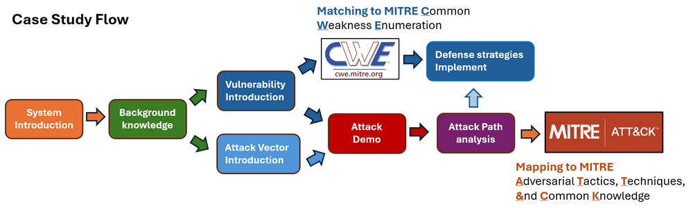
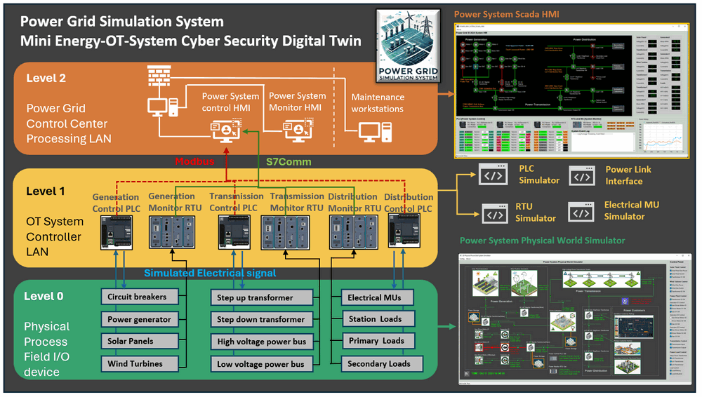
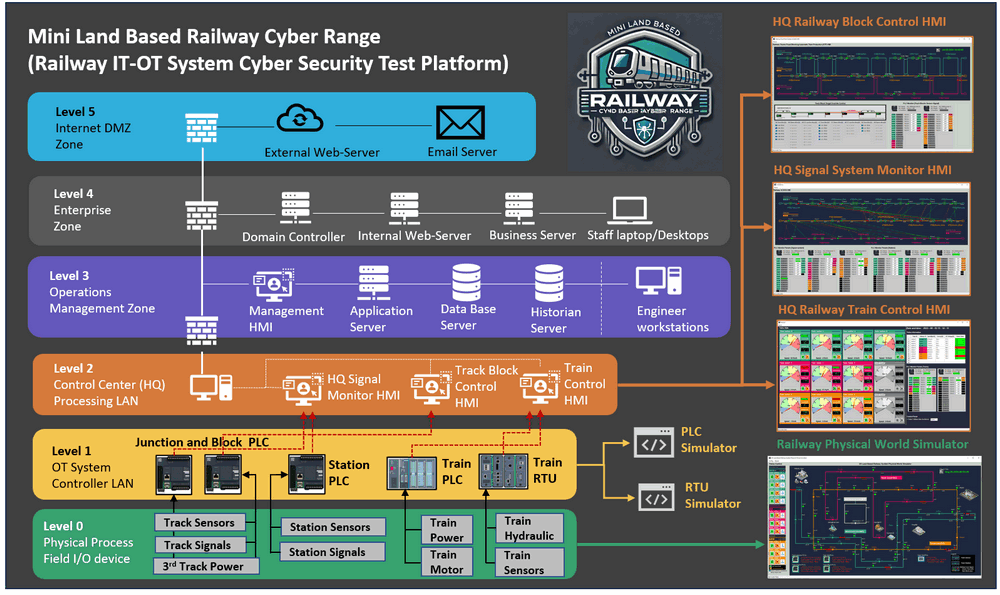
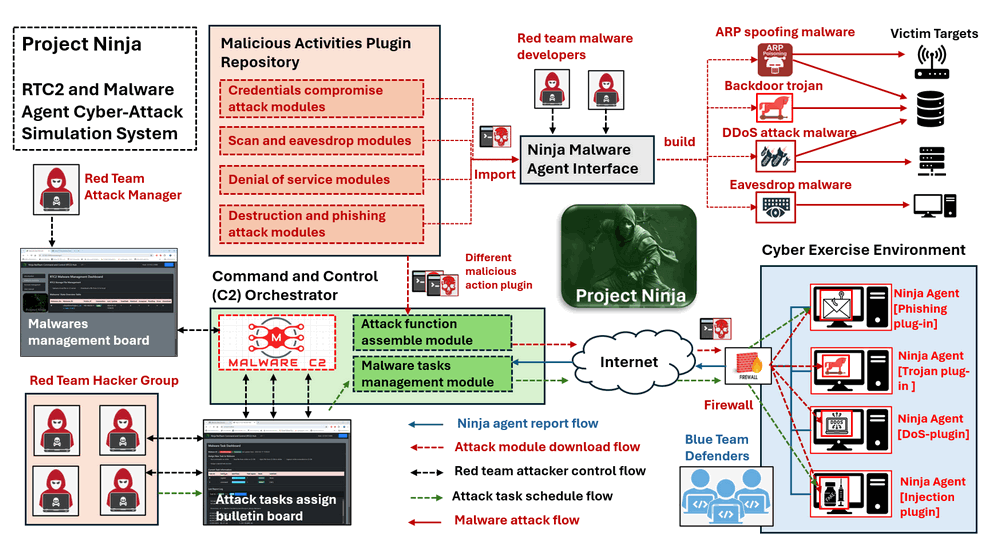

# Power Grid Simulation System 02 : FDI Power Outage Attack Case Study

We are excited to share that the [Power Grid Simulation System](https://www.linkedin.com/pulse/power-grid-ot-simulation-system-yuancheng-liu-dpplc/?trackingId=hN%2Ftqii0T5yoT12GO8pJZg%3D%3D) we developed  is used as part of the red team's targeted critical infrastructure system the cyber exercise [Crossed Swords 2024](https://ccdcoe.org/exercises/crossed-swords/) which conducted in December 2024. 


**Project Design Purpose**: This case study demonstrates using the Power Grid Simulation System as a platform to showcase the implementation of a **False Data Injection (FDI) attack** on the Metering Unit (MU) readings of a power grid's Remote Terminal Unit (RTU). The attack scenario focuses on manipulating voltage or current readings by overwriting specific memory addresses within the RTU, thereby triggering the safety protection mechanisms of the SCADA HMI system. This process ultimately leads to a power cut-off for the railway system connected to the grid's Level 0 step-down transformer. 

This particular attack scenario is proposed as one of the demonstration cases for the Crossed Swords 2024 Test-Run, serving as a live demonstration of how an IT intrusion can disrupt and potentially paralyze critical OT infrastructure. It highlights the devastating consequences of cyberattacks on industrial control systems and emphasizes the importance of robust cybersecurity measures for safeguarding critical infrastructure.

- **Attacker Vector** :  ` Siemens-S7comm Protocol False Data` , `Command Injection` , `Powe outage attack`
- **Matched MIRTE-CWD**:
- **Mapped MITRE-ATT&CK-TTP**:

> Important : The demonstrated attack case is used for education and training for different level of IT-OT cyber security ICS course, please don't apply it on any real world system.

```
# Created:     2025/01/08
# Version:     v_0.1.3
# Copyright:   Copyright (c) 2025 LiuYuancheng
# License:     GNU Affero General Public License v3.0  
```

**Table of Contents**

[TOC]

------

### Introduction

This case study demonstrates the execution of a **Siemens-S7Comm False Data Injection (FDI) attack** on a power grid system, illustrating how an attacker can exploit vulnerabilities to cause a power failure for a critical infrastructure client: a land-based railway simulation system connected to the Level 0 power distribution system. The attack sequence involves seven key steps, as outlined in the case study overview diagram below:


For the case study attack demo video, please refer to this link: https://youtu.be/INDEzA4qk7I?si=eG4ahl96KFb_Hv6u. 

#### Scenario Overview Introduction

In this case study, we envision a scenario where a red team attacker infiltrates the OT-System SCADA supervision network by implanting a **spy trojan** via an IT-based attack, such as a phishing email targeting a maintenance engineer's laptop. The attacker uses this trojan’s Command-and-Control (C2) capabilities to deliver a Siemens-S7Comm FDI script to a compromised machine within the SCADA network. The attack proceeds by:

1. Exploiting the spy trojan to inject false data into the power system RTU’s memory.
2. Bypasses verification functions and manipulating voltage or current readings to generate exception data.
3. Triggering the power grid system’s protection mechanism, leading to the disconnection of the transformer’s energy supply to the critical infrastructure customer.

This case study incorporates three key sub-projects:

- **Mini OT-Energy-System Cyber Security Digital Twin** : The primary demo platform used for attack execution, data collection, and visualization of the exception scenario.
- **Land Based Railway IT-OT System Cyber Security Test Platform** : A simulation of a Level 0 power distribution customer, representing critical infrastructure which drain 69kV AC with a maximum current of 100A for operation.
- **Ninja_C2_Malware_Simulation_System** : An agent based spy trojan attack monitor and control system used to control simulate the attack progress. 

#### Case Study Structure Introduction

In this case study, we will follow below flow diagram to draft the document. Beginning by introducing the digital twin systems used in the case study and providing related links for attack vectors and vulnerability background knowledge. Then show the attack demonstrate and introduce the attack observation with the attack path. Finally we will map the system vulnerabilities to the MITRE CWE framework, and align the attack path with the MITRE ATT&CK framework for those looking to integrate this case study into their cybersecurity training programs.



The case study document also includes the guidance for green team engineers deploying the simulation system's modules across various virtual machines (VMs) or physical devices. 

------

### Background Knowledge

Within this section, we aim to provide fundamental, general knowledge about each respective system and elucidate the Tactics, Techniques, and Procedures (TTP) associated with the attack vectors. This foundational information will serve as a primer for understanding the intricate details of the systems involved and the methodologies employed in the attack scenarios.

#### Power Grid Simulation System Over View

The **Mini OT Power Grid Simulation System** is a digital equivalent software platform designed to simulate the core operations of a hybrid power grid system, including hybrid power generation (natural gas power plants, solar power plants, and wind turbine farms), high-voltage power transmission and a three-level step-down power distribution system. The simulation integrates a SCADA system that incorporates PLCs for remote system control, RTUs and MUs for real-time data monitoring, and an HMI interface for operators to manage the grid. The system structure is shown below:



To check the detail please refer to this link: [System introduction link](https://www.linkedin.com/pulse/power-grid-ot-simulation-system-yuancheng-liu-dpplc/?trackingId=hN%2Ftqii0T5yoT12GO8pJZg%3D%3D)


#### Land Based Railway IT-OT System Cyber Security Test Platform 

The land-based railway system is a miniature cyber range capable of providing a simplified and straightforward digital-twin style Operational Technology (OT) environments emulation solution for the railway track signaling systems, train ATC and ATP system, station control system and the IT environment to simulate the railway company’s corporate network. The system structure is shown below:




#### False Data Injection (FDI) and False Command Injection (FCI)

Both FDI and FCI attacks target OT systems, FDI focuses on manipulating the data flowing through the system to deceive decision-making processes, while FCI involves injecting false commands to manipulate the actions of the control systems. Both types of attacks can have serious consequences, potentially leading to operational disruptions, safety hazards, or damage to critical infrastructure. Security measures, such as network segmentation, encryption, and intrusion detection systems, are crucial for protecting OT systems from these types of attacks.

**False Data Injection (FDI):**

- **Objective:** The main goal of FDI is to manipulate the data within the OT system, leading to incorrect or misleading information being processed by the control systems.
- **Method:** Attackers inject false or manipulated data into the sensors or communication channels within the OT system. This can lead to the control systems making incorrect decisions based on the compromised data.

**False Command Injection (FCI):**

- **Objective:** FCI aims to manipulate the commands sent to the control systems, causing them to execute unauthorized or malicious actions.
- **Method:** Attackers inject false or unauthorized commands into the communication channels or control signals of the OT system. This can lead to the control systems taking actions that are not intended or authorized.


#### Ninja_C2_Malware_Simulation_System

The Project Ninja is a cyber attack simulation toolkit designed for red team attackers to rapidly and dynamically develop and deploy various types of cyber attacks. The system is composed of a Command and Control (C2) hub and multiple distributed Trojan-Malware agents with below five main features:

- **Polymorphic Malware Construction:** A simple agent with a C2 tasks synchronization interface and a library of malicious activity plugins allows for customized construction of various types of malware.
- **Centralized Control and Task Distribution:** The C2 attack tasks synchronization mechanism enables attackers to dynamically control the functions of different Ninja malware agents.
- **Dynamic Malware Action Code Execution:** Users(red team attackers) can dynamically plug in attack modules or even execute code sections during malware runtime.
- **Camouflage Actions and Trace Erasure:** The system disguises attack actions and communications as normal software operations and erases traces to evade defender track logs.
- **Malware Self-Protection:** A self-protection watchdog prevents the malware from being terminated or deleted if it is detected by anti-malware software or defenders.

The system structure is shown below:



To check the detail, please refer to this link: https://github.com/LiuYuancheng/Ninja_C2_Malware_Simulation_System


------

