# Power Grid Simulation System 02 : FDI Power Outage Attack Case Study

We are excited to share that the [Power Grid Simulation System](https://www.linkedin.com/pulse/power-grid-ot-simulation-system-yuancheng-liu-dpplc/?trackingId=hN%2Ftqii0T5yoT12GO8pJZg%3D%3D) we developed was used as part of one red team's targeted critical infrastructure system the international cyber exercise [Crossed Swords 2024](https://ccdcoe.org/exercises/crossed-swords/) which conducted in December 2024. In this article, we will introduce one power outage attack case study which use the Power Grid Simulation System as the demo platform for OT cyber security workshop.


**Project Design Purpose**: This case study demonstrates using the Power Grid Simulation System as a target critical infrastructure to showcase the implementation of a **False Data Injection (FDI) attack** on the electricity Electrical Metering Unit (MU) readings of a power grid's Remote Terminal Unit (RTU). The attack scenario focuses on manipulating voltage or current reading value by overwriting the specific memory addresses data within the RTU, thereby triggering the safety protection mechanisms of the SCADA system. This process ultimately leads to a power cut-off for a primary power customer which is the railway system connected to the grid's Level 0 step-down transformer. 

This particular attack scenario is proposed as one of the demonstration cases for the Crossed Swords 2024 Test-Run, serving as a live demonstration of how an IT intrusion can disrupt and potentially paralyze critical OT infrastructure. It highlights the devastating consequences of cyberattacks on industrial control systems and emphasizes the importance of robust cybersecurity measures for safeguarding critical infrastructure.

- **Attacker Vector** :  ` Siemens-S7comm Protocol False Data` , `Command Injection` , `Powe outage attack`
- **Matched MIRTE-CWD** : `CWE-284`, `CWE-693`, `CWE-829`, `CWE-400`
- **Mapped MITRE-ATT&CK-TTP** : `T1566.001`, `T1567`, `T1485`, `T1490`

> Important : The demonstrated attack case is only used for education and training for different level of IT-OT cyber security ICS course, please don't apply it on any real world system.

```
# Created:     2025/01/08
# Version:     v_0.1.4
# Copyright:   Copyright (c) 2025 LiuYuancheng
# License:     GNU Affero General Public License v3.0  
```

**Table of Contents**

[TOC]

- [Power Grid Simulation System 02 : FDI Power Outage Attack Case Study](#power-grid-simulation-system-02---fdi-power-outage-attack-case-study)
    + [Introduction](#introduction)
      - [Scenario Overview Introduction](#scenario-overview-introduction)
      - [Case Study Structure Introduction](#case-study-structure-introduction)
    + [Background Knowledge](#background-knowledge)
      - [Power Grid Simulation System Over View](#power-grid-simulation-system-over-view)
      - [Land Based Railway IT-OT System Cyber Security Test Platform](#land-based-railway-it-ot-system-cyber-security-test-platform)
      - [OT Attack Vector: FDI and FCI](#ot-attack-vector--fdi-and-fci)
      - [Ninja_C2_Malware_Simulation_System](#ninja-c2-malware-simulation-system)
    + [Attack Scenario Design](#attack-scenario-design)
      - [Attack Vulnerability Background](#attack-vulnerability-background)
      - [Attack Path Introduction](#attack-path-introduction)
    + [OT Attack Demonstration](#ot-attack-demonstration)
      - [Case Study System Deployment](#case-study-system-deployment)
      - [Case Study Attack Demo Steps](#case-study-attack-demo-steps)
        * [Attack Step 1: Develop Customized FDI Attack Script](#attack-step-1--develop-customized-fdi-attack-script)
        * [Attack Step 2: Lateral Movement to Transfer the FDI Attack Script](#attack-step-2--lateral-movement-to-transfer-the-fdi-attack-script)
        * [Attack Step 3: Execute False Data Injection Attack](#attack-step-3--execute-false-data-injection-attack)
        * [Attack Step 4: Verify the Impact of the FDI Attack](#attack-step-4--verify-the-impact-of-the-fdi-attack)
    + [MITRE CWE Matching and ATT&CK Mapping](#mitre-cwe-matching-and-att-ck-mapping)
      - [MITRE CWE(Common Weakness Enumeration) Matching](#mitre-cwe-common-weakness-enumeration--matching)
      - [MITRE ATT&CK (Adversarial Tactics, Techniques, and Common Knowledge) Mapping](#mitre-att-ck--adversarial-tactics--techniques--and-common-knowledge--mapping)

------

### Introduction

This case study demonstrates the execution of a **Siemens-S7Comm False Data Injection (FDI) attack** on a power grid system's SCADA network, illustrating how an attacker can exploit vulnerabilities to cause a power failure for a critical infrastructure client: a land-based railway simulation system connected to the Level 0 power distribution system. The attack process is divided into two main phases:

- **IT System Attack**: This phase covers how the attacker uses a trojan to achieve lateral movement, evade intrusion detection systems (IDS), and deliver the OT attack payload (FDI script) to a compromised machine with access to the SCADA network. 
- **OT System Attack**:  This phase illustrates how the FDI script manipulates the power grid RTU’s memory, causing system errors that trigger the safety protection mechanisms, ultimately cutting off power to the critical infrastructure.

The attack progresses through nine key steps, as outlined in the case study overview diagram below:


` Figure-00: Power Outage Attack Case Study Overview Diagram, version v_0.1.4 (2025)`

For the case study attack demo video, please refer to this link: https://youtu.be/INDEzA4qk7I?si=eG4ahl96KFb_Hv6u. 

#### Scenario Overview Introduction

In this case study, we envision a scenario where a red team attacker infiltrates the OT-System SCADA supervision network by implanting a **spy trojan** via an IT-based attack, such as a phishing email targeting a maintenance engineer's laptop. The attacker uses this trojan’s Command-and-Control (C2) capabilities to deliver a Siemens-S7Comm FDI script to a compromised machine within the SCADA network. The attack proceeds by:

1. Exploiting the spy trojan to download FDI attack script into a victim node which can connect to the power system RTU.
2. Bypasses verification functions and manipulating voltage or current reading value to generate exception data.
3. Triggering the power grid system’s protection mechanism, leading to the disconnection of the transformer’s energy supply to the critical infrastructure customer.

This case study incorporates three key sub-projects:

- **Mini OT-Energy-System Cyber Security Digital Twin** : The primary demo platform used for attack execution, data collection, and visualization of the exception scenario demonstration .
- **Land Based Railway IT-OT System Cyber Security Digital Twin** : A railway digital twin simulate the Level 0 primary power distribution customer of the power grid, which drains 69kV AC with a maximum current of 100A for operation and used for show case the effect when the power outage attack happens.
- **Ninja_C2_Malware_Simulation_System** : An agent based trojan attack monitor and control system (includes the spy-trojan and the C2 Hub) used to control simulate the attack progress. 

#### Case Study Structure Introduction

In this case study, we will follow below flow diagram to draft the article. Beginning by introducing the digital twin systems used in the case study with background information to give a general overview. Then after providing related links for attack vectors and vulnerability, we will show the attack demonstrate and introduce the attack observation with the attack path. Finally we will map the system vulnerabilities to the MITRE CWE framework, and align the attack path with the MITRE ATT&CK framework for those looking to integrate this case study into their cybersecurity training programs.


` Figure-01: Case Study Workflow diagram, version v_0.1.4 (2025)`

The case study document also includes the guidance for green team engineers deploying the simulation system's modules across various virtual machines (VMs) or physical nodes.


------

### Background Knowledge

Within this section, we aim to provide fundamental, general knowledge about each respective system and elucidate the Tactics, Techniques, and Procedures (TTP) associated with the attack vectors. This foundational information will serve as a primer for understanding the intricate details of the systems involved and the methodologies employed in the attack scenarios.


#### Power Grid Simulation System Over View

The **Mini OT Power Grid Simulation System** is a digital equivalent platform designed to simulate the core operations of a hybrid power grid system, including hybrid power generation (natural gas power plants, solar power plants, and wind turbine farms), high-voltage power transmission and a three-level step-down power distribution system. The simulation integrates a SCADA system that incorporates PLCs for remote system control, RTUs and MUs for real-time data monitoring, and an HMI interface for operators to manage the grid. The system structure is shown below:


` Figure-02:Power Grid Simulation System structure diagram, version v_0.1.4 (2025)`

To check the detail please refer to this document link : https://www.linkedin.com/pulse/power-grid-ot-simulation-system-yuancheng-liu-dpplc/?trackingId=hN%2Ftqii0T5yoT12GO8pJZg%3D%3D


#### Land Based Railway IT-OT System Cyber Security Test Platform 

The land-based railway system is a miniature cyber range capable of providing a simplified and straightforward digital-twin style Operational Technology (OT) environments emulation solution for the railway track signaling systems, train ATC and ATP system, station control system and the IT environment to simulate the railway company’s corporate network. The system structure is shown below:


` Figure-03:Land Based Railway IT-OT System structure diagram, version v_0.1.4 (2025)`

The railway cyber range will offer several different modules to simulate Level 0 (Physical Process Field I/O device) to Level 5 (Internet DMZ Zone) of an IT-OT environment, as illustrated on the above diagram, The platform comprises six primary components which cover different levels of the system requirement: 

- **Level 0 [OT]** : 2D Railway System Physical-world Simulation (digital equivalent).
- **Level 1 [OT]** :Railway OT-Field-Controller Simulation (PLC & RTU) System.
- **Level 2 [OT]** : Railway HQ Supervisory Control and Data Acquisition (SCADA) System.
- **Level 3 [OT&IT]** : Railway System Operations Management Zone
- **Level 4 [IT]** : Railway Company's Corporate Environment Simulation System.
- **Level 5 [IT]** : Company Internet and Service Zone.


#### OT Attack Vector: FDI and FCI

Both FDI and FCI attacks target OT systems, FDI focuses on manipulating the data flowing through the system to deceive decision-making processes, while FCI involves injecting false commands to manipulate the actions of the control systems. Both types of attacks can have serious consequences, potentially leading to operational disruptions, safety hazards, or damage to critical infrastructure. Security measures, such as network segmentation, encryption, and intrusion detection systems, are crucial for protecting OT systems from these types of attacks.

**False Data Injection (FDI):**

- **Objective:** The main goal of FDI is to manipulate the data within the OT system, leading to incorrect or misleading information being processed by the control systems.
- **Method:** Attackers inject false or manipulated data into the sensors or communication channels within the OT system. This can lead to the control systems making incorrect decisions based on the compromised data.

**False Command Injection (FCI):**

- **Objective:** FCI aims to manipulate the commands sent to the control systems, causing them to execute unauthorized or malicious actions.
- **Method:** Attackers inject false or unauthorized commands into the communication channels or control signals of the OT system. This can lead to the control systems taking actions that are not intended or authorized.


#### Ninja_C2_Malware_Simulation_System

The Project Ninja is a cyber attack simulation toolkit designed for red team attackers to rapidly and dynamically develop and deploy various types of cyber attacks. The system is composed of a Command and Control (C2) hub and multiple distributed Trojan-Malware agents with below five main features:

- **Polymorphic Malware Construction:** A simple agent with a C2 tasks synchronization interface and a library of malicious activity plugins allows for customized construction of various types of malware.
- **Centralized Control and Task Distribution:** The C2 attack tasks synchronization mechanism enables attackers to dynamically control the functions of different Ninja malware agents.
- **Dynamic Malware Action Code Execution:** Users(red team attackers) can dynamically plug in attack modules or even execute code sections during malware runtime.
- **Camouflage Actions and Trace Erasure:** The system disguises attack actions and communications as normal software operations and erases traces to evade defender track logs.
- **Malware Self-Protection:** A self-protection watchdog prevents the malware from being terminated or deleted if it is detected by anti-malware software or defenders.

The system structure is shown below:


` Figure-05: Ninja_C2_Malware_Simulation_System structure diagram, version v_0.1.4 (2025)`

To check the detail, please refer to this link: https://github.com/LiuYuancheng/Ninja_C2_Malware_Simulation_System


------

### Attack Scenario Design

The attack scenario section outlines the targeted system vulnerabilities exploited by the attacker, the lateral movement of the attacker and the detailed possible effect can be observed when the attack happens.

#### Attack Vulnerability Background 

As detailed in the background knowledge section, the FDI attack focuses on manipulating system data to deceive decision-making processes. Specifically, this attack targets two critical components of the power grid system:

- **Power Grid Operating Data Collection**: The attacker manipulates real-time voltage and current data transmitted by Metering Units (MUs) to Remote Terminal Units (RTUs).
- **Exception Handling Mechanism**: By injecting erroneous data, the attacker triggers safety protection protocols, leading to system shutdowns or power cut-offs.

The table below summarizes the **normal operating ranges** for voltage and current across various power loads and customers within the power grid system. These thresholds are essential for maintaining safe and efficient system operations:

| Energy Source                  | Connected System        | Voltage Range | Current Range |
| ------------------------------ | ----------------------- | ------------- | ------------- |
| High Voltage Transmission Line | Distribution Substation | 0 - 150 kV    | 0 - 120 A     |
| Level 0 Step-Down Transformer  | Railway System          | 0 - 80 kV     | 0 - 100 A     |
| Level 1 Step-Down Transformer  | Smart Factory           | 0 - 15 kV     | 0 - 90 A      |
| Level 2 Step-Down Transformer  | Smart Home              | 0 - 220 V     | 0 - 40 A      |

The following table provides details on the **RTU memory addresses index**(from `0x00000000`)  used to store power load data received from Metering Units (MUs). Each address corresponds to specific metering data for voltage and current, stored as integer values.

| MU Components                                          | Memory Address Index | Address      | Byte Index | Data Type |
| ------------------------------------------------------ | -------------------- | ------------ | ---------- | --------- |
| Distribution Substation Voltage                        | 6                    | `0x00000006` | 4          | Int       |
| Distribution Substation Current                        | 6                    | `0x00000006` | 6          | Int       |
| Level 0 Step-Down Transformer (Railway System) Voltage | 7                    | `0x00000007` | 4          | Int       |
| Level 0 Step-Down Transformer (Railway System) Current | 7                    | `0x00000007` | 6          | Int       |
| Level 1 Step-Down Transformer (Smart Factory) Voltage  | 8                    | `0x00000008` | 0          | Int       |
| Level 1 Step-Down Transformer (Smart Factory) Current  | 8                    | `0x00000008` | 2          | Int       |
| Level 2 Step-Down Transformer (Smart Home) Voltage     | 8                    | `0x00000008` | 4          | Int       |
| Level 2 Step-Down Transformer (Smart Home) Current     | 8                    | `0x00000008` | 6          | Int       |

Mapping to the two critical components we introduced in the beginning of this section, The attacker exploits the following vulnerabilities:

- **Memory Data Manipulation**: Using an FDI attack, the attacker injects erroneous voltage and current data into specific memory addresses within the RTU.
- **Triggering System Protection Mechanisms**: The erroneous data activates the transformer’s voltage limitation feature, leading to a shutdown of energy flow to the railway system.


#### Attack Path Introduction

The FDI OT Attack  process consists of 7 steps, as illustrated in the attack path diagram below.

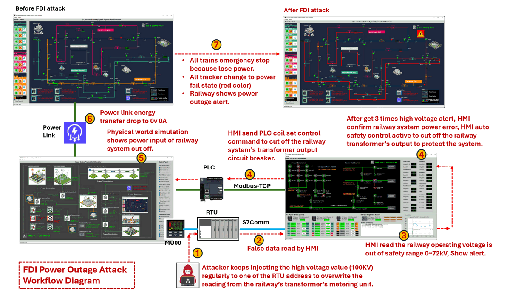

` Figure-06: Detailed OT Attack path diagram, version v_0.1.4 (2025)`

- **Step-01** : After successfully infiltrating the OT production network, the red team attacker discovers that the RTU can accept memory value modification commands via the `Siemens-S7Comm` protocol. The attacker then creates an S7Comm client program to continuously inject a high voltage value (100kV) into a specific RTU address which store the measured transformer's output voltage to the railway system, overriding the legitimate readings from the railway transformer’s metering unit.
- **Step-02** : The **Power Grid HMI** regularly reads data from the RTU. Each reading has an acceptable range, and if a value falls outside this range, the HMI will interpret it as an incorrect reading or a system error.
- **Step-03** : When the HMI detects a reading of 100kV for the railway operating voltage, which is outside the safety range of 0-72kV, it triggers an alert for the power grid operator to investigate.
- **Step-04** : If the power grid operator does not address the alert and the abnormal voltage reading persists three times consecutively, the SCADA-HMI will treat as a real system error and try activate its circuit protection mechanism. Typically, if the voltage or current is out of range, the circuit breaker trips immediately. However, if the high value persists for a period, it suggests a potential jammed of the breaker. After three alerts indicating high voltage, the HMI confirms an power error in the railway power system and initiates an automatic safety control to disconnect the railway transformer’s output, protecting the overall system.
- **Step-05** : The HMI sends a **Modbus-TCP command** to the PLC to remotely control the motorized circuit closer linked to the circuit breaker. For details on the design of the remote-controllable circuit breaker, refer to the following link: [Remote Controllable Circuit Breaker Design](https://github.com/LiuYuancheng/IT_OT_IoT_Cyber_Security_Workshop/blob/main/OT_System_Attack_Case_Study/Power_CircuitBreaker/Power_CircuitBreaker.md). Consequently, the physical circuit breaker in the power grid simulator is turned off, cutting off energy transmission to the railway system interface, resulting in 0V, 0A output.
- **Step-06** : The power grid physical simulator sends a **power cut-off message** to the railway system physical world simulator via the power link.
- **Step-07** : Upon receiving the power state update from the power link, the **railway system physical simulator** triggers power outage situation:  an emergency stop for all trains due to the loss of power. All trackers switch to a power failure state (red color), and the railway system displays a power outage alert.


------

### OT Attack Demonstration

In the attack demonstration we will show the steps to deploy the environment for green team then show the detailed red team attack steps. 

#### Case Study System Deployment

 To deploy the Power_Grid_OT_Simulation_System system with one power customer, a minimum of seven virtual machines (VMs) or physical machine are required, along with two isolated networks connected through one network switches. 

- The **Power_Grid_Physical World Network** hosts all physical-world simulation programs, including the power grid physical world simulator, weather data fetcher, power link connector, and power customer modules. This network is exclusively accessible to the green and blue teams.
- The **Power_Grid_System SCADA Network** contains OT supervisory control and data acquisition components, such as one or multiple PLC simulators,  one or multiple RTU simulators, and a human-machine interface (HMI) program. This network can be accessed by the green, blue, and red teams.

The network configuration diagram is shown below:

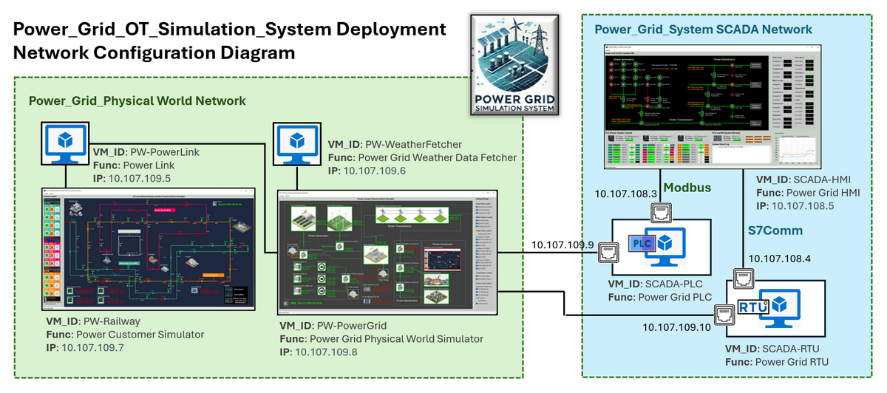

` Figure-07: Power_Grid_OT_Simulation_System Network Configuration Diagram , version v_0.1.4 (2025)`

Each PLC and RTU VM is configured with dual network interfaces to enable communication across both networks.

The recommended operating system for the Power Customer VM, Power Grid VM, and SCADA-HMI VMs is **Windows 11**, while **Ubuntu 22.04** is recommended for all other VMs to ensure compatibility with the required modules and libraries.

Deployment should follow the sequence outlined in the table below:

| VM Name          | Deploy Seq | OS Type | Physical World IP | SCADA IP     | Program/Module Needed                |
| ---------------- | ---------- | ------- | ----------------- | ------------ | ------------------------------------ |
| **PW-Railway**   | 1          | Win11   | 10.107.109.7      | N.A          | `lib` , `<Railway>PhysicalWorldSimu` |
| **PW-PowerGrid** | 2          | Win11   | 10.107.109.8      | N.A          | `lib`, `<Powergrid>PhysicalWorldEmu` |
| **PW-PowerLink** | 3          | Ubuntu  | 10.107.109.5      | N.A          | `powerlink`                          |
| **PW-Weather**   | 4          | Ubuntu  | 10.107.109.6      | N.A          | `weatherFetcher`                     |
| **SCADA-PLC**    | 5          | Ubuntu  | 10.107.109.9      | 10.107.108.3 | `lib`, `plcCtrl`                     |
| **SCADA-RTU**    | 6          | Ubuntu  | 10.107.109.10     | 10.107.108.4 | `lib`, `rtuCtrl`                     |
| **SCADA-HMI**    | 7          | Win11   | N.A               | 10.107.108.5 | `lib`, `ScadaHMI`                    |

For details on the required modules, refer to the **Program File List** section in the system setup portion of the **README** file. Each VM must also have the necessary libraries installed according to the setup instructions provided.

**Deploy Power Customer Railway System VM**

- Copy the needed program module and Update the Application Configuration File, since the railway system acts as the power customer in this deployment, update the configuration file to enable test mode by setting the flag to `True` (line 9). 
- Run the main execution file `RailwayPWSimuRun.py` and the railway physical world simulator UI will appear as shown below:

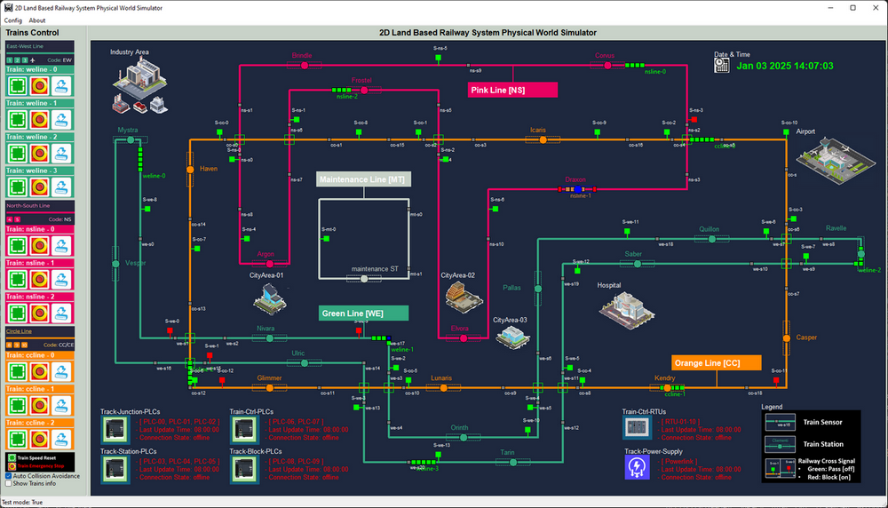

` Figure-08: Screen shot of railway system physical world simulator, version v_0.1.4 (2025)`

**Deploy Power Grid Physical World Simulator VM**

- Copy the needed program module and Update the Application Configuration File, Ensure the test mode flag (`TEST_MD`) is set to `False` to enable PLC-controlled signals.
- Run the main execution file `PowerGridPWRun.py` and the power grid system physical world simulator UI will appear as shown below:

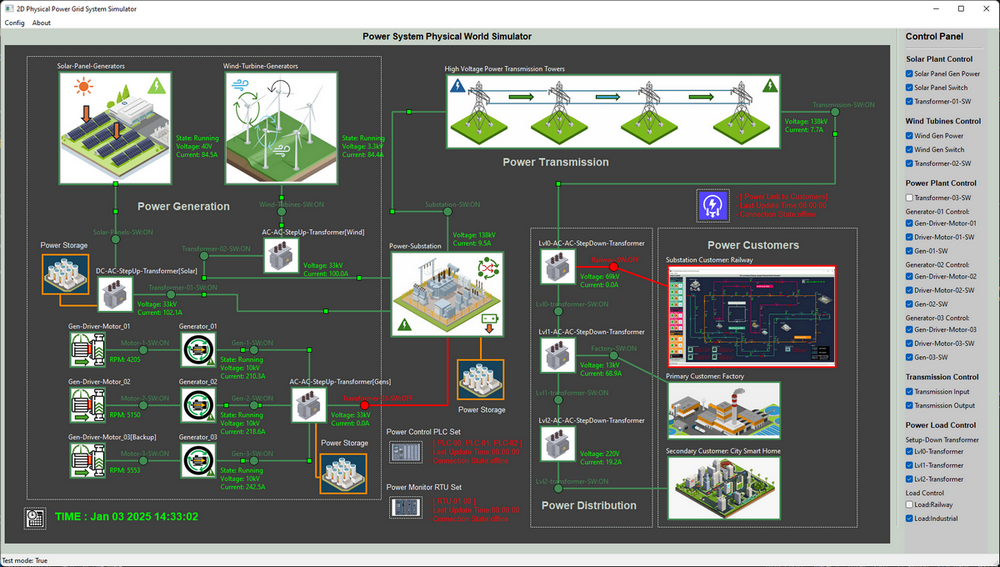

` Figure-09: Screen shot of power grid system physical world simulator, version v_0.1.4 (2025)`

**Deploy Power Grid Weather Fetcher VM**

- Copy the needed program module and manually modify lines 28–32 in the `weatherFetcher.py` file to specify the desired city and network parameters Update the code as shown below:

```python
# Set the city string to your location.
CityStr = 'Singapore'
# Set the UDP port to the physical world simulation program.
PW_IP = '10.107.109.8'
PW_PORT = 3001
```

- Run the main execution file `weatherFetcher.py` 

**Deploy Power Link Program VM**

- Copy the needed program module and Update the Application Configuration File added the 2 physical world simulators' IP in the config file.
- Run the main execution file `PowerLinkRun.py`, then check whether the power link icon on the power grid  and power customer are changed to green color as shown below image:

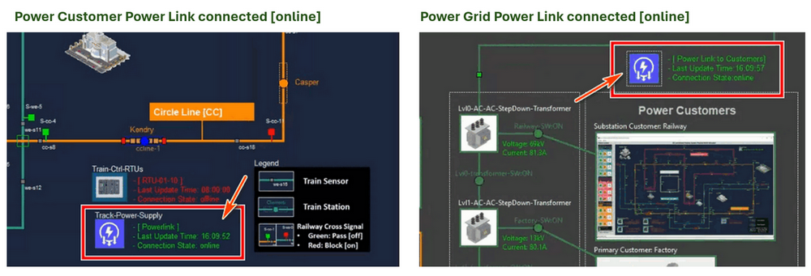

` Figure-10:Physical world simulators power link connection, version v_0.1.4 (2025)`

**Deploy SCADA-PLC Emulator VM**

- Copy the needed program module and Update the Application Configuration File. 
- Run the main execution file `plcSimulatorPwr.py`, When the PLC simulation program connected the the power grid physical world simulator, the PLC Icon and connection situation on power grid physical simulator user interface will be change to green color as shown below:

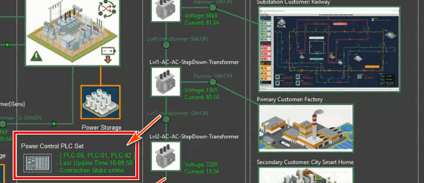

` Figure-11:SCADA-PLC Emulatorconnection indicator, version v_0.1.4 (2025)`

**Deploy SCADA-RTU Emulator VM**

- Copy the needed program module and Update the Application Configuration File. 
- Run the main execution file `rtuSimulatorPwr.py`, When the RTU simulation program connected the the power grid physical world simulator, the RTU Icon and connection situation on power grid physical simulator user interface will be change to green color as shown below:

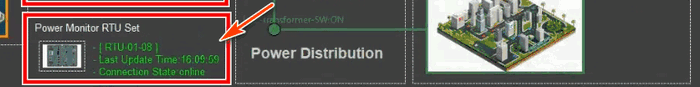

` Figure-12:SCADA-RTU Emulatorconnection indicator, version v_0.1.4 (2025)`

**Deploy SCADA-HMI Program VM**

- Copy the needed program module and Update the Application Configuration File. 
- Run the main execution file `ScadaHMIRun.py`, Verify that the RTU and PLC are connected properly as shown below (Connection indicator shows connected and green color) :


` Figure-13:Screen shot of power grid system SCADA-HMI, version v_0.1.4 (2025)`

#### Case Study Attack Demo Steps

The following steps detail how the red team attacker implements a **False Data Injection (FDI) attack** on the RTU to simulate a power outage scenario.

##### Attack Step 1: Develop Customized FDI Attack Script

The attacker identifies the RTU's IP address within the SCADA network through data leakage. An initial attempt to perform a false command injection (FCI) attack on the PLC fails because the victim machine's IP is not in the PLC's allow read/write access control list. Armed with the RTU's IP address, the attacker develops a customized FDI attack script tailored to exploit vulnerabilities in the Siemens S7Comm protocol used by the RTU.

The critical attack loop in the script to inject the out of range voltage value is shown below:

```python
#-----------------------------------------------------------------------------
# Attack loop example 
RTU_IP= '10.107.108.4' # change this IP to the Power grid RTU02 IP address

client = snap7Comm.s7CommClient(RTU_IP, rtuPort=102, snapLibPath=libpath)
connection = client.checkConn()
if connection:
    while True:
        print("Attack: Start inject out of MU measurement range false voltrage value (100kV) \nto lvl0 Transformer RTU-MU reading")
        client.setAddressVal(7, 4, 100, dataType=INT_TYPE)
        time.sleep(0.1)
        print("False data Inject finished!")
```

To create the custom script, the attacker references the S7Comm client example: https://github.com/LiuYuancheng/PLC_and_RTU_Simulator/blob/main/S7Comm_RTU_Simulator/src/snap7Comm.py

##### Attack Step 2: Lateral Movement to Transfer the FDI Attack Script

Once the attack script is prepared, the attacker uses a spy trojan and a Command and Control (C2) system to transfer the script to the victim machine within the SCADA network. The Step-by-Step process is shown below :

- **Upload Script to C2 Hub** : The attacker uploads the python FDI attack script `attackScript_FDI.py` from their local machine to the C2 hub, as shown below:

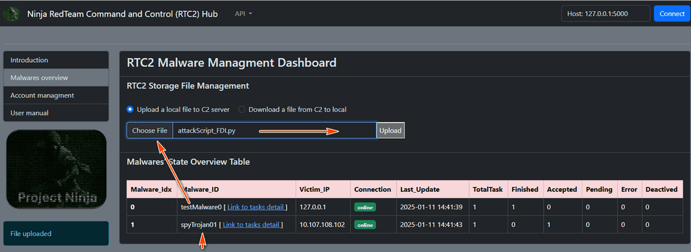

` Figure-14:Upload FDI Attack Script to C2 Hub , version v_0.1.4 (2025)`

- **Inject Script into Victim Machine** : From the C2 system, the attacker uses the C2 spy trojan control function-03 "Inject file from C2-DB to victim" function to download the script from the C2 hub to the victim machine as shown below:

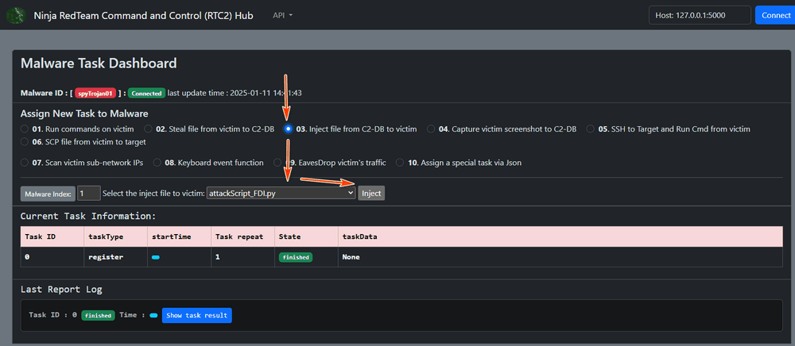

` Figure-15:Inject FDI Attack Script into Victim Machine , version v_0.1.4 (2025)`

At this stage, the attack script resides on the victim machine, ready for execution.


##### Attack Step 3: Execute False Data Injection Attack

The attacker executes the FDI attack script remotely via the C2 hub. The goal is to inject a `100 kV` voltage value into the RTU at memory index `7`, byte `4`.  The Step-by-Step process is shown below :

- **Run Attack Script via C2 Hub** : The attacker selects the function 01 "Run commands on victim" function to execute the FDI attack script as shown below:

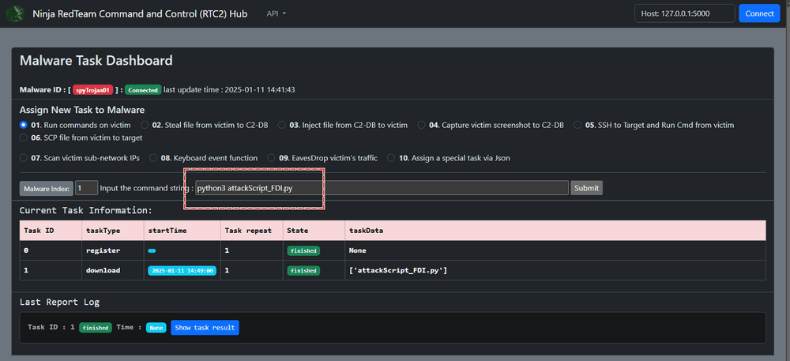

` Figure-16: Remote execute Attack Script via C2 Hub on Victim Machine , version v_0.1.4 (2025)`

- **Monitor Script Execution in Real-Time** : When the script is executing, from C2, the attacker can see the task is being executed as shown below:

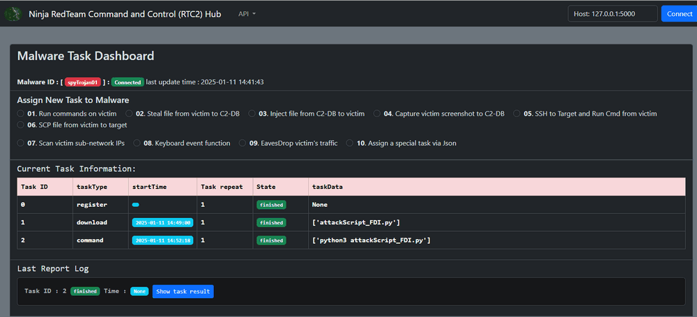

` Figure-17 : Monitor Script Execution in Real-Time from C2, version v_0.1.4 (2025)`

**Remark**: If the attack node (Ubuntu system) lacks the `python-snap7` library version 1.3, install it using the following commands from C2 function-01:

```
$ sudo apt-get install software-properties-common
$ sudo add-apt-repository ppa:gijzelaar/snap7
$ sudo apt-get update
$ sudo apt-get install libsnap7-1 libsnap7-dev
$ pip install python-snap7==1.3
```

When the script successfully connects to the RTU, the victim machine logs will display the following:

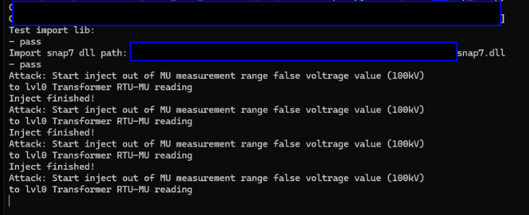

` Figure-18 : FDI attack script execution log, version v_0.1.4 (2025)`

##### Attack Step 4: Verify the Impact of the FDI Attack

The blue team can observe the following effects during and after the attack:

- **Monitor HMI for Alerts** : After the attack script has been running, the power grid SCADA-HMI displays red alerts indicating abnormal voltage values:

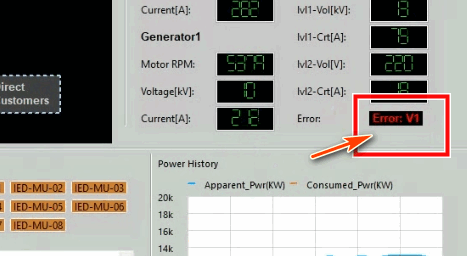

` Figure-19 : Alert detection display on SCADA-HMI, version v_0.1.4 (2025)`

- **Observe Circuit Protection Mechanism Activation** :  After continuous detect the  abnormal voltage values 3 times, the circuit protection mechanism triggers, cutting off power. The HMI logs the protective action in its UI log:

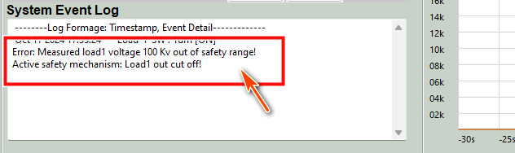

` Figure-20 : Circuit Protection Mechanism Activation Log display, version v_0.1.4 (2025)`

- **Inspect the Power Grid Physical Simulator** : The circuit breaker for the railway system (`Railway-SW`) switches off, and the current drops to `0.0 A` as shown below 

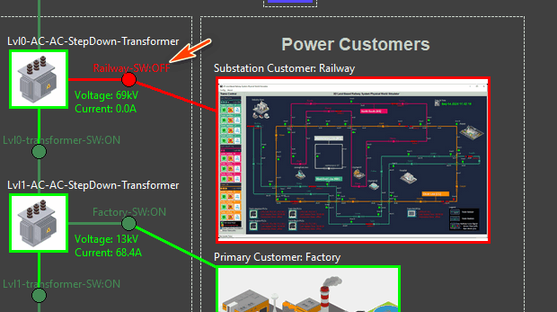

` Figure-21 : Power cut off on Power Grid Physical World simulator, version v_0.1.4 (2025)`

**Check Railway System Simulator for Power Failure**  : The railway system physical simulator shows that power has failed, completing the scenario (As shown below)

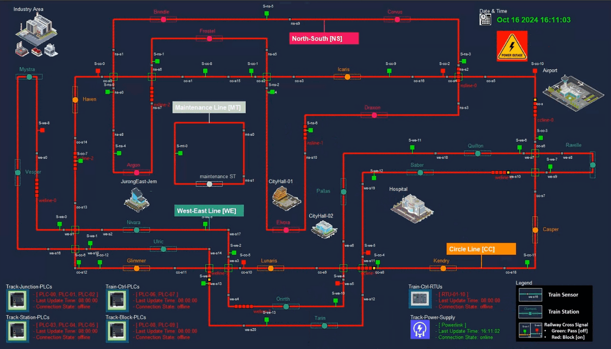

` Figure-22 : Power outage attack happens on the Railway physical world simulator, version v_0.1.4 (2025)`

At this point, the FDI attack successfully demonstrates its ability to disrupt critical infrastructure by manipulating RTU data and triggering protection mechanisms.


------

### MITRE CWE Matching and ATT&CK Mapping

In this section, we will map the system vulnerabilities to the MITRE CWE framework, and align the attack path with the MITRE ATT&CK framework for those looking to integrate this case study into their cybersecurity training programs.


#### MITRE CWE(Common Weakness Enumeration) Matching

**CWE-284** : Improper Access Control 

- **Matched vulnerability** : The attacker is able to continuously inject a high voltage value into a specific RTU address, overriding the legitimate readings from the railway transformer's metering unit. This indicates a lack of proper access control mechanisms in place to prevent unauthorized modification of data

**CWE-693** : Protection Mechanism Failure

- **Matched vulnerability** : The attacker is able to trigger the power grid system's protection mechanism, leading to the disconnection of the transformer's energy supply to the critical infrastructure customer. This indicates a failure in the protection mechanism to properly detect and respond to abnormal conditions

**CWE-829** : Inclusion of Functionality from Untrusted Control Sphere

- **Matched vulnerability** : The attacker is able to deliver a Siemens-S7Comm FDI script to a compromised machine within the SCADA network. This suggests that the script includes functionality from an untrusted control sphere, which can lead to unauthorized access and manipulation of the SCADA system. 

**CWE-400** : Uncontrolled Resource Consumption

- **Matched vulnerability** : The attacker is able to continuously inject a high voltage value into a specific RTU address, potentially leading to uncontrolled resource consumption and overload of the system.


#### MITRE ATT&CK (Adversarial Tactics, Techniques, and Common Knowledge) Mapping

**T1566.001** : Spearphishing Attachment

- The scenario mentions that the attacker infiltrates the OT-System SCADA supervision network by implanting a spy trojan via an IT-based attack, such as a phishing email targeting a maintenance engineer's laptop. This aligns with the Spearphishing Attachment technique, where the attacker uses a malicious attachment in a phishing email to gain initial access to the target network.

**T1567** : Manipulate Control Devices 

- The Manipulate Control Devices technique matches with Step-01 of the scenario description where the attacker creates an S7Comm client program to inject a high voltage value into a specific RTU address, manipulating the control device to override legitimate readings

**T1485** : Physical Destruction

- The Physical Destruction technique involves causing physical damage or destruction to a system or infrastructure. In the given scenario, the attacker triggers the power grid system's protection mechanism, leading to the disconnection of the transformer's energy supply to the critical infrastructure customer. This action can be considered as physical destruction as it results in the loss of power and the emergency stop of all trains in the railway system.

**T1490** : Disrupt Energy Supply 

- The given technique \"Disrupt Energy Supply\" matches with Step-05 of the scenario description. In this step, the attacker uses the HMI to send a Modbus-TCP command to the PLC to remotely control the motorized circuit closer linked to the circuit breaker. This action results in the physical circuit breaker being turned off, cutting off energy transmission to the railway system interface and disrupting the energy supply.


------

> Last edit by LiuYuancheng(liu_yuan_cheng@hotmail.com) at 11/01/2025, if you have any problem, please send me a message.  Copyright (c) 2025 LiuYuancheng