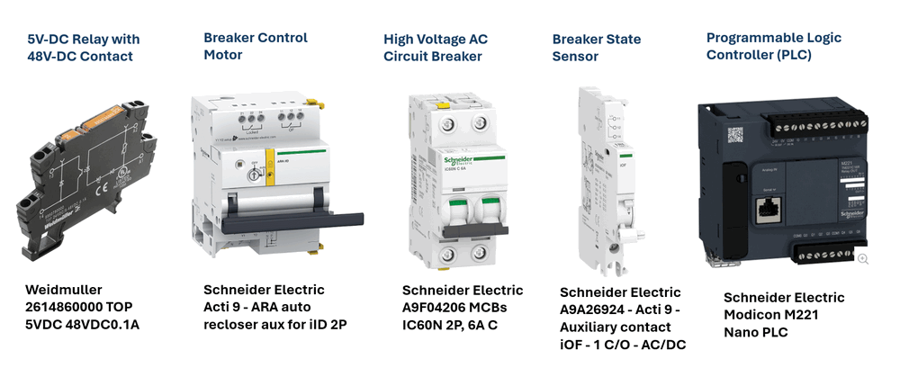
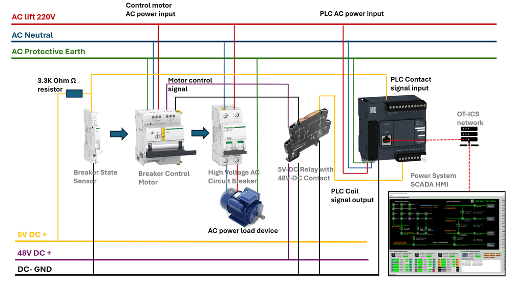
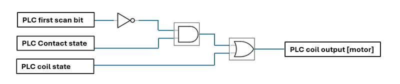
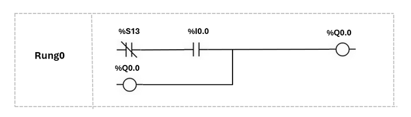
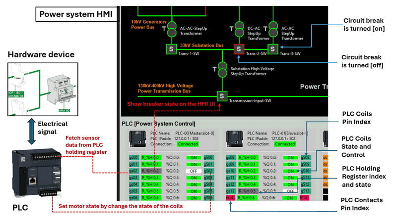
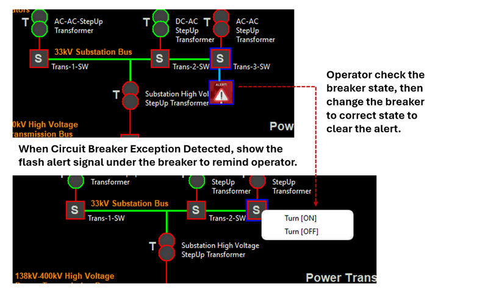

# OT Power Grid System Development

### How to Use PLC to Remote Control Circuit Breaker in Power Grid System 


**Project Design Purpose:**
The goal of this project is to demonstrate how to utilize Programmable Logic Controllers (PLC) to remotely monitor and control circuit breakers within a power grid system. Using a Schneider circuit breaker and PLC hardware, the project will cover the physical hardware connections and provide a step-by-step guide for designing a PLC ladder diagram  to sense and control the breaker states. Additionally, the project will explain how to detect power system anomalies, such as power trips, based on the states of PLC contacts and coils from the power system control SCADA HMI. Finally, a digital power grid digital equivalent  simulation will be used to model and simulate the entire control sequence for the people who don't have the hardware.

```
# Version:     v0.0.2
# Created:     2024/09/18
# Copyright:   Copyright (c) 2024 LiuYuancheng
# License:     MIT License 
```

[TOC]

 

------

### Introduction

Programmable Logic Controllers (PLC) are essential in power systems for remote monitoring and control of key equipment like circuit breakers. This project focuses on a practical example of using a Schneider PLC to remotely control a circuit breaker, along with integrating sensors and remote control mechanisms. The project will guide through:

- **Physical device/hardware connections**: Setting up wiring between the PLC, circuit breaker, position sensors, and control devices.
- **PLC ladder logic design**: Developing the control logic to manage breaker states and automate operations.
- **SCADA HMI integration**: Using a power system SCADA interface to monitor and control the circuit breaker remotely.
- **Exception and alert handling**: Simulating and responding to anomalies such as power trips.
- **Digital equivalent system simulation**: Designing a digital twin of the power grid to simulate and validate the entire control process.

For the  digital equivalent part, two subprojects will also be used for this system to simulate the OT device and the power grid control sequence:

- **Python Virtual PLC & RTU Simulator**: A tool to simulate the PLC devices used in the system.
- **Power Grid Simulation System**: A simulation platform for emulating physical electrical devices and providing SCADA HMI functionalities for monitoring and control.

The real power system is more complex than what we introduced, this comprehensive project will demonstrate the main idea how PLCs are used in modern power grids for safe, efficient, and reliable remote control.


------

### Physical Device Connection

To build a PLC-controlled circuit breaker system, we will need five key components: a 5V relay with 48V contacts, a circuit breaker, a breaker state sensor, a breaker control motor, and the PLC.(As shown below)



- **5V Relay with 48V Contact**: This relay will interface with the PLC's 5V coil output to control the 48V DC supply for the breaker control motor. For this, we will use the `Weidmuller 2614860000 TOP 5VDC 48VDC 0.1A relay`. [Product link](https://catalog.weidmueller.com/catalog/Start.do?localeId=en&ObjectID=2614860000)
- **High Voltage AC Circuit Breaker**: The AC circuit breaker will be responsible for controlling the on/off status of the AC power. We will use the `Schneider Electric A9F04206 MCB IC60N 2P, 6A C`. [Product link](https://www.se.com/sg/en/product/A9F04206/miniature-circuit-breaker-mcb-acti9-ic60n-2p-6a-c-curve-6000a-iec-608981-10ka-iec-609472-double-term-/)
- **Breaker State Sensor**: This sensor detects the position of the circuit breaker (whether it's open or closed). We will use the `Schneider Electric A9A26924 Acti 9 Auxiliary contact iOF - 1 C/O - AC/DC`. [Product link](Schneider Electric A9A26924 Acti 9 Auxiliary contact iOF - 1 C/O - AC/DC)
- **Breaker Control Motor**: This motor module receives control signals from the PLC and operates the circuit breaker, switching it on or off. For this, we will use the `Schneider Electric Acti 9 ARA auto-recloser auxiliary module for iID 2P`. [Product link](https://www.se.com/sg/en/product/A9C70342/acti-9-ara-auto-recloser-aux-for-iid-2p-1-prog/)
- **Programmable Logic Controller (PLC)**: The `Schneider Electric Modicon M221 PLC`, which supports Modbus TCP, will be used to control the entire system. [Product link](https://www.se.com/sg/en/product-range/62128-logic-controller-modicon-m221/#products)

The hardware connection diagram is illustrated in the image below.



Since the `Schneider Electric Acti 9 ARA auto-recloser motor` operates at 48V, we need to use the 5V relay with 48V contacts to bridge the PLC’s 5V output coil with the 48V power supply, enabling the motor to flip the breaker on or off. The breaker state sensor can directly connect to the PLC's 5V input. However, if a 48V PLC extension module, such as the SR2D201BD, is used, the relay and sensor connections can be linked directly to the breaker sensor and control motor, bypassing the 5V relay configuration.


------

### PLC Ladder Logic Design 

The breaker control motor operates by flipping on when it receives a low-to-high pulse and flipping off when it receives a high-to-low pulse. This means that the actual state of the motor might not always match the PLC coil state. For example, if the PLC coil sends a signal from low to high to turn the breaker on, but the breaker trips due to an overcurrent event, the breaker will flip the motor plastic handle ( [2] in below picture) and sensor handle ([3] in blow picture) to the off position. In this case, the PLC input contact will detect a low voltage (off) from the sensor, while the PLC coil still holds a high voltage (on) state.


In typical ladder logic design for breaker control, no special logic is required. However, for a breaker that supplies power, we need to ensure that the PLC doesn’t interfere with the current state of the power supply when it reboots. Upon startup, all PLC outputs default to zero voltage. Therefore, the PLC output coil needs to synchronize with the current state of the breaker sensor during the initial startup.

This synchronization can be illustrated as follows:

| PLC Startup Input Contact State | PLC Startup Output Coil State | Coil Change                          |
| ------------------------------- | ----------------------------- | ------------------------------------ |
| Voltage-High                    | Voltage-Low                   | From Voltage Low to Voltage-High     |
| Voltage-Low                     | Voltage-Low                   | Remain in current state Voltage -Low |

Once this one-time synchronization occurs during the PLC startup, the sensor input will no longer affect the coil state. To implement this in the ladder diagram, we utilize the **PLC first scan bit**—a special internal bit or flag that is set to `true` only during the first scan cycle after the PLC powers up. This allows initialization logic, such as resetting variables, setting default values, or synchronizing states, to run only once during startup. It is typically used for initialization tasks like resetting variables, setting default values, or running startup procedures that only need to happen once.

In most PLC programming environments, the first scan bit is built-in and commonly labeled as `First_Scan`, `S1`, or a similar identifier. For the M221 PLC, as per the programming guide [Modicon M221 Logic Controller Programming Guide](https://pneumatykanet.pl/pub/przekierowanie/Modicon-M221-Logic-Controller-Programming-Guide-EN.pdf), the first scan bit is `%S13`. The corresponding circuit diagram for this function is shown below : 



The state table below illustrates how the first scan bit affects the synchronization process:

| PLC State   | First Scan Bit | PLC Input Contact State | Current PLC Coil State | PLC Coil Change         |
| ----------- | -------------- | ----------------------- | ---------------------- | ----------------------- |
| PLC Startup | 0              | 0                       | 0                      | Remain in current state |
| PLC Startup | 0              | 1                       | 0                      | Change from 0 to 1      |
| PLC Running | 1              | 0 or 1                  | 0 or 1                 | Remain in current state |

The corresponding ladder logic diagram rung is shown below:



Using the first scan bit, the PLC will synchronize the sensor and motor states during startup, after which the sensor contact and motor control coil will operate independently from one another. This ensures stable and reliable operation without unintended state changes during normal operation.


------

### SCADA HMI Integration and Alert Handling

After finished connected the wire on the hardware and setup the PLC ladder logic, we will connect the PLC to the SCADA HMI to do the breaker control and monitor. The HMI will read the contact connected holding registers and the coils value regularly then shown in the power system display map: 



Then when the user click the breaker on/off button, the HMI will send the coil set Modbus-TCP command to PLC to change the motor state. 

After integrate the PLC with the SCADA-HMI, we need to add the breaker state exception detection logic in the HMI. As the coils state will be synchronized with the sensor state when PLC startup. So if the sensor state and the motor state are some thing unseal: either the HMI breaker change action failed or the breaker is flipped manually by some one or there is a power trip happened. 

| PLC Holding Register Val | PLC Coil State | System Exception                                             |
| ------------------------ | -------------- | ------------------------------------------------------------ |
| 0                        | False          | Normal state, no error.                                      |
| 1                        | True           | Normal state, no error.                                      |
| 0                        | True           | Circuit breaker power trip or some people manually flip of the breaker. |
| 1                        | False          | HMI breaker turn off action fail or some one flip on the breaker manually. |

If the exception is detected the HMI will show the flash alert signal under the breaker to remind operator system got error and need to check. Then the operator needs to check the breaker state, then change the breaker to correct state to clear the alert.(AS shown in the below picture)



------

