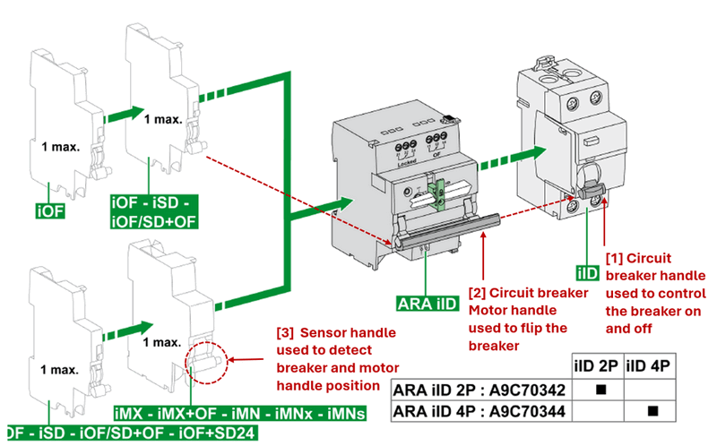

# OT Power Grid System Development

### How to Use PLC to Remote Control Circuit Breaker in Power Grid System 


` Figure-00: Project Overview Diagram, version v0.0.2 (2024)`

**Project Design Purpose**: The objective of this project is to demonstrate how to utilize Programmable Logic Controllers (PLC) to remotely monitor and control circuit breakers within a power (grid/supply) system. Using a Schneider Electric circuit breaker, sensor, closer and PLC, the project will cover the physical hardware connections and provide a step-by-step guide for designing a PLC ladder diagram  to sense and control the breaker states. Additionally, the project will explain how to detect power system anomalies (such as power trips), based on the states of PLC contacts and coils from the power system control SCADA HMI. Finally, a digital power grid digital equivalent simulation will be used to model and simulate the entire control sequence for the people who don't have the hardware.

```python
# Version:     v0.0.2
# Created:     2024/09/18
# Copyright:   Copyright (c) 2024 LiuYuancheng
# License:     MIT License 
```

**Table of Contents**

[TOC]

- [OT Power Grid System Development](#ot-power-grid-system-development)
    + [How to Use PLC to Remote Control Circuit Breaker in Power Grid System](#how-to-use-plc-to-remote-control-circuit-breaker-in-power-grid-system)
    + [Introduction](#introduction)
    + [Physical Device Connection](#physical-device-connection)
    + [PLC Ladder Logic Design](#plc-ladder-logic-design)
    + [SCADA HMI Integration and Alert Handling](#scada-hmi-integration-and-alert-handling)
    + [Digital Equivalent Simulation System](#digital-equivalent-simulation-system)
    + [Reference Link](#reference-link)

------

### Introduction

Programmable Logic Controllers (PLC) are essential in power systems for remote monitoring and control of key equipment like circuit breakers, relay and closer. This project focuses on a practical example of using a Schneider Electric  PLC to remotely control a circuit breaker, along with integrating sensors and remote control motor mechanisms. The project will guide through:

- **Physical device/hardware connections**: Setting up wiring between the power bus, signal link,  PLC, circuit breaker, position sensors, and control devices.
- **PLC ladder logic design**: Developing the PLC internal control logic to manage breaker states and automate operations.
- **SCADA HMI integration**: Using a power system SCADA interface to monitor and control the circuit breaker remotely.
- **Exception and alert handling**: Simulating and responding to anomalies such as power trips, breaker flip failed.
- **Digital equivalent system simulation**: Designing a digital twin of the power grid to simulate and validate the entire control process.

For the digital equivalent implement part, two subprojects will also be used for this system to simulate the OT devices and the power grid control sequence:

- **Python Virtual PLC & RTU Simulator**: A tool to simulate the PLC devices used in the system [project link](https://github.com/LiuYuancheng/Power_Grid_Simulation_System).
- **Power Grid Simulation System**: A simulation platform for emulating physical electrical devices and providing SCADA HMI functionalities for monitoring and control [project link](https://github.com/LiuYuancheng/PLC_and_RTU_Simulator).

The real world power system is much more complex than what we introduced, this comprehensive project will demonstrate the main basic idea how PLCs are used in modern power grids for safe, efficient, and reliable remote control.


------

### Physical Device Connection

To build a PLC-controlled circuit breaker monitor and control system, we will need five key components: a 5V relay with 48V contacts, a circuit breaker, a breaker state sensor, a breaker control motor, and the PLC. (As shown below)


` Figure-01: Project used hardware pictures, version v0.0.2 (2024)`

- **5V Relay with 48V Contact**: This relay will interface with the PLC's 5V coil output to control the 48V DC supply for the breaker control motor. For this, we will use the `Weidmuller 2614860000 TOP 5VDC 48VDC 0.1A relay`. [Product link](https://catalog.weidmueller.com/catalog/Start.do?localeId=en&ObjectID=2614860000)
- **High Voltage AC Circuit Breaker**: The AC circuit breaker will be responsible for controlling the on/off status of the high voltage (110V ~ 480V) AC power. We will use the `Schneider Electric A9F04206 MCB IC60N 2P, 6A C`. [Product link](https://www.se.com/sg/en/product/A9F04206/miniature-circuit-breaker-mcb-acti9-ic60n-2p-6a-c-curve-6000a-iec-608981-10ka-iec-609472-double-term-/)
- **Breaker State Sensor**: This sensor detects the position of the circuit breaker (whether it's open or closed). We will use the `Schneider Electric A9A26924 Acti 9 Auxiliary contact iOF - 1 C/O - AC/DC`. [Product link](https://www.se.com/sg/en/product/A9A26924/acti-9-auxiliary-contact-iof-1-c-o-ac-dc/)
- **Breaker Control Motor/Closer**: This motor module receives control signals from the 48V relay and operates the circuit breaker, switching it on or off. For this, we will use the `Schneider Electric Acti 9 ARA auto-recloser auxiliary module for iID 2P`. [Product link](https://www.se.com/sg/en/product/A9C70342/acti-9-ara-auto-recloser-aux-for-iid-2p-1-prog/)
- **Programmable Logic Controller (PLC)**: The `Schneider Electric Modicon M221 PLC`, which supports Modbus TCP communication, will be used to control the entire system. [Product link](https://www.se.com/sg/en/product-range/62128-logic-controller-modicon-m221/#products)

The hardware connection diagram is illustrated in the image below.


` Figure-02: Hardware connection wire diagram, version v0.0.2 (2024)`

Since the `Schneider Electric Acti 9 ARA auto-recloser motor` operates at 48V, we need to use the 5V relay with 48V contacts to bridge the PLC’s 5V output coil with the 48V power supply, enabling the motor to flip the breaker on or off. The breaker state sensor can directly connect to the PLC's 5V input. However, if a 48V PLC extension module, such as the `Schneider Electric SR2D201BD` is used, the relay and sensor connections can be linked directly from the extension mode to the breaker sensor and control motor, bypassing the 5V relay configuration.


------

### PLC Ladder Logic Design 

The breaker control motor operates by flipping on when it receives a low-to-high voltage pulse and flipping off when it receives a high-to-low voltage pulse. This means that the actual state of the motor might not always match the PLC coil state. For example, if the PLC coil sends a signal from low to high to turn the breaker on, but the breaker trips due to an overcurrent event, the breaker will flip the motor plastic handle ( `[2]` in below picture) and sensor handle ( `[3]` in below picture) to the off position. In this case, the PLC input contact will detect a low voltage (off) from the sensor, while the PLC coil still holds a high voltage (on) state.



` Figure-03: Circuit breaker, sensor and closer connection, version v0.0.2 (2024)`

In typical ladder logic design for breaker control, no special logic is required. However, for a breaker that supplies power, we need to ensure that the PLC doesn’t interfere with the current state of the current power supply when it reboots. Upon startup, all PLC outputs will try to reset to default to zero voltage. Therefore, the PLC output coil needs to synchronize with the current state of the breaker sensor during the initial startup.

This synchronization can be illustrated as follows:

| PLC Startup Input Contact State | PLC Startup Output Coil State | Coil Change                          |
| ------------------------------- | ----------------------------- | ------------------------------------ |
| Voltage-High                    | Voltage-Low                   | From Voltage Low to Voltage-High     |
| Voltage-Low                     | Voltage-Low                   | Remain in current state Voltage -Low |

Once this one-time synchronization occurs during the PLC startup, the sensor input will no longer affect the coil state. To implement this in the ladder diagram, we utilize the `PLC first scan bit`—a special internal bit or flag that is set to `true` only during the first scan cycle after the PLC powers up. This allows initialization logic, such as resetting variables, setting default values, or synchronizing states, to run only once during startup. It is typically used for initialization tasks like resetting variables, setting default values, or running startup procedures that only need to happen once.

In most PLC programming environments, the first scan bit is built-in and commonly labeled as `First_Scan`, `S1`, or a similar identifier. For the M221 PLC, as per the programming guide (page 194 / 238 ) [Modicon M221 Logic Controller Programming Guide](https://pneumatykanet.pl/pub/przekierowanie/Modicon-M221-Logic-Controller-Programming-Guide-EN.pdf), the first scan bit is `%S13`. 


` Figure-04: Schneider Electric Modicon M221 PLC user manual function guide , version v0.0.2 (2024)`

The corresponding circuit diagram for this function is shown below : 


` Figure-05: Circuit diagram to handle the init synchronization state , version v0.0.2 (2024)`

The state table below illustrates how the first scan bit affects the synchronization process:

| PLC State   | First Scan Bit | PLC Input Contact State | Current PLC Coil State | PLC Coil Change         |
| ----------- | -------------- | ----------------------- | ---------------------- | ----------------------- |
| PLC Startup | 0              | 0                       | 0                      | Remain in current state |
| PLC Startup | 0              | 1                       | 0                      | Change from 0 to 1      |
| PLC Running | 1              | 0 or 1                  | 0 or 1                 | Remain in current state |

The corresponding ladder logic diagram rung  (convert from the circuit diagram)  is shown below:


` Figure-06: PLC ladder diagram, version v0.0.2 (2024)`

Using the first scan bit, the PLC will synchronize the sensor and motor states during startup, after which the sensor contact and motor control coil will operate independently from one another. This ensures stable and reliable operation without unintended state changes during normal operation.


------

### SCADA HMI Integration and Alert Handling

Once the hardware connections are completed and the PLC ladder logic is set up, the next step is integrating the PLC with the SCADA HMI to enable control and monitoring of the circuit breaker. The HMI will continuously read the values from the PLC's holding registers and coil states, and these will be displayed on the power system's interface, as shown in the image below:


` Figure-07: PLC and SCADA HMI Integration workflow diagram, version v0.0.2 (2024)`

When the user interacts with the HMI by clicking the breaker on/off button, the HMI sends a Modbus-TCP command to the PLC, instructing it to change the motor state by updating the relevant coil.

After the integration, it's crucial to implement breaker state exception detection within the HMI. Since the PLC synchronizes the coil state with the sensor state during startup, discrepancies between the motor state and the sensor state could indicate a possible issue. These issues could be caused by a failed HMI command, manual breaker operation, or a power trip.

The table below summarizes potential system exceptions:

| PLC Holding Register Val | PLC Coil State | System Exception                                             |
| ------------------------ | -------------- | ------------------------------------------------------------ |
| 0                        | False          | Normal state, no error.                                      |
| 1                        | True           | Normal state, no error.                                      |
| 0                        | True           | Circuit breaker power trip or manual operation of the breaker. |
| 1                        | False          | HMI breaker off action failed or manual operation turned the breaker on. |

When an exception situation is detected, the HMI will display a flashing alert signal next to the breaker icon to notify the operator that an error has occurred and needs attention. The operator will then need to investigate the breaker’s current state and manually correct it to clear the alert, as shown in the image below:


` Figure-08: SCADA HMI Integration Alert Handling workflow, version v0.0.2 (2024)`

This system ensures that any breaker state inconsistencies are promptly identified and addressed, enhancing the overall reliability of the power grid system. In the HMI, a "Maintenance Flag" feature needs to be added. When electrical engineers perform circuit maintenance, they will physically lock the ARA automatic recloser, as shown below, to prevent anyone from accidentally turning on the breaker remotely:


` Figure-09: Step to lock the circuit breaker closer, version v0.0.2 (2024)`

In this scenario, the **Maintenance Flag** in the HMI will be enabled to prevent the system from interpreting the situation as an exception. More importantly, when the Maintenance Flag is activated, the HMI will be prohibited from remotely turning on the breaker as an additional safety mechanism. This ensures that even if the engineer forgets to engage the physical padlock, the system will still remain secure.

Once the maintenance is completed, the engineer will release the physical lock, manually flip the breaker to the desired position, and reset the PLC. Afterward, they will return to the control room, disable the HMI’s Maintenance Flag, and the system will resume normal operation with full remote control capabilities.


------

### Digital Equivalent Simulation System 

If physical devices are not available and you need to simulate a circuit breaker in a virtual power grid environment, this can be easily implemented by defining the breaker as an object within the physical world simulator. The object will include two key parameters to represent the breaker's state [`self.breakerState`] and motor input power[`self.motorVoltage`]. A private function will be used to monitor the current value and trip the breaker if it exceeds the maximum current limit. Additionally, three public functions will be provided to interact with other components in the simulation:

- `setCurrent()`: Called by other physical simulation devices to set the current flowing through the breaker.
- `setMotor()`: Interacts with the PLC coil output to change the breaker's state.
- `getSensorState()`: Interacts with the PLC contact input to report the breaker's state back to the PLC.

A simple example of a breaker object class is shown below:

```python
class AgentBreaker(AgentTarget):
    """ Remote motor-controllable breaker class."""
    def __init__(self, parent, tgtID, maxCrt, tType='BREAK'):
        super().__init__(parent, tgtID, None, None, tType)
        self.maxCurrent = maxCrt
        self.current = 0
        self.breakerState = False 
        self.motorVoltage = 0

    def _checkCurrent(self, currentVal):
        """ Check if the current exceeds the maximum limit. Returns True if within the limit."""
        if self.breakerState:
            return currentVal < self.maxCurrent
        return False

    def setCurrent(self, currentVal):
        if self._checkCurrent(currentVal):
            self.current = currentVal
            return True
        else:
            self.breakerState = False  # Circuit trips
            self.current = 0
            return False

    def setMotor(self, motorVal):
        if self.motorVoltage == motorVal:
            return
        elif self.motorVoltage == 0 and motorVal == 1:
            # Simulate low-to-high pulse to turn on the breaker.
            self.breakerState = True  # Circuit opens
        elif self.motorVoltage == 1 and motorVal == 0:
            # Simulate high-to-low pulse to turn off the breaker.
            self.breakerState = False  # Circuit closes

    def getSensorState(self):
        return self.breakerState
```

For the virtual PLC simulator ladder logic design, you can include the first scan bit as a global value, initialized to 1, in the PLC simulation program:

```python
	def runLadderLogic(self, regsList, coilList=None):
		# sychronize the coil state with the real world at the 1st when PLC connected to physical world
        if gv.firstScanbitt == 0: return None 
        coilsRsl = []
        if len(regsList) != 21:
            gv.gDebugPrint('runLadderLogic(): input not valid', logType=gv.LOG_WARN)
            gv.gDebugPrint("Input registers list: %s" %str(regsList))
        else:
            # direct connection copy the register state to coil directly:
            coilsRsl = list(regsList).copy()
            gv.firstScanbitt = 0
        gv.gDebugPrint('Finished calculate all coils: %s' %str(coilsRsl), logType=gv.LOG_INFO)
        return coilsRsl
```

The digital equivalent simulation work flow is shown below image:


` Figure-10: digital equivalent simualtion system workflow, version v0.0.2 (2024)`

This system allows you to model the behavior of breakers, PLCs, and other components in a virtual environment, ensuring flexibility and ease of testing without the need for physical hardware.


------

### Reference Link

- **Power Grid Digital Equivalent System**: https://github.com/LiuYuancheng/Power_Grid_Simulation_System
- **Python Victual PLC  Simulator**: https://github.com/LiuYuancheng/PLC_and_RTU_Simulator
- **Weidmuller 2614860000 TOP 5VDC 48VDC 0.1A relay** : https://catalog.weidmueller.com/catalog/Start.do?localeId=en&ObjectID=2614860000
- **Schneider Electric A9F04206 MCB IC60N 2P, 6A C**: https://www.se.com/sg/en/product/A9F04206/miniature-circuit-breaker-mcb-acti9-ic60n-2p-6a-c-curve-6000a-iec-608981-10ka-iec-609472-double-term-/
- **Schneider Electric A9A26924 Acti 9 Auxiliary contact iOF - 1 C/O - AC/DC**: https://www.se.com/sg/en/product/A9A26924/acti-9-auxiliary-contact-iof-1-c-o-ac-dc/
- **Schneider Electric Acti 9 ARA auto-recloser auxiliary module for iID 2P**: https://www.se.com/sg/en/product/A9C70342/acti-9-ara-auto-recloser-aux-for-iid-2p-1-prog/
- **Schneider Electric Modicon M221 PLC**: https://www.se.com/sg/en/product-range/62128-logic-controller-modicon-m221/#products


------

> last edit by LiuYuancheng (liu_yuan_cheng@hotmail.com) by 21/09/2024 if you have any problem, please send me a message. 