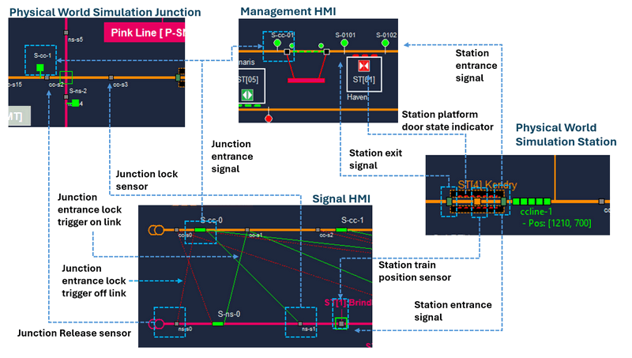
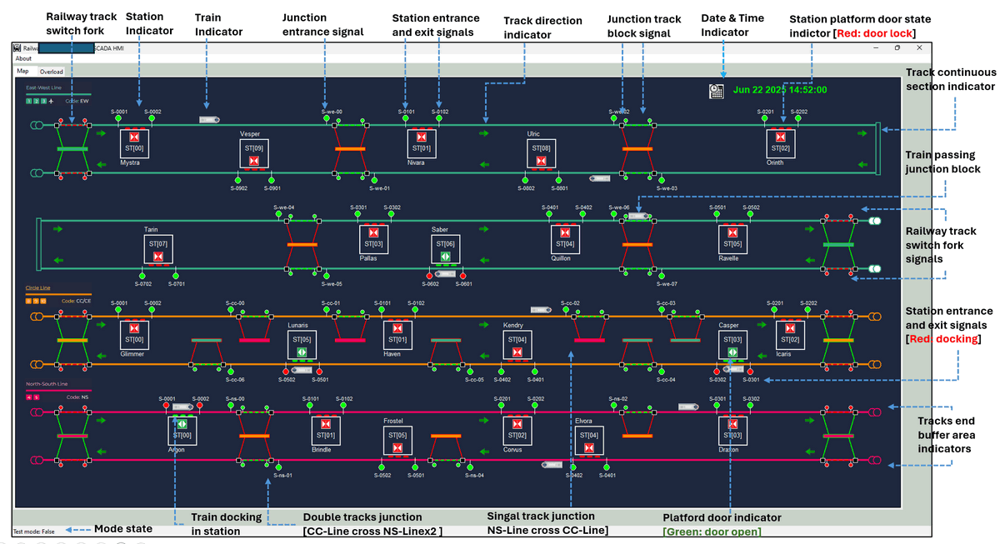
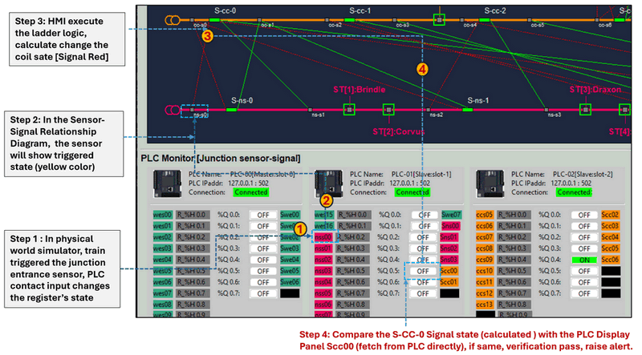
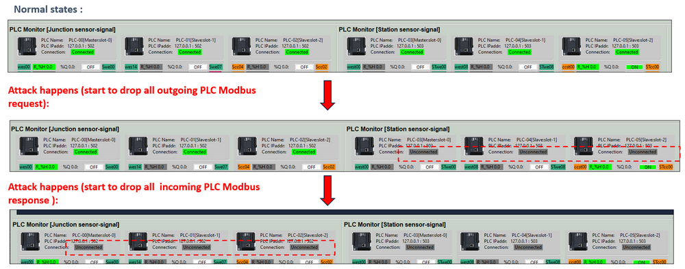

# OT Railway System Development [04]


### Design and Usage of the Human-Machine Interfaces (HMI) for a Land-Based Railway Cyber Range

```python
# Author:      Yuancheng Liu
# Created:     2025/06/20
# Version:     v_0.0.1
# Copyright:   Copyright (c) 2025 Liu Yuancheng
```

**Table of Contents**

[TOC]

------

### Introduction

In the previous article, [*Implementing Different Human-Machine Interfaces (HMI) for a Land-Based Railway Cyber Range*](https://www.linkedin.com/pulse/implementing-different-human-machine-interfaces-hmi-land-based-liu-cqojc), we explored the development of four specialized SCADA HMIs designed for a land-based railway simulation cyber range. That article introduced the foundational concepts behind SCADA HMIs, the rationale for their implementation in cyber-physical environments, and the functional architecture tailored for this railway-specific use case. We concluded with an overview of the network topology and communication design for each HMI.

This article serves as the second installment in the HMI documentation series. In previous article, we end with the introduction of detail network and communication design of each HMI, here we move from conceptual design to practical implementation, providing a detailed look into how each of the four HMIs operates within the cyber range and supports hands-on cybersecurity exercises.

This article is organized into four key sections:

- **Software Structure Design**: A breakdown of HMI’s internal architecture, including control flow, modular design, thread management, asynchronous processing, and data handling.
- **Cyber Range UI Design**: An overview of the interface layout and user experience (UX) enhancements tailored for cyber exercise scenarios.
- **HMI Usage Introduction**: A practical guide to operating the HMIs for system monitoring, control, and responding to anomalies during cyber simulations.
- **Defense Case Study**: A demonstration of how an HMI, when integrated with intrusion detection systems (IDS), can aid in identifying and mitigating OT-specific cyber attacks and threats.

**Clarifying a Common Question**

Before diving into the technical content, let's clarify a frequent  question may ask when I introduce the OT cyber range: 

> Once the hacker get in to OT environment, it’s already too late -- defense is futile and the war is over. There is no point for OT engineers to be cyber security expert, purely the responsibility of IT to detect and defense the cyber attack, not OT engineers.

This viewpoint may be common for OT operators, but from a OT system manager's view it  underestimates the defensive capabilities present in modern OT systems and the crucial role of OT engineers. In reality, OT system includes complex protection , fault tolerance and redundancy mechanisms to avoid damage for different abnormal situation includes cyber attack. Such as the PLC-IP whitelisting, the use of static ARP entries, and tightly controlled communications protocols to make the ARP spoofing, Mitm nearly impossible.  Even after an initial breach, OT engineers who understand both the physical processes and security principles can still identify, analyze, and respond to attacks in time.

From the defender's view unlike IT environments, where traffic is often encrypted and obfuscated, OT networks exhibit highly deterministic behavior. This predictability allows abnormal traffic—such as unexpected mDNS queries, unsolicited HTTP requests, or rogue pings—to stand out clearly. Thus, with the right tools and training, OT engineers can become a first line of defense against cyber threats, making real-time visibility through HMIs a critical component of incident response.


------

### HMI Software Design

To support the simulation, monitoring, and incident response capabilities required by a railway cyber range, all Human-Machine Interface (HMI) programs are developed using a modular, multithreaded architecture. This design ensures efficient data handling, real-time responsiveness, and separation of responsibilities across different functional modules. The overall software structure is depicted in the architecture diagram below:


At the core of the HMI application is the **Main Thread**, which orchestrates five key sub-threads responsible for managing data flow, user interaction, system communication, and real-time control.

#### Main Thread and Core Modules

The main thread initializes and governs the entire HMI application by controlling the lifecycle and interaction of all sub-modules and threads. The main thread includes 6 sub-modules:

- **Program Control Module** : Coordinates the start-up and shutdown of all sub-threads, ensuring orderly program execution and system synchronization.
- **Program Clock Control Module**: Manages the timing mechanisms and loop frequency for all the threads (e.g., FPS for UI rendering, data polling intervals for communication threads).
- **Program Data Control Module**: Oversees inter-thread data flow, ensuring proper sequencing for state processing, analysis, and storage.
- **Alert Management Module**: Monitors system states and triggers alerts in response to abnormal events or threshold violations.
- **Pre-Configured Instance Response Module**: Automatically executes predefined responses (e.g., shutdowns, notifications) based on alert types and user-defined conditions.
- **Operation Verification Module (Operational)**: This module is only used by the blue team which allow the HMI also run the same ladder logic as the target PLC based on the PLC input and compare the reading reason and calculation result to detect possible FDI attack.  

#### 1. IT Data Manager Thread

This thread handles communications on the IT layer, including interactions with databases and inter-HMI messaging, and conducts preliminary filtering of incoming data:

- **Database Comm Client**: Interfaces with the cyber range ICS database (typically using SQLite3) to fetch data (supervisory-level HMI ) or insert data (machine-level HMIs).
- **HMI Comm Client/Server**: Facilitates UDP-based communication between HMIs. Acts as a server in Master HMI mode and a client in Slave mode.
- **IT Data Storage Module**: Manages incoming data from the database or peer HMIs. It filters redundant data, organizes records, and sends preprocessed information to the Data Processing Thread and raw data to the Local I/O Manager for logging.

#### 2. OT Data Manager Thread

Thread responsible for collecting and preparing operational data from OT field devices such as PLCs, RTUs, and IEDs: 

- **OT Communication Clients**: Implements connectors for various protocols including Modbus-TCP,  Siemens S7Comm, IEC 60870-5-104, OPC-UA. The number of connectors will be same as the number of PLCs the HMI connects to.
- **Raw OT Data Storage and Process Module**: Gathers raw data in each polling cycle, organizes it into device-specific dictionaries, filters irrelevant entries, and logs the unprocessed data via the Local I/O Manager Thread.

#### 3. Data Processing Thread

This thread serves as the data refinement and analysis center for the HMI:

- **OT Data Convert Module**: Converts raw controller signals (e.g., NC/NO states) into logical values (e.g., `True/False`, `0/1`).
- **Data Mapping Module**: Translates system values into human-readable indicators (e.g., mapping a memory integer to a voltage reading or LED color).
- **Data Filter Module**: Removes duplicate or stale entries from both IT and OT data streams.
- **Data Verify Module**: Validates that incoming data falls within expected operational ranges. Alerts are triggered if violations are detected.
- **Data Process Module**: Aggregates and prepares final outputs for visualization and storage, interact with the Main Thread’s Program Data Control Module..

#### 4. UI Display Manager Thread

Manages the visual interface and interaction logic between the operator and the system:

- **UI Components Manager** : Renders visual elements like indicators, alarms, gauges, and animation effects in real time.
- **Display Refresh Manager** : Display panel to refresh  visualize cycles to maintain a stable and responsive UI.
- **User Action and Event Handler** : Captures user inputs (e.g., button clicks, toggle switches) and relays control commands to the Program Control Module for execution.

#### 5. Local I/O Manager Thread

Handles program configuration, logging, and global state variables:

- **Config Loader**: Parses configuration files to initialize and dynamically update system settings.
- **Log and Record Generator**:  Log all the data to the related log files, roll over if the log file is big (10MB), create HMI screen shot when abnormal situation appears. 
- **Global Variable Module**: Manages shared variables used across the entire application and interacts with the Program Data Control Module for synchronization.


------

### HMI UI Design Introduction

This section will introduce the User Interface design for each HMI.

#### Design of PLC Display Panel

In the machine-level HMIs each HMI features multiple **PLC display panels** to visualize the real-time raw PLC data (which always hide in real world or digital twin HMI). Each machine-level HMI displays a different number of PLC panels, depending on its monitoring scope:

- **Signal System Monitor HMI**: 6 PLC panels
- **Railway Block Monitor HMI**: 2 PLC panels
- **Railway Train Control HMI**: 2 PLC panels

Each panel presents detailed, real-time information from a specific PLC, with mappings to its associated ladder logic and connected physical components. The design structure is shown in the diagram below:


Each PLC panel is divided into two main sections: **PLC Information** and **PLC State Display**.

PLC Information Section section provides metadata and communication details about the connected PLC:

- **PLC ID**: Unique identifier assigned to each PLC within the SCADA system.
- **Position**: Logical location or subsystem the PLC belongs to.
- **Mode**: PLC Mode (master/slave)
- **IP Address**: Network IP used by the PLC.
- **Port**: Port number used for communication (e.g., `502` for Modbus-TCP).
- **Connection State**: Displays whether the HMI is currently connected to the PLC. (Green = Connected, Yellow = High latency, Gray = Disconnected)

PLC State Display Section section shows the real-time data read directly from the PLC ladder logic and maps it to the physical world components. The display is divided into five key columns:

- **Physical World Sensor ID** : Shows the sensor connected to the PLC input contact. Format: `<LineID>_<SensorType><Index>`. 
  Example: `west08` = WE Line (we), Station (st) 08 sensor.
- **Holding Register ID and State** :  Indicates the state of the register linked to the ladder logic contact.  Format: `R_<Changeable_Char%>_<register_type> <rung_set_idx>.<item_idx>`  Example: `R_%H0.0` = Holding register, rung 0, item 0.  Green = Input Voltage High 5V , Gray = Input Voltage Low 0V.
- **Coil ID** : Ladder logic coil address. Format: `<Changeable_Char%>Q<rung_set_idx>.<item_idx>`  Example: `%Q0.0` = Output coil 0 in rung set 0.
- **Coil State** : Status of the coil. Green = ON (Output Voltage High), Gray = OFF (Output Voltage  Low).
- **Physical World Signal ID** : Indicates the real-world actuator or signal driven by the coil. Format: `<SignalType>_<LineID>_<SignalIndex>`  Example: `STwe08` = Signal device at WE Line, Station 08.

The register ID and coil ID formatting follows conventions commonly used in Schneider Electric's Wonderware PLC programming tool's stand, ensuring compatibility and familiarity for industrial engineers as shown below:


#### Design of Sensor-Signal Relationship Diagram

The Sensor-Signal Relationship Diagram is a core UI component of both the Signal System Monitor HMI, Block Monitor HMI and the HQ Management HMI, offering a real-time visual mapping between the simulated physical world components (stations and junctions), their connected sensors, and the control signal states. It is designed to provide intuitive situational awareness during operation and cyber defense activities. 

Below is an example to mapping the physical world simulation components to the sensor-signal relationship diagram display:



The diagram represents the interaction between:

- **Sensors** in stations and junctions (position sensors, lock sensors, release sensors)
- **Signal lights** (entrance, exit, junction)
- **Physical components** (junction switches, train positions, platform doors)

The relationships are visualized in a way that allows operators to instantly assess whether a signal behavior is logically valid based on the current state of its corresponding sensors and PLC logic.

**Ladder Logic Verification Mode**

A key feature of the Sensor-Signal Relationship Diagram is the "Ladder Logic Verification Mode". When this mode is enabled (typically during cyber defense exercises), the HMI operates in simulation-consistency verification mode, the detail process is:

1. The Sensor-Signal Relationship Diagram will only display the sensors state from PLC raw data. 
2. HMI control module will execute the same ladder logic as the related PLC based on the PLC sensor data.
3. After get the expected signal state, the ladder logic execution result will show on Sensor-Signal Relationship Diagram signal. 
4. If the Sensor-Signal Relationship Diagram signal state is different with the PLC display panel's raw data, then there may be possible OT False Command Injection attack happens.

This verification mechanism is inspired by concepts from the PLC Honeypot Project: https://www.linkedin.com/pulse/python-plc-honeypot-project-yuancheng-liu-vks8c 


------

### HMI UI Display Introduction

This chapter introduces the User Interface (UI) design and core functional components of the four HMI types: Signal System Monitor HMI, Railway Block Monitor HMI, Railway Train Control HMI, and HQ Management HMI.

#### 1. Signal System Monitor HMI

The Signal System Monitor HMI provides visualization of sensor-to-signal mapping within both station and junction areas. It is used to show the signal operations in relation to train presence and movement across track forks and platforms. The UI with detail function explanatory note is shown below :


HMI Main Components:

- **Sensor-Signal Relation Map** : Displays real-time status of train sensors and signal lights. It also visualizes automatic control relationships based on track layout, station zones, and junction connections. If enable the signal light verify function, it will show the expected signal state based on the "internal ladder logic calculation" to compare with the raw data read from PLC.
- **Three Station PLC Panels**: 3 PLC display panels [PLC-03, PLC-04, PLC-05] monitor input/output states related to sensors and signals at all the stations.
- **Thee Junction PLC Panels**: 3 PLC display panels [PLC-00, PLC-01, PLC-02] monitor input/output states at railway junctions.  Each panel includes real-time display of PLC holding registers, digital input/output states, and coil activation statuses.

This HMI plays a critical role in simulating switch misbehavior, light malfunction, or control failures under normal or attack conditions.


#### 2. Railway Block Monitor HMI

The Railway Block Monitor HMI focuses on block-level train control and ATP (Automatic Train Protection) management. It simulates block occupancy, sensor detection, and signal enforcement across train blocks. The UI with detail function explanatory note is shown below :


HMI Main Components:

- **Block Sensor-Signal Control Map**: Provides real-time visibility into block occupation status, sensor triggers, and signal transitions in stations and junctions.
- **Two PLC State Panels**: 2 PLC Display Panels to show I/O signal states and register/coils from block control PLCs.
- **ATP Control Override Panel** : Allows manual override of the PLC's ATP function. Enabled (Checkbox Checked): ATP logic operates normally through PLC ladder control. Disabled (Checkbox Unchecked): ATP logic is bypassed, and signal states remain frozen (keep the current state) or manually controlled by the operator.

This HMI is especially useful in demonstrating the impact of cyber tampering with ATP logic or unauthorized control access.


#### 3. Railway Train Control HMI

The Railway Train Control HMI is designed for monitoring individual train systems, including traction power, radar input, and real-time diagnostics. It supports both operational simulation and cybersecurity testing. The UI with detail function explanatory note is shown below :


Main Components:

- **Train Information Panels** : 10 train information panels and 2 placeholders provide detailed telemetry for each train, including: Train ID, Current and Average Speed, 3rd Rail Power Input: Voltage, Current, and Power State and Control Buttons for 3rd Rail Power Toggle. 
- **RTU Radar State Panel**: 10 indicators to display the obstacle detection status from front-facing radar sensors.
- **RTU Information Sheet** : 1 RTU information sheet with 2 function. Normal Mode (`test mode false`) : Displays raw feedback data from RTUs. Test Mode: Allows users to manually input test values (e.g., speed or power) to validate alert and data filtering functions.
- **PLC State Display Panels** : 2 PLC display panels show live holding register and coil state used to control 3rd rail power.
- **Auto-Avoidance Backdoor Switch** Provides a backdoor toggle control for enabling/disabling the auto-train collision avoidance system—primarily used in cyberattack demo scenarios to illustrate effects of unauthorized overrides. 


#### 4. HQ Management HMI

The HQ Management HMI acts as the supervisory-level interface for control room operators. It provides an overview of the full railway system’s operational status and enables strategic decision-making. The UI with detail function explanatory note is shown below :



Main Components:

- **22 Station Monitor Indicators** : Display the state of entrance/exit signals, platform doors, and associated door lighting for each monitored station.
- **10 Train Indicators** : Show the current position of each train based on block occupancy, following a fixed-block railway control model.
- **6 Track-End Buffer Area Indicators**: Monitor signal states at the physical end-points of the tracks.
- **5 Double-Track Junction Indicators** : Show real-time signal and block states at major junctions where two tracks with  multi-crosses. 
- **9 Signal-Track Junction Indicators**: Display control states and signals at forked junctions involving fork entrance signal and the junction block state. 

This interface provides centralized visibility and is vital for cyber situational awareness, abnormal pattern detection, and incident response coordination.


------

### HMI Usage and Defense Case Study

This section will introduce some simple cases for the blue team to use the HMI to detect the possible cyber attack. 

#### Detect possible False command injection attack on PLC 

This is a simple example to use Sensor-Signal Relationship Diagram to detect abnormal scenario and raise alert : 



- Step 1 : In physical world simulator, train triggered the junction entrance sensor, PLC contact input changes the register’s state
- Step 2: In the Sensor-Signal Relationship Diagram,  the sensor will show triggered state (yellow color)
- Step 3: HMI execute the ladder logic, calculate change the coil sate [Signal Red]
- Step 4: Compare the S-CC-0 Signal state (calculated ) with the PLC Display Panel Scc00 (fetch from PLC directly), if same, verification pass, raise alert.  

#### Detect possible False command injection attack on RTU

This is a simple example to use HQ management HMI to detect abnormal scenario and raise alert : 


Step 1 : the PLC display panel shows the station sensor is triggered 

Step 2: Check the calculated signal’s state from the Sensor-Signal Relationship Diagram

Step 3: Compare the ST[0] Signal state (calculated ) with the PLC Display Panel STns00 (fetch from PLC directly), if same, verification pass, raise alert.  

Step 4: Mapping to the management HMI to confirm data update correctly in data base

Step 5 : check the position of the train on the fixed block if the train position not in the station block, means the RTU data is abnormal, there may be false data injection attack on the RTU memory 

#### Detect Possible ARP spoofing from the PLC connection Panel

To detect the APT spoofing packet drop attack please follow the observation describe in this case study

**OT Cyber Attack Workshop [ Case Study 02 ]: ARP Spoofing Attack on HM** : https://www.linkedin.com/pulse/ot-cyber-attack-workshop-case-study-02-arp-spoofing-hmi-yuancheng-liu-howzc




------

> last edit by LiuYuancheng (liu_yuan_cheng@hotmail.com) by 22/06/2025 if you have any problem, please send me a message. 

