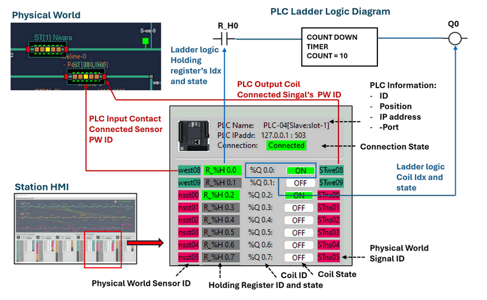

# OT Railway System Development [04]


### Design and Usage of the Human-Machine Interfaces (HMI) for a Land-Based Railway Cyber Range

```python
# Author:      Yuancheng Liu
# Created:     2025/06/20
# Version:     v_0.0.1
# Copyright:   Copyright (c) 2025 Liu Yuancheng
```

**Table of Contents**

[TOC]

------

### Introduction

In the previous article, [*Implementing Different Human-Machine Interfaces (HMI) for a Land-Based Railway Cyber Range*](https://www.linkedin.com/pulse/implementing-different-human-machine-interfaces-hmi-land-based-liu-cqojc), we explored the development of four specialized SCADA HMIs designed for a land-based railway simulation cyber range. That article introduced the foundational concepts behind SCADA HMIs, the rationale for their implementation in cyber-physical environments, and the functional architecture tailored for this railway-specific use case. We concluded with an overview of the network topology and communication design for each HMI.

This article serves as the second installment in the HMI documentation series. In previous article, we end with the introduction of detail network and communication design of each HMI, here we move from conceptual design to practical implementation, providing a detailed look into how each of the four HMIs operates within the cyber range and supports hands-on cybersecurity exercises.

This article is organized into four key sections:

- **Software Structure Design**: A breakdown of HMI’s internal architecture, including control flow, modular design, thread management, asynchronous processing, and data handling.
- **Cyber Range UI Design**: An overview of the interface layout and user experience (UX) enhancements tailored for cyber exercise scenarios.
- **HMI Usage Introduction**: A practical guide to operating the HMIs for system monitoring, control, and responding to anomalies during cyber simulations.
- **Defense Case Study**: A demonstration of how an HMI, when integrated with intrusion detection systems (IDS), can aid in identifying and mitigating OT-specific cyber attacks and threats.

**Clarifying a Common Question**

Before diving into the technical content, let's clarify a frequent  question may ask when I introduce the OT cyber range: 

> Once the hacker get in to OT environment, it’s already too late -- defense is futile and the war is over. There is no point for OT engineers to be cyber security expert, purely the responsibility of IT to detect and defense the cyber attack, not OT engineers.

This viewpoint may be common for OT operators, but from a OT system manager's view it  underestimates the defensive capabilities present in modern OT systems and the crucial role of OT engineers. In reality, OT system includes complex protection , fault tolerance and redundancy mechanisms to avoid damage for different abnormal situation includes cyber attack. Such as the PLC-IP whitelisting, the use of static ARP entries, and tightly controlled communications protocols to make the ARP spoofing, Mitm nearly impossible.  Even after an initial breach, OT engineers who understand both the physical processes and security principles can still identify, analyze, and respond to attacks in time.

From the defender's view unlike IT environments, where traffic is often encrypted and obfuscated, OT networks exhibit highly deterministic behavior. This predictability allows abnormal traffic—such as unexpected mDNS queries, unsolicited HTTP requests, or rogue pings—to stand out clearly. Thus, with the right tools and training, OT engineers can become a first line of defense against cyber threats, making real-time visibility through HMIs a critical component of incident response.


------

### HMI Software Design

To support the simulation, monitoring, and incident response capabilities required by a railway cyber range, all Human-Machine Interface (HMI) programs are developed using a modular, multithreaded architecture. This design ensures efficient data handling, real-time responsiveness, and separation of responsibilities across different functional modules. The overall software structure is depicted in the architecture diagram below:


At the core of the HMI application is the **Main Thread**, which orchestrates five key sub-threads responsible for managing data flow, user interaction, system communication, and real-time control.

#### Main Thread and Core Modules

The main thread initializes and governs the entire HMI application by controlling the lifecycle and interaction of all sub-modules and threads. The main thread includes 6 sub-modules:

- **Program Control Module** : Coordinates the start-up and shutdown of all sub-threads, ensuring orderly program execution and system synchronization.
- **Program Clock Control Module**: Manages the timing mechanisms and loop frequency for all the threads (e.g., FPS for UI rendering, data polling intervals for communication threads).
- **Program Data Control Module**: Oversees inter-thread data flow, ensuring proper sequencing for state processing, analysis, and storage.
- **Alert Management Module**: Monitors system states and triggers alerts in response to abnormal events or threshold violations.
- **Pre-Configured Instance Response Module**: Automatically executes predefined responses (e.g., shutdowns, notifications) based on alert types and user-defined conditions.
- **Operation Verification Module (Operational)**: This module is only used by the blue team which allow the HMI also run the same ladder logic as the target PLC based on the PLC input and compare the reading reason and calculation result to detect possible FDI attack.  

#### 1. IT Data Manager Thread

This thread handles communications on the IT layer, including interactions with databases and inter-HMI messaging, and conducts preliminary filtering of incoming data:

- **Database Comm Client**: Interfaces with the cyber range ICS database (typically using SQLite3) to fetch data (supervisory-level HMI ) or insert data (machine-level HMIs).
- **HMI Comm Client/Server**: Facilitates UDP-based communication between HMIs. Acts as a server in Master HMI mode and a client in Slave mode.
- **IT Data Storage Module**: Manages incoming data from the database or peer HMIs. It filters redundant data, organizes records, and sends preprocessed information to the Data Processing Thread and raw data to the Local I/O Manager for logging.

#### 2. OT Data Manager Thread

Thread responsible for collecting and preparing operational data from OT field devices such as PLCs, RTUs, and IEDs: 

- **OT Communication Clients**: Implements connectors for various protocols including Modbus-TCP,  Siemens S7Comm, IEC 60870-5-104, OPC-UA. The number of connectors will be same as the number of PLCs the HMI connects to.
- **Raw OT Data Storage and Process Module**: Gathers raw data in each polling cycle, organizes it into device-specific dictionaries, filters irrelevant entries, and logs the unprocessed data via the Local I/O Manager Thread.

#### 3. Data Processing Thread

This thread serves as the data refinement and analysis center for the HMI:

- **OT Data Convert Module**: Converts raw controller signals (e.g., NC/NO states) into logical values (e.g., `True/False`, `0/1`).
- **Data Mapping Module**: Translates system values into human-readable indicators (e.g., mapping a memory integer to a voltage reading or LED color).
- **Data Filter Module**: Removes duplicate or stale entries from both IT and OT data streams.
- **Data Verify Module**: Validates that incoming data falls within expected operational ranges. Alerts are triggered if violations are detected.
- **Data Process Module**: Aggregates and prepares final outputs for visualization and storage, interact with the Main Thread’s Program Data Control Module..

#### 4. UI Display Manager Thread

Manages the visual interface and interaction logic between the operator and the system:

- **UI Components Manager** : Renders visual elements like indicators, alarms, gauges, and animation effects in real time.
- **Display Refresh Manager** : Display panel to refresh  visualize cycles to maintain a stable and responsive UI.
- **User Action and Event Handler** : Captures user inputs (e.g., button clicks, toggle switches) and relays control commands to the Program Control Module for execution.

#### 5. Local I/O Manager Thread

Handles program configuration, logging, and global state variables:

- **Config Loader**: Parses configuration files to initialize and dynamically update system settings.
- **Log and Record Generator**:  Log all the data to the related log files, roll over if the log file is big (10MB), create HMI screen shot when abnormal situation appears. 
- **Global Variable Module**: Manages shared variables used across the entire application and interacts with the Program Data Control Module for synchronization.


------

### UI Design Introduction

This section will introduce the User Interface design for each HMI.

#### Design of PLC Display Panel

In the machine-level HMIs each HMI features multiple **PLC display panels** to visualize the real-time raw PLC data (which always hide in real world or digital twin HMI). Each machine-level HMI displays a different number of PLC panels, depending on its monitoring scope:

- **Signal System Monitor HMI**: 6 PLC panels
- **Railway Block Monitor HMI**: 2 PLC panels
- **Railway Train Control HMI**: 2 PLC panels

Each panel presents detailed, real-time information from a specific PLC, with mappings to its associated ladder logic and connected physical components. The design structure is shown in the diagram below:



Each PLC panel is divided into two main sections: **PLC Information** and **PLC State Display**.

PLC Information Section section provides metadata and communication details about the connected PLC:

- **PLC ID**: Unique identifier assigned to each PLC within the SCADA system.
- **Position**: Logical location or subsystem the PLC belongs to.
- **Mode**: PLC Mode (master/slave)
- **IP Address**: Network IP used by the PLC.
- **Port**: Port number used for communication (e.g., `502` for Modbus-TCP).
- **Connection State**: Displays whether the HMI is currently connected to the PLC. (Green = Connected, Yellow = High latency, Gray = Disconnected)

PLC State Display Section section shows the real-time data read directly from the PLC ladder logic and maps it to the physical world components. The display is divided into five key columns:

- **Physical World Sensor ID** : Shows the sensor connected to the PLC input contact. Format: `<LineID>_<SensorType><Index>`. 
  Example: `west08` = WE Line (we), Station (st) 08 sensor.
- **Holding Register ID and State** :  Indicates the state of the register linked to the ladder logic contact.  Format: `R_<Changeable_Char%>_<register_type> <rung_set_idx>.<item_idx>`  Example: `R_%H0.0` = Holding register, rung 0, item 0.  Green = Input Voltage High 5V , Gray = Input Voltage Low 0V.
- **Coil ID** : Ladder logic coil address. Format: `<Changeable_Char%>Q<rung_set_idx>.<item_idx>`  Example: `%Q0.0` = Output coil 0 in rung set 0.
- **Coil State** : Status of the coil. Green = ON (Output Voltage High), Gray = OFF (Output Voltage  Low).
- **Physical World Signal ID** : Indicates the real-world actuator or signal driven by the coil. Format: `<SignalType>_<LineID>_<SignalIndex>`  Example: `STwe08` = Signal device at WE Line, Station 08.

The register ID and coil ID formatting follows conventions commonly used in Schneider Electric's Wonderware PLC programming tool's stand, ensuring compatibility and familiarity for industrial engineers as shown below:


#### UI Introduction

##### Signal System Monitor HMI

The Junction and station signal link HMI detail is shown below:


The HMI contents below components and function:

- A train sensors-signal relation map to show sensors state, signals state and the sensors-signals auto control relation ship (tracks-cross-junction and train-stations). 
- Three PLC panel to show the junction-sensor-signal control system's Digital Input/Output state, PLC holding register state and the PLC Coils state. 
- Three PLC panel to shoe the station-sensor-signal control system's Digital Input/Output state, PLC holding register state and the PLC Coils state. 

**Railway Block Monitor HMI**

The Railway Block Monitor HMI is shown below;


The HMI contents below components and function:

- A train sensors-signal relation map to show sensors state, signals state and the sensors-signals auto control relation ship of each block on the track, station and junction. 
- Two PLC panel to show the block-sensor-signal control system's Digital Input/Output state, PLC holding register state and the PLC Coils state. 
- A PLC control override panel for operator to enable or disable the PLC's ATP(auto train protection) control, when the check box is check, the PLC block ATP function will work normally, then the check box is uncheck, the ATP function will be disabled and the signal will remain the last state and the operator can use the block control to manual change the signal state.


##### Railway Train Control HMI

The Railway Railway Train Control HMI is shown below:


The HMI contents below components and function:

- 10 Trains information panel + 2 place holder with a gauge to show the trains related information: Train-ID, Current Speed, average, 3rd track input power state, 3rd track input Current,  3rd track input Voltage and 3rd track power control buttons 
- One RTU connection panel to show the train front radar detection state. 
- One RTU Information sheet with 2 mode: If test mode off , the sheet will show the raw RTU feed back data, if test mode on it is for the user to type in the numbers to test the alert handling and the data filter function. Example, if the user set the speed alert to 90km/h, type in 100 in 3 column to check whether the alert will be triggered and alert dialog will pop-up
- Two PLC state display panel to show the state of holding registers and output coils for control the 3rd power track.
- One Train collision auto avoidance backdoor control to on/off trains auto-safety  control used for cyber attack demo.

