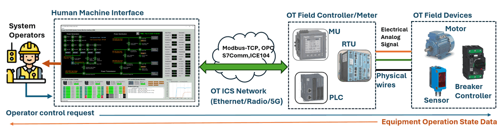
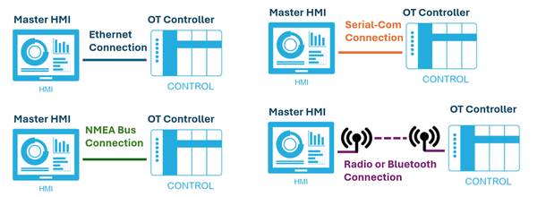
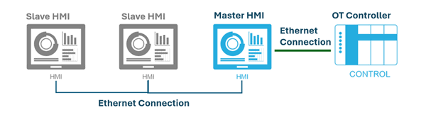
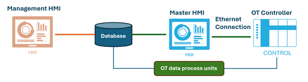

# OT Railway System Development [03]

### Implementing Different Human-Machine Interfaces (HMI) for a Land-Based Railway Cyber Range

------

### Introduction

In the operational technology (OT) environments,Human-Machine Interfaces (HMIs) play a critical role in bridging the complex control systems and human operators. In both real-world railway systems and cybersecurity training platforms, well-designed HMIs enhance visibility, improve safety, and enable timely decision-making. However, when designing HMIs for a **cyber range**—a simulated environment used for cybersecurity exercise, training and evaluation needs some different considerations and priorities.

This article explores the development of four different SCADA HMIs created specifically for a **Land-Based Railway Cyber Range**. These interfaces were designed not only to reflect the realism of an operational railway control system but also to serve the unique functional and pedagogical goals of a cybersecurity exercise and training environment. The article is structured into four main sections:

- **Fundamentals of SCADA HMIs** : A brief overview of SCADA systems and HMI principles background knowledge, using the railway domain as a case study example.
- **Design Differences [Real-World HMI vs Cyber Range HMI]** : A discussion of how HMI design requirements shift when the objective changes from operational control to cybersecurity simulation and education.
- **Functional Architecture of Railway Cyber Range HMIs** – A detailed introduction about how these HMIs interact with other simulated OT components in the railway system, including signaling, PLCs, and interlocking mechanisms.
- **User Interface and Functional Showcase** – A walkthrough of the developed HMI UI and usage, highlighting their unique features, use cases, and integration with the railway cyber range platform.

**Important:** Currently there is not a standard for designing HMIs specifically for cyber ranges. In this article, I want to share my idea about finding the "balance point" between the needs of **OT engineers** and **cybersecurity professionals**. The goal is to create an HMI that is intuitive and functional for OT operators performing system control tasks, while also providing the necessary visibility and context for cybersecurity engineers to detect, analyze, and respond to cyber incidents effectively. Striking this balance ensures that the HMI serves both operational usability and security monitoring purposes within the cyber range environment.

------

### Background Knowledge about HMI in ICS

Human-Machine Interfaces (HMIs) are critical components of modern industrial automation systems. Together with Supervisory Control and Data Acquisition (SCADA) systems, HMIs allow operators to monitor, visualize, and control complex physical processes. Within the 6 layers Industrial Control System (ICS) architecture, HMIs are typically positioned in:

- **Level 2 – Control Center Processing LAN** (e.g., SCADA/HMI workstation networks)
- **Level 3 – Operations Management Zone**, which handles production control and supervision (as shown below)

This layered positioning ensures that HMIs have both the visibility of OT field data and the control capabilities needed for safe, efficient operations.

#### What Is an HMI program?

An **HMI** is a graphical user interface that enables human operators to interact with machines, controllers, or entire systems. In the context of railway, power, or maritime systems, HMIs are used to monitor real-time system status, send control commands, receive alarms, and visualize operational trends. The typical workflow of HMI is shown below:

Key Features of HMI Program:

- **Graphical Interface**: Displays process graphics, system schematics, or animations to represent real-time operations.
- **Data Monitoring**: Allows visualization of machine states, sensor readings, alarms, and trend logs.
- **User Interaction**: Enables users to send commands, acknowledge alarms, or adjust parameters.
- **Platform Flexibility**: HMIs can run on industrial touch panels, desktop workstations, tablets, or web-based dashboards.
- **Alarm and Event Handling**: Facilitates prompt operator response to abnormal situations through visual and audible notifications.

#### HMI Communication Architecture

In a SCADA system, HMIs are typically connected to OT field devices (like PLCs, RTUs, IED or intelligent sensors) through various types of linkage, depending on the system architecture, security policy, and latency requirements. Below are three common types of HMI connection patterns:

##### 1. Direct Linkage (Integrated HMI Connection)

In this architecture, the HMI is **directly connected** to the OT controllers (e.g., PLCs in power systems or motor controllers on marine vessels). It operates within the same OT network and communicates using standard industrial protocols (e.g., Modbus, DNP3, IEC 60870-5-104, NMEA 2000, etc.). 

Key features of the direct linkage: 

- Real-time data acquisition and control
- Simple architecture
- Low latency

**Use Case**: Common in systems where immediate operational feedback and control are required, such as emergency stop panels or motor control dashboards.

Master–Slave Linkage (Non-Integrated HMI Connection)

##### 2. Master-Slave linkage (Non-integrated HMI connection)

In more complex systems, a **master HMI** is directly linked to OT devices, while one or more **slave HMIs** connect to the master via a separate network. Slave HMIs receive data filtered and distributed by the master HMI andall the slave's control request will also send to master HMI first then forward to related controller based on the master HMI's setting. (The connection is shown below)

Key features of the direct Master-Slave linkage : 

- Better control over access permissions
- Isolation between core control and auxiliary interfaces
- Suitable for multi-role operator environments

**Use Case**: Operation training systems, remote monitoring stations, or multi-tiered control rooms.

##### 3. Database Linkage (Non-Integrated HMI Connection)

In large SCADA environments, processed field data is often stored in centralized databases. Some of the HMIs such as the management HMI in this configuration access **historical or aggregated data** via standard IT protocols (e.g., SQL queries, RESTful APIs) rather than communicating directly with OT devices. The connection diagram is shown below:

Key features of the direct Database Linkage : 

- Aggregates data from multiple systems
- Useful for analytics dashboards, reporting, and supervisory-level overviews
- Reduced OT network load

**Use Case**: High-level monitoring across multiple subsystems (e.g., energy, signaling, HVAC) in a unified dashboard.

##### 4. Hybrid Connection Models

Many modern systems implement hybrid architectures of the Direct Linkage, Master-Slave linkage  and  Database Linkage. combining different HMIs in the system for different operators to control and monitor the complex ICS system. 

------

### Design Differences: Real-World HMI vs. Cyber Range Simulated HMI

Designing a Human-Machine Interface (HMI) for a cyber range simulation requires a fundamentally different approach compared to building one for real-world OT training. Based on my experience from multiple cybersecurity exercises and feedback from end users, this section explores the key distinctions between the two types of HMI designs. While these observations are based on my personal experience and may not be 100% correct, they reflect real-world needs from both OT engineers and cybersecurity practitioners.

##### 1. Design Purpose and Usage Context

- **Real-World Training HMI** : These HMIs are designed to replicate actual industrial control systems as closely as possible. Their primary goal is to train OT operators in using the production system, so accuracy, realism, and fidelity are critical. The interface must mirror the layout, features, and behavior of the live system in production environment.

- **Cyber Range Simulated HMI** : The purpose of the cyber range HMI shifts from operation to defense of cyber attack. The HMI is tailored for cybersecurity training scenarios, helping defenders (blue teams) identify anomalies, investigate possible attacks, and practice incident response. It emphasizes observability, anomaly detection, and flexibility over realism.

##### 2. Protocols and Communication

- **Real-World Training HMI** : These HMIs typically simulate a single, vendor-specific OT protocol—such as Siemens S7Comm+ or Rockwell’s EtherNet/IP—because real-world devices from one vendor often use a unified protocol stack.
- **Cyber Range Simulated HMI** : To support red team exercises and simulate diverse attack vectors, the cyber range HMI integrates multiple open or standard protocols (e.g., IEC 60870-5-104, Modbus TCP, DNP3). This allows attackers to test various tactics across different protocol layers in a single environment.

##### 3. Information Display

- **Real-World Training HMI** : These interfaces need to be clear and show most critical information which for the operator to make decision. Only essential information is shown—such as alarms, system status, and critical sensor values—so that operators are not overwhelmed. Non-critical data (e.g., detailed PLC coil states or sensor response times) is often hidden to reduce distractions.

- **Cyber Range Simulated HMI** : These interfaces are designed to be information-rich. They display as much information as possible even the low-level data including PLC coil/contact states, communication latency, individual sensor statuses, and even abnormal signal behavior. Some alerts may be deliberately omitted or hidden to test the defender’s situational awareness and detection capabilities (e.g., discovering a MITM attack based on increased latency of PLC response).

##### 4. **User Interaction Design**

- **Real-World Training HMI** : A high degree of interactivity between the HMI and operator is expected. Operators are trained to manually acknowledge alarms, switch system modes, and control devices using HMI buttons, slider-bar and menus—closely replicating real-life workflows.
- **Cyber Range Simulated HMI** : In most cyber exercises, the HMI is projected on large screens without dedicated a human operators to control 24/7. As such, these HMIs are designed to be self-running or script-driven, automatically simulating operator behaviors or some response action. Manual controls are minimized or abstracted.

##### 5. **UI Layout and Alert Management**

- **Real-World Training HMI** : These typically feature a tabbed layout with separate views/tab page for alarms, process control, and trend monitoring and the operator need to switch between different tab to monitor and control the system. Alerts are pre-configured and follow fixed rules designed by the system integrator.
- **Cyber Range Simulated HMI** : To support continuous forensic recording, all critical information is displayed on a single screen—ensuring that nothing is missed in screen recordings. Additionally, the HMI allows customizable alert logic, often configured via external files, so blue teams can define their own detection thresholds or trigger conditions for dynamic learning scenarios.

##### 6. **Logging and Forensics Support**

- **Real-World Training HMI** : Logging is often limited to operational events and system states, primarily for training review or internal diagnostics.
- **Cyber Range Simulated HMI**: Logging and recording are extensive and forensic-focused. This includes: Continuous screen capture (e.g., video recording of UI), Logging of all control events, communication attempts, and OT messages, and even Packet-level network traffic capture (e.g., PCAP logs) for post-event analysis. These logs provide valuable datasets for post-exercise debriefing, attacker traceability, and blue team performance review.

#### Summary Table: Real-World vs. Cyber Range HMI Design

By recognizing and designing for these key differences, developers can create effective HMIs tailored to the needs of each environment—whether it's for day-to-day operational control or high-intensity cyber defense training. The difference comapre table is shown below:

| **Aspect**              | **Real-World OT Training HMI**    | **Cyber Range Simulated HMI**                |
| ----------------------- | --------------------------------- | -------------------------------------------- |
| **Main Purpose**        | Operator skill training           | Cyber defense awareness, anomaly detection   |
| **Protocols Used**      | Single vendor-specific protocol   | Multiple open/standard protocols             |
| **Information Display** | Minimal, focused on critical data | Detailed, includes low-level system metrics  |
| **User Interaction**    | Manual interaction required       | Mostly automated or scripted behavior        |
| **UI Layout**           | Tabbed views                      | All-in-one view for continuous recording     |
| **Alert Configuration** | Fixed, pre-configured             | Customizable via config files                |
| **Logging Focus**       | Operational logs only             | Full data/event/packet logging for forensics |

------

### Functional Architecture of Railway Cyber Range HMIs

After introduced the background of HMI and the design of cyber range HMI, this section I will introduce how I design the 4 HMIs in the land based railway system. 

