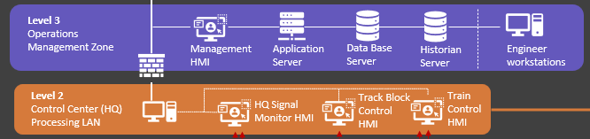

# OT Railway System Development [03]

### Implement different Human Machine Interface (HMI) for a Land Based Railway Cyber Range

**Project Design Purpose** : This article will introduce how we develop the 4 different SCADA Human Machine Interface (HMI) for the Land Based Railway Cyber Range and why we design the HMI like that. This article includes 4 main section:

- General knowledge about the HMI and scadar system.(use the railway system as an example to show)
- What's the different different between design a normal real world/training OT platform HMI and a cyber range HMI
- Detailed function and communication relationship between different railway cyber range HMI and other OT components in the railway cyber range system. 
- Detailed UI and function introduction of the railway cyber range HMI I developed.

------

### Introduction 

Background knowledge about HMI

HMI (Human-Machine Interface) and SCADA (Supervisory Control and Data Acquisition) are crucial in industrial automation, working together to enable operators to monitor and control processes. HMI acts as the user interface, providing operators with real-time data and control over machinery, while SCADA collects, analyzes, and displays data from various devices and systems, enabling remote monitoring and control. 

HMI (Human-Machine Interface):

- HMI is the user interface that allows operators to interact with machines or systems. 
- It provides a graphical representation of the process, enabling operators to monitor equipment, view data trends, and make adjustments. 
- HMIs can be accessed through dedicated screens, mobile devices, or any PC connected to the control network via a web browser. 
- HMIs can show information like machine status, level indicators, and alarm