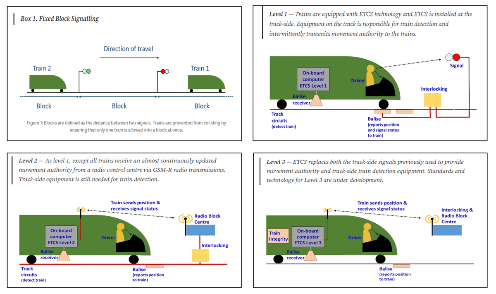
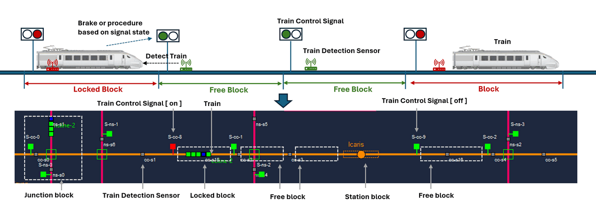

# How to Use PLC to Implement Land Based Railway Track Fixed Block Signaling System

**Project design purpose**: We want to use PLC with sensor and signals to implement the operation of railway track fixed blocking signaling automated control system in the digital equivalent system or railway system module to show the logic of track fixed blocking ATC(Automatic Train Control) mechanism for training. 

> Important: The real world railway Automatic Train Control mechanism Automatic Train Protection(ATP) and Automatic Train Operation(ATO) are much more complex, we just simplified the general operation logic for OT training.

```
# Version:     v0.1.3
# Created:     2024/07/18
# Copyright:   Copyright (c) 2024 LiuYuancheng
# License:     MIT License 
```

[TOC]

------

### Introduction

This document will show how to implement train fix blocking  Automatic Train Protection and Operation mechanism in a railway track digital simulation system. The implement includes 3 sub projects

1. Railway signaling system physical world simulator. 
2. PLC simulator project.
3. Railway block control HMI.  

#### Introduction of Fixed Blocking System

The track fixed blocking system is a fundamental method used in railway signaling to ensure safe and efficient train operations. This system divides the railway track into sections known as "blocks." Only one train is allowed in each block at any given time, preventing collisions and ensuring a safe distance between trains.

**Key Features of Track Fixed Blocking System:**

1. **Division into Blocks:** The railway track is divided into fixed segments or blocks, each equipped with signals.
2. **Signals:** Each block has entry and exit signals that control train movements. These signals indicate whether the block ahead is occupied or free.
3. **Train Detection:** Various technologies like track circuits, axle counters, or radio systems detect the presence of trains within a block.
4. **Safety:** By ensuring only one train per block, the system prevents collisions and allows safe operation, even in cases of signal failure or human error.
5. **Manual or Automatic Control:** Signals can be controlled manually by signal operators or automatically by computer-based interlocking systems.

The track fixed blocking system is a reliable and straightforward method for managing train traffic, providing the foundational safety mechanism for railways around the world.

> Reference: 

https://www.linkedin.com/pulse/moving-block-vs-fixed-signalling-which-better-naeem-ali/

Link: https://www.sgtrains.com/technology-signalling.html#atc


#### System Design


#### Physical World Simulation Design

To implement the fixed blocking, we need trackside ATC and trainborne ATC. There are several level of ATC such as shown in the European Rail Traffic Management System (ERTMS):



Reference: https://medium.com/@POST_UK/moving-block-signalling-b9b0b9f498c2

In our simulation program, we will simplified the design and implement two elements to railway signaling:

- **Train detection** : Which recognizes when a section of track is occupied by a train In the 2D physical world simulation program, we will add the "sensor" to do the pixel detection of the moving train on the track.
- **Movement authority**: which gives a train permission to move to a particular location on the track. The train will receive the block entrance signal's pixel color to identify whether it is allowed to move into the block. 

As shown below, we match the fixed block :



**Train detection Sensor**: in the 2D simulator, along the track each interval there will be a train detection sensor (small grey box), when a train (green rectangle) move over the sensor, the sensor will change to blue color and generate the simulated voltage change message. Sensor color code:

- Green: no train is detected, generate sensor "voltage low" message to block controller input pin.
- Blue: train is passing the sensor, generate sensor "voltage high" message to block controller input pin.

**Block Control Signal**: In the 2D simulator, next to the track near to each sensor, there will be a signal (big red/green box) controlled by the fixed blocking controller. The train will keep detection the front area (50 pixel), if it detect a signal is red, the train will brake to reduce the speed and stop before the signal. If the train detect the signal green color, it will pass through the signal area to enter the block.

- Red: Block controller output voltage high, track block after signal is locked and trains have no permission to move in the block. 
- Green: block controller output voltage low, track block after signal is released, trains have permission to move in the block. 


