# OT Railway System Development

### How to Use PLC to Implement Land Based Railway Track Fixed Block Signaling OT System

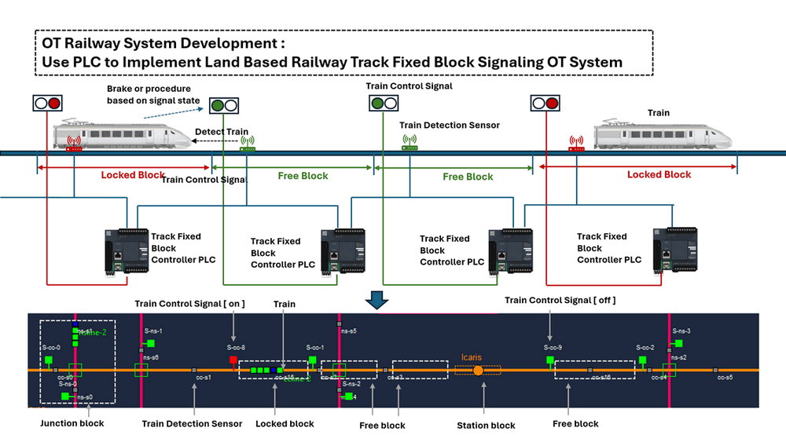

` Figure-00: Railway fixed block signaling system over view diagram, version v1.3 (2024)`

**Project Design Purpose:** This project aims to use Programmable Logic Controllers (PLC) with train detection sensors and train control signals to develop an automated OT system for railway track fixed block signaling control. The system will include a digital equivalent simulation to explain the logic of the track fixed block Automatic Train Control (ATC) mechanism for demonstration and training purposes. In this article, we will introduce the design of the block controller's electrical circuit, then demonstrate how to implement this circuit using PLC ladder logic diagrams and structured text. Finally, we will show how to integrate multiple controllers to build an railway Automatic Train Protection (ATP) system capable of handling complex situations, such as controlling multi-track junctions and block override.

> **Important:** Real-world railway Automatic Train Control mechanisms, including Automatic Train Protection (ATP) and Automatic Train Operation (ATO), are much more complex than what we introduced in the article. This project simplifies the general operation logic for training purposes only.

```
# Version:     v0.1.3
# Created:     2024/07/18
# Copyright:   Copyright (c) 2024 LiuYuancheng
# License:     MIT License 
```

**Table of Contents**

[TOC]

- [OT Railway System Development](#ot-railway-system-development)
    + [How to Use PLC to Implement Land Based Railway Track Fixed Block Signaling OT System](#how-to-use-plc-to-implement-land-based-railway-track-fixed-block-signaling-ot-system)
    + [Introduction](#introduction)
    + [Background knowledge](#background-knowledge)
      - [Introduction of Fixed Blocking System](#introduction-of-fixed-blocking-system)
      - [Compare Between Fixed Blocking and Moving Blocking](#compare-between-fixed-blocking-and-moving-blocking)
      - [PLC Ladder Diagram Programming](#plc-ladder-diagram-programming)
      - [PLC Structure Text Programming](#plc-structure-text-programming)
    + [System Design](#system-design)
      - [Physical World Simulation Design](#physical-world-simulation-design)
      - [Track Block Controller Design](#track-block-controller-design)
      - [Multi-Tracks Fixed Blocks Design](#multi-tracks-fixed-blocks-design)
      - [Controller ATC Override Design](#controller-atc-override-design)
    + [System Usage](#system-usage)

------

### Introduction

Fixed block signaling and moving block signaling are the two main railway signaling systems used in modern Automatic Train Control (ATC). Fixed block signaling is a traditional method that manages train movements by dividing the railway track into discrete segments or blocks. Moving block signaling is a modern, dynamic system that allows for real-time management of train movements, offering increased efficiency and flexibility. This document demonstrates how to implement a fixed block Automatic Train Protection (ATP) and Operation mechanism in a railway track digital simulation OT (Operational Technology) system. 

The implementation comprises three sub-projects, covering three basic levels of an OT system.

| Sub-Project Name                                       | OT System Level                                    | Project Link                                                 |
| ------------------------------------------------------ | -------------------------------------------------- | ------------------------------------------------------------ |
| **Railway Signaling System Physical World Simulation** | OT-System-lvl0: Physical Process Field I/O Devices | [Private Project Link](https://github.com/LiuYuancheng/Railway_IT_OT_System_Cyber_Security_Platform/tree/main/src/physicalWorldSimu) |
| **Virtual PLC & RTU Simulator Library Project**        | OT-System-lvl1: Controller LAN.                    | [Public Project Link](https://github.com/LiuYuancheng/PLC_and_RTU_Simulator). |
| **Railway Track Block Control HMI**                    | OT-System-lvl2: Control Center (HQ) Processing LAN | [Private Project Link](https://github.com/LiuYuancheng/Railway_IT_OT_System_Cyber_Security_Platform/tree/main/src/trackBlocksHMI) |

The system OT structure and workflow is illustrated below:

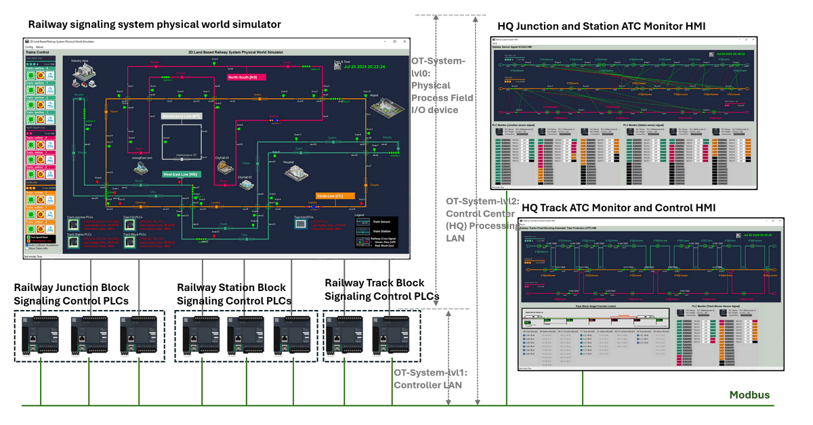

` Figure-01: Railway fixed block signaling system structre diagram, version v1.3 (2024)`

The physical world simulation will generate the simulated electrical signal and fill to the PLCs, then the PLC will execute the ladder logic and generate the simulated electrical signal to control the components' state in the physical world simulation program. At the same time, we will also provide two types of Control Center (HQ) human machine interface  `HQ Junction and Station ATC Monitor HMI` and `HQ Track ATC Monitor and Control HMI` for railway operator to monitor and control the system. 

In this article, we will introduce some basic background knowledge about railway Fixed/Moving block systems, Automatic Train Control (ATC), Automatic Train Protection (ATP), and Automatic Train Operation (ATO). We will then present the system design, including the physical world digital equivalent program, the fixed block controller, the multi-track block control system, and the ATP override function design.


------

### Background knowledge

This section provides a brief overview and comparison of fixed and moving block signaling systems, PLC ladder logic diagrams, and PLC structured text programming. If you are already familiar with these concepts, you may skip this section. For those seeking more detailed information, we have included reference documents for further reading.

#### Introduction of Fixed Blocking System

The track fixed blocking system is a fundamental method used in railway signaling to ensure safe and efficient train operations. This system divides the railway track into sections known as "blocks." Only one train is allowed in each block at any given time, preventing collisions and ensuring a safe distance between trains.

**Key Features of Track Fixed Blocking System:**

1. **Division into Blocks:** The railway track is divided into fixed segments or blocks, each equipped with signals.
2. **Signals:** Each block has entry and exit signals that control train movements. These signals indicate whether the block ahead is occupied or free.
3. **Train Detection:** Various technologies like track circuits, axle counters, or radio systems detect the presence of trains within a block.
4. **Safety:** By ensuring only one train per block, the system prevents collisions and allows safe operation, even in cases of signal failure or human error.
5. **Manual or Automatic Control:** Signals can be controlled manually by signal operators or automatically by computer-based interlocking systems.

The track fixed blocking system is a reliable and straightforward method for managing train traffic, providing the foundational safety mechanism for railways around the world.

> Reference: https://www.sgtrains.com/technology-signalling.html#atc


#### Compare Between Fixed Blocking and Moving Blocking

|                   | Fixed Blocking                                               | Moving Block                                                 |
| ----------------- | ------------------------------------------------------------ | ------------------------------------------------------------ |
| **Key Features**  | `Block Division`: The track is divided into fixed-length blocks, each controlled by signals. | `Dynamic Blocks`: Blocks are not fixed but vary in size depending on the position and speed of trains. The safe braking distance is dynamically calculated. |
|                   | `Train Detection`: Presence of trains is detected using track circuits, axle counters, or other train detection systems. | `Real-Time Train Tracking`: Implements automatic train protection (ATP) and automatic train operation (ATO) systems, enhancing safety and efficiency. |
|                   | `Signals train control`: Each block has entry and exit signals that indicate whether the block is occupied or free. These signals ensure that only one train occupies a block at any time. | `Increased Capacity` : Allows for closer headways between trains, increasing track capacity and reducing delays. |
|                   | `Safety` : Ensures trains maintain a safe distance from each other, preventing collisions. | `Flexibility` : Adapts to varying train speeds and operational conditions, optimizing traffic flow. |
|                   | `Interlocking`: Signals are interlocked to ensure that conflicting movements do not occur, providing an additional layer of safety. |                                                              |
| **Advantages**    | Simplicity and reliability.                                  | Higher track capacity due to reduced headways.               |
|                   | Well-established and widely understood.                      | Greater operational flexibility and efficiency.              |
|                   | Proven safety record.                                        | Improved safety with continuous real-time monitoring and control. |
| **Disadvantages** | Inefficiency due to large fixed block sizes, leading to reduced track capacity. | Complexity and higher cost of implementation and maintenance. |
|                   | Lack of flexibility in handling variable train speeds and headways. | Requires advanced technology and continuous communication systems. |
|                   |                                                              | Greater reliance on robust software and hardware infrastructure. |

>  Reference: https://www.linkedin.com/pulse/moving-block-vs-fixed-signalling-which-better-naeem-ali/


#### PLC Ladder Diagram Programming

PLC ladder diagram programming is a graphical programming language used to develop software for programmable logic controllers (PLCs). It is widely used in industrial automation and control systems due to its intuitive, visual nature, which resembles electrical relay logic schematics.

> Reference: https://www.solisplc.com/tutorials/how-to-read-ladder-logic


#### PLC Structure Text Programming

The Structured Text (ST) language is one of the programming languages defined in the IEC 61131-3 standard for programmable logic controllers (PLCs). ST is a high-level programming language that resembles traditional programming languages like Pascal or C, making it a powerful and flexible tool for developing complex control algorithms in industrial automation.

> Reference: https://www.realpars.com/blog/structured-text


------

### System Design

This section introduces the design of the system's functions, which are divided into four main parts:

- **Designing the Physical World Simulation Program**: We will explain how we create them simulation program that mimics real-world railway operations and generates electrical signals to input into the PLC.
- **Implementing the Track Fixed Block Controller Circuit:** We will explain how to use ladder logic diagrams and structured text language to implement the track fixed block controller circuit by using PLC.
- **Combining Track Block Controllers for Complex Multi-Track Traffic ATP:** We will demonstrate how to integrate multiple track block controllers to manage complex multi-track traffic using Automatic Train Operation (ATO) systems.
- **Adding the ATP Override Functionality**: We will describe how to implement an override feature in the ATC system, enabling HQ operators to bypass the ATP for handling emergency situations.


#### Physical World Simulation Design

To implement fixed block signaling, we need both trackside ATC and trainborne ATC systems. There are various levels of ATC, as illustrated by the European Rail Traffic Management System (ERTMS):


` Figure-02: ERTMS 3 levels signalling technology explaination, version v1.3 (2024)`

> eference: https://medium.com/@POST_UK/moving-block-signalling-b9b0b9f498c2

In our simulation program, we will simplify the design by implementing two key elements of railway signaling:

- **Train Detection** : This element recognizes when a section of track is occupied by a train. In the 2D physical world simulation program, we will add sensors to detect the presence of a moving train on the track.
- **Movement Authority**: This element grants a train permission to move to a particular location on the track. The train will identify block entrance signals by detecting the pixel color, determining whether it is allowed to move into the block.

As shown below, we match the fixed block signaling system to the 2D simulation program:


` Figure-03:  2D physical world simulation program block signaling components view, version v1.3 (2024)`

**Train Detection Sensor:** In the 2D simulator, there will be train detection sensors (small grey boxes) placed at intervals along the tracks. When a train (green rectangles) moves over a sensor, the sensor will change color to blue and generate a simulated voltage change message. 

The sensor color codes are:

| Color Code | Physical World State          | Sensor data to PLC                                           |
| ---------- | ----------------------------- | ------------------------------------------------------------ |
| Grey       | No train is detected          | Generate sensor "voltage low" message to controller input pin |
| Blue       | A train is passing the sensor | Generate sensor "voltage high" message to controller input pin |

**Block Control Signal:** In the 2D simulator, signals (big red/green boxes) controlled by the fixed block controller will be placed next to the track near each sensor. The train will continuously detect the area 50 pixels ahead. If it detects a red signal, the train will brake to reduce speed and stop before the signal. If the signal is green, the train will proceed through the signal area to enter the block.

The signal color codes are : 

| Color Code | Physical World State                                         | PLC to signal data             |
| ---------- | ------------------------------------------------------------ | ------------------------------ |
| Red        | Track block after signal is locked and trains have no permission to move in the block | Controller output voltage high |
| Green      | Track block after signal is released and trains have permission to move in the block | Controller output voltage low  |


#### Track Block Controller Design

After completing the simulation of physical world components, we need to develop the track fixed block ATC control circuit. We use PLC to implement the block control circuit so that OT engineers can easily monitor the block state and override it in case of emergencies.

First, let's analyze the state changes of the sensors and signals. A signal will switch to the "on" (red) state when the block sensor(n) is triggered and remain "on" until the next block sensor(n+1) is triggered, after which it switches to the "off" state, as shown in the table below:

| Train Status                              | Sensor(n) | Sensor(n+1) | Signal-n(t) | Signal-n(t+1) |
| ----------------------------------------- | --------- | ----------- | ----------- | ------------- |
| Before train enter track block            | 0         | 0           | 0           | 0             |
| Train start enter block (passing sensor)  | 1         | 0           | 0           | 1             |
| Train entered block (passed sensor)       | 0         | 0           | 1           | 1             |
| Train leaving block (passing next sensor) | 0         | 1           | 1           | 0             |
| Train left block and in next block        | 0         | 0           | 0           | 0             |

These changes can be mapped to the basic JK flip-flop circuit, as shown below:

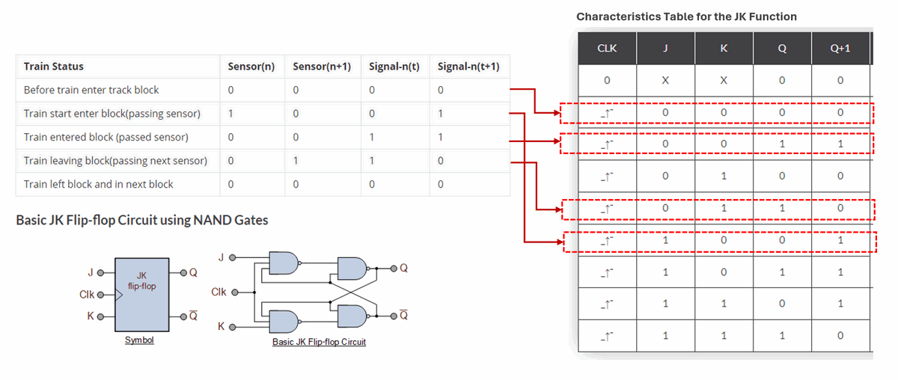

` Figure-04: Block controller circuit analysis, version v1.3 (2024)`

> Reference: https://www.electronics-tutorials.ws/sequential/toggle-flip-flop.html

To generate the trigger clock cycle, we can add another sensor behind sensor(n) and sensor(n+1) to create the clock. We can also use the sensor voltage change to build the clock cycle, but we cannot connect both sensor(n) to J and CLK directly, as when the clock is generated the state change and clock up pulse happen at the same time, sensor(n)'s state will be "unknown", the clock pulse need to be "later" than the J input changed (as shown below):

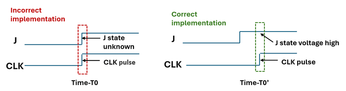

` Figure-05: Time line of the JK flip-flop J input and clock, version v1.3 (2024)`

To shift the clock pulse correctly, we need to add a delay timer. The train takes about 15 seconds to pass the sensor, so we delay the sensor by 0.5 ~ 1 second. Then, we use an `OR` gate to combine the inputs from the two sensors. The final circuit design is shown below:

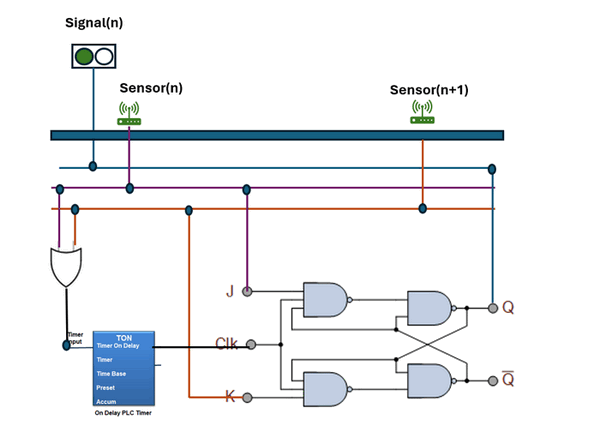

` Figure-06: Block contoller circuit diagram, version v1.3 (2024)`

We will show how to use PLC to implement this circuit via `Ladder Logic Diagram` and `Structured Text Language`.


**Implementing the Circuit via PLC Ladder Diagram**

After designing the electrical circuit logic, we will implement it with a PLC ladder logic diagram. We need two PLC input contacts to read the voltage from the two sensors and one coil to change the signal state. Most PLC ladder editors provide built-in `JK/T/SR-flip-flop` modules for using, but you can also use `NAND` gates to build one if needed.(As shown below)

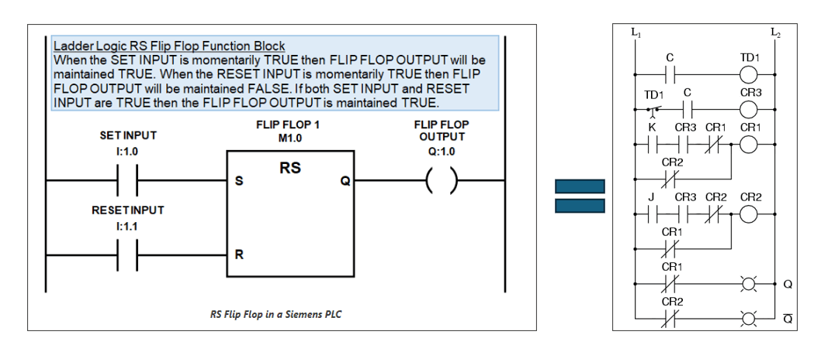

` Figure-07: Implement the JK flip-flop with PLC ladder logic , version v1.3 (2024)`

> Reference: If you want to build your own JK flip flop ladder diagram in PLC, you can follow this document: https://instrumentationtools.com/topic/j-k-flip-flop/ 

The PLC ladder logic diagram is shown below: 

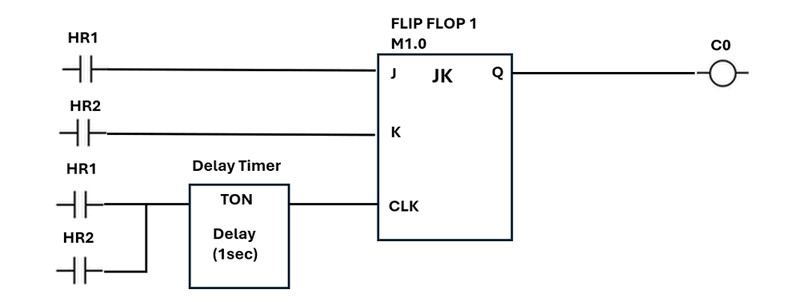

` Figure-08: Track block controller PLC ladder diagram, version v1.3 (2024)`

Wire connection of the PLC input contact and output coils: 

- sensor(n) => I0.1(PLC input contact) => HR1 (PLC internal holding register)
- sensor(n+1) => I0.2 (PLC input contact) =>HR2 (PLC internal holding register)
- Signal(n) => Q0.1(PLC output coil) => C0 (PLC output pin)


**Implement the Circuit via PLC ST(Structure Text) Language**

We can also use the PLC ST program language to implement the circuit. 

We create a JK flip flop function block fist : 

```pascal
FUNCTION_BLOCK JK_FlipFlop
VAR_INPUT
    J       : BOOL;   // J input
    K       : BOOL;   // K input
    CLK     : BOOL;   // Clock input
    RESET   : BOOL;   // Reset input
END_VAR

VAR_OUTPUT
    Q       : BOOL;   // Q output
    Q_NOT   : BOOL;   // Q' output (inverse of Q)
END_VAR

VAR
    last_CLK : BOOL := FALSE; // Previous state of the clock
END_VAR

// Function block implementation
IF RESET THEN
    // Asynchronous reset
    Q := FALSE;
    Q_NOT := TRUE;
ELSE
    // Detect rising edge of the clock
    IF (CLK = TRUE) AND (last_CLK = FALSE) THEN
        // Rising edge detected
        IF (J = TRUE) AND (K = FALSE) THEN
            // Set
            Q := TRUE;
            Q_NOT := FALSE;
        ELSIF (J = FALSE) AND (K = TRUE) THEN
            // Reset
            Q := FALSE;
            Q_NOT := TRUE;
        ELSIF (J = TRUE) AND (K = TRUE) THEN
            // Toggle
            Q := NOT Q;
            Q_NOT := NOT Q_NOT;
        END_IF;
    END_IF;
END_IF;

// Update last clock state
last_CLK := CLK;

END_FUNCTION_BLOCK
```

Now we make a 1 sec timer module via ST language :

```pascal
FUNCTION_BLOCK TON
VAR_INPUT
    IN      : BOOL;   // Timer input
    PT      : TIME;   // Preset time
END_VAR

VAR_OUTPUT
    Q       : BOOL;   // Timer output
    ET      : TIME;   // Elapsed time
END_VAR

VAR
    start_time : TIME;   // Start time
    running    : BOOL;   // Timer running flag
END_VAR

// Function block implementation
IF IN THEN
    IF NOT running THEN
        // Start the timer
        start_time := TIME();
        running := TRUE;
    END_IF;
    // Calculate elapsed time
    ET := TIME() - start_time;
    IF ET >= PT THEN
        Q := TRUE;
    ELSE
        Q := FALSE;
    END_IF;
ELSE
    // Reset the timer
    Q := FALSE;
    ET := T#0s;
    running := FALSE;
END_IF;

END_FUNCTION_BLOCK
```

After build the 2 components module we can make our Main PLC ST program:

```
PROGRAM Main
VAR
    timer      : TON;      // Instance of the TON function block
    jkflipflop : JK_FlipFlop // Instance of the JK FLIP FLOP function block
    or_gate    : OR_Gate;  // Instance of the OR_Gate function block
    input1     : BOOL := FALSE;   // Input 1 for OR gate
    input2     : BOOL := FALSE;   // Input 2 for OR gate
    CLK_input: BOOL := FALSE;
    timer_input: BOOL := FALSE;   // Input for the timer
    preset_time: TIME := T#1s;    // Preset time for the timer (1 seconds)
    or_output  : BOOL;    // Output of the OR gate
    timer_output : BOOL;  // Output of the timer
END_VAR

// Assign inputs to the timer
timer.IN := timer_input;
timer.PT := preset_time;
// Set flip flopp in
flipflop.J := input1;
flipflop.K := input2;
// run timer
timer_input:= input1 OR input2
timer();
timer_output := timer.Q;
// Create the clock pulse
CLK_input := timer_input
flipflop.CLK := CLK_input;
// Run flipflop
flipflop();
// Get the outputs from the flip-flop
Q_output := flipflop.Q;
```

> reference: https://forums.mrplc.com/index.php?/topic/39080-flip-flop-in-structured-text/


Now after use the PLC built the block controller, we can link multiple tack block controllers together to build a single track's fixed block ATC system as shown below:

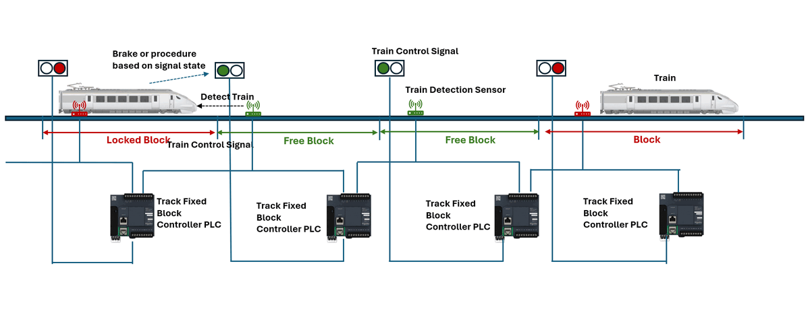

` Figure-09: Railway single track block control PLC connectoin diagram, version v1.3 (2024)`

>  Remark: we can use one PLC to control multiple blocks, in the picture, we want to make the connection clear so each PLC control one Fixed block. 


#### Multi-Tracks Fixed Blocks Design 

Building on the previous section where we implemented a single track with multiple fixed blocks, we can now handle a more complex scenario: track junctions. As illustrated below:

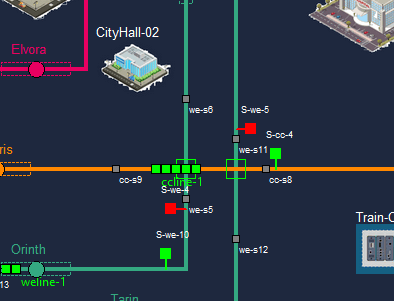

` Figure-10: 2D physical world junction screen shot, version v1.3 (2024)`

When a train on the orange line passes through the two junctions, we need to not only lock the fix blocks on the orange line but also the two green line blocks at the junction cross area. This ensures that only one train can occupy the junction area at any time, preventing other trains from entering. The junction block control is illustrated below:

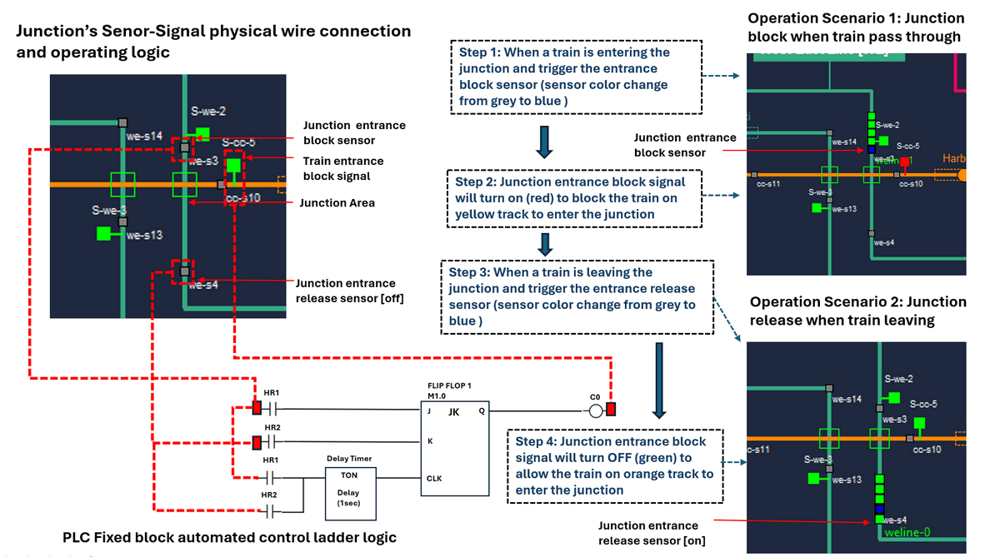

` Figure-11: 2 railway tracks junction block controller connection and work progress diagram, version v1.3 (2024)`

When a train on the green track enters a 'not lock' or 'free' junction, it triggers the junction entrance sensor. The PLC then activates the signal to block trains on the orange line from entering the junction, changing the junction state to 'locked'.

Once the train has left the junction, it triggers the junction exit sensor. The PLC then deactivates the signal, allowing trains on the yellow line to enter the junction, and changes the junction state to 'not hold.'

By combining track block control and junction block control, we achieve the following circuit setup:

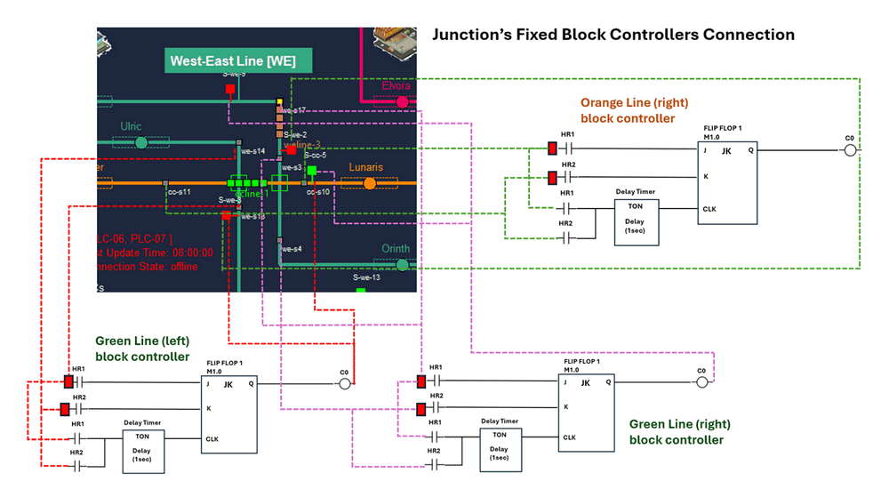

` Figure-12: 3 tracks junction fixed block controllers connection, version v1.3 (2024)`

Given the complexity of the junction, each junction typically requires 3 to 6 block controllers to implement ATC effectively.


#### Controller ATC Override Design

In emergency situations, the HQ operator may need to temporarily disable the ATC system. By using a PLC, the operator can use the track block HMI to change the state of the PLC coils, thus altering the signal. However, this might only work once, as any subsequent triggering of the JK flip-flop input sensor will change the signal again. To make the override controllable, we need to add an additional AND gate to enable or disable the clock. The circuit design is shown below:

 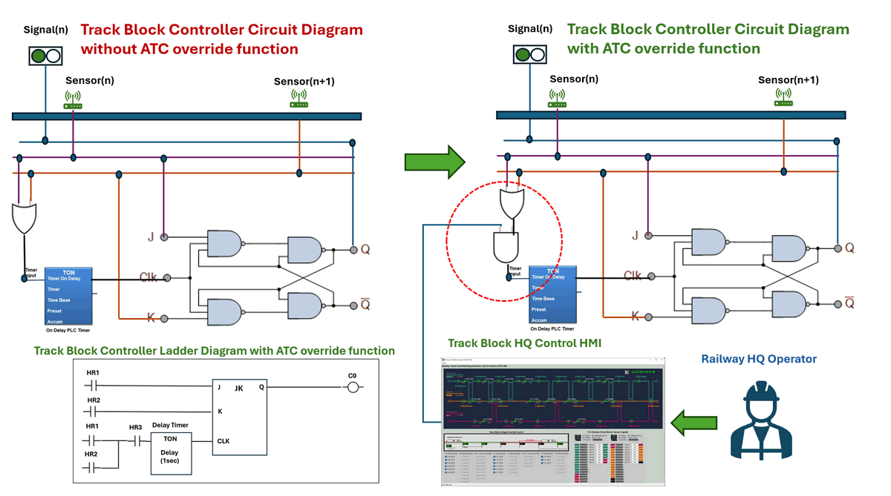

` Figure-13: , Controller ATC Override Circuit design diagram, version v1.3 (2024)`

In the ladder logic, we connect the AND gate to a holding register, HR3. In the HMI, when the operator activates the block override function, HR3 is set to 0. This prevents the sensors from generating a clock signal to the control circuit. As a result, after the operator changes the signal state, the signal will remain unchanged even if the sensors are triggered.


------

### System Usage


------

> last edit by LiuYuancheng (liu_yuan_cheng@hotmail.com) by 20/07/2023 if you have any problem, please send me a message. 