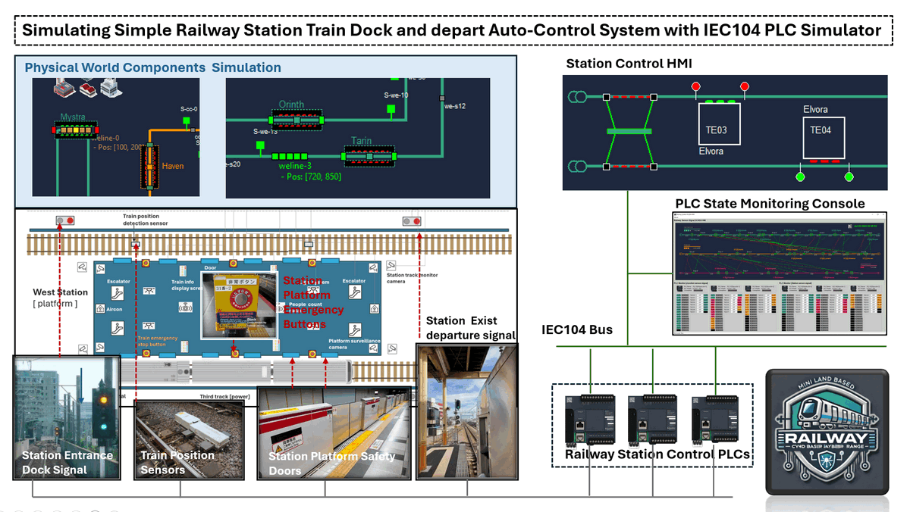
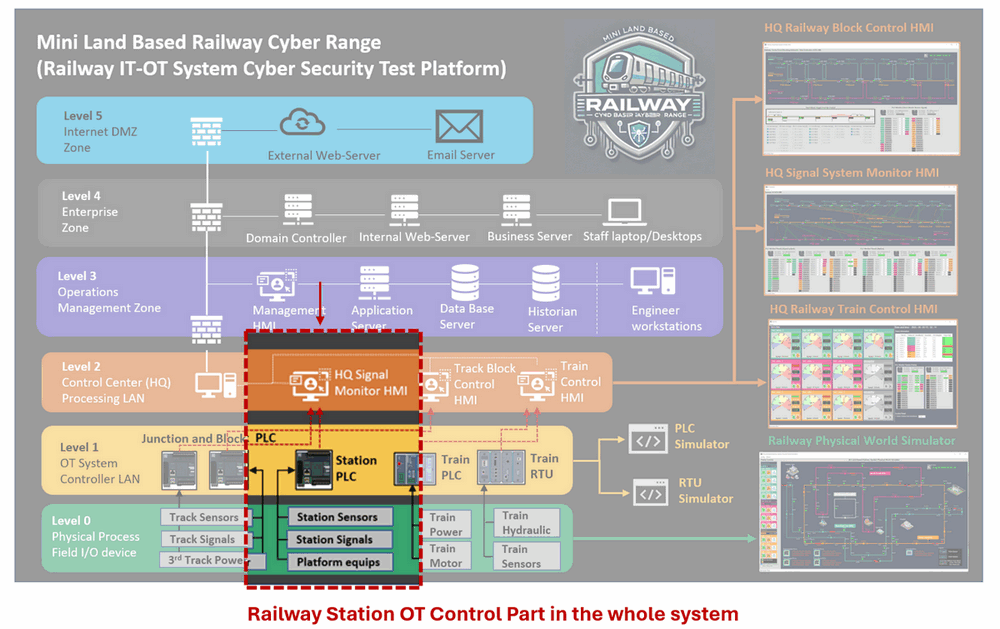
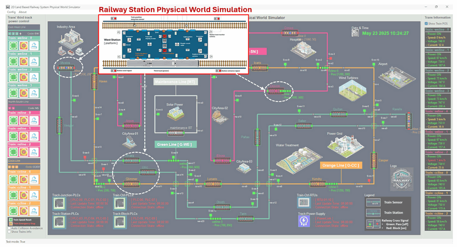
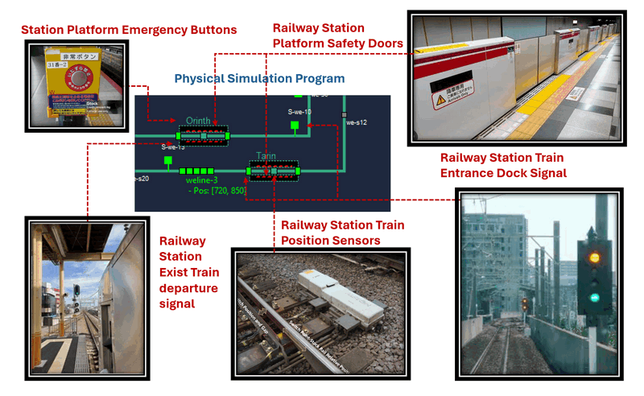
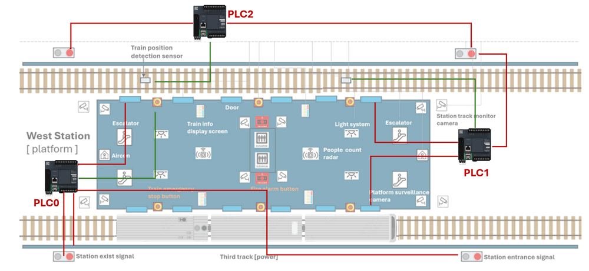
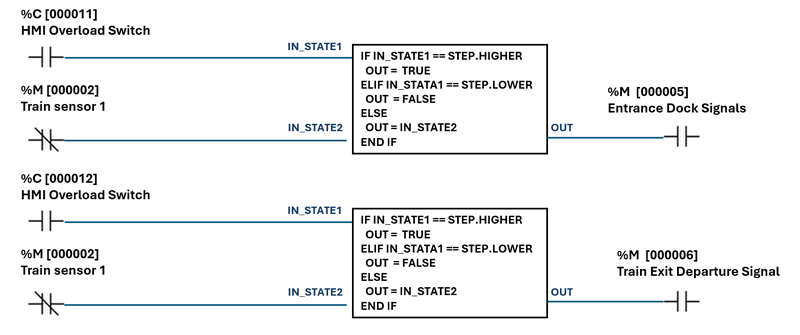
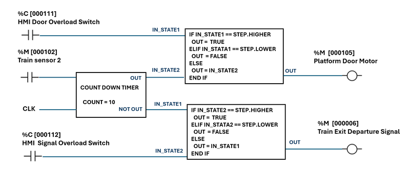
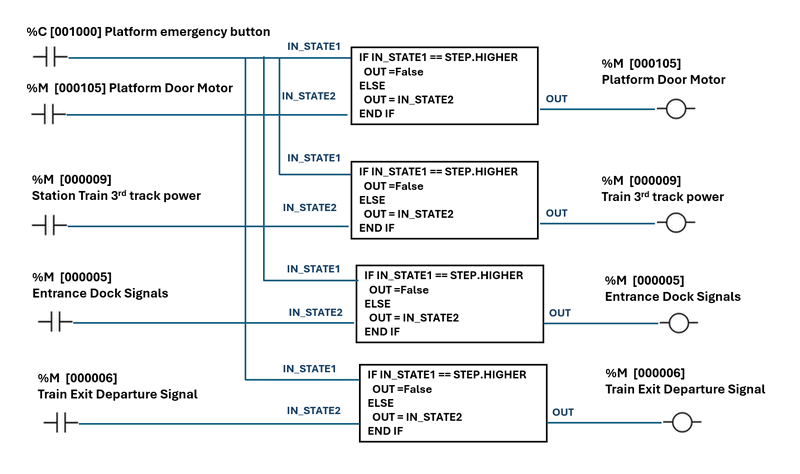

# OT Railway System Development [02]

### Simulating Simple Railway Station Train Dock and Depart Auto-Control System with IEC104 PLC Simulator

**Project Design Purpose** : Building on the Virtual PLC Simulator with IEC 60870-5-104 communication (https://www.linkedin.com/pulse/python-virtual-plc-simulator-iec-60870-5-104-protocol-yuancheng-liu-bov7c) that I presented in the previous article, this project demonstrates one detailed use case about how the PLC/RTU simulator can drive a simplified railway-station automation control scenario. Our goal is to show step-by-step information about how core station hardware—train-position sensors, dock/depart signal lights, platform doors, platform emergency stops, station control room —can be modeled in software; how their interactions are orchestrated through a lean automatic-control circuit; and how the resulting logic is implemented and tested in ladder code within the IEC 104 virtual PLC. The system over view is shown below:



` Figure-00: Station Control System Overview Diagram, version v_0.0.3 (2025)`

While real-world rail systems involve far richer safety layers and interlocks, the streamlined approach here is intentionally trimmed for education and rapid prototyping, giving engineers and students a practical sandbox for exploring OT-grade rail automation without the overhead of a full-scale installation.

```
# Version:     v_0.0.3
# Created:     2025/05/18
# Copyright:   Copyright (c) 2025 LiuYuancheng
# License:     MIT License 
```

**Table of Contents**

[TOC]

------

### Introduction

This article is part of the Land Based Railway IT-OT Cyber Range System's program design wiki,  it presents a detailed walkthrough of how the Virtual IEC 60870-5-104 PLC Simulator is applied within the OT environment of Land-Based Railway IT-OT Cyber Range System I developed, specifically for monitoring and controlling the railway stations in the system. The system operates in both automatic and manual modes, covering two key functional domains:

- **Station Track Control**: Utilizing position sensors and signal logic to control train braking and acceleration, this subsystem ensures accurate train docking and safe departure guiding procedures.
- **Station Platform Control**: Managing the synchronized operation of train and platform doors, emergency stop functions, and manual override controls from the station control room.

To provide a comprehensive understanding of this simulation, the article is structured into four main sections:

- **Background Knowledge** – A brief overview of the Land-Based Railway IT-OT Cyber Range System, with a focus on the station control segment within the overall architecture.
- **Station Physical Components Simulation** – Modeling key simulated physical elements of the station such as trains position sensors, trains dock/depart signals, platform safety doors, emergency buttons, and manual control room console interfaces.
- **Platform Automatic Control Circuit Design** – Developing different control circuits that govern automatic train docking and departure sequences, platform safety door control. 
- **PLC Ladder Logic Implementation** – Programming the control logic using the IEC 60870-5-104 virtual PLC simulator to realize the station track, trains and platform automation control workflow.

If you are interested about how virtualized OT components can be integrated into rail system scenarios for training, testing, and prototyping purposes and get more information about the Land-Based Railway IT-OT Cyber Range, this is another article about how to use ModBus-TCP PLC to Implement Land Based Railway Track Fixed Block Signaling OT System: https://www.linkedin.com/pulse/use-plc-implement-land-based-railway-track-fixed-block-yuancheng-liu-saaec/?trackingId=NuOghXz8rui9f2Z4%2F5RQEQ%3D%3D


------

### Background Knowledge

The Land-Based Railway IT-OT System Cyber Security Test Platform is a compact and modular cyber range designed to emulate the complex IT and OT environments of modern railway systems. It serves as a digital-twin simulation environment that integrates both operational technologies—such as railway track signaling, train ATC/ATP systems, and station control systems—and a realistic enterprise IT network comprising standard user infrastructure like internal servers, databases, and workstations. This platform allows researchers, engineers, and cybersecurity professionals to study and test interactions across IT-OT boundaries in a controlled, scalable environment.

The system architecture spans all six levels of the Purdue Model—from Level 0 (Physical Process Field I/O) to Level 5 (Internet DMZ)—and is fully customizable to suit various training or simulation goals. In this article, we specifically focus on the **Railway Station OT Control Subsystem**, which is highlighted in the system diagram below.



` Figure-01: Station Control System Architecture Diagram, version v_0.0.3 (2025)`

As illustrated, the **station control system** operates across three OT environment layers:

- **Level 0 – Physical Process (Field I/O Devices)**: A software-based physical world simulator generates virtual sensor signals—such as echo sensors to detect train position—and actuator signals like brake commands, start/stop movement instructions, and platform safety door motor triggers. These emulate the electrical behavior of actual field devices.
- **Level 1 – OT System Controller LAN**: The custom-developed IEC 60870-5-104 PLC simulator receives the simulated signals and processes them using control logic implemented in ladder diagrams. This level replicates how a real PLC would manage train docking, departure sequences, and platform door control based on input conditions.
- **Level 2 – Control Center (Processing LAN)**: Here, Human-Machine Interfaces (HMIs) and control consoles interact with the virtual PLC via OT communication protocols. These interfaces enable real-time system monitoring, emergency intervention, and manual override functionalities—just like in a real-world railway control room.

This layered design allows us to replicate realistic control workflows and fault scenarios in a safe, repeatable simulation environment—supporting both engineering education and cybersecurity defense exercises.


------

### Physical World Station Simulation

Within the Land-Based Railway IT-OT System Cyber Security Test Platform, the physical world simulation program replicates the behavior of a multi-station rail network consisting of 22 virtual train stations simulator across 3 distinct tracks (Green / Pink / Orange) , as highlighted in the below diagram : 



` Figure-02: Station Control System Physical World Simulator View, version v_0.0.3 (2025)`

**Station Simulator Operation Workflow** : Each virtual station will dynamically generates a random number of passengers labeled as “people waiting to onboard.” When a train docks at the station, the system simulates the passengers boarding process, decrementing this number until it reaches zero. This number directly influences the train’s dwell time at the platform: the more passengers, the longer the train will stop. Once all waiting passengers have boarded, the station closes the platform doors and updates the departure signal to release the train for departure.

To emulate the physical station environment, five key station components are simulated in software, as shown in the following schematic:



` Figure-03: Station Control System Physical Components View, version v_0.0.3 (2025)`

- **Train Position Sensors** : These sensors detect the train’s position as it approaches and docks at the platform. They send real-time positioning data to the control system to ensure train precise alignment—so that all train doors align exactly with the platform safety doors.
- **Train Entrance Dock Signals** : Two sets of signals are used: one at the station perimeter max safety distance (entrance signal) and one at the platform threshold (platform dock signal). These signals manage queueing and entry permissions for trains—only allowing them to dock when conditions are safe and space is available.
- **Platform Safety Doors** : These doors remain closed by default and are only triggered to open once the train has fully docked. They automatically close again before departure, ensuring passenger safety and synchronization with the train doors.
- **Train Exit Departure Signal** : Positioned at the end of the platform, this signal governs when a train is permitted to leave. It turns green only if both the train and platform doors are closed, reinforcing safe departure logic.
- **Platform Emergency Button**: This manual override mechanism immediately halts all train movement and disables the platform door motors when pressed. It also cuts power to the train and forces all signals both entrance and exit to red, placing the station in an emergency stop state.

All these components are interfaced with the Station Control PLC, which processes their status and manages control logic. The implementation details of the PLC logic and automatic control circuitry will be covered in the next section of the article.


------

### System PLC Operation Design

In the Land-Based Railway IT-OT System Cyber Security Test Platform, the **Railway Station OT Control System** relies on programmable logic controllers (PLCs) to simulate and manage various station automation processes. For better logical separation and easier understanding, the control system is modularized into three PLC units: PLC0, PLC1, and PLC2. However, in real implementation, these logic sequences can be consolidated into one PLC using separate ladder rungs or functional blocks.

The following figure illustrates the component-to-PLC connection architecture:



` Figure-04: Station Control System PLC connection diagram, version v_0.0.3 (2025)`

#### PLC2 – Entrance and Exit Signal Control

**Connected Components:**

- Train position detection sensor (1st sensor before the platform)
- Station Entrance Dock Signal
- Station Exit Departure Signal

**Control Logic:**

- **Inputs:** Train motion detection sensor signal (train pass and moving direction)
- **Outputs:** Entrance Dock Signal, Exit Departure Signal
- **Initial State:** Both signals set to **green** (train allowed to enter and exit)
- **Workflow:**
  1. When the train triggers the first motion sensor, PLC2 sets both signals to **red** to lock down the station (prevent entrance/exit).
  2. This state ensures that only one train occupies the station at any time.

**Override Capability:**

- The station HMI interface can **manually override** PLC2 to control entrance and exit signals in case of supervisory intervention or failure recovery.

#### PLC1 – Platform Door and Departure Flow Control

**Connected Components:**

- PLC2 ( for coordination )
- Train position detection sensor (2nd sensor at platform zone)
- Platform Safety Doors
- Train Exit Departure Signal

**Control Logic:**

- **Inputs:** Second train sensor (checks if train is stopped in docking zone)
- **Outputs:** Platform doors, coordination signal to PLC2, Exit Departure Signal
- **Initial State:** Platform doors **closed**, Dock Signal **green**
- **Workflow:**
  1. When train is **stopped** and correctly aligned (sensor trigger + speed = 0), platform doors are **opened**.
  2. A **countdown timer** simulates boarding time, based on the number of waiting passengers.
  3. Once the timer reaches zero, platform doors are **closed**, and Exit Departure Signal is set to **green** to allow train departure.
  4. When the train fully exits the platform (as detected by the second sensor), PLC1 resets for the next docking cycle.

**Override Capability:**

- The station HMI can **force door open/close** and **manually control** the Exit Departure Signal as needed.

#### PLC0 – Emergency Safety Control System

**Connected Components:**

- Emergency Stop Button
- PLC1 and PLC2 (via control signals)
- Platform Door Motors
- Train 3rd Track Power Supply
- Entrance and Exit Signals

**Control Logic:**

- **Input:** Platform Emergency Stop Button
- **Outputs:** Kill signals to PLC1, PLC2, Platform door motors, Train power supply, and both platform signals
- **Initial State:** All systems **active** – entrance/exit signals green, platform doors powered, train powered
- **Workflow:**
  1. When the **Emergency Button is pressed**, PLC0 initiates **total shutdown**:
     - Entrance and Exit signals turn **red**
     - **Platform door motors and train power** are cut off
     - Both PLC1 and PLC2 are **disabled**
  2. This ensures all movement stops, achieving a fail-safe halt of all operations.

**Override Capability:**

- Emergency mode **can only be reset** by **rebooting all PLCs**, ensuring controlled and deliberate recovery from any hazardous condition.

This three-tier PLC design enables simulation of realistic station automation processes, fault response, and HMI interactions. The layered logic also serves as a **testbed for cybersecurity assessment**, ensuring that each control point can be monitored, isolated, or overridden during test scenarios.


------

### PLC2 Ladder Logic Implement Overview

This section describes the ladder logic used to implement **PLC2 operations**. It also explains how the control logic is simulated using the **IEC 60870-5-104 (IEC104) PLC Simulator**. PLC2 is responsible for managing the train entrance dock signal and the exit departure signal based on the first train sensor and HMI overrides.



` Figure-05: Station Control System PLC2 ladder logic diagram, version v_0.0.3 (2025)`

Each output is controlled by the train sensor input and an optional override from the HMI. The logic block performs a conditional check:

- If HMI override is set to HIGHER, output is forced to `True`. If HMI override is set to LOWER, output is forced to `False`.
- Otherwise, the output mirrors the train sensor state.

PLC Point Configuration Table is shown below : 

| Point ID | Point Address | Point Type       | Point Data Type | Init Value     | Ladder Rung I/O Type                                 |
| -------- | ------------- | ---------------- | --------------- | -------------- | ---------------------------------------------------- |
| pt1      | `00 00 02`    | Measured Point   | `M_SP_NA`       | False          | **Input** – Train Sensor 01                          |
| pt2      | `00 00 11`    | Changeable Point | `C_RC_TA`       | STEP.INVALID_0 | **Input** – HMI Entrance Dock Signal Override switch |
| pt3      | `00 00 12`    | Changeable Point | `C_RC_TA`       | STEP.INVALID_0 | **Input** – HMI Departure Signal Override switch     |
| pt4      | `00 00 05`    | Measured Point   | `M_SP_NA`       | True           | **Output** – Entrance Dock Signal                    |
| pt5      | `00 00 06`    | Measured Point   | `M_SP_NA`       | True           | **Output** – Train Exit Departure Signal             |

**PLC2 Simulation Initialization Code** 

Use the following Python code snippet to initialize PLC2 point addresses and types for the IEC104 PLC simulator:

```python
def initLadderInfo(self):
    self.stationAddr = STATION_ADDR 
    self.srcPointAddrList = [2, 11, 12]  # pt1, pt2, pt3
    self.srcPointTypeList = [M_BOOL_TYPE, C_STEP_TYPE, C_STEP_TYPE]
    self.destPointAddrList = [5, 6]      # pt4, pt5
    self.destPointTypeList = [M_BOOL_TYPE, M_BOOL_TYPE] 
```

**PLC2 Logic Execution Code**

This function simulates the ladder logic behavior using Python:

```python
def runLadderLogic(self):
    # Get train sensor value
    pt1Val = self.parent.getPointVal(self.stationAddr, self.srcPointAddrList[0])
    # Get HMI overrides
    pt2Val = self.parent.getPointVal(self.stationAddr, self.srcPointAddrList[1])
    pt3Val = self.parent.getPointVal(self.stationAddr, self.srcPointAddrList[2])
    # Determine entrance dock signal output
    pt4Val = pt1Val
    if pt2Val == c104.Step.HIGHER:
        pt4Val = True
    elif pt2Val == c104.Step.LOWER:
        pt4Val = False
    self.parent.setPointVal(self.stationAddr, self.destPointAddrList[0], pt4Val)
    # Determine train exit departure signal output
    pt5Val = pt1Val
    if pt3Val == c104.Step.HIGHER:
        pt5Val = True
    elif pt3Val == c104.Step.LOWER:
        pt5Val = False        
    self.parent.setPointVal(self.stationAddr, self.destPointAddrList[1], pt5Val)
```


------

### PLC1 Ladder Logic Implement Overview

This section describes the logic executed by **PLC1**, which manages the **Platform Door Motor** and the **Train Exit Departure Signal**. The logic is designed to handle automated door operations and departure signaling, including manual overrides and a countdown timer to simulate dwell time at the station. The ladder is shown below:



` Figure-05: Station Control System PLC1 ladder logic diagram, version v_0.0.3 (2025)`

PLC1 controls two key output signals:

- **Platform Door Motor (%M 000105)** – Controls opening/closing of the train platform doors.
- **Train Exit Departure Signal (%M 000006)** – Signals the train that it is clear to depart.

Inputs include:

- **Train Sensor 2 (%M 000102)** – Detects the presence of a train.
- **HMI Door Overload Switch (%C 000111)** – Overrides the door state manually.
- **HMI Signal Overload Switch (%C 000112)** – Overrides the departure signal manually.

Countdown Timer Logic

To simulate dwell time, a countdown timer (COUNT = 10s) is used:

- While the train is present, the platform door remains open.
- After 10 seconds, the door closes automatically.
- The NOT output of the timer becomes `True`, which triggers the departure signal to turn green.

This timer-based sequence ensures a realistic platform operation: wait, close door, then depart.

PLC Point Configuration Table is shown below : 

| Point ID | Point Address | Point Type       | Point Data Type | Init Value       | Ladder Rung I/O Type                     |
| -------- | ------------- | ---------------- | --------------- | ---------------- | ---------------------------------------- |
| pt1      | `00 01 02`    | Measured Point   | `M_SP_NA`       | `False`          | **Input** – Train Sensor 2               |
| pt2      | `00 01 11`    | Changeable Point | `C_RC_TA`       | `STEP.INVALID_0` | **Input** – HMI Door Override            |
| pt3      | `00 01 12`    | Changeable Point | `C_RC_TA`       | `STEP.INVALID_0` | **Input** – HMI Signal Override          |
| pt4      | `00 01 05`    | Measured Point   | `M_SP_NA`       | `True`           | **Output** – Platform Door Motor         |
| pt5      | `00 00 06`    | Measured Point   | `M_SP_NA`       | `True`           | **Output** – Train Exit Departure Signal |

**PLC2 Simulation Initialization Code** 

```python
def initLadderInfo(self):
    self.stationAddr = STATION_ADDR 
    self.srcPointAddrList = [102, 111, 112]  # pt1, pt2, pt3
    self.srcPointTypeList = [M_BOOL_TYPE, C_STEP_TYPE, C_STEP_TYPE]
    self.destPointAddrList = [105, 6]       # pt4, pt5
    self.destPointTypeList = [M_BOOL_TYPE, M_BOOL_TYPE] 
```

**PLC2 Logic Execution Code**

```python
def runLadderLogic(self):
    # Get sensor and HMI override values
    train_present = self.parent.getPointVal(self.stationAddr, self.srcPointAddrList[0])  # pt1
    door_override = self.parent.getPointVal(self.stationAddr, self.srcPointAddrList[1])  # pt2
    signal_override = self.parent.getPointVal(self.stationAddr, self.srcPointAddrList[2])  # pt3
    # === Phase 1: While Train is Present ===
    # Open door
    door_val = train_present
    if door_override == c104.Step.HIGHER:
        door_val = True
    elif door_override == c104.Step.LOWER:
        door_val = False
    self.parent.setPointVal(self.stationAddr, self.destPointAddrList[0], door_val)  # pt4
    # Keep signal red (False)
    signal_val = not train_present
    if signal_override == c104.Step.HIGHER:
        signal_val = True
    elif signal_override == c104.Step.LOWER:
        signal_val = False
    self.parent.setPointVal(self.stationAddr, self.destPointAddrList[1], signal_val)  # pt5
    # === Countdown timer to simulate 10 seconds dwell time ===
    time.sleep(10)  # simulate timer countdown
    # === Phase 2: Close Door ===
    door_val = not train_present
    door_override = self.parent.getPointVal(self.stationAddr, self.srcPointAddrList[1])
    if door_override == c104.Step.HIGHER:
        door_val = True
    elif door_override == c104.Step.LOWER:
        door_val = False
    self.parent.setPointVal(self.stationAddr, self.destPointAddrList[0], door_val)  # pt4
    # === Phase 3: Allow Train to Depart (Green Signal) ===
    signal_override = self.parent.getPointVal(self.stationAddr, self.srcPointAddrList[2])  # pt3
    signal_val = not train_present  # departure signal turns green
    if signal_override == c104.Step.HIGHER:
        signal_val = True
    elif signal_override == c104.Step.LOWER:
        signal_val = False
    self.parent.setPointVal(self.stationAddr, self.destPointAddrList[1], signal_val)  # pt5
```


------

### PLC0 Ladder Logic Implement Overview

This section describes the logic executed by **PLC0**, which manages the **platform emergency stop circuit**. The logic ensures immediate power shutdown and signal lockdown when any **Emergency Stop Button** is pressed, prioritizing passenger safety and emergency handling. The **PLC0 emergency stop logic** provides critical safety functions:

- Immediately powers off doors and train systems.
- Forces all entry/exit signals to RED.
- Prevents any train movement during emergencies.
- Ensures all systems remain in current state unless an emergency is triggered.

The ladder is shown below:



` Figure-05: Station Control System PLC0 ladder logic diagram, version v_0.0.3 (2025)`

PLC0 controls the following output systems:

- **Platform Door Motor Power (%M 000106)** – Supplies power to the door control system.
- **Train Exit Departure Signal (%M 000006)** – Signals that allow a train to leave the platform.
- **Train Entrance Dock Signal (%M 000005)** – Signal allows train entry into the station.
- **Train’s Third Track Power Supply (%M 000009)** – Power supply for the trains system docking next to the platform.  

Input inlcude:

- **Emergency Stop Button (%M 001000)** – Triggered when someone presses the emergency stop.

Emergency Stop Logic

The PLC checks the **state of the emergency stop button**:

- If **not pressed**, all outputs retain their current state.
- If **pressed**, all critical systems are **immediately powered off** and **signals set to red**, halting any train movement and isolating platform systems.

This logic ensures a **fail-safe mode** is activated in emergency scenarios.

PLC Point Configuration Table is shown below : 

| Point ID | Point Address | Point Type       | Point Data Type | Init Value     | Ladder Rung I/O Type                     |
| -------- | ------------- | ---------------- | --------------- | -------------- | ---------------------------------------- |
| pt1      | `00 10 00`    | Changeable Point | `C_RC_TA`       | `STEP.LOWER`   | **Input** – Emergency Button             |
| pt2      | `00 01 06`    | Measured Point   | `M_SP_NA`       | measured value | **Input** – Platform Door Motor Power    |
| pt3      | `00 00 09`    | Measured Point   | `M_SP_NA`       | measured value | **Input** – Train's 3rd Track Power      |
| pt4      | `00 00 05`    | Measured Point   | `M_SP_NA`       | measured value | **Output** – Train Entrance Dock Signal  |
| pt5      | `00 00 06`    | Measured Point   | `M_SP_NA`       | measured value | **Output** – Train Exit Departure Signal |

**PLC0 Simulation Initialization Code** 

```python
def initLadderInfo(self):
    self.stationAddr = STATION_ADDR 
    self.srcPointAddrList = [1000, 106, 9, 5, 6]  # pt1, pt2, pt3, pt4, pt5
    self.srcPointTypeList = [C_STEP_TYPE, M_BOOL_TYPE, M_BOOL_TYPE, M_BOOL_TYPE, M_BOOL_TYPE]
    self.destPointAddrList = [106, 9, 5, 6]       # door power, track power, entry signal, exit signal
    self.destPointTypeList = [M_BOOL_TYPE, M_BOOL_TYPE, M_BOOL_TYPE, M_BOOL_TYPE] 
```

**PLC0 Logic Execution Code**

```python
def runLadderLogic(self):
    pt1Val = self.parent.getPointVal(self.stationAddr, self.srcPointAddrList[0])  # Emergency button

    if pt1Val == c104.Step.HIGHER:
        # Emergency triggered – shut everything down
        self.parent.setPointVal(self.stationAddr, self.destPointAddrList[0], False)  # Door motor power OFF
        self.parent.setPointVal(self.stationAddr, self.destPointAddrList[1], False)  # 3rd track power OFF
        self.parent.setPointVal(self.stationAddr, self.destPointAddrList[2], False)  # Entry signal RED
        self.parent.setPointVal(self.stationAddr, self.destPointAddrList[3], False)  # Exit signal RED
    else:
        # Emergency not triggered – maintain current state
        pass
```


If you are interested about the detailed implementation about Python Virtual PLC Simulator with IEC-60870-5-104 Communication Protocol, you can refer to this article: https://www.linkedin.com/pulse/python-virtual-plc-simulator-iec-60870-5-104-protocol-yuancheng-liu-bov7c

------


------

> last edit by LiuYuancheng (liu_yuan_cheng@hotmail.com) by 22/05/2025 if you have any problem, please send me a message. 

