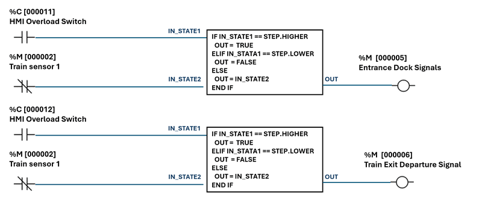

# OT Railway System Development [02]

### Simulating Simple Railway Station Train Dock and depart Auto-Control System with IEC104 PLC Simulator

**Project Design Purpose** : Building on the Virtual PLC Simulator with IEC 60870-5-104 communication (https://www.linkedin.com/pulse/python-virtual-plc-simulator-iec-60870-5-104-protocol-yuancheng-liu-bov7c) that I presented in the previous article, this project demonstrates one detailed use case about how the PLC/RTU simulator can drive a simplified railway-station automation control scenario. Our goal is to show step-by-step information about how core station hardware—train-position sensors, dock/depart signal lights, platform doors, platform emergency stops, station control room —can be modeled in software; how their interactions are orchestrated through a lean automatic-control circuit; and how the resulting logic is implemented and tested in ladder code within the IEC 104 virtual PLC. 

While real-world rail systems involve far richer safety layers and interlocks, the streamlined approach here is intentionally trimmed for education and rapid prototyping, giving engineers and students a practical sandbox for exploring OT-grade rail automation without the overhead of a full-scale installation.

```
# Version:     v_0.0.3
# Created:     2025/05/18
# Copyright:   Copyright (c) 2024 LiuYuancheng
# License:     MIT License 
```

**Table of Contents**

[TOC]


------

### Introduction

This article is part of the Land Based Railway IT-OT Cyber Range System's program design wiki,  it presents a detailed walkthrough of how the Virtual IEC 60870-5-104 PLC Simulator is applied within the OT environment of Land-Based Railway IT-OT Cyber Range System I developed, specifically for monitoring and controlling the railway stations in the system. The system operates in both automatic and manual modes, covering two key functional domains:

- **Station Track Control**: Utilizing position sensors and signal logic to control train braking and acceleration, this subsystem ensures accurate train docking and safe departure guiding procedures.
- **Station Platform Control**: Managing the synchronized operation of train and platform doors, emergency stop functions, and manual override controls from the station control room.

To provide a comprehensive understanding of this simulation, the article is structured into four main sections:

- **Background Knowledge** – A brief overview of the Land-Based Railway IT-OT Cyber Range System, with a focus on the station control segment within the overall architecture.
- **Station Physical Components Simulation** – Modeling key simulated physical elements of the station such as trains position sensors, trains dock/depart signals, platform safety doors, emergency buttons, and manual control room console interfaces.
- **Platform Automatic Control Circuit Design** – Developing different control circuits that govern automatic train docking and departure sequences, platform safety door control. 
- **PLC Ladder Logic Implementation** – Programming the control logic using the IEC 60870-5-104 virtual PLC simulator to realize the station track, trains and platform automation control workflow.

If you are interested about how virtualized OT components can be integrated into rail system scenarios for training, testing, and prototyping purposes and get more information about the Land-Based Railway IT-OT Cyber Range, this is another article about how to use ModBus-TCP PLC to Implement Land Based Railway Track Fixed Block Signaling OT System: https://www.linkedin.com/pulse/use-plc-implement-land-based-railway-track-fixed-block-yuancheng-liu-saaec/?trackingId=NuOghXz8rui9f2Z4%2F5RQEQ%3D%3D


------

### Background Knowledge

The Land-Based Railway IT-OT System Cyber Security Test Platform is a compact and modular cyber range designed to emulate the complex IT and OT environments of modern railway systems. It serves as a digital-twin simulation environment that integrates both operational technologies—such as railway track signaling, train ATC/ATP systems, and station control systems—and a realistic enterprise IT network comprising standard user infrastructure like internal servers, databases, and workstations. This platform allows researchers, engineers, and cybersecurity professionals to study and test interactions across IT-OT boundaries in a controlled, scalable environment.

The system architecture spans all six levels of the Purdue Model—from Level 0 (Physical Process Field I/O) to Level 5 (Internet DMZ)—and is fully customizable to suit various training or simulation goals. In this article, we specifically focus on the **Railway Station OT Control Subsystem**, which is highlighted in the system diagram below.


As illustrated, the **station control system** operates across three OT environment layers:

- **Level 0 – Physical Process (Field I/O Devices)**: A software-based physical world simulator generates virtual sensor signals—such as echo sensors to detect train position—and actuator signals like brake commands, start/stop movement instructions, and platform safety door motor triggers. These emulate the electrical behavior of actual field devices.
- **Level 1 – OT System Controller LAN**: The custom-developed IEC 60870-5-104 PLC simulator receives the simulated signals and processes them using control logic implemented in ladder diagrams. This level replicates how a real PLC would manage train docking, departure sequences, and platform door control based on input conditions.
- **Level 2 – Control Center (Processing LAN)**: Here, Human-Machine Interfaces (HMIs) and control consoles interact with the virtual PLC via OT communication protocols. These interfaces enable real-time system monitoring, emergency intervention, and manual override functionalities—just like in a real-world railway control room.

This layered design allows us to replicate realistic control workflows and fault scenarios in a safe, repeatable simulation environment—supporting both engineering education and cybersecurity defense exercises.


------

### Physical World Station Simulation

Within the Land-Based Railway IT-OT System Cyber Security Test Platform, the physical world simulation program replicates the behavior of a multi-station rail network consisting of 22 virtual train stations simulator across 3 distinct tracks (Green / Pink / Orange) , as highlighted in the below diagram : 


**Station Simulator Operation Workflow** : Each virtual station will dynamically generates a random number of passengers labeled as “people waiting to onboard.” When a train docks at the station, the system simulates the passengers boarding process, decrementing this number until it reaches zero. This number directly influences the train’s dwell time at the platform: the more passengers, the longer the train will stop. Once all waiting passengers have boarded, the station closes the platform doors and updates the departure signal to release the train for departure.

To emulate the physical station environment, five key station components are simulated in software, as shown in the following schematic:


- **Train Position Sensors** : These sensors detect the train’s position as it approaches and docks at the platform. They send real-time positioning data to the control system to ensure train precise alignment—so that all train doors align exactly with the platform safety doors.
- **Train Entrance Dock Signals** : Two sets of signals are used: one at the station perimeter max safety distance (entrance signal) and one at the platform threshold (platform dock signal). These signals manage queueing and entry permissions for trains—only allowing them to dock when conditions are safe and space is available.
- **Platform Safety Doors** : These doors remain closed by default and are only triggered to open once the train has fully docked. They automatically close again before departure, ensuring passenger safety and synchronization with the train doors.
- **Train Exit Departure Signal** : Positioned at the end of the platform, this signal governs when a train is permitted to leave. It turns green only if both the train and platform doors are closed, reinforcing safe departure logic.
- **Platform Emergency Button**: This manual override mechanism immediately halts all train movement and disables the platform door motors when pressed. It also cuts power to the train and forces all signals both entrance and exit to red, placing the station in an emergency stop state.

All these components are interfaced with the Station Control PLC, which processes their status and manages control logic. The implementation details of the PLC logic and automatic control circuitry will be covered in the next section of the article.


------

### System Operation Design

For the system design part, we will introduce the control connection the the circuit and the ladder control. The components to PLC connection link diagram is shown below: 


As shown in the diagram, to make it looks clearer we use 3 PLC, for detail implementation we can use one PLC with different ladder rung sequence configuration. For each control flow detail : 

**PLC2 control** 

- Connected components: to the 1st train sensor, the Entrance Dock Signals and the Train Exit Departure Signal. 
- input: 1st train motion detection sensor
- Output: entrance Dock Signals and the Train Exit Departure Signal
- Init state: change Dock Signals green and Departure Signal green. 
- Workflow: When the 1st train sensor triggered, turn both  change Dock Signals and Departure Signal to red to freeze the station. 
- Over ride control: The station HMI can force turn on/off the  Dock Signals and the Train Exit Departure Signal. 


**PLC 1 control** 

- Connected components: PCL2, 2nd train sensor, Train Exit Departure Signal, platform doors. 
- Input :  2nd train sensor,
- Output: PLC2, Train Exit Departure Signal, platform doors. 
- Init state: change Dock Signals green and the platform doors close (red). 
- Workflow: when the 2nd train sensor detect train speed 0 and at correct trigger area, open the platform door. When the internal timer count to 0 (simulate all people finish boarding), turn off the platform door, then change the Train Exit Departure Signal to green. When the 2nd train sensor detect train left, reset the PLC for the next train to dock. 
- Over ride control: he station HMI can force turn on/off the  Departure Signal, platform doors open and close.


**PLC 0 Control** 

- Connected components: PLC1, PLC2, Emergency button, Entrance Dock Signals and the Train Exit Departure Signal, platform doors motor and the train 3rd track power input. 
- Input: platform Emergency buttons. 
- Output :PLC1, PLC2,  Entrance Dock Signals and the Train Exit Departure Signal, platform doors motor and the train 3rd track power input. 
- Init state: Entrance Dock Signals and the Train Exit Departure Signal green, platform doors motor on and the train 3rd track power on.
- Workflow : when the button is pressed, Entrance Dock Signals and the Train Exit Departure Signal will change to red, the power to the platform doors and train will be cut off. The PLC1 and PLC2 will be turn off.  
- Over ride control: Then emergency state can only be over ride (recover ) via reboot all the PLC(s)


------

### Circuit and PLC Ladder Design 

This section will introduce the ladder logic to implement the PLC operation and how we use the IEC104 PLC simulator to implement the ladder logic.

PLC2 Ladder Design 




| Point ID | Point Address | Point Type       | Point Data Type | Init Value     | Ladder Rung I/O Type                                  |
| -------- | ------------- | ---------------- | --------------- | -------------- | ----------------------------------------------------- |
| pt1      | `00 00 02`    | Measured Point   | `M_SP_NA`       | False          | Input [ train sensor 01]                              |
| pt2      | `00 00 11`    | Changeable Point | `C_RC_TA`       | STEP.INVALID_0 | Input [ station HMI dock signal control switch]       |
| pt3      | `00 00 12`    | Changeable Point | `C_RC_TA`       | STEP.INVALID_0 | Input [ station HMI departure signal control switch ] |
| pt4      | `00 00 05`    | Measured Point   | `M_SP_NA`       | True           | Output [station dock signal]                          |
| pt5      | `00 00 06`    | Measured Point   | `M_SP_NA`       | True           | Output [station departure signal]                     |


------

> last edit by LiuYuancheng (liu_yuan_cheng@hotmail.com) by 22/05/2025 if you have any problem, please send me a message. 

