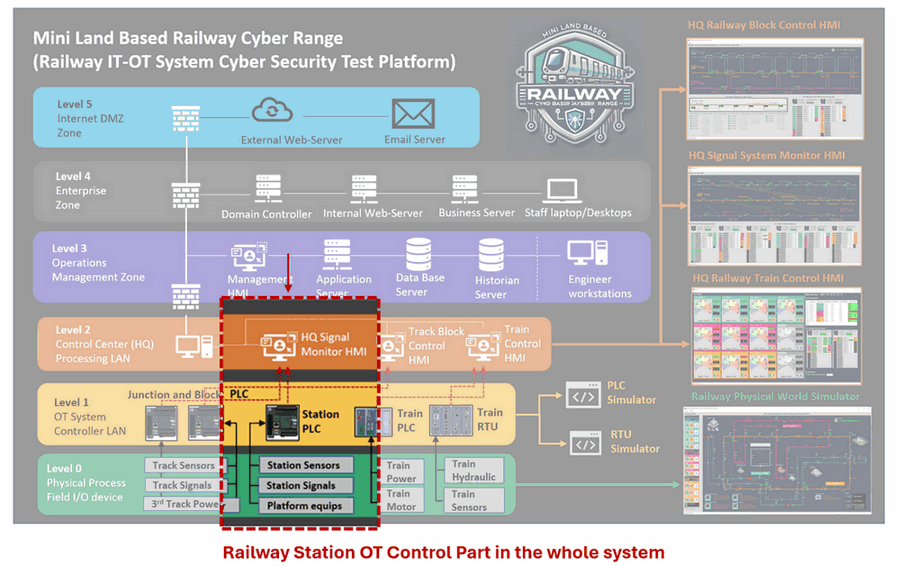

# OT Railway System Development [02]

### Simulating Simple Railway Station Train Dock and depart Auto-Control System with IEC104 PLC Simulator

**Project Design Purpose** : Building on the Virtual PLC Simulator with IEC 60870-5-104 communication (https://www.linkedin.com/pulse/python-virtual-plc-simulator-iec-60870-5-104-protocol-yuancheng-liu-bov7c) that I presented in the previous article, this project demonstrates one detailed use case about how the PLC/RTU simulator can drive a simplified railway-station automation control scenario. Our goal is to show step-by-step information about how core station hardware—train-position sensors, dock/depart signal lights, platform doors, platform emergency stops, station control room —can be modeled in software; how their interactions are orchestrated through a lean automatic-control circuit; and how the resulting logic is implemented and tested in ladder code within the IEC 104 virtual PLC. 

While real-world rail systems involve far richer safety layers and interlocks, the streamlined approach here is intentionally trimmed for education and rapid prototyping, giving engineers and students a practical sandbox for exploring OT-grade rail automation without the overhead of a full-scale installation.

```
# Version:     v_0.0.3
# Created:     2025/05/18
# Copyright:   Copyright (c) 2024 LiuYuancheng
# License:     MIT License 
```

**Table of Contents**

[TOC]


------

### Introduction

This article is part of the Land Based Railway IT-OT Cyber Range System's program design wiki,  it presents a detailed walkthrough of how the Virtual IEC 60870-5-104 PLC Simulator is applied within the OT environment of Land-Based Railway IT-OT Cyber Range System I developed, specifically for monitoring and controlling the railway stations in the system. The system operates in both automatic and manual modes, covering two key functional domains:

- **Station Track Control**: Utilizing position sensors and signal logic to control train braking and acceleration, this subsystem ensures accurate train docking and safe departure guiding procedures.
- **Station Platform Control**: Managing the synchronized operation of train and platform doors, emergency stop functions, and manual override controls from the station control room.

To provide a comprehensive understanding of this simulation, the article is structured into four main sections:

- **Background Knowledge** – A brief overview of the Land-Based Railway IT-OT Cyber Range System, with a focus on the station control segment within the overall architecture.
- **Station Physical Components Simulation** – Modeling key simulated physical elements of the station such as trains position sensors, trains dock/depart signals, platform safety doors, emergency buttons, and manual control room console interfaces.
- **Platform Automatic Control Circuit Design** – Developing different control circuits that govern automatic train docking and departure sequences, platform safety door control. 
- **PLC Ladder Logic Implementation** – Programming the control logic using the IEC 60870-5-104 virtual PLC simulator to realize the station track, trains and platform automation control workflow.

If you are interested about how virtualized OT components can be integrated into rail system scenarios for training, testing, and prototyping purposes and get more information about the Land-Based Railway IT-OT Cyber Range, this is another article about how to use ModBus-TCP PLC to Implement Land Based Railway Track Fixed Block Signaling OT System: https://www.linkedin.com/pulse/use-plc-implement-land-based-railway-track-fixed-block-yuancheng-liu-saaec/?trackingId=NuOghXz8rui9f2Z4%2F5RQEQ%3D%3D


------

### Background Knowledge

The Land-Based Railway IT-OT System Cyber Security Test Platform is a compact and modular cyber range designed to emulate the complex IT and OT environments of modern railway systems. It serves as a digital-twin simulation environment that integrates both operational technologies—such as railway track signaling, train ATC/ATP systems, and station control systems—and a realistic enterprise IT network comprising standard user infrastructure like internal servers, databases, and workstations. This platform allows researchers, engineers, and cybersecurity professionals to study and test interactions across IT-OT boundaries in a controlled, scalable environment.

The system architecture spans all six levels of the Purdue Model—from Level 0 (Physical Process Field I/O) to Level 5 (Internet DMZ)—and is fully customizable to suit various training or simulation goals. In this article, we specifically focus on the **Railway Station OT Control Subsystem**, which is highlighted in the system diagram below.



As illustrated, the **station control system** operates across three OT environment layers:

- **Level 0 – Physical Process (Field I/O Devices)**: A software-based physical world simulator generates virtual sensor signals—such as echo sensors to detect train position—and actuator signals like brake commands, start/stop movement instructions, and platform safety door motor triggers. These emulate the electrical behavior of actual field devices.
- **Level 1 – OT System Controller LAN**: The custom-developed IEC 60870-5-104 PLC simulator receives the simulated signals and processes them using control logic implemented in ladder diagrams. This level replicates how a real PLC would manage train docking, departure sequences, and platform door control based on input conditions.
- **Level 2 – Control Center (Processing LAN)**: Here, Human-Machine Interfaces (HMIs) and control consoles interact with the virtual PLC via OT communication protocols. These interfaces enable real-time system monitoring, emergency intervention, and manual override functionalities—just like in a real-world railway control room.

This layered design allows us to replicate realistic control workflows and fault scenarios in a safe, repeatable simulation environment—supporting both engineering education and cybersecurity defense exercises.


------

### Physical World Station Simulation

Within the Land-Based Railway IT-OT System Cyber Security Test Platform, the physical world simulation program replicates the behavior of a multi-station rail network consisting of 22 virtual train stations simulator across 3 distinct tracks (Green / Pink / Orange) , as highlighted in the below diagram : 


**Station Simulator Operation Workflow** : Each virtual station will dynamically generates a random number of passengers labeled as “people waiting to onboard.” When a train docks at the station, the system simulates the passengers boarding process, decrementing this number until it reaches zero. This number directly influences the train’s dwell time at the platform: the more passengers, the longer the train will stop. Once all waiting passengers have boarded, the station closes the platform doors and updates the departure signal to release the train for departure.

To emulate the physical station environment, five key station components are simulated in software, as shown in the following schematic:


- **Train Position Sensors** : These sensors detect the train’s position as it approaches and docks at the platform. They send real-time positioning data to the control system to ensure train precise alignment—so that all train doors align exactly with the platform safety doors.
- **Train Entrance Dock Signals** : Two sets of signals are used: one at the station perimeter max safety distance (entrance signal) and one at the platform threshold (platform dock signal). These signals manage queueing and entry permissions for trains—only allowing them to dock when conditions are safe and space is available.
- **Platform Safety Doors** : These doors remain closed by default and are only triggered to open once the train has fully docked. They automatically close again before departure, ensuring passenger safety and synchronization with the train doors.
- **Train Exit Departure Signal** : Positioned at the end of the platform, this signal governs when a train is permitted to leave. It turns green only if both the train and platform doors are closed, reinforcing safe departure logic.
- **Platform Emergency Button**: This manual override mechanism immediately halts all train movement and disables the platform door motors when pressed. It also cuts power to the train and forces all signals both entrance and exit to red, placing the station in an emergency stop state.

All these components are interfaced with the Station Control PLC, which processes their status and manages control logic. The implementation details of the PLC logic and automatic control circuitry will be covered in the next section of the article.


------

### System PLC Operation Design

In the Land-Based Railway IT-OT System Cyber Security Test Platform, the **Railway Station OT Control System** relies on programmable logic controllers (PLCs) to simulate and manage various station automation processes. For better logical separation and easier understanding, the control system is modularized into three PLC units: PLC0, PLC1, and PLC2. However, in real implementation, these logic sequences can be consolidated into one PLC using separate ladder rungs or functional blocks.

The following figure illustrates the component-to-PLC connection architecture:


#### PLC2 – Entrance and Exit Signal Control

**Connected Components:**

- Train position detection sensor (1st sensor before the platform)
- Station Entrance Dock Signal
- Station Exit Departure Signal

**Control Logic:**

- **Inputs:** Train motion detection sensor signal (train pass and moving direction)
- **Outputs:** Entrance Dock Signal, Exit Departure Signal
- **Initial State:** Both signals set to **green** (train allowed to enter and exit)
- **Workflow:**
  1. When the train triggers the first motion sensor, PLC2 sets both signals to **red** to lock down the station (prevent entrance/exit).
  2. This state ensures that only one train occupies the station at any time.

**Override Capability:**

- The station HMI interface can **manually override** PLC2 to control entrance and exit signals in case of supervisory intervention or failure recovery.

#### PLC1 – Platform Door and Departure Flow Control

**Connected Components:**

- PLC2 ( for coordination )
- Train position detection sensor (2nd sensor at platform zone)
- Platform Safety Doors
- Train Exit Departure Signal

**Control Logic:**

- **Inputs:** Second train sensor (checks if train is stopped in docking zone)
- **Outputs:** Platform doors, coordination signal to PLC2, Exit Departure Signal
- **Initial State:** Platform doors **closed**, Dock Signal **green**
- **Workflow:**
  1. When train is **stopped** and correctly aligned (sensor trigger + speed = 0), platform doors are **opened**.
  2. A **countdown timer** simulates boarding time, based on the number of waiting passengers.
  3. Once the timer reaches zero, platform doors are **closed**, and Exit Departure Signal is set to **green** to allow train departure.
  4. When the train fully exits the platform (as detected by the second sensor), PLC1 resets for the next docking cycle.

**Override Capability:**

- The station HMI can **force door open/close** and **manually control** the Exit Departure Signal as needed.

#### PLC0 – Emergency Safety Control System

**Connected Components:**

- Emergency Stop Button
- PLC1 and PLC2 (via control signals)
- Platform Door Motors
- Train 3rd Track Power Supply
- Entrance and Exit Signals

**Control Logic:**

- **Input:** Platform Emergency Stop Button
- **Outputs:** Kill signals to PLC1, PLC2, Platform door motors, Train power supply, and both platform signals
- **Initial State:** All systems **active** – entrance/exit signals green, platform doors powered, train powered
- **Workflow:**
  1. When the **Emergency Button is pressed**, PLC0 initiates **total shutdown**:
     - Entrance and Exit signals turn **red**
     - **Platform door motors and train power** are cut off
     - Both PLC1 and PLC2 are **disabled**
  2. This ensures all movement stops, achieving a fail-safe halt of all operations.

**Override Capability:**

- Emergency mode **can only be reset** by **rebooting all PLCs**, ensuring controlled and deliberate recovery from any hazardous condition.

This three-tier PLC design enables simulation of realistic station automation processes, fault response, and HMI interactions. The layered logic also serves as a **testbed for cybersecurity assessment**, ensuring that each control point can be monitored, isolated, or overridden during test scenarios.


------

### Circuit and PLC Ladder Design 

This section will introduce the ladder logic to implement the PLC operation and how we use the IEC104 PLC simulator to implement the ladder logic.

PLC2 Ladder Design 


| Point ID | Point Address | Point Type       | Point Data Type | Init Value     | Ladder Rung I/O Type                                  |
| -------- | ------------- | ---------------- | --------------- | -------------- | ----------------------------------------------------- |
| pt1      | `00 00 02`    | Measured Point   | `M_SP_NA`       | False          | Input [ train sensor 01]                              |
| pt2      | `00 00 11`    | Changeable Point | `C_RC_TA`       | STEP.INVALID_0 | Input [ station HMI dock signal control switch]       |
| pt3      | `00 00 12`    | Changeable Point | `C_RC_TA`       | STEP.INVALID_0 | Input [ station HMI departure signal control switch ] |
| pt4      | `00 00 05`    | Measured Point   | `M_SP_NA`       | True           | Output [station dock signal]                          |
| pt5      | `00 00 06`    | Measured Point   | `M_SP_NA`       | True           | Output [station departure signal]                     |

To implement the login with the IEC104 PLC simulator

```python
def initLadderInfo(self):
    self.stationAddr = STATION_ADDR 
    self.srcPointAddrList = [2, 11, 12]
    self.srcPointTypeList = [M_BOOL_TYPE, C_STEP_TYPE, C_STEP_TYPE]
    self.destPointAddrList = [5, 6]
    self.destPointTypeList = [M_BOOL_TYPE, PT5_ADDR]
```

**Logic Execution Code** : After finished all the point configuration, use python to implement the logic in the function `runLadderLogic()` function as shown below.

```python
def runLadderLogic(self):
    pt1Val = self.parent.getPointVal(self.stationAddr, self.srcPointAddrList[0])
    pt2Val = self.parent.getPointVal(self.stationAddr, self.srcPointAddrList[1])
    pt4Val = pt1Val
    if pt2Val == c104.Step.HIGHER:
        pt4Val = True 
    elif pt2Val == c104.Step.LOWER:
        pt4Val = False 
    self.parent.setPointVal(self.stationAddr, self.destPointAddrList[0], pt4Val)

	pt3Val = self.parent.getPointVal(self.stationAddr, self.srcPointAddrList[2])
	pt5Val = pt1Val
	if pt3Val == c104.Step.HIGHER:
		pt5Val = True
	elif pt3Val == c104.Step.LOWER:
		pt4Val = False
	self.parent.setPointVal(self.stationAddr, self.destPointAddrList[1], pt5Val)
```


------

> last edit by LiuYuancheng (liu_yuan_cheng@hotmail.com) by 22/05/2025 if you have any problem, please send me a message. 

