# OT Railway System Development [05]

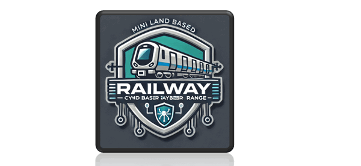

### Design of the Train Control for Land-Based Railway Cyber Range

```python
# Author:      Yuancheng Liu
# Created:     2025/06/29
# Version:     v_0.0.2
# Copyright:   Copyright (c) 2025 Liu Yuancheng
```

**Table of Contents**

[TOC]

------

### Introduction

In the modern railway systems, train control involves a complex integration of automation, signaling, and communication technologies. This article introduces the design of a simplified train control system implemented within the land-based railway cyber range I developed for the purpose of cybersecurity exercise, training and simulation. 

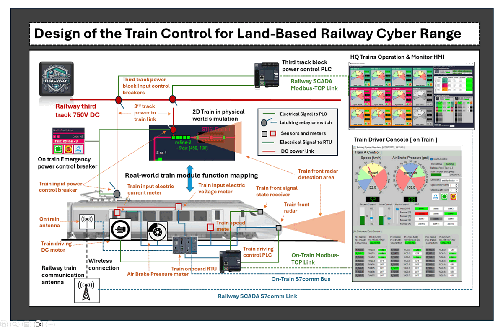

The simulated train system aims to provide a functional, interactive sub-system models ten autonomous 750V-DC trains operating on three separate tracks. Each train is equipped with an onboard Programmable Logic Controller (PLC) and Remote Terminal Unit (RTU), allowing it to autonomously interact with the trackside signaling systems. These trains are capable of navigating junctions and forks, docking at stations, and departing automatically, simulating the key behaviors of real-world operations. To support cyber-physical attack and defense scenarios, the simulation also includes realistic control logic, communication protocols, and monitoring interfaces.

This article is structured into four main sections:

- **Overview of the Train Simulation System** – Describes the overview and architecture of the train simulation within the cyber range.
- **System Design of the Simulated Train** – Details the train’s auto control circuit design, PLC/RTU control sequence, train collision safety control work flow, and signal interaction logic.
- **Network and Communication Configuration** – Explains how the simulated trains communicate over the on-train internal network and the railway SCADA network with signaling systems and HQ control center.
- **Train Control Interfaces** – Introduces the user interfaces including the onboard driver console and the HQ control center train monitoring HMI system.

This design also serves as a foundational component in cyber range exercises, enabling red and blue teams to explore vulnerabilities and defense mechanisms in railway control environments.

> **Important**: The actual train control systems are highly sophisticated and governed by strict safety standards, the implementation described in this article offers a simplified conceptual model tailored for educational and training purposes in a controlled cyber range environment.


------

### Overview of the Train Simulation System

The train simulation system is one of the core components of the land-based railway cyber range. It represents the physical-world operation of trains in a simplified and controlled environment designed for cybersecurity training and system behavior analysis. Within this simulation, ten autonomous trains are visualized as sequences of 5 to 7 rectangles each (based on the train length user configured), moving along three tracks at speeds ranging from 0 to 20 pixels per second (approximate visual simulation speed). The trains are high lighted on the physical world simulator screen shot as shown below :

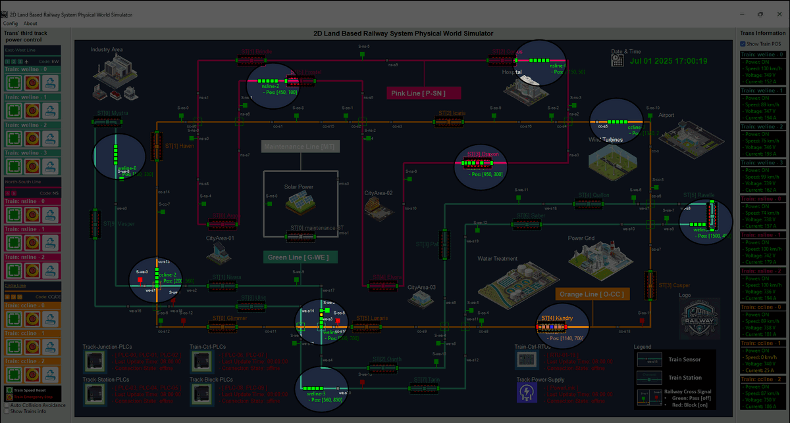

` Figure-01: Trains in physical world simulator, version v_0.0.2 (2025)`

Each train is a self-contained unit that interacts with its environment—including track signals, power systems, and sensors—while being monitored and controlled through two main interfaces as shown below:

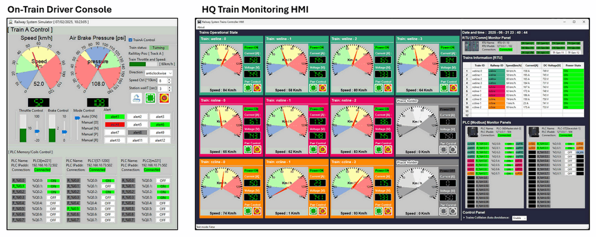

` Figure-02: Trains control interface, version v_0.0.2 (2025)`

- **On-Train Driver Console** (local train driver monitor and manual control HMI)
- **HQ Train Monitoring HMI** (central supervisory interface in HQ control center)

#### Key Features of Each Simulated Train 

Each Train will interact with other components in the physical world simulator with below key features : 

- **3rd Rail Track Power Interaction** : Each train relies on the availability of power from a simulated third rail track power system. If third rail track power is lost, the train transitions to a powerless, stationary state.
- **Sensor and Signal Response** : The train will interact with the train detect sensors on the tracks, it will trigger the sensor when it pass through the sensor position. Trains are capable of detecting and reacting to track signals. If a signal ahead indicates a "block" condition, the train will automatically reduce speed and come to a stop before the signal.
- **Dynamic Parameter Generation** : Each train continuously generates telemetry data, including: Speed (km/h), Motor input current (A), Motor voltage (V), motor RPM, Position in block zones, Throttle and brake status. 
- **Internal Control Network** : Every train hosts an onboard OT control network, integrating a PLC to control the train, it also have one RTU to remote connect to the railway SCADA network. This allows both local (driver) and remote (HQ) control.

#### Operation States of the Simulated Train

As depicted in the image below, each train transitions through four operational scenarios depending on its power state, control inputs, and environmental conditions :

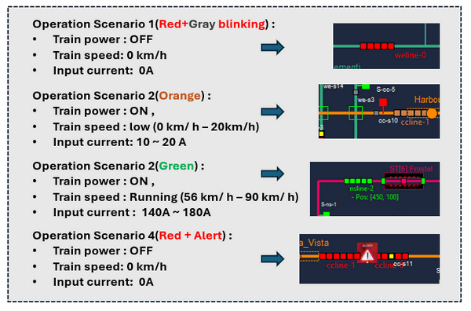

` Figure-03: Trains four operational scenarios, version v_0.0.2 (2025)`

| Operation scenario | Visual Indicator      | Scenario description                                         |
| ------------------ | --------------------- | ------------------------------------------------------------ |
| **Scenario 1**     | 🔴 Red + Gray Blinking | **Power OFF**: Train is not powered. Speed = 0 km/h, Current = 0A. Occurs when third rail power is lost or driver turns off the train power input breaker. |
| **Scenario 2**     | 🟠 Orange              | **Low-Speed / Braking State**: Train is powered, but moving slowly or stop (0–20 km/h). Current draw is between 10–20A. Typically seen during station docking or braking before a red signal. |
| **Scenario 3**     | 🟢 Green               | **Running State**: Train is fully operational and in transit, moving between 56–90 km/h. Current draw is high (140–180A), brake is turned off, throttle is active. |
| **Scenario 4**     | 🔴 Red + ⚠️ Alert Icon  | **Emergency / Fault State**: Triggered by failures, system errors, or accident simulations. Power is cut, train stops immediately (0 km/h, 0A), and alert status is raised. |

These operational states help replicate realistic behaviors in response to faults, signal changes, or cyber-induced disturbances, providing a comprehensive platform for evaluating both safety mechanisms and cybersecurity resilience in railway systems.


------

### System Design of the Simulated Train

The simulated train in the land-based railway cyber range is built as a modular system comprising four interconnected subsystems. Each subsystem is mapped to physical world behaviors and enables cyber-physical interaction between the virtual environment and control logic. The four train sub-systems include : 

- Train Power Supply Control Subsystem
- Train Auto Pilot Control Subsystem
- Train Driving Control Subsystem
- Train Operation Information Report Subsystem

The design not only supports autonomous operation but also enables manual control, monitoring, and communication with the railway SCADA network. The overall system structure is illustrated in the diagram below:

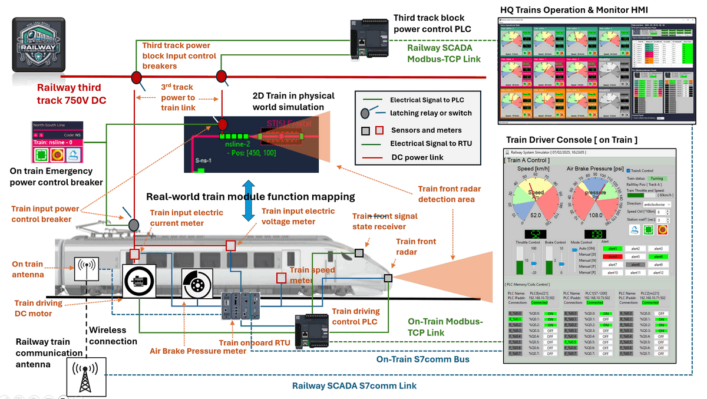

` Figure-04: System Design of the Simulated Train System, version v_0.0.2 (2025)`

#### 1. Train Power Supply Control Subsystem

This subsystem simulated the third rail electrification track infrastructure used in urban rail systems (as shown in the top part of the diagram). Each track block provides 750V DC to the train through a third rail segment, controlled by 3rd-track-side PLCs and HQ. For the train to receive power, two conditions must be met:

- The **third track block input breaker** (track-side) must be ON
- The **train’s onboard power breaker** must also be ON

These dual-breaker safety controls reflect real-world redundancy and support emergency power cut-off functionality.

**Key components:**

- **Railway Third Track Power (750V DC):** Simulated third rail track providing traction DC power.
- **Third Track Block Power Control Breakers:** Controlled by the SCADA-integrated PLCs, these breakers supply power from the track to the train-3rdTrack power connection link.
-  **Train-3rdTrack power** : Link between the train and 3rd rail electrification track to transfer power to the train.
- **Train Input Power Control Breaker:** A local breaker onboard the train, operated by the emergency stop button or driver console.
- **Third Track Block Power Control PLC:** Controlled via Modbus-TCP from the HQ Train Operation HMI.

For the 3rd track power technical details please refer to this link: https://www.railway-technology.com/features/overhead-lines-vs-third-rail-how-does-rail-electrification-work/?cf-view&cf-closed.


#### 2. Train Auto Pilot Control Subsystem

This subsystem enables autonomous operation such as braking, acceleration, and responding to track signals. Two primary on train sensors guide this behavior:

- A **track signal state receiver** at the train’s front detects upcoming track signals (e.g., track block STOP or CLEAR).
- A **front radar** monitors safety distance ahead to prevent collisions.

These sensor inputs are processed by the train onboard PLC, which uses ladder logic to automatically control motor and brake behavior.

**Key components:**

- **Train Front Signal State Receiver:** Detects the nearest signal ahead and transmits the state to the PLC.
- **Train Front Radar:** Scans the area in front of the train for check whether obstacles or other trains in safety distance range.
- **Train Driving Control PLC:** Connect to the train motor and brake, executes logic to brake or accelerate based on sensor inputs.

Typical behaviors include:

- Signal RED / Blocked → Brake Activated, Motor Off
- Signal GREEN / Clear → Brake Released, Motor On
- Radar detects nearby train → Brake Activated to avoid collision


#### 3. Train Driving Control Subsystem

This subsystem simulates the physical mechanisms for motion, braking, and performance monitoring. It includes simulated actuators (motor and air brake) and sensors (speed, current, voltage, pressure) that work together to represent the train's dynamic state.

Manual override is available via the **on-train driver console**, allowing the operator to switch off auto-pilot and take control using throttle, brake, and other controls.

**Key components:**

- **Train Driving DC Motor & Air Brake:** Execute train physical movement and braking.
- **Train Speed & Motor RPM Meter:** Monitor real-time speed and motor RPM performance.
- **Electric Current & Voltage Meters:** Measure power (current and voltage) input from third rail track.
- **Air Brake Pressure Meter:** Measures air brake pressure ( PSI ) for braking control.
- **Train Driving Control PLC:** Central logic controller managing actuators and safety inputs.
- **Onboard RTU:** Gathers sensor data and reports it to the console and SCADA system.
- **Train Driver Console (HMI):** Interface for manual train operation, including throttle/brake control, door operation, and state monitoring.


#### 4. Train Operation Information Report Subsystem

To maintain centralized situational monitoring, each train reports its operational state to the HQ control center in real time via a wireless SCADA link. This simulates a 5G or radio communication network, and uses the Siemens-S7Comm/IEC104 protocol to transmit data from the train’s RTU to the HQ Train Monitoring HMI.

**Key components:**

- **Onboard RTU:** Collects sensor data and sends it via communication link.
- **On-Train Antenna:** Simulated radio antenna linking from train to railway SCADA network.
- **Railway Train Communication Antenna:** Network endpoint receiving train telemetry and integrate in the railway SCADA network.
- **HQ Train Monitoring HMI:** Central dashboard HMI in HQ control center showing all train states, alerts, and statuses for supervisory control.

This reporting loop ensures HQ can monitor speed, power state, brake pressure, signal compliance, and emergency conditions across all trains in the lvl3 OT network.


------

### Network and Communication Configuration

The simulated railway train control system is built on a modular communication architecture consisting of three major network subnets and five functional communication buses. This networked environment supports both control and monitoring across multiple components including simulated PLCs, RTUs, driver consoles, and HQ monitoring HMIs.

To model realistic industrial OT behavior while enabling cybersecurity training, the simulation separates functions into isolated logical zones, while also exposing selective parts of the network to red/blue team interaction.

The data flow across the system follows this sequence:

> Physical World Simulator → PLC/RTU Simulation → HMI Interfaces (Driver Console / HQ Train Monitor HMI)

The diagram below illustrates the full communication structure and component relationships:

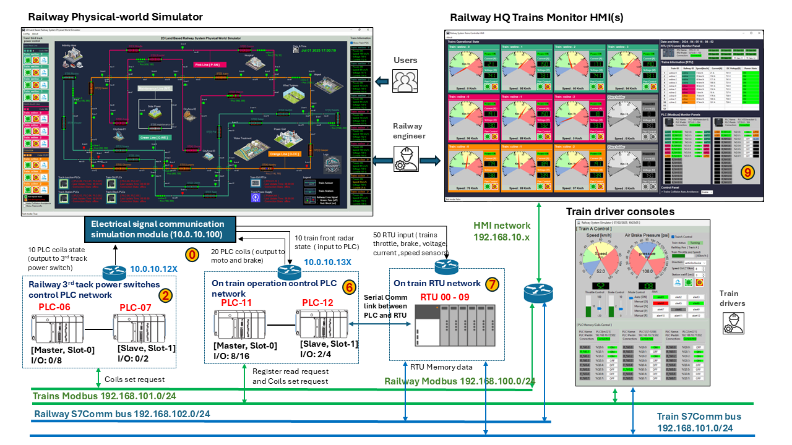

` Figure-05: Train control system network diagram, version v_0.0.2 (2025)`

The distributed network enables precise modeling of railway control and communication behavior while allowing cyber defenders (blue team) and attackers (red team) to train and test their skills in a safe, controlled simulation environment.

#### Three Network Subnets

The network topology consists of the following three subnets:

**Electrical Signal Simulation Subnet**

- Function : Simulates the signal exchange between physical-world components (motors, sensors, breakers) and all the lvl1 OT controller devices.
- Devices and Comm-Buses : Railway Physical-world Simulator, 3rd Rail Track Power Control PLCs (PLC-06, PLC-07), On-Train Operation PLCs (PLC-11, PLC-12), On-Train RTUs (RTU00–RTU09), Electrical Signal Communication Bus.
- IP Range: `10.0.10.X`

**On-Train Local SCADA Network**

- Function : Provides internal communication between train level-1 OT controllers and the level-2 train driver console.
- Devices and Comm-Buses : On-Train PLCs (PLC-11, PLC-12), On-Train RTUs (RTU00–RTU09), Train Driver Console HMI, On-Train PLC Communication Bus, On-Train RTU Communication Bus
- IP Ranges:  `192.168.101.0/24`, `192.168.102.0/24`

**Railway SCADA Network**

- Function : External SCADA network outside the train included the 3rd rail track control PLC and the train Information report RTU used by HQ for monitoring and control.
- Devices and Comm-Bus : 3rd Rail Track Power PLCs (PLC-06, PLC-07), On-Train RTUs (RTU00–RTU09), HQ Train Monitoring HMI, Railway 3rd Rail Track PLC Communication Bus, Railway SCADA S7Comm RTU Communication Bus.
- IP Ranges: `192.168.100.0/24`, `192.168.10.X`

#### Five Communication Data Buses

**Electrical Signal Communication Bus**

- Function: High frequency message exchange simulates wire connection electrical signals (e.g., power coil activation, radar inputs) exchanged between physical devices and OT controllers.

- Protocol: UDP (text-based signal exchange)
- Access Policy: Isolated in Green Team network, Not accessible to Blue or Red teams

**On-Train PLC Communication Bus**

- Function: Facilitates wire connection data exchange between the Train Driver Console and onboard PLCs for throttle, brake, door, and autopilot control.
- Protocol: Modbus-TCP
- Access Policy: Isolated in Blue Team network, Not accessible to Red Team

**On-Train RTU Communication Bus**

- Function: Allows the Train Driver Console to collect real-time sensor and meter data from RTUs.
- Protocol: Siemens S7Comm
- Access Policy: Isolated in Blue Team network, Not accessible to Red Team

**Railway 3rd Rail Track PLC Communication Bus**

- Function: Connects HQ Train Monitor HMI to the 3rd Track Power Control PLCs to monitor and switch block power status.
- Protocol: Modbus-TCP
- Access Policy: Accessible to both Blue and Red teams, Target for SCADA network attack simulations

**Railway SCADA S7Comm RTU Communication Bus**

- Function: Enables On-Train RTUs to report operational status wirelessly to the HQ Train Monitor HMI.
- Protocol: Siemens S7Comm (wireless)
- Access Policy: Accessible to both Blue and Red teams, Target for communication spoofing or interception


------

### Trains Collision Avoidance Control Logic

In the land-based railway cyber range simulation, train safety is ensured through a dual-layered collision avoidance system that integrates both automated and manual control. The simplified ladder logic and its hardware linkage are depicted in the diagram below:

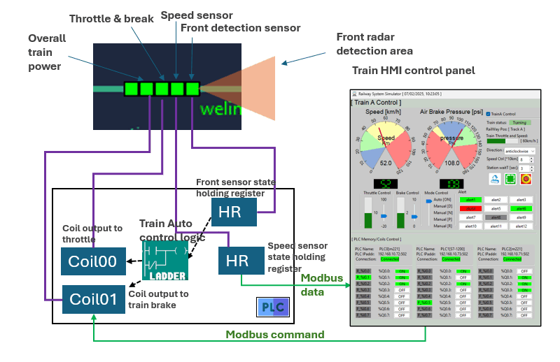

` Figure-06: Trains Collision Avoidance Control Logic diagram, version v_0.0.2 (2025)`

#### Auto Collision Avoidance Sub-system

Each simulated train is equipped with a front radar, responsible for detecting any obstacles or other trains within a predefined safe distance (e.g., within the front radar detection area shown in the diagram). When another train or object is detected in this zone, the radar sends a signal to the onboard PLC input contact to set a holding register.

- The PLC logic processes this input through a ladder diagram, which evaluates the radar signal stored in Holding Register HR0.

- If the holding register is set, the ladder logic will deactivates Coil00 (Throttle) and activates the coil01(brake) control, bringing the train to a controlled halt.

This automatic mechanism prevents rear-end or head-on collisions by responding in real-time without human intervention. To supplement the automated logic, train operators are also given manual override capability via the Train Driver Console. 

#### PLC Ladder Logic Implementation

Key Functional Elements:

- **HR0 (Radar Sensor Input)**: Stores binary signal from the front detection radar. Triggers automatic braking logic.
- **HR1 (Speed Sensor Input)**: Captures current train speed data and shares it with the HMI for monitoring and diagnosis.
- **Coil00**: Controls train throttle system, turn off if HR0 is set, otherwise set based on the train driver's console auto pilot config. 
- **Coil01**: Controls main brake system. turn on If HR0 is set, otherwise set  based on the train driver's console auto pilot config. 
- **Driver Console Control Panel**: Provides visualization of all train parameters and allows manual input to override automation logic when needed.

This layered collision avoidance system ensures the reliability and safety of the train simulation under both normal operations and cyber attack simulations. By combining sensor-driven PLC logic and operator-controlled emergency systems, the cyber range supports diverse training scenarios, including fault injection, signal spoofing, and manual override response drills.


------

### Train Control User Interfaces

In the land-based railway cyber range system, three distinct control user interfaces are implemented to simulate the management of train operations under both normal and cybersecurity exercise conditions. Each interface serves a different purpose and user role—ranging from physical simulation control to operational management and high-level monitoring.


#### Simulated Physical Control Interface

The simulated physical interface mimics the real-world control buttons on an actual train, such as emergency stop buttons, power breakers, and reset controls. These controls are implemented on the left panel of the Physical World Simulator, as shown in the image below:

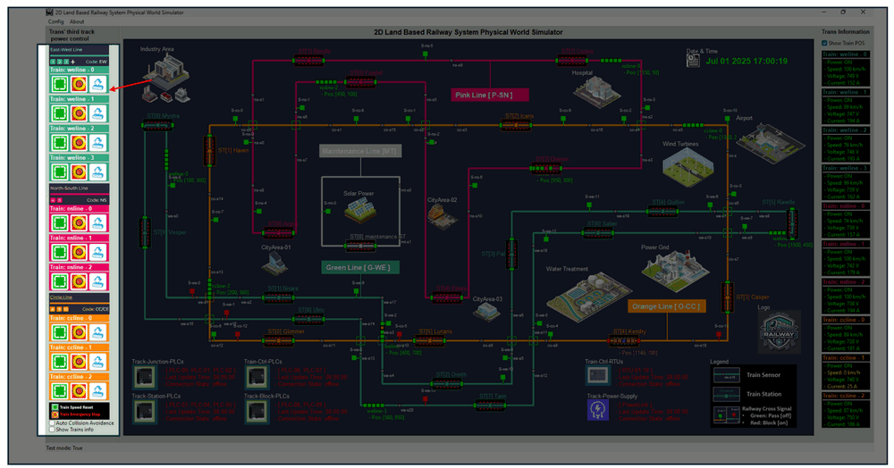

` Figure-07: Simulated Physical Control Interface, version v_0.0.2 (2025)`

**Functionality:**

- Green Button: Turns ON the on-train power input breaker, simulating activation of the train’s main power switch.
- Red Emergency Button: Immediately turns OFF the train’s input power breaker, simulating an emergency shutdown.
- Blue "Reset" Button: Resets the selected train to its initial state, clearing its sensors and internal state registers.

This interface is typically used by simulation operators, green team instructors to simulate fault conditions, emergency stops, or reinitialization during exercises.


#### Train Driver Control Console Interface

The **Train Driver Console** serves as the main HMI for train operators, allowing for direct manual control and monitoring of a single train’s status and performance. It is used by blue team members acting as train drivers during simulation exercises.

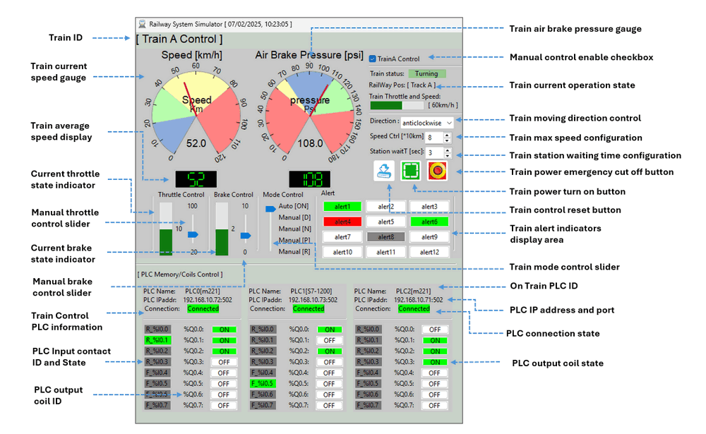

` Figure-08: Train Driver Control Console Interface, version v_0.0.2 (2025)`

Key Features:

- **PLC Status Panel**: Displays connectivity status, input/output coil values, and register data from the onboard train PLC.
- **Driving Indicators**: Train Speed (km/h) gauge, Air Brake Pressure (psi) gauge, Throttle and Brake Percentage indicators.
- **Manual Controls**: Throttle and Brake Manual control sliders, Manual Mode Selector, Direction Control (Forward/Reverse), Speed Limit Settings, Station Dwell Time Controls, Train Door Control Buttons. 
- **Operational State Monitors**: Power Input Voltage and Current, Train State Alerts (e.g., overcurrent, brake fault, emergency)
- **Power Controls**: Onboard Power Input Breaker Control and Power Reset button.

This HMI simulates the typical driver experience while supporting both manual override and diagnostics.


#### Railway Train Control HMI (HQ Monitoring Interface)

The **Railway Train Control HMI** is a supervisory interface used by HQ operators to monitor and manage the status of all trains across the network. It offers a centralized view into telemetry, control systems, safety signals, and RTU feedback, making it vital for both simulation and red/blue team cyber operations. The UI with detail function explanatory note is shown below :

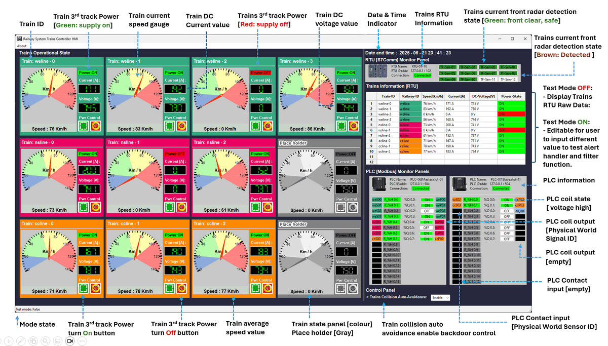

` Figure-09: Railway Train Control HMI (HQ Monitoring Interface), version v_0.0.2 (2025)`

Main Components:

- **Train Information Panels (10+2)**: Train ID, Current and Average Speed, 3rd Rail Power Input: Voltage, Current, and Power State, Remote Power Control Switches for each train. 
- **RTU Radar State Indicators**: Live feed from front-facing train radar to detect obstacle presence.
- **RTU Information Panel**: Displays real-time RTU sensor input data.
- **PLC Control Panels**: Real-time view of Modbus/S7Comm coil and register state from the railway’s power control PLCs.
- **Auto-Avoidance Backdoor Switch**: Toggles the automatic train collision avoidance logic.

This HMI acts as both an **operational dashboard** and a **cyber training surface**, providing visibility into control integrity and anomaly response capabilities.


------

> last edit by LiuYuancheng (liu_yuan_cheng@hotmail.com) by 04/07/2025 if you have any problem, please send me a message. 