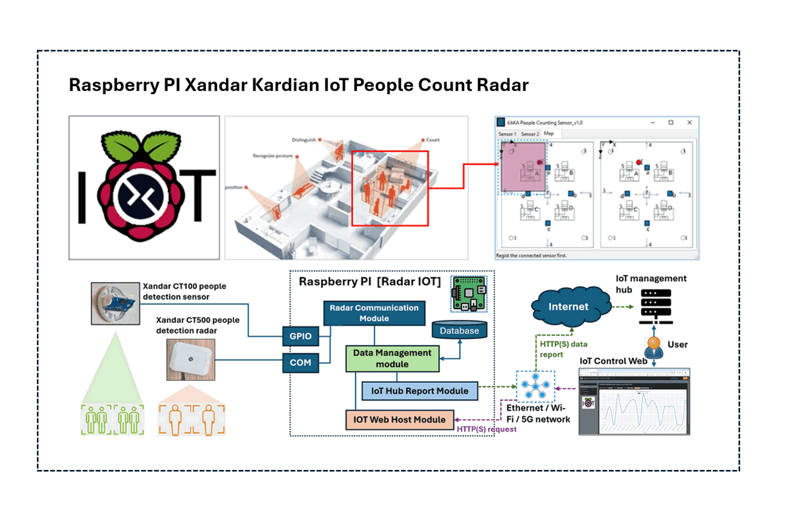
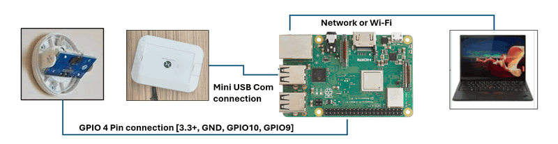

# Projects Introduction

[TOC]

### Cyber Den Project

#### People Detection Radar [IoT] Raspberry PI Xandar Kardian IoT People Count Radar

**Program Design Purpose**: 

People detection sensors and radars are utilized in various applications across multiple fields such as security and surveillance, healthcare, building automation, smart cities, transportation and autonomous manufacturing systems. This project aims to develop a prototype  IoT device for an indoor people counting using the Xandar Kardian people detection radar and a Raspberry Pi. The device will be network-ready and easily integrated with other systems. The Python-based IoT firmware will run on the Raspberry Pi and provide the following functionalities:

1. Read raw data from the people detection radar to determine the number of people in an area.

2. Offer a web interface for users to view the data and adjust radar parameters.

3. Provide IoT data access authorization and interfaces for integration with other systems.

The IoT device program workflow is shown below : 

The cyber Den box includes one Xandar Kardian Peopoe detection radara CT100: https://xkcorp.com/products/built-environment/ct100/ and one Raspberry PI. The hardware connection is shown below:

During the cyber exercise, the participants need to try to attack the IoT system to mess up the one or multiple radar reading data. 

Reference Project: https://github.com/LiuYuancheng/Xandar_PPL_Sensor_IOT_Web

------

Intern project for NCL master scholar (related to railway  system) : 

#### Intern Project 1: Railway Company Website Front End Project

**Time period**: 6 month

**People**: 1 Student

**Project description**: 

The intern is required to build a railway company website front end for the customer, the front end need to includes below basic pages / functions: 

1. A simple railway company home page and news display page. 
2. User registration, verification and login page/function. 
3. Trains schedule time line checking page.
4. Tickets purchase ( from station to station ). 
5. Money top-up page. 
6. Station and trains' state checking function: train delay, arriving time and on time. 

Attack scenario development: develop a cyber attack scenario which can apply on the web host. 

#### Intern Project 2: Railway Company Website Back End. 

**Time period**: 6 month

**People**: 1 Student

**Project description**: 

The intern is required to build a railway company website backend for the users, the front end need to includes below pages/ functions: 

1. Railway company management page:  user management,  billing management, finance ...
2. One data base to handle the money top-up. 
3. One data base to handle the ticket purchasing. 
4. One data base to save the train operation history. 
5. Provide the train operation information to the front end. 
6. Develop the interface to link the railway system to fetch the train operation data.

#### Intern Project 3: Railway Company Android App 

**Time period**: 6 month

**People**: 1 Student

**Project description**: 

The intern is required to build simple android for the users, the App needs to includes below pages/ functions: 

1. Railway station state display page. 
2. User login. 
3. Train schedule checking.
4. Ticket purchase. 
5. Money top-up page. 
6. Station's train state checking function: train delay, on time. 

#### **Intern Project 4:** Attack control Orchestrator [CUE]

The intern are request to design a simple Cyber Orchestrator web portal same as SUTD's water test bed which link to link to CUE system to automated control and stop the attack scenario during the cyber exercise. 

Example project: https://github.com/LiuYuancheng/OT_Platform_Attack_Web

