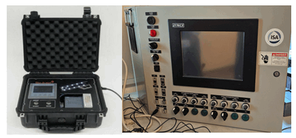

# NCL Table Top Cyber Security Demo Box

**Project Design Purpose**: The idea of the NCL cyber security demo box comes from the concept of the Athena Dynamics "CyberDen" which construct tabletop replicas of IT and OT systems into a simple box for cyber security education. 

[TOC]

------

### Introduction

The "CyberDen" is a concept designed to bring realism to cybersecurity in a more exciting way for students and newcomers by allowing them to see the physical impacts in real-time during a cyber-attack.Below is a simple cyberDen example of the airport runway light control system and a SCADA control box:

 We want to create some similar potable table top device which can also used in the NCL's training. 

------

### Table Top Cyber Security Demo Box

#### Smart Door Lock Box

IoT smart door locks have become the standard for home security. They are lauded for their convenience and advanced features, allowing homeowners to lock and unlock their doors remotely via a smartphone app. These locks provide security and convenience, seamlessly integrated into the daily lives of millions. However, beneath the surface of this technological marvel lies a vulnerability waiting to be exploited. 

We want to create a table top smart door lock system for the student to break the system with different cyber attack techniques such as brute force break the password, replay attack to unlock the door... 

Main Items includes : 

| Item                            | function                                      | number |
| ------------------------------- | --------------------------------------------- | ------ |
| Raspberry PI 400                | Main start door locker controller             | 1      |
| Raspberry pi membrane keypad    | Door lock password input pad                  | 1      |
| Raspberry pi camera [optional]  | Door lock face detection                      | 1      |
| Finger print scanner [optional] | Door lock finger print                        | 1      |
| Raspberry PI Serial COM board   | Interface for hacker used to break the system | 1      |

#### Drone Controller Simulation

The drones have emerged as pivotal tools in various sectors, with security and surveillance being one of the most significant applications.  These drones, equipped with advanced AI and real-time data processing, patrol the skies, providing unparalleled security. However, the rise of a new cyber threat poses a challenge unlike any before.

We want to create a simplified drone controller table top box for the student to control a virtual drone and try different attack techniques to break the drone control system. 

Main items includes : 

| Item                   | function                                                     | number |
| ---------------------- | ------------------------------------------------------------ | ------ |
| Laptop computer        | Run virtual drone simulation program and accept the drone control cmd from the box | 1      |
| Raspberry PI 400       | Main drone controller                                        | 1      |
| Raspberry PI HAT board | Provide the joystick for user to control the drone, LED display to show the drone state. | 1      |
| Wireless router        | Simulate the drone connection and provide in interface for cyber attack | 1      |

