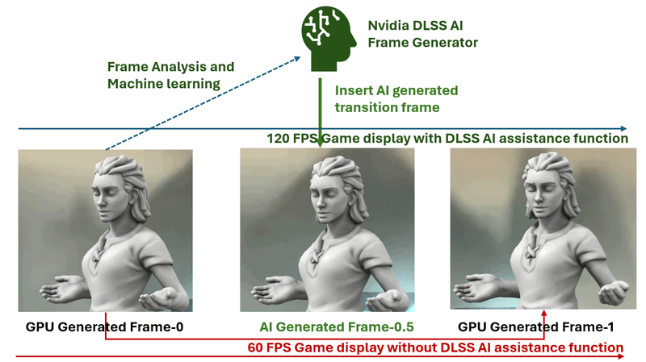
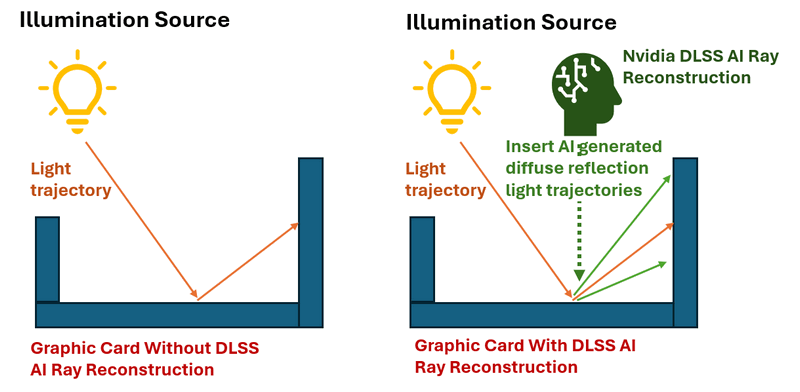

# New Unreal Engine 5 and Nvidia Technology in Black Myth: Wukong

In this article, we explore the cutting-edge Unreal Engine 5 and Nvidia GPU technologies used in the highly anticipated AAA game *Black Myth: Wukong* this year to enhance its game graphical quality. Our insights are based on an interview article of the technical lead of Game Science Interactive Technology, Geekerwan's experimental analysis, and Nvidia's official *Black Myth: Wukong* showcase featuring the RTX 40xx series. As a software engineer, my perspective may differ from that of a game development expert and more focus on the "Software development", so I welcome any corrections or feedback.

The technical discussion is divided into four parts, each illustrated with in-game screenshots to show how these technologies elevate the game's visual quality:

- Unreal Engine 5 Niagara Particle System
- Unreal Engine 5 Nanite Virtualized Geometry
- Unreal Engine 5 Lumen Global Illumination and Reflections
- Nvidia RTX 40 Series Deep Learning Super Sampling (DLSS 3)

We will summarize the key features of these technologies based on what we learned, compare them with previous solutions, and explain how they are implemented in *Black Myth: Wukong* to achieve the superior graphics.

**Table of Contents**

[TOC]

------

### Unreal Engine 5 Niagara Particle System

The Niagara particle system in Unreal Engine 5 is a powerful and versatile tool for creating real-time visual effects, ranging from simple particles like smoke and fire to complex simulations such as fluid dynamics and advanced environmental effects. As the successor to the older Cascade particle system, Niagara offers greater control, scalability, and performance.

In *Black Myth: Wukong* game, Niagara's capabilities are evident in how particles interact with the environment and characters. Unlike the Cascade system, where particles might follow a predefined trajectory regardless of obstacles, Niagara allows particles to physically interact with models and materials. For example, in a scene where wind blows snow past a character (like the Monkey King in *Black Myth: Wukong*), the snow particles respond realistically—they are deflected by the character's body, with some snow particles sticking to the surface and others following the wind’s trajectory. This creates a more immersive and dynamic visual experience, as illustrated below:

The snow particles in this scene dynamically interact with the model, with some snow following the wind's path, some rising higher, and some adhering to the character.

#### Niagara Particle System Key Features

- **Node-Based Workflow**: Niagara uses a node-based interface, allowing artists and developers to build complex effects visually without deep programming knowledge. This intuitive and modular workflow simplifies the creation and modification of effects.
- **Customizable Emitters and Particles**: Niagara offers a high degree of customization, enabling users to control various particle properties, such as shape, size, velocity, color, and lifetime. Emitters can be set to spawn particles under specific conditions or in response to gameplay events.
- **Data-Driven Simulations**: Niagara supports data-driven simulations, meaning you can use input from physics simulations or external data sources to dictate particle behavior, resulting in realistic and dynamic effects.

#### Niagara Use Cases Example in *Black Myth: Wukong*

The game's use of Niagara demonstrates its key features as shown below:

- **Dynamic Environmental Effects**: Niagara enables the creation of weather systems like rain, snow, and fog that realistically interact with the environment and characters, enhancing the game's immersive quality.
- **Magic and Spell Effects**: In fantasy settings, Niagara generates visually stunning spell effects with intricate patterns, glowing lights, and dynamic animations.
- **Explosions and Debris**: For action-packed scenes, Niagara excels at creating realistic explosions, with particles simulating debris, fire, and smoke that behave according to the laws of physics.
- **Fluid Simulations**: Niagara can simulate realistic fluids, such as water or lava, with waves, splashes, and flow dynamics that interact naturally with the environment.

This advanced particle system significantly enhances the visual fidelity and realism in *Black Myth: Wukong*, setting a new standard for real-time effects in modern games.

> Reference link: 
>
> Doc: https://www.udemy.com/course/unreal-5-niagara-introduction-to-niagara/?couponCode=SKILLS4SALEA
>
> https://dev.epicgames.com/community/learning/tutorials/8B1P/unreal-engine-intro-to-niagara
>
> Video: https://www.youtube.com/watch?v=SAAZRWBry_I

------

### Unreal Engine 5 Nanite Virtualized Geometry

Nanite Virtualized Geometry in Unreal Engine 5 is a revolutionary technology that fundamentally changes how detailed 3D models are rendered in real-time. It allows developers to create and display incredibly complex scenes with billions of polygons, all while avoiding performance issues like draw calls or polygon budgets. The dynamic LOD technology highly improved the game 3D-model development efficiency.(as shown below)

Without automatic dynamic LOD, developers would need to manually create multiple versions of a model with varying levels of detail. With Nanite, Unreal Engine 5 automatically generates multiple LODs based on factors like the environment and camera distance, smoothly transitioning between them.

#### Nanite Virtualized Geometry Key Features

- **Automatic Level of Detail (LOD)**: Nanite automatically adjusts the level of detail based on the camera's distance from objects. This means high-detail models can be used throughout a scene without the need for manually creating multiple LODs. The system dynamically streams in the appropriate amount of detail, ensuring optimal performance.
- **Massive Polygon Counts**: Nanite supports assets with extremely high polygon counts, such as those created through photogrammetry or detailed sculpting software. This allows for unprecedented levels of detail in game environments, characters, and objects.
- **Efficient Rendering**: By virtualizing geometry, Nanite optimizes memory and processing power usage, enabling the rendering of large numbers of triangles efficiently. This makes it possible to achieve film-quality visuals in real-time, without the need for traditional optimization techniques.
- **No Need for Baking or Normal Maps**: With Nanite, developers can use high-resolution assets directly, eliminating the need for baking normal maps or employing other traditional methods to simulate detail on low-poly models. This streamlines workflows and reduces asset preparation time.
- **Scalable Performance**: Nanite is designed to scale across different hardware capabilities, ensuring that both high-end and lower-end devices can benefit from the technology.

#### Nanite Use Cases Example in *Black Myth: Wukong*

Nanite's key features are applied in *Black Myth: Wukong* in several ways:

- **Photorealistic Environments**: Nanite excels at creating photorealistic game environments with intricate detail, such as dense forests, urban landscapes, or ancient ruins. In *Black Myth: Wukong*, the development team utilized Nanite to recreate the Dazu Rock Carvings in Chongqing, China, with a level of detail that closely mirrors the real-world location. Below is a comparison between the game and a real-world photo:

- **Complex Architectural Visualizations**: Nanite allows for the accurate rendering of detailed architectural models and interiors, providing an immersive experience that closely resembles final construction. In *Black Myth: Wukong*, the game's use of Nanite results in lower graphics card memory usage compared to other 3D games with similar architectural complexity:

- **High-Detail Characters and Creatures**: Developers can leverage Nanite to create highly detailed characters and creatures, complete with intricate textures and geometry, significantly enhancing the visual fidelity of the game.

Nanite Virtualized Geometry is a game-changer for artists and developers, enabling the creation of stunningly detailed worlds without compromising performance, and paving the way for the next generation of real-time 3D graphics.

> Reference Link: https://dev.epicgames.com/documentation/en-us/unreal-engine/nanite-virtualized-geometry-in-unreal-engine

------

### Unreal Engine 5 Lumen Global Illumination and Reflections

Lumen in Unreal Engine 5 is a cutting-edge system for dynamic global illumination and reflections, fundamentally changing how light interacts with environments in real-time. It enables developers to create realistic lighting and reflections without relying on pre-baked lightmaps or complicated setups. Unlike older illumination solutions that calculate light reflection only once, Lumen continuously updates reflections multiple times based on the GPU's performance, ensuring highly realistic visuals, as shown in the example below:

#### Lumen Global Illumination Key Features

- **Dynamic Global Illumination**: Lumen offers fully dynamic global illumination, meaning light bounces off surfaces and illuminates surrounding areas in real-time. This results in realistic lighting scenarios where environmental changes, such as moving objects or shifting light sources, are accurately reflected in the scene.
- **Dynamic Reflections**: Lumen handles reflections dynamically, capturing the environment and accurately reflecting it on surfaces like water, glass, or shiny metals. These reflections update in real-time, ensuring they remain consistent with the current state of the scene.
- **No Pre-Baking Required**: Unlike traditional global illumination methods, Lumen eliminates the need for pre-baked lightmaps or reflection captures. This significantly reduces the time required for lighting setups, allowing for more iterative and creative workflows.
- **Supports Large-Scale Environments**: Lumen is designed to handle large, open-world environments efficiently. It scales with the size of the environment, ensuring consistent and realistic lighting across vast distances.
- **Interactive Lighting**: With Lumen, light sources can be dynamically added, moved, or altered within a scene, with the lighting and reflections adjusting in real-time. This makes Lumen ideal for creating interactive and immersive experiences where lighting plays a crucial role.

#### Lumen Use Cases Example in *Black Myth: Wukong*

In the game we can see how the key feature are applied: 

- **Day-Night Cycles**: Lumen allows developers to create seamless day-night cycles with changing sunlight and moonlight that naturally illuminate and shade the environment as time passes. The light effect of sun and moon is shown below:

  

- **Interior Lighting**: In interior scenes, Lumen can simulate how natural light enters through windows and interacts with various materials, providing a realistic preview of how spaces will look under different lighting conditions.
- **Reflective Surfaces in Games**: For surfaces like water, mirrors, or polished floors, Lumen delivers realistic and dynamic reflections that enhance immersion, making these elements more lifelike and engaging.

The comparison between lower and higher levels of Lumen Global Illumination is shown below:

Lumen Global Illumination and Reflections make it possible to achieve high-quality, realistic lighting in real-time, unlocking new possibilities for interactive storytelling, immersive environments, and more efficient game development workflows.

> Reference : https://dev.epicgames.com/documentation/en-us/unreal-engine/lumen-global-illumination-and-reflections-in-unreal-engine

------

### Nvidia RTX40 Deep Learning Super Sampling Technology V3

Nvidia Deep Learning Super Sampling (DLSS) V3 is an advanced AI-powered technology designed to significantly enhance the performance of graphics rendering in video games while preserving or even improving visual quality. DLSS leverages neural networks and deep learning to upscale lower-resolution images to higher resolutions, enabling games to run smoothly at higher frame rates without sacrificing detail. DLSS V3 offers four key AI-assisted functions:

**DLSS Frame Generation**: DLSS analyzes sequential frames and motion data using the new Optical Flow Accelerator in GeForce RTX 40 Series GPUs, employing AI to create additional high-quality frames. For instance, if a game can only maintain 60 FPS at high settings, DLSS V3’s Frame Generation feature can analyze the previous frames and generate intermediate transition frames, effectively doubling the frame rate to 120 FPS, resulting in smoother gameplay. The effect is illustrated below:

**DLSS Ray Reconstruction**: This feature uses AI to generate additional pixels for scenes involving intensive ray tracing. For example, when a game renders mirror reflections or other complex surfaces, DLSS AI helps generate more detailed diffuse reflections based on the material’s properties, enhancing visual realism. As shown below:

**DLSS Super Resolution**: This function uses AI to output higher resolution frames from a lower resolution input. DLSS samples multiple lower-resolution images, using motion data and feedback from prior frames to reconstruct images that appear as if they were rendered at native resolution.

**Deep Learning Anti-Aliasing (DLAA)**: DLAA uses the same Super Resolution technology as DLSS to reconstruct native resolution images, maximizing image quality by reducing visual artifacts such as jagged edges.

#### DLSS V3 Key Features

- **AI-Powered Upscaling**: DLSS employs deep learning algorithms to analyze lower-resolution frames and upscale them to high-resolution images. This allows the game to render at a lower resolution, reducing the GPU’s workload while still delivering visuals that look as though they were rendered at a much higher resolution.
- **Performance Gains**: By rendering at a lower resolution and upscaling to a higher one, DLSS significantly boosts game performance, allowing for higher frame rates even in graphically demanding titles.
- **Image Quality**: Despite the performance improvements, DLSS maintains high image quality, often producing visuals comparable to or better than native resolution rendering. The AI algorithm enhances details and minimizes artifacts, such as jagged edges, that are common in traditional upscaling methods.
- **Multiple Quality Modes**: DLSS typically offers several modes—Performance, Balanced, and Quality—allowing users to choose between higher frame rates or better image quality, depending on their preference and hardware capabilities.
- **Real-Time Ray Tracing Compatibility**: DLSS is optimized to work in conjunction with real-time ray tracing, a technology that simulates realistic lighting and reflections. By using DLSS alongside ray tracing, players can enjoy visually stunning games without a significant performance hit.

#### DLSS V3 Use Cases in *Black Myth: Wukong*

- **4K Gaming**: If run the game with GeForce RTX40x GPU card, DLSS enables gamers to experience 4K resolution gaming on hardware that might otherwise struggle to render games at such high resolutions natively, delivering a smooth and immersive experience.
- **Ray Tracing-Enhanced Games**: In *Black Myth: Wukong*, turning on the Ray Tracing option with DLSS allows the game to run at higher frame rates with ray tracing enabled, preserving both performance and visual fidelity. the effect is shown below:

Nvidia DLSS is a groundbreaking innovation in modern gaming, enabling stunning graphics and smooth gameplay across a wide range of hardware, making it an invaluable tool for both developers and players alike.

> Reference: https://www.nvidia.com/en-sg/geforce/campaigns/black-myth-wukong-bundle/

------

> Last edit by LiuYuancheng(liu_yuan_cheng@hotmail.com) at 24/08/2024,  if you have any problem please free to message me.