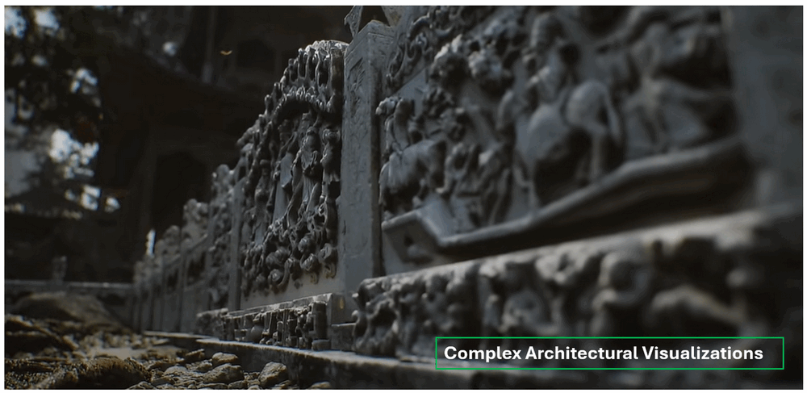

# New Ureal Engine 5 and Nvidia Technology used in game [Black Myth: Wukong]

In this article we want to share the what we learn the new Ureal Engine 5 and Nvidia GPU technology which used in the popular 3A computer game Black Myth: Wukong to improve the Game graphics quality. We use the Interview article of Game Science Interactive Technology, the Geekerwan's experiment and the Nvidia GTX40xx office Black Myth: Wukong introduction as reference. As I am not a game development expert, our view may from the point of a "software engineer" and if there is any mistake, many thanks if you can point out and give some comment. The technical we share will includes 5 parts, we will use the game's picture to show how the technology improve the Game graphics quality.

- Unreal engine 5 Niagara particle system 
- Unreal Engine 5 Nanite Virtualized Geometry Technology
- Lumen Global Illumination and Reflections

**Table of Contents**

[TOC]

------

### Unreal engine 5 Niagara particle system 

The Niagara particle system in Unreal Engine 5 is a powerful and flexible tool for creating real-time visual effects, ranging from simple particles like smoke and fire to complex simulations such as fluid dynamics and advanced environmental effects. It is the successor to the older Cascade particle system, offering more control, scalability, and performance. 

In computer game, the different use can observe is the particles now has physical interaction with the model and environment. For example in the scenario when the wind blow snow pass a character (the monkey in Black Myth: Wukong), for old cascade particle system, the wind will follow the physical effect simulation to by pass the model, but the particle effect (the snow) will follow the pre-config trajectory to pass through the model directly if the developer don't set the special configure effect moving route. But in the Niagara particle system, the particle has the physical “interact”  with other module or even materials.  as shown below:

The Snow particle effect trajectory will “interact” with the module, some snow follow the wind trajectory, some snow goes higher some snow stick on the model

The key feature includes:

- **Node-Based Workflow**: Niagara uses a node-based interface, allowing artists and developers to build complex effects visually without deep programming knowledge. This workflow is intuitive and modular, making it easier to create and modify effects.
- **Customizable Emitters and Particles**: Niagara allows for a high degree of customization, enabling users to control various properties of particles, such as their shape, size, velocity, color, and lifetime. You can create emitters that spawn particles under specific conditions or in response to gameplay events.
- **Data-Driven Simulations**: Niagara supports data-driven simulations, meaning you can use data from various sources, such as physics simulations or external data files, to drive the behavior of particles. This allows for the creation of realistic and dynamic effects.

**Example Use Cases in  [Black Myth: Wukong]**

In the game we can see how the key feature are applied: 

**Dynamic Environmental Effects**: Niagara can be used to create weather systems like rain, snow, and fog that interact with the environment and characters, enhancing the immersive experience.

**Magic and Spell Effects**: In fantasy games, Niagara can generate visually stunning spell effects with intricate patterns, glowing lights, and dynamic animations.

**Explosions and Debris**: For action sequences, Niagara is ideal for creating realistic explosions, with particles simulating debris, fire, and smoke that behave according to the laws of physics.

**Fluid Simulations**: Niagara can simulate fluids like water or lava, complete with waves, splashes, and flowing dynamics that interact with other objects in the scene.

------

### Unreal Engine 5 Nanite Virtualized Geometry 

Nanite Virtualized Geometry in Unreal Engine 5 is a groundbreaking technology that revolutionizes how detailed 3D models are rendered in real-time. Nanite allows developers to create and display incredibly complex scenes with billions of polygons without worrying about performance issues like draw calls or polygon budgets.

- **Automatic Level of Detail (LOD)**: Nanite automatically adjusts the level of detail based on the camera's distance to objects. This means that high-detail models can be used throughout a scene without manually creating multiple LODs. The system dynamically streams in the appropriate amount of detail, ensuring optimal performance. as shown in the below example: 

Without Automatic Level of Detail, the developers need to build 4 different model manually. With UE5 Nanite automatically LOD, the engine will auto generate many different LOD based on the environment, camera view distance and convert them smoothly 

- **Massive Polygon Counts**: Nanite enables the use of assets with massive polygon counts, such as those created from photogrammetry or high-detail sculpting software. This allows for an unprecedented level of detail in game environments, characters, and objects.
- **Efficient Rendering**: By virtualizing geometry, Nanite efficiently handles the rendering of large numbers of triangles, optimizing memory and processing power. This makes it possible to achieve film-quality visuals in real-time without the need for traditional optimization techniques.
- **No Need for Baking or Normal Maps**: With Nanite, developers can use high-resolution assets directly, eliminating the need for baking normal maps or other traditional methods used to simulate detail on low-poly models. This streamlines the workflow and reduces the time spent on asset preparation.
- **Scalable Performance**: Nanite is designed to scale with different hardware capabilities, ensuring that games and applications can take advantage of the technology on both high-end and lower-end devices

**Example Use Cases in  [Black Myth: Wukong]**

In the game we can see how the key feature are applied: 

**Photorealistic Environments**: Nanite is ideal for creating photorealistic game environments with a high level of detail, such as dense forests, urban landscapes, or ancient ruins, where every object, down to the smallest pebble, is rendered with precision. In the game, the development team use the Nanite technology to rebuild the Dazu Rock Carvings in Chong Qing China, the compare between the game and the real world photo is shown below:

**Complex Architectural Visualizations**: In architectural visualization, Nanite allows for the accurate rendering of detailed building models and interiors, providing clients with an immersive experience that closely mirrors the final construction. In the game you can find that the Black Myth: Wukong graphic card memory will be much lower than other 3D game with same Architectural complex level: 

Nanite Virtualized Geometry is a game-changer for artists and developers, enabling the creation of stunningly detailed worlds without compromising performance, paving the way for the next generation of real-time 3D graphics.