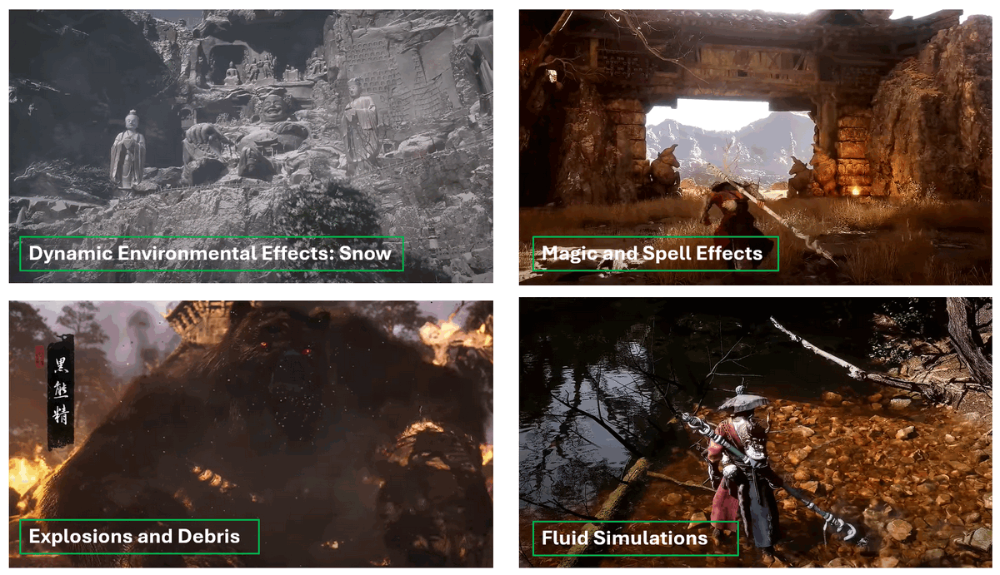

# New Ureal Engine 5 and Nvidia Technology used in game [Black Myth: Wukong]

In this article we want to share the what we learn the new Ureal Engine 5 and Nvidia GPU technology which used in the popular 3A computer game Black Myth: Wukong to improve the Game graphics quality. We use the Interview article of Game Science Interactive Technology, the Geekerwan's experiment and the Nvidia GTX40xx office Black Myth: Wukong introduction as reference. As I am not a game development expert, our view may from the point of a "software engineer" and if there is any mistake, many thanks if you can point out and give some comment. The technical we share will includes 5 parts, we will use the game's picture to show how the technology improve the Game graphics quality.

- Unreal engine 5 Niagara particle system 
- Unreal Engine 5 Nanite Virtualized Geometry Technology
- Unreal Engine 5 Lumen Global Illumination and Reflections
- Nvidia RTX40 Deep Learning Super Sampling technology

We will summarize the key features of these new technology and compare with Black Myth: Wukong's game picture to explain the advantage of these technology compare with the old solution and how these technology are applied in the game. 

**Table of Contents**

[TOC]

------

### Unreal engine 5 Niagara particle system 

The Niagara particle system in Unreal Engine 5 is a powerful and flexible tool for creating real-time visual effects, ranging from simple particles like smoke and fire to complex simulations such as fluid dynamics and advanced environmental effects. It is the successor to the older Cascade particle system, offering more control, scalability, and performance. 

In computer game, the different use can observe is the particles now has physical interaction with the model and environment. For example in the scenario when the wind blow snow pass a character (the monkey in Black Myth: Wukong), for old cascade particle system, the wind will follow the physical effect simulation to by pass the model, but the particle effect (the snow) will follow the pre-config trajectory to pass through the model directly if the developer don't set the special configure effect moving route. But in the Niagara particle system, the particle has the physical “interact”  with other module or even materials.  as shown below:

The Snow particle effect trajectory will “interact” with the module, some snow follow the wind trajectory, some snow goes higher some snow stick on the model

The key feature includes:

- **Node-Based Workflow**: Niagara uses a node-based interface, allowing artists and developers to build complex effects visually without deep programming knowledge. This workflow is intuitive and modular, making it easier to create and modify effects.
- **Customizable Emitters and Particles**: Niagara allows for a high degree of customization, enabling users to control various properties of particles, such as their shape, size, velocity, color, and lifetime. You can create emitters that spawn particles under specific conditions or in response to gameplay events.
- **Data-Driven Simulations**: Niagara supports data-driven simulations, meaning you can use data from various sources, such as physics simulations or external data files, to drive the behavior of particles. This allows for the creation of realistic and dynamic effects.

**Example Use Cases in  [Black Myth: Wukong]**

In the game we can see how the key feature are applied: 

- **Dynamic Environmental Effects**: Niagara can be used to create weather systems like rain, snow, and fog that interact with the environment and characters, enhancing the immersive experience.
- **Magic and Spell Effects**: In fantasy games, Niagara can generate visually stunning spell effects with intricate patterns, glowing lights, and dynamic animations.

- **Explosions and Debris**: For action sequences, Niagara is ideal for creating realistic explosions, with particles simulating debris, fire, and smoke that behave according to the laws of physics.
- **Fluid Simulations**: Niagara can simulate fluids like water or lava, complete with waves, splashes, and flowing dynamics that interact with other objects in the scene.

------

### Unreal Engine 5 Nanite Virtualized Geometry 

Nanite Virtualized Geometry in Unreal Engine 5 is a groundbreaking technology that revolutionizes how detailed 3D models are rendered in real-time. Nanite allows developers to create and display incredibly complex scenes with billions of polygons without worrying about performance issues like draw calls or polygon budgets.

- **Automatic Level of Detail (LOD)**: Nanite automatically adjusts the level of detail based on the camera's distance to objects. This means that high-detail models can be used throughout a scene without manually creating multiple LODs. The system dynamically streams in the appropriate amount of detail, ensuring optimal performance. as shown in the below example: 

Without Automatic Level of Detail, the developers need to build 4 different model manually. With UE5 Nanite automatically LOD, the engine will auto generate many different LOD based on the environment, camera view distance and convert them smoothly 

- **Massive Polygon Counts**: Nanite enables the use of assets with massive polygon counts, such as those created from photogrammetry or high-detail sculpting software. This allows for an unprecedented level of detail in game environments, characters, and objects.
- **Efficient Rendering**: By virtualizing geometry, Nanite efficiently handles the rendering of large numbers of triangles, optimizing memory and processing power. This makes it possible to achieve film-quality visuals in real-time without the need for traditional optimization techniques.
- **No Need for Baking or Normal Maps**: With Nanite, developers can use high-resolution assets directly, eliminating the need for baking normal maps or other traditional methods used to simulate detail on low-poly models. This streamlines the workflow and reduces the time spent on asset preparation.
- **Scalable Performance**: Nanite is designed to scale with different hardware capabilities, ensuring that games and applications can take advantage of the technology on both high-end and lower-end devices

**Example Use Cases in  [Black Myth: Wukong]**

In the game we can see how the key feature are applied: 

**Photorealistic Environments**: Nanite is ideal for creating photorealistic game environments with a high level of detail, such as dense forests, urban landscapes, or ancient ruins, where every object, down to the smallest pebble, is rendered with precision. In the game, the development team use the Nanite technology to rebuild the Dazu Rock Carvings in Chong Qing China, the compare between the game and the real world photo is shown below:

**Complex Architectural Visualizations**: In architectural visualization, Nanite allows for the accurate rendering of detailed building models and interiors, providing clients with an immersive experience that closely mirrors the final construction. In the game you can find that the Black Myth: Wukong graphic card memory will be much lower than other 3D game with same Architectural complex level: 

**High-Detail Characters and Creatures**: Game developers can use Nanite to create highly detailed characters and creatures, complete with intricate textures and geometry, enhancing the visual fidelity of their games.

Nanite Virtualized Geometry is a game-changer for artists and developers, enabling the creation of stunningly detailed worlds without compromising performance, paving the way for the next generation of real-time 3D graphics.

------

### Unreal Engine 5 Lumen Global Illumination and Reflections

Lumen in Unreal Engine 5 is a dynamic global illumination and reflections system that transforms how light interacts with environments in real-time. It allows developers to create realistic lighting and reflections without the need for pre-baked lightmaps or complex setups. Compare with old Illumination solution which only calculates the light reflection once , the Lumen will calculate the reflections multiple times based on the user's GPU performance. (as shown in the example below)

The key feature of Lumen includes:

- **Dynamic Global Illumination**: Lumen provides fully dynamic global illumination, meaning that light bounces off surfaces and illuminates surrounding areas in real-time. This allows for realistic lighting scenarios where changes in the environment, such as moving objects or varying light sources, are accurately reflected in the lighting.
- **Dynamic Reflections**: Lumen handles reflections dynamically, capturing the environment and reflecting it in surfaces like water, glass, or shiny metals. These reflections update in real-time, ensuring they are accurate to the current state of the scene.
- **No Pre-Baking Required**: Unlike traditional global illumination methods, Lumen does not require pre-baked lightmaps or reflection captures. This drastically reduces the time spent on lighting setups and allows for more iterative and creative workflows.
- **Supports Large-Scale Environments**: Lumen is designed to handle large, open-world environments effectively. It scales with the size of the environment, ensuring that lighting remains consistent and realistic across vast distances.
- **Interactive Lighting**: With Lumen, light sources can be added, moved, or changed dynamically within the scene, and the lighting and reflections will adjust accordingly. This makes it ideal for creating interactive and immersive experiences where lighting plays a crucial role.

**Example Use Cases in  [Black Myth: Wukong]**

In the game we can see how the key feature are applied: 

- **Day-Night Cycles**: Lumen allows developers to create seamless day-night cycles with changing sunlight and moonlight that naturally illuminate and shade the environment as time passes. The light effect of sun and moon is shown below:

  

- **Interior Lighting**: In architectural visualization or interior design, Lumen can simulate how natural light enters through windows and interacts with various materials, giving a realistic preview of how spaces will look under different lighting conditions.

- **Reflective Surfaces in Games**: Games that feature highly reflective surfaces, such as water bodies, mirrors, or polished floors, can use Lumen to achieve realistic and dynamic reflections that enhance immersion.

The compare between lower Lumen Global Illumination and higher lumen Lumen Global Illumination level is shown below 

Lumen Global Illumination and Reflections make it possible to achieve high-quality, realistic lighting in real-time, opening up new possibilities for interactive storytelling, immersive environments, and more efficient game development workflows.

------

### Nvidia RTX40 Deep Learning Super Sampling technology

Nvidia Deep Learning Super Sampling (DLSS) is an AI-powered technology designed to boost the performance of graphics rendering in video games while maintaining high visual quality. DLSS leverages the power of neural networks and deep learning to upscale lower-resolution images to higher resolutions, allowing games to run smoothly at higher frame rates without sacrificing detail.

**Key Features:**

1. **AI-Powered Upscaling**: DLSS uses deep learning algorithms to analyze lower-resolution frames and generate high-resolution images. This process allows the game to render at a lower resolution, reducing the workload on the GPU, while still delivering a final image that looks as if it were rendered at a much higher resolution.
2. **Performance Gains**: By rendering at a lower resolution and upscaling to a higher one, DLSS significantly improves game performance, allowing for higher frame rates, even in demanding games with complex graphics.
3. **Image Quality**: Despite the performance boost, DLSS maintains high image quality, often producing visuals that are comparable to or even better than native resolution rendering. The AI algorithm can fill in details and reduce artifacts, such as jagged edges, that are common in traditional upscaling methods.
4. **Multiple Quality Modes**: DLSS typically offers several modes, such as Performance, Balanced, and Quality, allowing users to choose between higher frame rates or better image quality based on their preference and hardware capabilities.
5. **Real-Time Ray Tracing Compatibility**: DLSS works well with real-time ray tracing, a technology that simulates realistic lighting and reflections. By using DLSS in conjunction with ray tracing, players can enjoy visually stunning games without a significant performance hit.

**Example Use Cases in  [Black Myth: Wukong]**

- **4K Gaming**: DLSS allows gamers to experience 4K resolution gaming on hardware that might not otherwise be capable of rendering games at such high resolutions natively, delivering a smooth and immersive experience.
- **Ray Tracing-Enhanced Games**: in Black Myth: Wukong if you turn on the Ray Tracing configuration, with the DLSS, it allows you to run at higher frame rates with ray tracing enabled, preserving both performance and visual fidelity.

Reference: https://www.nvidia.com/en-sg/geforce/campaigns/black-myth-wukong-bundle/

Nvidia DLSS is a key innovation in modern gaming, enabling stunning graphics and smooth gameplay on a wide range of hardware, making it a valuable tool for developers and players alike.