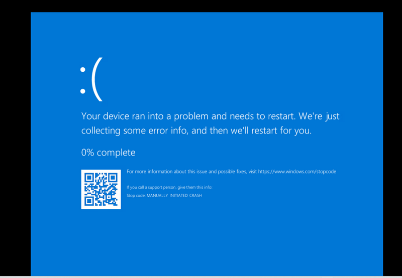

# Reverse Engineering to Get the Malware Source Code via Memory Dump in DFIR

This article will introduce the detailed steps about how to parse a complied windows malware exe file (coded by python) from the windows memory dump file then decompile the data to get the source code for a DFIR (Digital Forensics and Incident Response) cyber exercise. The article includes below 5 section.

1. Create a python windows execution file. 
2. Configure the windows for memory dump collection. 
3. Collect the memory dump file. 
4. Parse the memory dump to get the executed malware data. 
5. Decompile the malware data back to sour


------

### Introduction

The Digital Forensics and Incident Response is a very wide topic in cyber execise/event, this article is included in the Memory forensics topic in DFIR (as shown below). Before we start, we need to introduce some background knowledge about the DFIR and the tools we used. 


#### Background knowledge about the DFIR

**Digital forensics and incident response (DFIR)** is a field within cybersecurity that focuses on the identification, investigation, and remediation of cyberattacks.

DFIR has two main components:

- **Digital forensics:** A subset of forensic science that examines system data, user activity, and other pieces of digital evidence to determine if an attack is in progress and who may be behind the activity.
- **Incident response:** The overarching process that an organization will follow in order to prepare for, detect, contain, and recover from a [data breach](https://www.crowdstrike.com/en-us/cybersecurity-101/cyberattacks/data-breach/).

The [Digital forensics](https://www.crowdstrike.com/en-us/cybersecurity-101/data-protection/digital-forensics/) provides the necessary information and evidence that the computer emergency response team (CERT) or computer security incident response team (CSIRT) needs to respond to a security incident. Digital forensics may include: File system forensics, Memory forensics, Network forensics and Log analysis.

> Reference Llink: https://www.crowdstrike.com/en-us/cybersecurity-101/exposure-management/digital-forensics-and-incident-response-dfir/#:~:text=Digital%20forensics%20and%20incident%20response%20(DFIR)%20is%20a%20field%20within,investigation%2C%20and%20remediation%20of%20cyberattacks.


#### Tools used in the Project

In this project, we use a Window11 machine to create the exe file, one Windows10 VM to collect the memory dump and one Ubuntu machine to decompile the to the source code. There are several tools we will be used in the project.

**PyInstaller** : Tool to compile a python program to and Windows executable program. 


------

### Create a python windows execution file

**Host machine** : Windows-11

**Tool** : PyInstaller https://pyinstaller.org/

In the DFIR memory forensics, we will need to create an executable program to simulate the malware's activities running on the data collect machine. If you use python to create the program we can use the PyInstaller to compile your python program to one file. In this step we try to create an exe file of the backdoor trojan malware simulator program: https://github.com/LiuYuancheng/Python_Malwares_Repo/tree/main/src/backdoorTrojan

Step 1 :  Install the pyInstaller in host machine with pip

```
pip install -U pyinstaller
```

Step 2 :  Compile the backdoor trojan malware to one exe file with the pyinstaller "onefile" parameter

```
pyinstaller --onefile .\backdoorTrojan.py
```

After the progress finished, we will get the one file executable in the `dist` folder as shown below:


Then we rename the backdoor trojan as testInstaller.exe and copy to the target VM.


------

### Configure the windows for memory dump collection

**Host machine** : Windows-10

**Tool** : N.A 

A memory dump is taking all the information in your device’s working memory (RAM) and creating a copy of it in your computer's hard drive. This process happens automatically when a computer crashes and right before the power turns off. To collect the memory dump file in a windows VM, the memory file will be nearly same size of your memory, we need to make sure the VM disk has enough space (Assume your VM RAM config is 16GB, then we need to make sure there will be 16GB free space in the VM disk) . 

Step 1 : Enable the Windows memory dump setting

Follow below steps to enable the windows memory dump setting

1. In **Control Panel**, select **System and Security** > **System**.
2. Select **Advanced system settings**, and then select the **Advanced** tab.
3. In the **Startup and Recovery** area, select **Settings**.
4. Make sure that **Kernel memory dump** or **Complete memory dump** is selected under **Writing Debugging Information**.
5. Restart the computer.

As shown below: 


Step 2 Enable the parameters in the Registry 

Open the registry editor with Run `regedit`


1. In Registry Editor, locate the following registry subkey:

   `HKEY_LOCAL_MACHINE\SYSTEM\CurrentControlSet\Control\CrashControl`

2. Right-click **CrashControl**, point to **New**, and then select **DWORD Value**.

3. Type *NMICrashDump*, and then press Enter.

4. Right-click **NMICrashDump**, and then select **Modify**.

5. In the **Value data** box, type *1*, and then select **OK**.

Then make sure the `alwayskeepmemoryDump` parameter is set to 1 as shown below:


------

### Collect the memory dump file. 

**Host machine** : Windows-10

**Tool** : N.A 

After finished the configuration, we can start to run the malware and collect the memory dump file.

Then we start to run our backdoortrojan malware simulator (testInstaller.exe), when the program is running,  we need to *create a memory dump by "blue screen" kernel crash"  : 

To trigger a memory dump on a virtual machine using the keyboard, press and hold the "Ctrl" key while pressing the "Scroll Lock" (for some keyboard you need to hold the function key "Fn" to enable the Scroll Lock ) key twice; this keyboard shortcut will typically force a crash and generate a memory dump file on the VM. 

Key points to remember:

- **Shortcut:** 

  Ctrl + Scroll Lock + Scroll Lock 

- **Functionality:** This shortcut sends a specific signal to the virtual machine, essentially simulating a hardware error, which prompts the operating system to create a memory dump file. 

Then when you press the Scroll Lock twice, you will see the system crash as shown below:



Don't do any thing until the system reach 100% and restart itself, then you will find the dump file `test.dmp` in the "`C:\dump`" folder as shown below:


------

### Parse the memory dump to get the executed malware data. 

**Host machine** : Ubuntu

**Tool** : volatility3, https://github.com/volatilityfoundation/volatility3

Now we get the memory dump file, we can try to use the volatility3 to get all the data from the memory.

Step 1 :  Install the volatility3in host machine with pip

```
pip install volatility3
```

Then 