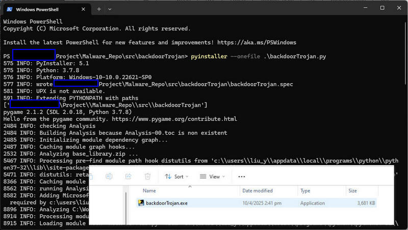

# Reverse Engineering to Get the Python Malware Source Code via DFIR Memory Dump

In the world of cybersecurity, understanding how to dissect and analyze malware and malicious code is a critical skill—especially during Digital Forensics and Incident Response (DFIR) operations. One common scenario involves encountering malicious executables written in Python but compiled into Windows executable (EXE) files. In such cases, analysts often rely on memory dumps to retrieve and reverse engineer the malware’s behavior and underlying code. This article will introduce the detailed steps about how to extract a complied windows malware exe file (coded by python) from the windows memory dump data, then decompile the data to get the Python source code. (As shown in the below project workflow diagram)


`Figure-00 Project workflow diagram, version v_0.0.1 (2025)`

The guide is structured into five key sections:

1. **Malware Creation** : Creating a Python-based malware simulation Windows-OS executable program.
2. **Victim Configuration** : Configuring the malware victim node system for memory dump data collection.
3. **Evidence Collection** : Capturing the memory dump during malware execution.
4. **Data Extraction** : Extracting malware data/files from the memory dump.
5. **Reverse Engineering** : Decompiling the extracted data back into readable python source code.


We will also introduce about the related tools used by finishing each section, so if you're a DFIR blue team practitioner or a cybersecurity enthusiast you can also used them for memory forensics and Python malware analysis.

```python
# Author:      Yuancheng Liu
# Created:     2025/04/06
# version:     v_0.0.1
# Copyright:   Copyright (c) 2025 LiuYuancheng
# License:     MIT License
```

**Table of Contents** 

[TOC]

- [Reverse Engineering to Get the Python Malware Source Code via DFIR Memory Dump](#reverse-engineering-to-get-the-python-malware-source-code-via-dfir-memory-dump)
    + [Introduction](#introduction)
      - [Background Knowledge about DFIR](#background-knowledge-about-dfir)
      - [Tools Used in This Project](#tools-used-in-this-project)
    + [Creating a Python-based Windows Executable](#creating-a-python-based-windows-executable)
    + [Configuring Windows for Memory Dump Collection](#configuring-windows-for-memory-dump-collection)
    + [Collecting the Memory Dump File](#collecting-the-memory-dump-file)
    + [Parsing the Memory Dump to Extract Executed Malware Data](#parsing-the-memory-dump-to-extract-executed-malware-data)
    + [Decompile the malware data back to source code](#decompile-the-malware-data-back-to-source-code)
    + [Conclusion](#conclusion)

------

### Introduction

The Digital Forensics and Incident Response (DFIR) is a cornerstone of modern cybersecurity, playing a critical role in identifying, investigating, and mitigating cyberattacks. Within DFIR, **memory forensics** has become an essential technique, allowing analysts to extract volatile evidence from system memory that might not be present on disk or network traffic. As shown in the below DFIR contents diagram. 


`Figure-01 Digital Forensics and Incident Response (DFIR) domain overview diagram, version v_0.0.1 (2025)`

Before diving into the hands-on steps, we provide essential background knowledge about DFIR and introduce the tools utilized in this project. This article falls under the *Memory Forensics* domain of DFIR and focuses on a practical reverse engineering scenario commonly used in cyber exercises and training events. Specifically, we demonstrate how to extract and recover the source code of a Python-based malware sample that was compiled into a Windows executable, using only a memory dump captured during its execution. 

#### Background Knowledge about DFIR

**Digital Forensics and Incident Response (DFIR)** is a cybersecurity discipline dedicated to understanding, responding to, and recovering from security incidents. It includes two main areas:

- **Digital forensics:** Involves the analysis of system data, user behavior, and digital evidence to uncover how an attack happened and who may be responsible.
- **Incident response:** Encompasses the strategies and processes organizations follow to detect, contain, and remediate threats in real time.

Digital forensics branches into multiple areas, including file system forensics, network forensics, log analysis, and **memory forensics**, which is the core focus of this article.

> Reference Link: https://www.crowdstrike.com/en-us/cybersecurity-101/exposure-management/digital-forensics-and-incident-response-dfir/#:~:text=Digital%20forensics%20and%20incident%20response%20(DFIR)%20is%20a%20field%20within,investigation%2C%20and%20remediation%20of%20cyberattacks.

#### Tools Used in This Project

This project utilizes multiple tools across different environments:

- **PyInstaller** (Windows): Used to compile Python scripts into standalone Windows executable files.
- **Volatility3** (Ubuntu): A powerful framework for memory forensics, used here to analyze memory dumps and extract malware-related data.
- **uncompyle6** (Ubuntu/Windows): A de-compilation tool that converts Python bytecode (.pyc files) back into readable source code.

We use a Windows-11 machine to generate the malware EXE, a Windows-10 virtual machine to execute and capture memory dumps, and an Ubuntu-22.04 machine to perform analysis and reverse engineering.

With this foundation in place, we’ll now walk through each step of the process—from compiling the malware to recovering its source code from memory.


------

### Creating a Python-based Windows Executable

**Host machine** : Windows-11

**Tool** : PyInstaller https://pyinstaller.org/

As part of this DFIR memory forensics exercise, we need to simulate the behavior of malware running on a target victim system. To do this, we'll create a Windows-OS executable from a Python-based malware script using **PyInstaller**, a tool that compiles Python programs into standalone executables.

In this section, we will generate an `.exe` file for a simulated backdoor trojan malware sample sourced from the following GitHub repository : https://github.com/LiuYuancheng/Python_Malwares_Repo/tree/main/src/backdoorTrojan

**Step 1: Install PyInstaller**

Use `pip` to install PyInstaller on the host Windows 11 machine:

```
pip install -U pyinstaller
```

**Step 2: Compile the Python Script into an Executable**

Navigate to the directory containing `backdoorTrojan.py`, then run the following command to generate a single executable file using the `--onefile` flag :

```
pyinstaller --onefile .\backdoorTrojan.py
```

Once the process completes, the compiled executable `backdoorTrojan.exe` will be located in the `dist` folder, as shown below:



`Figure-02 Python malware code compilation, version v_0.0.1 (2025)`

Then we rename the output file as a software installation program (e.g., to `testInstaller.exe`) and copy it to the target virtual machine where the memory dump will be collected.


------

### Configuring Windows for Memory Dump Collection

**Target Machine:** Windows 10

**Tool:** N/A (Built-in Windows settings and Registry Editor)

A **memory dump** captures the contents of a system’s RAM and saves it to disk—essentially creating a snapshot of everything running in memory at a given time. While memory dumps are often generated automatically during system crashes, they can also be configured to assist in forensic analysis, such as during a DFIR exercise.

Before collecting a memory dump on the Windows 10 virtual machine, ensure there is enough free disk space. The size of the memory dump will roughly match the amount of RAM allocated to the VM. For example, if your VM has 16 GB of RAM, make sure at least 16 GB of free disk space is available.

**Step 1: Enable Windows Memory Dump Settings**

To configure Windows to generate a memory dump:

1. Open **Control Panel** > **System and Security** > **System**.
2. Click **Advanced system settings** in the sidebar.
3. Under the **Advanced** tab, go to the **Startup and Recovery** section and click **Settings**.
4. Make sure that **Kernel memory dump** or **Complete memory dump** is selected under **Writing Debugging Information**.
5. Click **OK** and restart the machine to apply the changes.

As shown below : 


`Figure-03 Enable Windows_OS System Failure Memory Dump Settings, version v_0.0.1 (2025)`

**Step 2: Enable Memory Dump Parameters via Registry Editor**

Press `Win + R`, type `regedit`, and press Enter to open the **Registry Editor**.


`Figure-04 Start the registry editor, version v_0.0.1 (2025)`

To ensure that memory dumps are always preserved, modify the Windows registry as follows:

1. Navigate to the following key:
   `HKEY_LOCAL_MACHINE\SYSTEM\CurrentControlSet\Control\CrashControl`
2. Right-click on **CrashControl**, select **New** > **DWORD (32-bit) Value**.
3. Name the new entry `NMICrashDump` and set its value to `1` by: Right-clicking `NMICrashDump` > Selecting **Modify** > Entering `1` in the **Value data** field and clicking **OK**
4. Ensure the `AlwaysKeepMemoryDump` key is also set to `1`. (As shown below)


`Figure-05 Setup the CrashControl config in registry editor, version v_0.0.1 (2025)`

These settings ensure that the memory dump file is preserved even after system restarts, making it available for later analysis with forensic tools.

>  Reference: https://learn.microsoft.com/en-us/troubleshoot/windows-client/performance/generate-a-kernel-or-complete-crash-dump


------

### Collecting the Memory Dump File

**Target Machine:** Windows 10

**Tool:** N/A (uses built-in system behavior)

Once the system is properly configured for memory dump generation, we can proceed to run the malware and trigger a memory dump for forensic analysis.

Start by executing the simulated malware (`testInstaller.exe`) on the target Windows 10 virtual machine. While the program is running, we will manually trigger a system crash—also known as a **"blue screen" kernel crash**—to force the operating system to generate a memory dump file.

**Step 1 : Triggering the Memory Dump via Keyboard Shortcut**

To initiate the crash and dump process:

1. Hold down the `Ctrl` key.
2. Press the `Scroll Lock` key **twice**.

> ⚠️ *Note:* On some keyboards, especially on laptops, you may need to press the `Fn` (Function) key to access `Scroll Lock`.

**Keyboard Shortcut:**
`Ctrl + Scroll Lock + Scroll Lock`

This combination simulates a non-maskable interrupt (NMI), which causes the system to crash and generate a memory dump file as configured in the previous step.

**Step 2: Confirm the  Memory Dump File Created**

Once triggered, the system will crash and display a blue screen (BSOD) with a progress indicator showing memory being dumped to disk as shown below:


`Figure-06 System failure screen shot, version v_0.0.1 (2025)`

Wait until the dump process reaches **100%** and the system automatically restarts. Do **not** interrupt the process. After rebooting, navigate to the `C:\dump` directory (based on the configuration you set in the previous section). You should now see the generated memory dump file (e.g., `test.dmp`) as shown below:


`Figure-07 Windows system memory dump file, version v_0.0.1 (2025)`

> Reference: https://techcommunity.microsoft.com/blog/coreinfrastructureandsecurityblog/how-to-force-a-diagnostic-memory-dump-when-a-computer-hangs/257809


------

### Parsing the Memory Dump to Extract Executed Malware Data 

**Host Machine:** Ubuntu 22.04

**Tool** : volatility3, https://github.com/volatilityfoundation/volatility3

With the memory dump file (`test.dmp`) now available, the next step is to analyze it using **Volatility3**, a powerful memory forensics framework. Our goal is to identify the malware process and extract its associated memory data for further analysis.

**Step 1: Install Volatility3**

Install Volatility3 on your Ubuntu machine using `pip`:

```
pip install volatility3
```
**Step 2: Identify the Malware Process**

Once installed, use the `vol` command to list all running processes from the memory dump:

```
vol -f test.dmp windows.pslist
```
This command outputs a list of active processes captured at the time of the dump. Looking for the name of your malware executable (in this case, `testInstaller.exe`) to identify its process ID (PID) as shown below:


`Figure-08 use the volatility3 to get the process try from the memory dump, version v_0.0.1 (2025)`

In the example above process tree, as we renamed the backdoor trojan to `testInstaller` we can see two related processes:

- PID **3968**
- PID **8276**

Since the Parent Process ID (PPID) of process 8276 is 3968, we can infer that 3968 is the initial process that launched the malware.

**Step 3: Extract the Malware Memory Section**

Now that we've identified the correct process (PID 3968), we can extract its memory data to files using Volatility3’s `dumpfiles` plugin:

```
vol -f test.dmp -o output  windows.dumpfiles --pid 3968
```
The memory regions associated with the selected process are extracted into the `output/` directory. Among the extracted files, locate the one similar to  `file.0xd084eb19a620.0xd084eb13d150.DataSectionObject.testInstaller.exe.dat`  as shown below:


`Figure-08 Use the volatility3 to extract program data from memory dump, version v_0.0.1 (2025)`

This file contains the in-memory representation of the executable—this is the critical data we’ll use in the next step to recover the original Python source code.


------

### Decompile the malware data back to source code 
**Host machine** : Ubuntu 20.04 or Windows

**Tool** : 

- pyinstxtractor, [https://github.com/volatilityfoundation/volatility3](https://github.com/extremecoders-re/pyinstxtractor)

- uncompyle6, https://pypi.org/project/uncompyle6/

After extracting the executable memory data from the memory dump, the next step is to reverse-engineer the binary back into Python source code.

**Step 1: Extract `.pyc` Files Using `pyinstxtractor`**

Start by downloading `pyinstxtractor.py` from its GitHub repository. Place the previously extracted memory data file (`file.0xd084eb19a620.0xd084eb13d150.DataSectionObject.testInstaller.exe.dat`) in the same directory as the script.

Run the following command to extract the embedded Python bytecode:

```
python3 pyinstxtractor.py file.0xd084eb19a620.0xd084eb13d150.DataSectionObject.testInstaller.exe.dat
```

After execution, you'll see output like this:


`Figure-09 Extract .pyc Files Using pyinstxtractor from memory dump, version v_0.0.1 (2025)`

The extractor also identifies the Python version used to compile the executable—in this case, Python **3.7**.

⚠️ **Important:** If your current environment is not using the same Python version (3.7), the `PYZ-00.pyz_extracted/` directory will remain empty. To avoid this, create and activate a Python 3.7 virtual environment before extraction.


`Figure-10 Find the additional import library file from PYZ-00.pyz_extracted folder, version v_0.0.1 (2025)`


**Step 2: Decompile `.pyc` Files Using `uncompyle6`**

Once the extraction is successful, locate the main executable `.pyc` file from the output directory:

📷 Example of extracted `backdoorTrojan.pyc`:


`Figure-11 Find python pyc file from the result, version v_0.0.1 (2025)`

Use `uncompyle6` to decompile the `.pyc` file into readable Python source code:

```
uncompyle6 backdoorTrojan.pyc >> sourcode.txt
```
The decompiled code will be saved in `sourcecode.txt` and should resemble the original backdoor trojan Python script as shown below:


`Figure-12 decompile the pyc file to python source code, version v_0.0.1 (2025)`

Now you can now review and analyze the behavior of the malware simulator for your DFIR exercise.

**(Optional) Decompile Imported Libraries**

If you also want to analyze the imported Python modules bundled inside the PyInstaller archive:

1. Navigate to the `PYZ-00.pyz_extracted/` folder.
2. Use `uncompyle6` to decompile any `.pyc` files found there.

> ⚠️ Remember: If your host Python version doesn’t match the original compilation version (e.g., 3.7), this folder may remain empty or incomplete.


------

### Conclusion

In this article, we walked through a complete end-to-end DFIR workflow for recovering Python malware source code from a memory dump. Starting with the creation of a Python-based Windows executable, we demonstrated how to simulate malware execution, capture a memory dump, extract the in-memory data using Volatility3, and finally decompile the retrieved binary using tools like `pyinstxtractor` and `uncompyle6`.

This hands-on reverse engineering approach highlights the power of memory forensics in uncovering malicious behavior that may otherwise go undetected. By understanding these techniques, DFIR practitioners and cybersecurity enthusiasts can better analyze, respond to, and defend against Python-based malware threats in real-world environments.

Whether for research, training, or incident response, this process offers a practical and insightful way to deepen your malware analysis skills.


------

> last edit by LiuYuancheng (liu_yuan_cheng@hotmail.com) by 12/04/2025 if you have any problem, please send me a message. 


