# Deploying DeepSeek-R1 Locally with a Custom RAG Knowledge Data Base

**Project Design Purpose** : The primary goal of this article is to explore how to deploy DeepSeek-R1 an open-source large language model (LLM), and integrate it with a customized Retrieval-Augmented Generation (RAG) knowledge base on your local machine (PC/server). This setup enables the model to utilize domain-specific knowledge for expert-level responses while maintaining data privacy and customization flexibility. By doing so, users can enhance the model’s expertise in specific technical domains, enabling applications such as AI-powered support chatbots, private code generation, and industry-specific assistants. Most importantly, this setup allows users to keep proprietary data private, ensuring sensitive documents, licensed software, or non-public information remain secure while still benefiting from AI-powered insights.

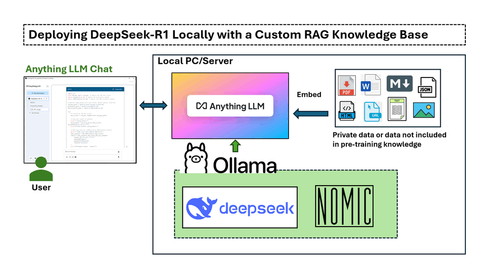

The implementation in this article covers four main sections :

- **Installing and running DeepSeek-R1 locally** on a Windows machine with an NVIDIA RTX 3060 GPU.
- **Setting up a RAG pipeline** using nomic-embed-text for vector-based text retrieval.
- **Deploying AnythingLLM** to integrate document-based AI responses.
- **Testing DeepSeek-R1 with and without RAG**, demonstrating its accuracy in responding to domain-specific queries.

```python
# Version:     v_0.0.1
# Created:     2025/02/06
# License:     MIT License
```

**Table of Contents**

[TOC]

- [Deploying DeepSeek-R1 Locally with a Custom RAG Knowledge Base](#deploying-deepseek-r1-locally-with-a-custom-rag-knowledge-base)
    + [Introduction](#introduction)
    + [Background Knowledge](#background-knowledge)
      - [DeepSeek-R1: A High-Performance Open-Source LLM](#deepseek-r1--a-high-performance-open-source-llm)
      - [Understanding Retrieval-Augmented Generation (RAG)](#understanding-retrieval-augmented-generation--rag-)
    + [Step 1 : Deploy DeepSeek-R1 Model on Your Local Machine](#step-1---deploy-deepseek-r1-model-on-your-local-machine)
    + [Step 2 : Install nomic-embed-text](#step-2---install-nomic-embed-text)
    + [Step 3 : Install AnythingLLM and Deploy RAG](#step-3---install-anythingllm-and-deploy-rag)
    + [Step 4 : Load RAG Data and Start Testing](#step-4---load-rag-data-and-start-testing)
    + [Conclusion](#conclusion)
    + [Reference](#reference)

------

### Introduction

DeepSeek, a Chinese AI firm, is disrupting the industry with its low-cost, open source  large language models, challenging U.S. tech giants. It has shown high performance in mathematic, coding, English and Chinese Conversation. The DeepSeek-R1 model  is opensource ( MIT License ). This article will explore the detailed steps to deploy the DeepSeek-R1:7B LLM model on a Windows laptop with an NVIDIA RTX 3060 (12GB GPU) to create a customized AI-powered chatbot or a program code generator using knowledge database Retrieval-Augmented Generation (RAG) and do a simple comparison between the normal LLM answer and RAG answer.

- For the **AI customer service chatbot**, we want it to provide information based on company product documentation, making it a powerful tool for internal knowledge management and customer support.
- For the **AI program code generator**,, we want it to assist in software development by generating code snippets based on existing program APIs or importing functions from a customized library.

To implement this project, we will use four key tools:

- **Ollama** : A lightweight, extensible framework for building and running language models on the local machine. [> link](https://ollama.com/)
- **DeepSeek-R1** : A model trained via large-scale reinforcement learning (RL) without supervised fine-tuning (SFT) as a preliminary step, demonstrated remarkable performance on reasoning. [> link](https://github.com/deepseek-ai/DeepSeek-R1/tree/main)
- **nomic-embed-text** : An open-source text embedding model that converts text into numerical vectors, allowing computers to understand the semantic meaning of text by comparing its representation to others. [> link](https://ollama.com/library/nomic-embed-text)
- **AnythingLLM** : An open-source AI chatbot that allows users to chat with documents. It's designed to help businesses and organizations make their written documents more accessible. [> link](https://anythingllm.com/)

This approach significantly improves **AI-assisted decision-making, technical support, and software development** by ensuring that responses are **grounded in reliable, domain-specific information**.


------

### Background Knowledge 

#### DeepSeek-R1: A High-Performance Open-Source LLM

DeepSeek AI is pioneering a new era of reasoning-based large language models (LLMs) with its DeepSeek-R1 series, designed to push the boundaries of mathematical, coding, and logical reasoning capabilities. Unlike traditional LLMs that rely heavily on supervised fine-tuning (SFT), DeepSeek AI adopts a reinforcement learning (RL)-first approach, enabling models to naturally develop complex reasoning behaviors.

**Evolution of DeepSeek-R1 Models**

- DeepSeek-R1-Zero was the first-generation model trained purely through large-scale reinforcement learning (RL), allowing it to self-verify, reflect, and generate long chain-of-thoughts (CoT) without SFT. However, it faced challenges such as language mixing, readability issues, and repetitive outputs.
- DeepSeek-R1 improved upon this by incorporating cold-start data before RL training, resulting in a more refined and human-aligned model with performance comparable to OpenAI-o1 across various reasoning benchmarks.

Reference link : https://api-docs.deepseek.com/

#### Understanding Retrieval-Augmented Generation (RAG)

Retrieval-augmented generation is a technique for enhancing the accuracy and reliability of generative AI models with information from specific and relevant data sources. RAG enhances generative AI models by retrieving external data before generating responses, leading to more accurate, up-to-date, and context-aware answers. 

The work flow of RAS is shown below:

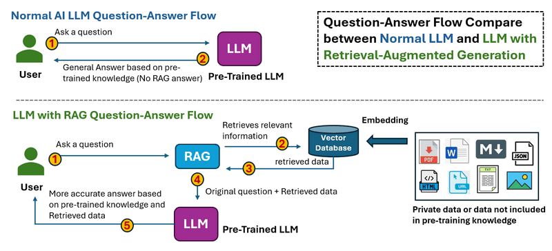

- In the **Normal LLM Question-Answer Flow** , when a user asks a question. Thee LLM processes the input and generates an answer **only based on its pre-trained knowledge**. There is no external data retrieval, meaning outdated or missing information cannot be corrected.
- In the **LLM with RAG Question-Answer Flow**, when a user asks a questions. The The system first retrieves relevant information from external sources (databases, documents, APIs, or the web). The retrieved data is fed into the LLM along with the original question, then the LLM generates an answer based on both pre-trained knowledge and retrieved data, leading to more accurate and up-to-date responses.

Reference link : https://blogs.nvidia.com/blog/what-is-retrieval-augmented-generation/


------

### Step 1 : Deploy DeepSeek-R1 Model on Your Local Machine

To set up the **DeepSeek-R1** model locally, you first need to install Ollama, a lightweight, extensible framework for running large language models on your machine. Then, you will download the appropriate DeepSeek-R1 model based on your hardware specifications.

**1.1 Install Ollama**

Download **Ollama** from the official website: https://ollama.com/download, and select the installation package for your operating system:

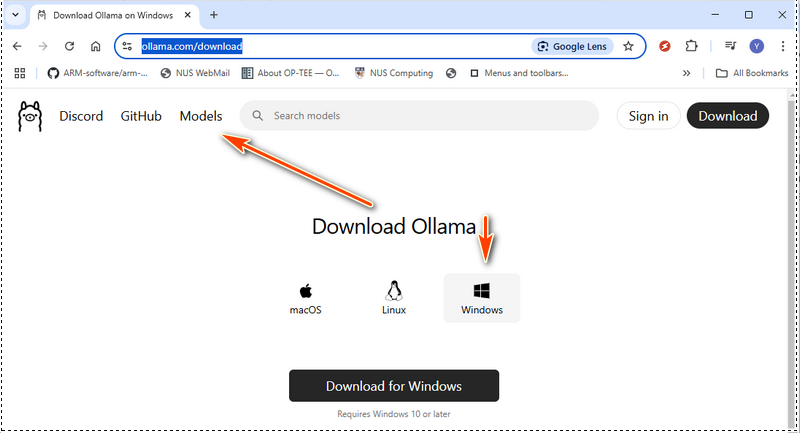

Once the installation is complete, verify that Ollama is properly installed by running the following command in a terminal:

```
ollama --version
```

If the version number shows, which means the Ollama is ready for use:

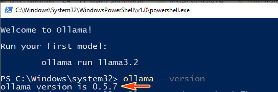

Next, start the Ollama service by running:

```
ollama serve
```

**1.2 Choose the Right DeepSeek-R1 Model**

DeepSeek-R1 offers models ranging from a compact 1.5 billion-parameter version to a massive 671 billion-parameter model. The model size you choose should match your GPU memory (VRAM) and system resources. In Ollama web, select models then search deepseek as shown below:


Below is a hardware requirement table to help you decide which model to deploy. If your hardware is below the recommended specs, you can still run a larger model by using hardware optimization tools like LMStudio (https://lmstudio.ai/), but this will increase processing time. DeepSeek-R1 Hardware Requirements : 

| Module Name      | Model Type Level | GPU VRAM                          | CPU                                                  | RAM         | Disk   |
| ---------------- | ---------------- | --------------------------------- | ---------------------------------------------------- | ----------- | ------ |
| deepseek-r1:1.5b | Accessible       | No dedicated GPU or VRAM required | CPU no older than 10 years                           | 8 GB        | 1.1 GB |
| deepseek-r1:7b   | Lightweight      | 8 GB of VRAM                      | Single CPU such as i5                                | 8 GB        | 4.7 GB |
| deepseek-r1:8b   | Lightweight      | 8 GB of VRAM                      | Single CPU such as i5, i7                            | 8 GB        | 4.9 GB |
| deepseek-r1:14b  | Mid-Range        | 12 - 16 GB of VRAM                | Single CPU (i7/i9) or dual CPU (Xeon Silver 4114 x2) | 16-32 GB    | 9.0 GB |
| deepseek-r1:32b  | Mid-range        | 24 GB of VRAM                     | Dual CPU (Xeon Silver 4114 x2)                       | 32 - 64 GB  | 20 GB  |
| deepseek-r1:70b  | Large-Scale      | 48 GB of VRAM                     | Dual CPU (Xeon Gold 6130 x2)                         | 128-256 GB  | 43 GB  |
| deepseek-r1:671b | Enterprise       | 480 GB of VRAM                    | Dual CPU (Xeon Gold 6142 x2)                         | 512-1024 GB | 404 GB |

For 671b model,  approximately 480 GB of VRAM. Multi-GPU setups are mandatory, with configurations such as:

- 20 Nvidia RTX 3090 GPUs (24 GB each)
- 10 Nvidia RTX A6000 GPUs (48 GB each)

Reference:

- https://www.geeky-gadgets.com/hardware-requirements-for-deepseek-r1-ai-models/

- https://youtu.be/5RhPZgDoglE?si=xnHo9a9v7tvVd5sz

**1.3 Download and Run DeepSeek-R1**

For my local configuration, I use a 3060GPU(12GB), so I can try the 7b. We can use the `ollama pull to down load the model`  or just use the run command, if the module is not download, Ollama will auto download it:

```
ollama run deepseek-r1:7b
```

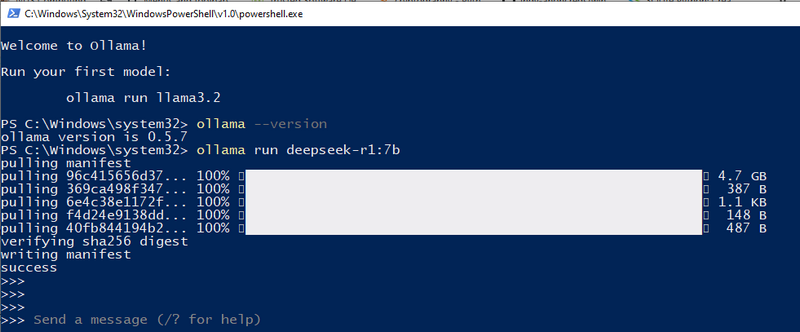

Now, DeepSeek-R1 is successfully deployed on your local machine, and you can start asking AI questions directly from the terminal.


------

### Step 2 : Install nomic-embed-text

To build the RAG (Retrieval-Augmented Generation) knowledge base, we need nomic-embed-text, which converts data (such as PDF files or text strings) into vector representations. These vector embeddings allow the AI model to understand semantic relationships between different pieces of text, improving search and retrieval accuracy.

**2.1 Download nomic-embed-text**

Visit the official page: https://ollama.com/library/nomic-embed-text and download the latest version as shown below:

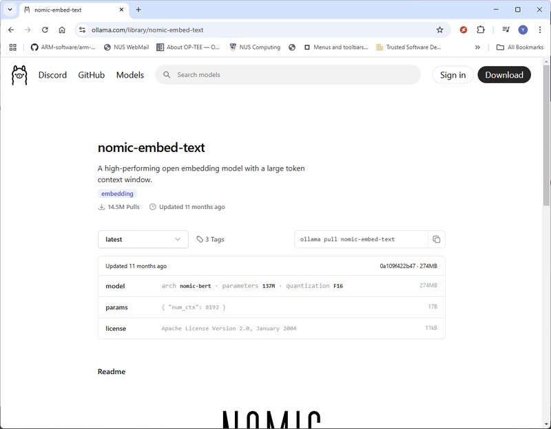

**2.2 Install via Ollama**

You can also install nomic-embed-text directly using the Ollama pull command:

```bash
ollama pull nomic-embed-text
```

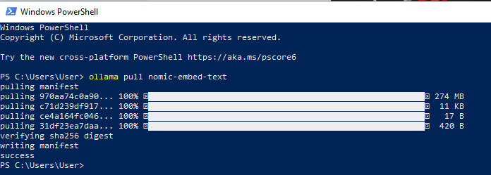

Once downloaded, **nomic-embed-text** is ready to be integrated into your RAG pipeline.


------

### Step 3 : Install AnythingLLM and Deploy RAG

To set up the **RAG (Retrieval-Augmented Generation) system**, we will use **AnythingLLM**, an open-source AI chatbot that allows seamless interaction with documents.

**3.1 Download and Install AnythingLLM**

Visit the official **AnythingLLM** download page: https://anythingllm.com/desktop and download the appropriate installer for your operating system.

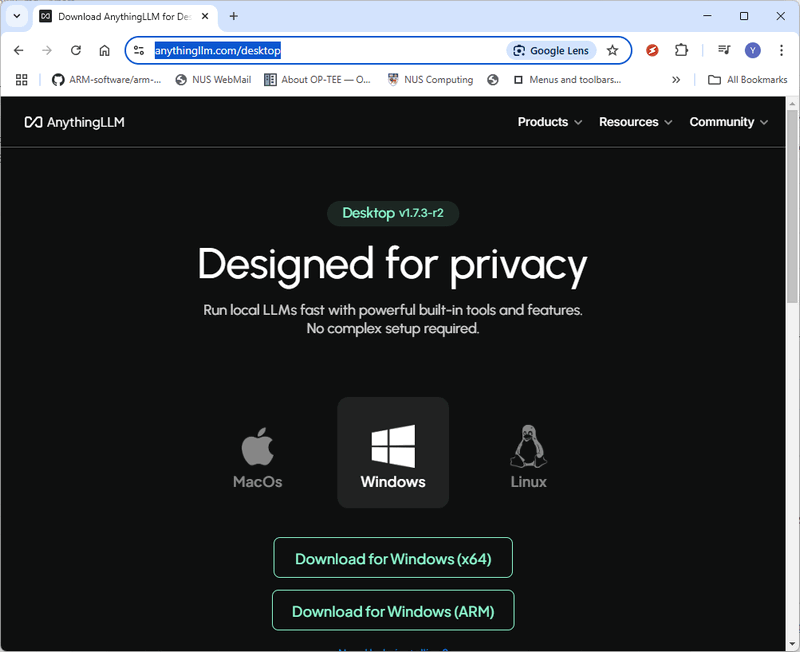

**3.2 Create a Workspace**

After installing and running **AnythingLLM**, create a new workspace named **"DeepSeek-R1-RAG"**. Then, click on the **"Open Settings"** icon for the workspace, as shown below:

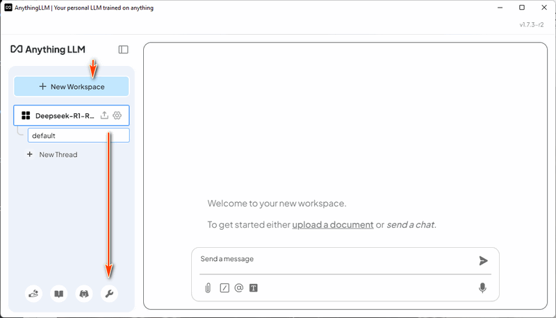

**3.3 Configure LLM Settings**

- In the **LLM Provider** section, select **Ollama**.
- Choose **DeepSeek-R1** as the **Ollama Model**.
- Set **Max Tokens** to **4096** (you can increase this if you need more extensive analysis or summarization).
- Click **Save Changes** to apply the settings. 

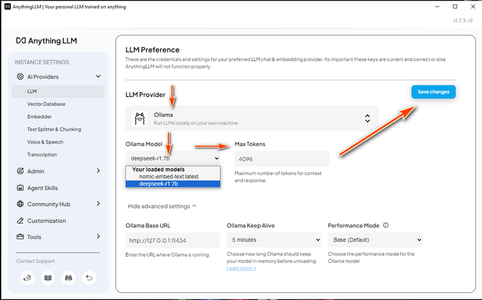

**3.4 Configure Vector Database**

- Navigate to the **Vector Database** settings.
- Select **LanceDB**, a **fully local** vector database that ensures data privacy by keeping everything on your local machine.

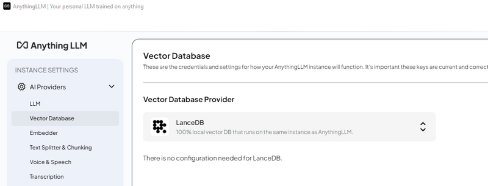

**3.5 Configure Embedding Model**

- In the **Embedder Tag**, choose **nomic-embed-text** under the **Ollama Embedding Model** section.
- Save the changes to finalize the setup.


------

### Step 4 : Load RAG Data and Start Testing

Now that we have completed the setup, we can load documents into the RAG system and test the DeepSeek-R1 chatbot.

**4.1 Prepare the Knowledge Base**

We will use four **PDF documents** to build the AI’s knowledge base:

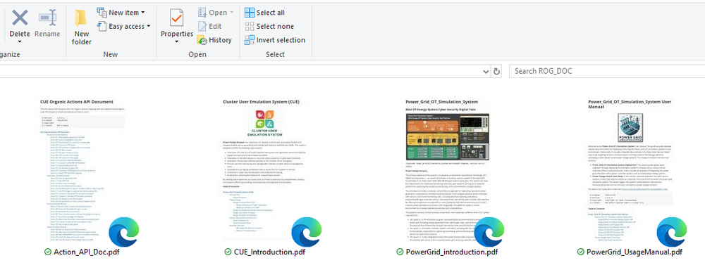

Power Grid Simulation System Documents

- `PowerGrid_introduction.pdf` – Introduction to the Power_Grid_OT_Simulation_System, including system overview, structure, and subsystem design.
- `PowerGrid_UsageManual.pdf` – A user manual covering system configuration, setup, and usage.

Cluster User Action Emulation (CUE) System Documents

- `CUE_Introduction.pdf` – Overview of the Cluster User Emulation (CUE) system, covering system structure, configuration, and usage.
- `Action_API_Doc.pdf` – Python API documentation with details on available functions, parameters, and usage examples.


**4.2 Load Power Grid System Data**

In AnythingLLM, create a "Power Grid Chat Bot" thread and click the upload icon:

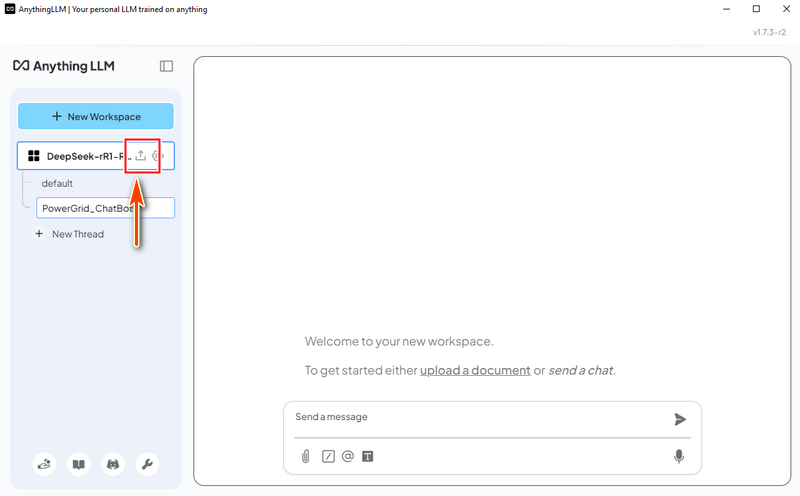

Upload the 2 PDF files `PowerGrid_introduction.pdf` and `PowerGrid_UsageManual.pdf`, then select both files and click "Move to Workspace":

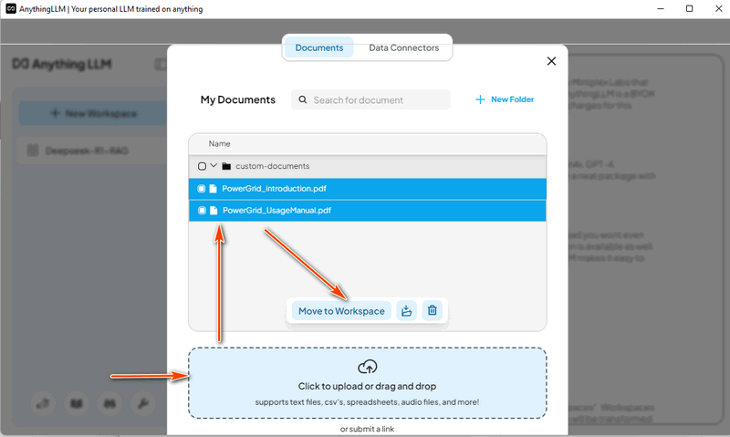

Then select the "Save and Embed" as shown below, after the progress finished the LLM with RAG is ready for use. 

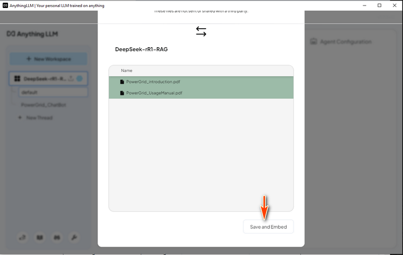


**4.3 Test the DeepSeek-R1 ChatBot with Power Grid data RAG** 

Now we can try to ask DeepSeek-R1 a question related to the power grid simulation system and compare the result between the answer with and without RAG.

Question: 

```
Give a short summary about the design of PLC and Remote Control Circuit Breaker Design in Power_Grid_OT_Simulation_System project. 
```

**DeepSeek-R1 (Without RAG) Answer** - For DeepSeek-R1 without RAG, it listed a very general answer as shown below and the response doesn't have relationship with the project Power_Grid_OT_Simulation_System :


**DeepSeek-R1 (With RAG Enabled)** - The AI provides an accurate response based on the uploaded documents, covering HMI breaker control and system details:


**4.4 Load the Cluster User Action Emulator Project Data** 

This time we remove the power grid doc and load the Cluster User Action Emulator Project introduction document `CUE_Introduction.pdf` and the python code API document `Action_API_Doc.pdf` as shown below:

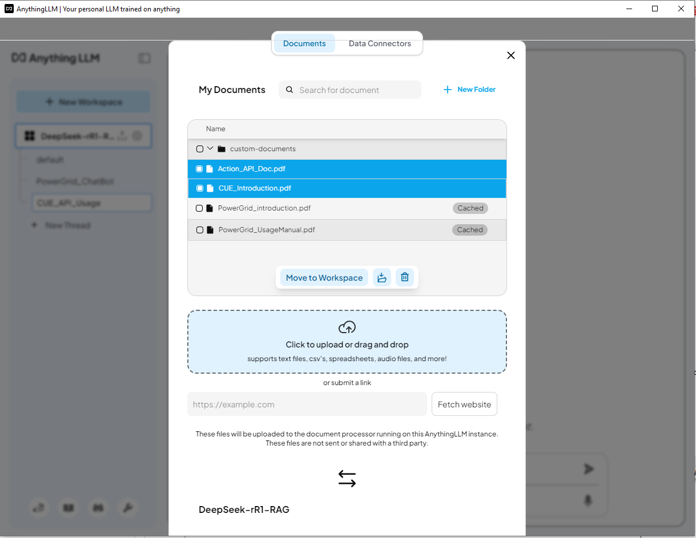


**4.5 Test the DeepSeek-R1 ChatBot with CUE data**  

Now we can try to ask DeepSeek-R1 a question related to create a python script with the lib function in cluster user action simulation system.

Question:

```
Help create a python script/function uses the cluster user emulator(CUE) function API to ping an IP 192.168.10.100 and ssh login to the server with (username: admin, password: P@ssword)  to run a command "ifconfig" 
```

**DeepSeek-R1 (Without RAG) Answer** - The AI does not recognize CUE and incorrectly generates a solution using the `requests` library which is incorrect as shown below:

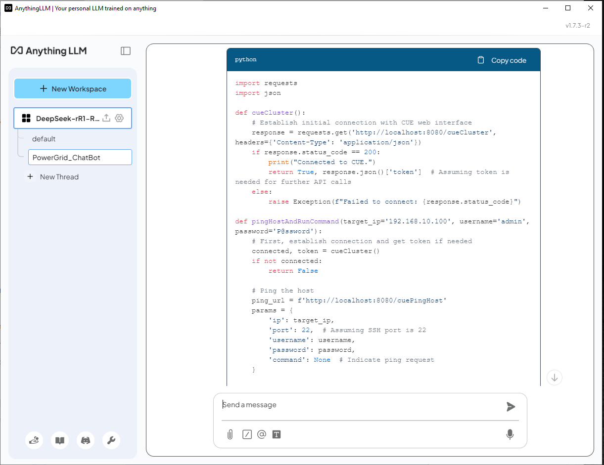

**DeepSeek-R1 (With RAG Enabled)** - The AI correctly utilizes the CUE API to generate the script. However, while it correctly finds the ping API function, it incorrectly initializes the SSH action:

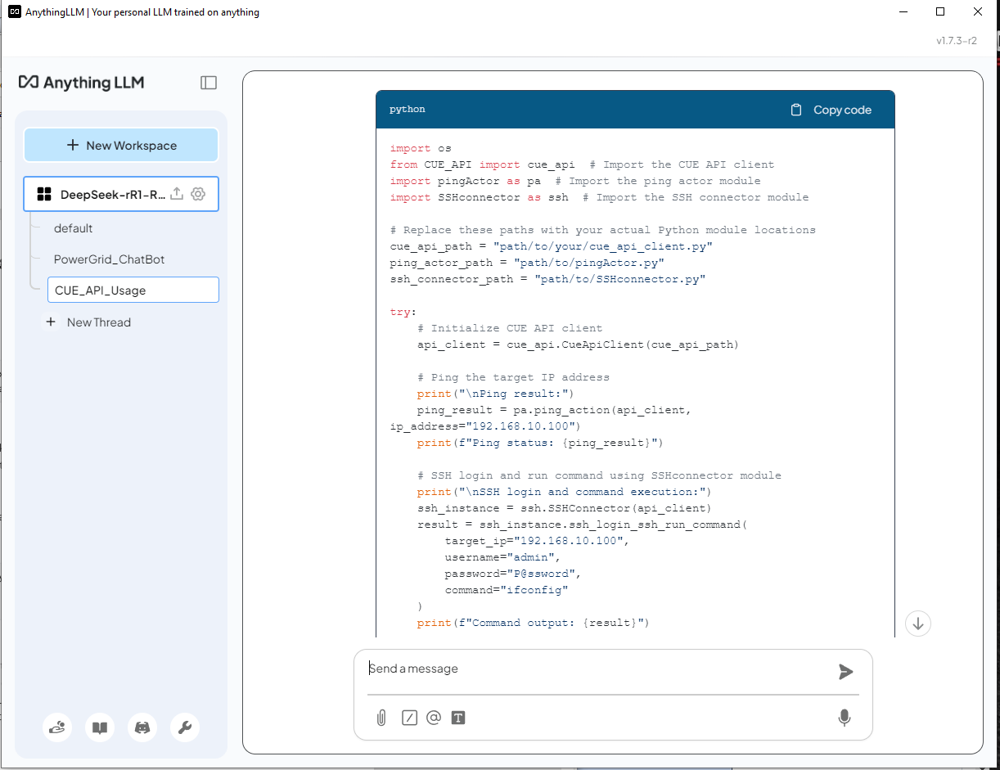

As we can see the DeepSeek-R1 use the correct lib module provide in the API document and build the script. For the ping action code, it find the correct API function from API_document in page2 and used correctly. For the SSH action, it find the correct API from API_document in page 4, but it didn't init the connector object correctly:

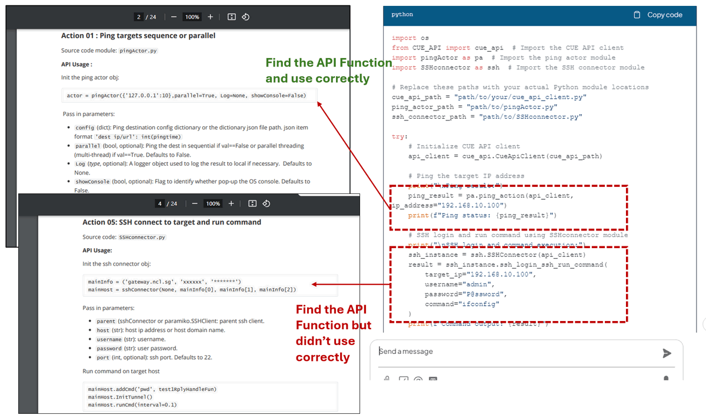

With RAG enabled, DeepSeek-R1 can generate responses based on domain-specific documents, making it far more accurate and useful than the standard model. However, reviewing AI-generated code is still necessary to ensure correctness.


------

### Conclusion

Deploying DeepSeek-R1 locally with a custom Retrieval-Augmented Generation (RAG) knowledge base enables AI-powered applications with enhanced domain-specific expertise while maintaining data privacy. By leveraging tools like Ollama, nomic-embed-text, and AnythingLLM, users can build intelligent chatbots, code generators, and AI-assisted decision-making systems tailored to their unique needs. The comparison between standard LLM responses and RAG-enhanced answers highlights the significant improvements in accuracy and relevance when integrating external knowledge sources. This setup not only enhances AI reliability but also ensures proprietary data remains secure, making it a powerful solution for businesses, researchers, and developers seeking localized AI-driven insights.

------

### Reference

- https://api-docs.deepseek.com/
- https://blogs.nvidia.com/blog/what-is-retrieval-augmented-generation/
- https://www.bilibili.com/video/BV16RF5eaEML/?spm_id_from=333.788.recommend_more_video.2


------

>  last edit by LiuYuancheng (liu_yuan_cheng@hotmail.com) by 08/02/2025 if you have any problem, please send me a message. 