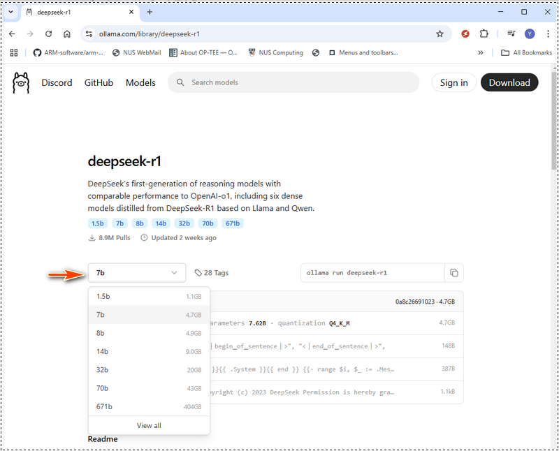

# Deploying DeepSeek-R1 Locally with a Custom RAG Knowledge Base

**Project Design Purpose** : The primary goal of this article is to explore how to deploy DeepSeek-R1 an open-source large language model (LLM), and integrate it with a customized Retrieval-Augmented Generation (RAG) knowledge base on your local machine (PC/server). This setup enables the model to utilize domain-specific knowledge for expert-level responses while maintaining data privacy and customization flexibility. By doing so, users can enhance the model’s expertise in specific technical domains, enabling applications such as AI-powered support chatbots, private code generation, and industry-specific assistants. Most importantly, this setup allows users to keep proprietary data private, ensuring sensitive documents, licensed software, or non-public information remain secure while still benefiting from AI-powered insights.

```python
# Version:     v_0.0.1
# Created:     2025/02/06
# License:     MIT License
```

**Table of Contents**

[TOC]

------

### Introduction

DeepSeek, a Chinese AI firm, is disrupting the industry with its low-cost, open source  large language models, challenging U.S. tech giants. It has shown high performance in mathematic, coding, English and Chinese Conversation. The DeepSeek-R1 model  is opensource ( MIT License ). This article explores the detailed steps to deploy the DeepSeek-R1:7B LLM model on a Windows laptop with an NVIDIA RTX 3060 (12GB GPU) to create a customized AI-powered chatbot or a program code generator using knowledge database Retrieval-Augmented Generation (RAG) and do a simple comparison between the normal LLM answer and RAG answer.

- For the AI customer service chatbot, we want it to provide information based on company product documentation, making it a powerful tool for internal knowledge management and customer support.
- For the code generator, we want it to assist in software development by generating code snippets based on existing program APIs or importing functions from a customized library.

To implement this project, we will use four key tools:

- **Ollama** : A lightweight, extensible framework for building and running language models on the local machine. [> link](https://ollama.com/)
- **DeepSeek-R1** : A model trained via large-scale reinforcement learning (RL) without supervised fine-tuning (SFT) as a preliminary step, demonstrated remarkable performance on reasoning. [> link](https://github.com/deepseek-ai/DeepSeek-R1/tree/main)
- **nomic-embed-text** : An open-source text embedding model that converts text into numerical vectors, allowing computers to understand the semantic meaning of text by comparing its representation to others. [> link](https://ollama.com/library/nomic-embed-text)
- **AnythingLLM** : An open-source AI chatbot that allows users to chat with documents. It's designed to help businesses and organizations make their written documents more accessible. [> link](https://anythingllm.com/)

This approach significantly improves **AI-assisted decision-making, technical support, and software development** by ensuring that responses are **grounded in reliable, domain-specific information**.


------

### Background Knowledge 

#### DeepSeek-R1: A High-Performance Open-Source LLM

DeepSeek AI is pioneering a new era of reasoning-based large language models (LLMs) with its DeepSeek-R1 series, designed to push the boundaries of mathematical, coding, and logical reasoning capabilities. Unlike traditional LLMs that rely heavily on supervised fine-tuning (SFT), DeepSeek AI adopts a reinforcement learning (RL)-first approach, enabling models to naturally develop complex reasoning behaviors.

**Evolution of DeepSeek-R1 Models**

- DeepSeek-R1-Zero was the first-generation model trained purely through large-scale reinforcement learning (RL), allowing it to self-verify, reflect, and generate long chain-of-thoughts (CoT) without SFT. However, it faced challenges such as language mixing, readability issues, and repetitive outputs.
- DeepSeek-R1 improved upon this by incorporating cold-start data before RL training, resulting in a more refined and human-aligned model with performance comparable to OpenAI-o1 across various reasoning benchmarks.

Reference link : https://api-docs.deepseek.com/

#### Understanding Retrieval-Augmented Generation (RAG)

Retrieval-augmented generation is a technique for enhancing the accuracy and reliability of generative AI models with information from specific and relevant data sources. RAG enhances generative AI models by retrieving external data before generating responses, leading to more accurate, up-to-date, and context-aware answers. 

The work flow of RAS is shown below:


- In the **Normal LLM Question-Answer Flow** , when a user asks a question. Thee LLM processes the input and generates an answer **only based on its pre-trained knowledge**. There is no external data retrieval, meaning outdated or missing information cannot be corrected.
- In the **LLM with RAG Question-Answer Flow**, when a user asks a questions. The The system first retrieves relevant information from external sources (databases, documents, APIs, or the web). The retrieved data is fed into the LLM along with the original question, then the LLM generates an answer based on both **pre-trained knowledge and retrieved data**, leading to **more accurate and up-to-date responses**.

Reference link : https://blogs.nvidia.com/blog/what-is-retrieval-augmented-generation/


------

### Deploy DeepSeek-R1 Model on your Local machine

To setup the  DeepSeek-R1 Model on you Local, you need to install the Ollama Tool which is a lightweight, extensible framework for building and running language models on the local machine. Then download the related DeepSeek-R1 Model based on your hardware. 

To download the Ollama, go to https://ollama.com/download and select the installation based on your OS: 


After installed the Ollama, open a terminal to verify the installation is successful with the version check cmd:

```
ollama --version
```

If the version number shows, which means the ollama is ready for use:


Now you can start the ollama service with cmd:

```
ollama serve
```

Then in the Models search and find the deepseek model, there are different size models' ranging from compact 1.5 billion-parameter versions to the massive 671 billion-parameter model. Depending on the size of the model you intend to deploy and the hardware (especial GPU memory) you have, you can choose the one suitable for you.  We have list down the minimum requirements for hardware deploying different models below, you can also deploy a bigger model on low performance hardware by using the the hardware performance optimization tool such as LMStudio (https://lmstudio.ai/) , then the "thinking" time will be longer.



DeepSeek-R1Hardware requirement

| Module Name      | Model Type Level | GPU VRAM                          | CPU                                                          | RAM         | Disk   |
| ---------------- | ---------------- | --------------------------------- | ------------------------------------------------------------ | ----------- | ------ |
| deepseek-r1:1.5b | Accessible       | No dedicated GPU or VRAM required | CPU no older than 10 years                                   | 8 GB        | 1.1 GB |
| deepseek-r1:7b   | Lightweight      | 8 GB of VRAM                      | Single CPU such as i5                                        | 8 GB        | 4.7 GB |
| deepseek-r1:8b   | Lightweight      | 8 GB of VRAM                      | Single CPU such as i5, i7                                    | 8 GB        | 4.9 GB |
| deepseek-r1:14b  | Mid-Range        | 12 - 16 GB of VRAM                | Single CPU such as i7, i9 or duel CPU such as Xeon silver 4114 x 2 | 16-32 GB    | 9.0 GB |
| deepseek-r1:32b  | Mid-range        | At least 24 GB of VRAM            | duel CPU such as Xeon silver 4114 x 2                        | 32 - 64 GB  | 20 GB  |
| deepseek-r1:70b  | Large-Scale      | 48 GB of VRAM                     | duel CPU such as Xeon gold 6130 x 2                          | 128-256 GB  | 43 GB  |
| deepseek-r1:671b | Large-Scal       | 480 GB of VRAM                    | duel CPU such as Xeon gold 6142 x 2                          | 512-1024 GB | 404 GB |

For 671b model: approximately 480 GB of VRAM. Multi-GPU setups are mandatory, with configurations such as:

- 20 Nvidia RTX 3090 GPUs (24 GB each)
- 10 Nvidia RTX A6000 GPUs (48 GB each)

Reference: https://www.geeky-gadgets.com/hardware-requirements-for-deepseek-r1-ai-models/, https://youtu.be/5RhPZgDoglE?si=xnHo9a9v7tvVd5sz

For my local configuration, I use a 3060GPU(12GB), so I can try the 7b. Then I can use the deepseek-r1:7b model, we can use the `ollama pull to down load the model`  or just use the run command, if the module is not download, ollama will auto download it:

```
ollama run deepseek-r1:7b
```


Now the DeepSeek-R1has been setup on your local and you can ask AI questions from the terminal. 


------

### Install nomic-embed-text 

To build the RAG knowledge base, we need the nomic-embed-text to convert the data (such as PDF file, text strings) to vector data. To download the nomic-embed-text ,go to  https://ollama.com/library/nomic-embed-text and download the latest version as shown below:


You can also use Ollama pull command to download it:

```bash
ollama pull nomic-embed-text
```


------

### Install AnythingLLM and Deploy RAG

Go to the anythingLLM web download page to download the installer based on your system:


------

https://www.bilibili.com/video/BV16RF5eaEML/?spm_id_from=333.788.recommend_more_video.2