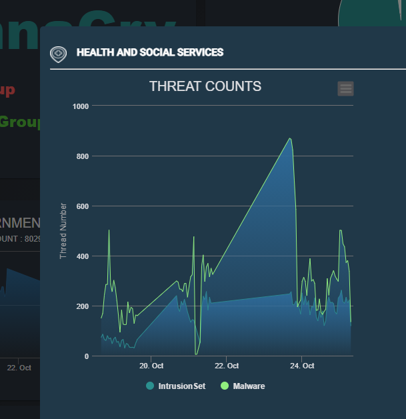

# SIEM Big Data Visualization [02]

### Dashboard for Summarizing SG National Cyber Threats in Critical Infrastructure


**Program Design Purpose**: 

The purpose of this program is to develop a comprehensive Angular web dashboard plugin for a Security Information and Event Management (SIEM) system, focusing on the effective monitoring, categorization, summarization, and visualization of cyber threat events targeting Singapore's critical infrastructure. This dashboard will provide researchers and security managers with a clear, concise view of national cybersecurity threats, enabling them to quickly detect and respond to potential cybercriminal activities and Advanced Persistent Threats (APTs) within a short timeframe.

Key features include visual representations of total event counts over time, identification of top-N threats, actors, and affected sectors, as well as categorization of threat actors across eight critical service sectors: `Government Service`, `InfoComm`, `Manufacturing-Related Service`, `Energy Service`, `Transportation Service`, `Health and Social Services`, `Security and Emergency Services`, and `Banking and Finance Service`. This tool will facilitate a better understanding of cybersecurity threats and help prioritize mitigation strategies across different sectors.

The program demo video link: https://youtu.be/fCrS79RXoik?si=3CqP23KeM8QrgbCe

```
# Version:     v0.1.2
# Created:     2024/10/18
# Copyright:   Copyright (c) 2024 LiuYuancheng
# License:     MIT License 
```

**Table of Contents**

[TOC]

- [SIEM Big Data Visualization [02]](#siem-big-data-visualization--02-)
    + [Dashboard for Summarizing SG National Cyber Threats in Critical Infrastructure](#dashboard-for-summarizing-sg-national-cyber-threats-in-critical-infrastructure)
    + [Project Introduction](#project-introduction)
      - [Dashboard UI View](#dashboard-ui-view)
      - [Project Architecture](#project-architecture)
        * [Front-End: Angular Web Host Program](#front-end--angular-web-host-program)
        * [Back-End: GraphQL Query Program](#back-end--graphql-query-program)
    + [Threats Data Source Available](#threats-data-source-available)
    + [System/Program Design](#system-program-design)
      - [Dashboard UI Structure and Design](#dashboard-ui-structure-and-design)
      - [Components and Backend Query Design](#components-and-backend-query-design)
        * [Total Threats Count Timeline Panel](#total-threats-count-timeline-panel)
        * [Top-N Threats Name Display Panel](#top-n-threats-name-display-panel)
        * [Top-N Threats Actor Display Panel](#top-n-threats-actor-display-panel)
        * [Top-N Threats Sector Display Panel](#top-n-threats-sector-display-panel)
        * [Sector Threats Count Time Period Panel](#sector-threats-count-time-period-panel)
        * [Dashboard Pop-Up Dialog](#dashboard-pop-up-dialog)
    + [Program Setup and Usage](#program-setup-and-usage)
        * [Program Files List](#program-files-list)
      
      - [Program Usage/Execution](#program-usage-execution)
    + [Reference](#reference)

------

### Project Introduction

This project aims to develop a comprehensive dashboard plugin that visualizes large datasets of Singapore national cyber threat events, sourced from publicly available cybersecurity datasets. The dashboard is designed to offer real-time insights and an overview of cyber threats impacting various critical infrastructure sectors in Singapore. By leveraging data from trusted sources such as the Singapore Cyber Security Agency (CSA) Annual Cybersecurity Report and SingCERT (Singapore Computer Emergency Response Team) advisories, the dashboard provides a centralized view of national cyber threat activities. The five key features include:

- **Threat Event Summary**: Overview of total detected events within a specified period (e.g., daily, weekly, monthly), with a timeline displaying event trends.
- **Top-N Threats and Actors**: Identification and ranking of the most frequent threats and threat actors, along with information on their types and methods.
- **Sector-Specific Analysis**: Categorization of threats based on critical infrastructure sectors (e.g., Government, Energy, Health), with breakdowns of how each sector is impacted.
- **Threat Actor Profiles**: Detailed information about known cybercriminal groups, APTs (Advanced Persistent Threats), and their typical behaviors, attack vectors, and patterns.
- **Event Timeline Visualization**: A graphical timeline showing the volume and frequency of cyber events, enabling the identification of spikes and anomalies over time.

With the key features, the Singapore National Cyber Threat Dashboard Plugin bridges the gap between raw data and actionable insights, empowering researchers, security professionals, and policy makers to mitigate risks and improve national cybersecurity defenses.

#### Dashboard UI View 

The dashboard is designed with three main sections, providing a clear and intuitive way to visualize national cyber threat data. The dashboard view is shown below:


`Figure-01 National cyber threats summary dashboard webpage view, version v0.1.2 (2024)`

- **Total Threats Count Timeline**: This section displays a timeline chart showing the total number of detected threats, sorted by timestamp. Users can view data aggregated by day or hour, helping them track trends and spikes in cyber activity over time.
- **Top-N Threats Percentage Display**: This pane presents a summary of the most prevalent threats, categorized by threat name, actor, and affected sector. The display is configurable, allowing users to adjust the parameters based on their specific needs, such as viewing the top threats by name, key actors, or targeted sectors.
- **Sector-Specific Threat Line Charts**: This section offers line charts that categorize threat events by service type (e.g., Government, Energy, Health). Users can view trends sorted by day, which helps in identifying which sectors are most affected and how threat patterns vary across different actor service types.

The dashboard also provides interactive features: when a user clicks on data within the Top-N Threats pane or any sector panel, a detailed timeline dialog will pop up, offering an in-depth view of the selected threat information, as shown in the example image above. This functionality allows users to drill down into specific data points, enhancing their ability to analyze and respond to threats effectively.

#### Project Architecture

The project consists of two main components: the **Front-End Web Host** and the **Back-End Database Balancer**.

##### Front-End: Angular Web Host Program

- The front-end is built using Angular, providing an interactive web-based interface for user to monitor data.
- It handles user HTTP(S) requests and delivers webpages for viewing and interacting with the dashboard.
- Users can customize and filter data views based on specific time periods, sectors, or threat types, making it easier to pinpoint relevant information.

##### Back-End: GraphQL Query Program

- The back-end is powered by a `GraphQL` query engine designed to optimize data fetching for multiple concurrent users.
- It efficiently manages requests by queuing and filtering based on user data permissions and access limitations, ensuring secure and scalable data retrieval.
- The system converts `GraphQL` queries into native database queries, pulling data from a database cluster to serve up-to-date, accurate information.

The dashboard is equipped with various data visualizations that summarize and categorize threats, allowing security professionals, researchers, and policy makers to identify trends, monitor real-time threat events, and enhance their understanding of Singapore's cybersecurity landscape.


------

### Threats Data Source Available 

For detailed and sector-specific cybersecurity threat data for Singapore, particularly focused on critical infrastructure sectors, three are several raw data you can download and insert in your data base:

**Singapore Cyber Security Agency (CSA) Annual Cybersecurity Report**

- CSA publishes an annual report that highlights the key cybersecurity threats faced by Singapore. The report typically covers various critical sectors, including Government, Healthcare, Financial Services, and others. It provides insights into significant incidents, trends, and sector-specific threats.
- Link: https://www.csa.gov.sg/Tips-Resource/publications/2024/singapore-cyber-landscape-2023

**SingCERT (Singapore Computer Emergency Response Team) Advisories**

- SingCERT, under CSA, provides advisories on cybersecurity threats and incidents affecting Singapore. While it may not always break down threats by specific sectors, it highlights incidents of national importance that may impact critical infrastructure.
- Link: https://www.csa.gov.sg/faqs/singcert

**Global Resilience Federation (GRF) - Asia Pacific (APAC) Cyber Information Sharing**

- GRF offers sector-specific threat intelligence sharing, focusing on cybersecurity and resilience across critical infrastructure sectors, including Banking, Healthcare, and Energy. They collaborate with companies in Singapore and other APAC regions to disseminate threat data.
- Link: https://www.grf.org/newsletter

> If you have any other data source can be used, many thanks if you can share to us.


------

### System/Program Design

The system consists of a **front-end web host program** developed using `Angular` and `TypeScript`, and a **back-end database balancer** programmed with `GraphQL` and `JavaScript`. The underlying data storage is managed by a `Druid Data Base Cluster`, which handles large datasets effectively. The system diagram is shown below:


`Figure-02 National threats dashboard system workflow diagram, version v0.1.2 (2024)`

As illustrated in the diagram, the system workflow involves several key components:

- **Front-End Web Host**: The user interface facilitates interaction between security managers and the dashboard, allowing them to send requests and receive packaged data for visual analysis. The front-end handles user authorization, data requests, and displays key information through an intuitive graphical interface.
- **Network Communication**: Requests from the front-end are processed and transmitted over a network, facilitating communication between the front-end and back-end systems.
- **Back-End Database Balancer**: The back-end utilizes `GraphQL` to parse and optimize user queries. It manages authorization, ensuring data access permissions are verified before any data retrieval. It converts `GraphQL` queries to native database queries, filters results, and fetches data efficiently from the Druid database cluster.
- **Data Source Integration**: The system integrates with various data sources, including the `CSA Annual Cybersecurity Report`, `SingCERT Advisories`, and `Asia Pacific (APAC) Cyber Information Sharing`, providing a comprehensive view of current cyber threats.
- **Data Combination and Processing**: After retrieving data from the Druid cluster, the system combines and processes this information, packaging it into a format suitable for visualization on the dashboard.

This architecture ensures a smooth flow of data from multiple sources to a centralized dashboard, empowering users with critical insights and timely information to detect and mitigate cyber threats.


#### Dashboard UI Structure and Design 

The dashboard is organized into a grid structure, providing a clear and user-friendly interface for visualizing key information. Below is the layout of the dashboard:

| **Dashboard Plug-in Title**                          |                                                         |                                                     |                                                  |
| ---------------------------------------------------- | ------------------------------------------------------- | --------------------------------------------------- | ------------------------------------------------ |
| Total Threat Count Line-Area High-Chart              |                                                         |                                                     |                                                  |
| Top-N Threat Names Word Cloud High-Chart (Count)     | Top-N Threat Actors Pie High-Chart (Percentage)         | Top-N Threat Sectors Pie High-Chart (Percentage)    |                                                  |
| Sector Line-Area High-Chart: GOVERNMENT              | Sector Line-Area High-Chart: INFOCOMM                   | Sector Line-Area High-Chart: MANUFACTURING          | Sector Line-Area High-Chart: ENERGY              |
| Sector Line-Area High-Chart: TRANSPORTATION SERVICES | Sector Line-Area High-Chart: HEALTH AND SOCIAL SERVICES | Sector Line-Area High-Chart: SECURITY AND EMERGENCY | Sector Line-Area High-Chart: BANKING AND FINANCE |

The main UI is shown below:


`Figure-03 National threats dashboard main page screen shot, version v0.1.2 (2024)`

Key visual elements include:

- **Total Threats Count**: A line-area chart depicting the overall count of detected threats over a specific period.
- **Top-N Threat Names**: A word cloud chart highlighting the most frequently detected threat names.
- **Top-N Threat Actors and Sectors**: Pie charts illustrating the distribution of threats by actors and affected sectors.
- **Sector-Specific Analysis**: Individual line-area charts for each critical sector, offering a detailed view of threat trends and activities in specific areas such as `Government`, `InfoComm`, `Manufacturing`, `Energy`, `Transportation`, `Health and Social Services`, `Security and Emergency`, and `Banking and Finance`.

Pop-up threats count time-line detail dialog :


`Figure-04 National threats dashboard pop-up dialog screen shot, version v0.1.2 (2024)`

When the user click the detailed words, sector on the panel in the main UI, the detail threats count time line dialog will pop-up. 


#### Components and Backend Query Design

The front-end dashboard is composed of multiple components, each responsible for a specific aspect of data visualization. The back-end will fetch data from the Druid database using `GraphQL` queries. The backend acts as a balancer, parsing user requests, applying authorization, and converting `GraphQL` queries into native SQL queries to optimize data retrieval. The work flow is shown below: 


##### Total Threats Count Timeline Panel

Line-area panel displays a timeline chart showing the total count of threat events, sorted by timestamps (day/hour). The UI is shown below:


`Figure-05 Threats Count Timeline Panel screen shot, version v0.1.2 (2024)`

BE GraphQL Query (Function call):

```javascript
threatEvents_nationalCount(dimension:"All")
```

BE Druid SQL (Total Threat Count):

```sql
SELECT
DATE_TRUNC('hour', __time), count(*) as threatCount
FROM "ds-suspected-ip-2021"
GROUP BY DATE_TRUNC('hour', __time)
```


##### Top-N Threats Name Display Panel

Word cloud chart panel displays the top N threads name based on the user's selection in the drop down menu during the time period. The UI is shown below:


`Figure-06 Top-N Threats Name Panel screen shot, version v0.1.2 (2024)`

BE GraphQL Query:

```javascript
threatEvents_nationalTopN(dimension:"threatName", filterVal:"Name", topN:10)
```

BE Druid SQL:

```sql
SELECT
threatName, count(*) as threatCount
FROM "ds-suspected-ip-2021"
GROUP BY threatName
ORDER BY threatCount DESC
LIMIT 10
```


##### Top-N Threats Actor Display Panel

Pie chart Panel displays the top N threads actors based on the user's selection in the drop down menu, showing percentage distribution. The UI is shown below:


`Figure-07 Top-N Threats Actor Panel screen shot, version v0.1.2 (2024)`

BE GraphQL Query:

```javascript
threatEvents_nationalCount(queryType:"All")
threatEvents_nationalTopN(dimension:"threatActor", filterVal:"percentage", topN:10)
```

BE Druid SQL:

```sql
SELECT
threatActor, count(*) as threatCount
FROM "ds-suspected-ip-2021"
GROUP BY threatName
ORDER BY count DESC
LIMIT 10
```

Then in BE divide the return list by total to calculate the percentage data.


##### Top-N Threats Sector Display Panel

Pie chart displays the top-N threat sectors based on user selection, showing percentage distribution. Focus on threats defined as `IntrusionSet`. The UI is shown below:


`Figure-08 Top-N Threats Sector Panel screen shot, version v0.1.2 (2024)`

BE GraphQL Query:

```javascript
threatEvents_nationalCount(queryType:"All")
threatEvents_nationalTopN(dimension:"threatName", filterDimension:"threatType", filterVal:"IntrusionSet", topN:10)
```

BE Druid SQL:

```sql
SELECT
threatName, count(*) as threatCount
FROM "ds-suspected-ip-2019"
WHERE threatType='IntrusionSet'
GROUP BY threatName
ORDER BY threatCount DESC
LIMIT 10
```


##### Sector Threats Count Time Period Panel 

Line-area panel displays a time series for threat counts within sectors over a period of 3-5 days, sorted by hour. The UI is shown below:


`Figure-09 Sector Threats Count Time Period Panel screen shot, version v0.1.2 (2024)`

Sectors Category:

```json
["GOVERNMENT", "INFOCOMM", "MANUFACTURING", "ENERGY", "TRANSPORTATION SERVICES", "HEALTH AND SOCIAL SERVICES", "SECURITY AND EMERGENCY", "BANKING AND FINANCE"]
```

BE GraphQL Query:

```javascript
threatEvents_nationalCount(queryType:"threatSector", fieldStr:"GOVERNMENT", threatType:"All")
```

BE Druid SQL:

```sql
SELECT
DATE_TRUNC('hour', __time), count(*) as threatCount
FROM "ds-suspected-ip-2021"
WHERE srcSector='GOVERNMENT'
GROUP BY DATE_TRUNC('hour', __time)
ORDER BY DATE_TRUNC('hour', __time)
```


##### Dashboard Pop-Up Dialog

A pop-up dialog that appears when users select specific items, showing a comparative area chart for `Intrusion Set` and `Malware` and providing detailed descriptions. The UI is shown below:



`Figure-10 Dashboard Pop-Up Dialog screen shot, version v0.1.2 (2024)`

Parameter Input:

- `popupName`: `[<threatName>/<threatSector>]`
- `popupType`: `['Sector', 'Name', 'Actor']`

BE GraphQL Query:

```javascript
threatEvents_nationalCount(queryType:"threatSector", fieldStr:"GOVERNMENT", threatType:"IntrusionSet", limitVal:1000)
profile_threatName(threatName:"APT37")
```

BE Druid SQL Example:

```sql
SELECT
DATE_TRUNC('hour', __time), count(*) as threatCount
FROM "ds-suspected-ip-2021"
WHERE srcSector='GOVERNMENT' and threatType='IntrusionSet'
GROUP BY DATE_TRUNC('hour', __time)
ORDER BY DATE_TRUNC('hour', __time)
```

```sql
SELECT
DATE_TRUNC('hour', __time), count(*) as threatCount
FROM "ds-suspected-ip-2021"
WHERE threatType='IntrusionSet' and threatName='Silence'
GROUP BY DATE_TRUNC('hour', __time)
ORDER BY DATE_TRUNC('hour', __time)
```


------

### Program Setup and Usage

This section outlines the program file structure, environment setup, and steps for executing the National Threat Display Dashboard. Follow these instructions to correctly configure and run the system.

##### Program Files List 

| Program file/folder                    | Execution Env | Description                                                  |
| -------------------------------------- | ------------- | ------------------------------------------------------------ |
| `src/dash-national/*`                  | Typescript    | This components will show the main dashboard web page.       |
| `src/dash-national-actors/*`           | Typescript    | This components will show a mat-card to display the top N threats actor/type in a highchart pie chart. |
| `src/dash-national-name/*`             | Typescript    | This components will show a mat-card to display the top N threat name in a highchart word cloud. |
| `src/dash-national-popup/*`            | Typescript    | This components will show a pop-up dialog in the mid of the page with a count area chart of the item selected by user on the left side and item description text on the right side. |
| `src/dash-national-sector/*`           | Typescript    | This components will show a mat-card to display the sectors threat timeseries hour count in a highchart line-area chart. |
| `backEnd/threatEvents/resolvers/ *.js` | JavaScript    | All the backend balancer resolvers modules.                  |
| `backEnd/threatEvents/schema/ *.gql`   | gql           | All the graphql query/datatype definition.                   |

#### Program Usage/Execution

Copy Files to Appropriate Directories

- **Frontend (UI) Files**: Copy the `src` folder into your project at `<ProjectRoot>/src/app/pages`.
- **Backend (GraphQL)**: Copy the `threatEvents` folder into your backends' `<ProjectRoot>/graphql/threatEvents` folder.
- **Routing Configuration**: Import the `graph-national-component` into your project's routing module by modifying `app-routing.module.ts`.
- **Command to Run the Program**: To start the development server and compile the project, use the following command `npm run dev`

Access the Webpage:  you can directly access the dashboard at: http://localhost:4200/#/national

------

### Reference

- Graphql tutorial link: https://www.tutorialspoint.com/graphql/graphql_environment_setup.htm
- Druid console link: http://druid.cdl.telco.lan/unified-console.html

- Native queries: https://druid.apache.org/docs/latest/querying/querying.html

- Angular function handle input https://stackoverflow.com/questions/42287304/pass-variable-to-custom-component

- Angular High chart word cloud: https://medium.com/@pmzubar/creating-awesome-word-clouds-using-highcarts-js-76967cb15c22

- Angular Check box event: https://www.concretepage.com/angular-material/angular-material-checkbox-change-event

- Angular tool tip: https://material.angular.io/components/tooltip/overview

- P-card detail: https://www.bookstack.cn/read/PrimeNG/e455a9cbe0018c68.md

------

>  last edit by LiuYuancheng (liu_yuan_cheng@hotmail.com) by 19/10/2024 if you have any problem, please send me a message. 