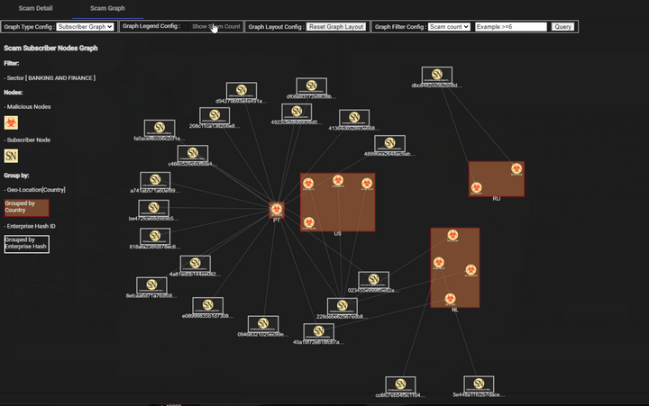

# SIEM Big Data Visualization

### Dashboard for Monitoring Scam Events in Critical Infrastructure


**Project Design Purpose**:  In a Security Information and Event Management (SIEM) system, effective monitoring and visualization of scam events is crucial to detecting and responding to cyberattacks. Cybercriminals often use deceptive methods to exploit individuals or organizations, aiming to steal sensitive information, financial assets, or disrupt operations. This project seeks to develop a web plugin dashboard to help cybersecurity researchers and managers better understand the scope and impact of scam-related cyberattacks targeting critical infrastructure sectors such as `Government Services`, `InfoComm`, `Manufacturing, Energy`, `Transportation`, `Healthcare`, `Security and Emergency Services`, and `Banking and Finance`. By enabling real-time visualization of attack patterns, the dashboard will assist organizations in identifying trends, spotting anomalies, improving cybersecurity strategies, and making informed, data-driven decisions.

```python
# Version:     v0.0.1
# Created:     2024/10/01
# Copyright:   Copyright (c) 2024 LiuYuancheng
# License:     MIT License 
```

**Table of Contents**

[TOC]

- [SIEM Big Data Visualization](#siem-big-data-visualization)
    + [Dashboard for Monitoring Scam Events in Critical Infrastructure](#dashboard-for-monitoring-scam-events-in-critical-infrastructure)
    + [Introduction](#introduction)
      
      - [Dashboard Main UI View](#dashboard-main-ui-view)
    + [Scam Data Source](#scam-data-source)
    + [System/Program Design](#system-program-design)
        * [Main Scam Event Analytics Dashboard](#main-scam-event-analytics-dashboard)
        * [Scam Event Breakdown Information Pop-Up Window](#scam-event-breakdown-information-pop-up-window)
        * [Scam Source-Destination Relationship Graph](#scam-source-destination-relationship-graph)
      - [Back-End Data Query Design](#back-end-data-query-design)
        * [1. Country Code Lookup Query](#1-country-code-lookup-query)
        * [2. Campaign Breakdown Query](#2-campaign-breakdown-query)
        * [3. Sector Graph Data Queries](#3-sector-graph-data-queries)
      - [Components Panel Design](#components-panel-design)
        * [1. Scam Threat Events Timeline Chart Panel](#1-scam-threat-events-timeline-chart-panel)
        * [2. Event Source Heatmap](#2-event-source-heatmap)
        * [3. Scam Destination Sector History Timeline Chart Panel](#3-scam-destination-sector-history-timeline-chart-panel)
        * [4. Scam Breakdown Pop-Up Dialog Window](#4-scam-breakdown-pop-up-dialog-window)
        * [5. Scam Source-Destination Relationship Graph](#5-scam-source-destination-relationship-graph)
    + [Program Setup and Usage](#program-setup-and-usage)
      
      - [Program Usage/Execution](#program-usage-execution)
    + [Reference](#reference)

------

### Introduction

This project aims to develop a dashboard that visualizes large datasets of scam threat events sourced from publicly available cybersecurity datasets. The dashboard will be an essential tool for cybersecurity researchers and managers, allowing them to analyze and understand scam incidents targeting critical infrastructure. By offering real-time visualization, it will help organizations gain insights into attack patterns, trends, and sector-specific vulnerabilities.

The dashboard will feature several key components: an `event count timeline panel`, a `scam event world heatmap`, `sector-specific line charts` displaying various scam threat types, and a `pop-up information dialog` for in-depth event breakdowns and graphical analysis.

- **Types of Cybersecurity Scams Visualized**: `Phishing`, `Ransomware`, `Tech Support Scams`, `Business Email Compromise (BEC)`, `Investment or Charity Scams` and `Cryptocurrency Scams`. 
- **Critical Infrastructure Sectors Covered**: `Government Services`, `InfoComm (Information and Communication)`, `Manufacturing-related Services`, `Energy Services (Utilities, Power)`, `Transportation Services`, `Health and Social Services`, `Security and Emergency Services`, `Banking and Finance`. 
- **Visualization Methods Applied**: `Heatmaps` for geographical representation of incidents, `Bar/Pie Charts` for comparing scam events by type and sector, `Geographic Maps` for scam event locations, `Timeline Graphs` for visualizing trends over time. 

The project is divided into two main sections: **Front-End Web Host** and **Back-End Database Balancer**.

- **Front-End**: The front-end is powered by an Angular web host that serves the user interface and handles HTTP requests. This allows users to interact with the dashboard, view visualizations, and explore the data.
- **Back-End**: The back-end consists of a GraphQL query system that optimizes data retrieval from the database cluster. It efficiently handles multiple user queries by balancing request loads and converting GraphQL queries into native queries, while ensuring user data permissions and access limitations are respected.

This integrated system will provide a powerful and user-friendly platform to monitor and analyze scam threats, helping to enhance cybersecurity strategies and decision-making for critical infrastructure protection. For the plugin demo, please refer to this video: https://youtu.be/Tq6_YjBabhM?si=EqmII7a5HBQpoiTx


#### Dashboard Main UI View

The plug-in dashboard layout is designed to offer an intuitive and data-driven experience, providing cybersecurity professionals with real-time insights into scam activities and their impact on critical infrastructure. A preview of the Dashboard Webpage is shown below:


`Figure-01 Scam event analytics dashboard plugin webpage view, version v0.1 (2024)`

The dashboard consists of five key sections, designed to provide a comprehensive view of scam threat data:

- **Total Scam Threats Timeline Chart**: Displays the total count of scam events over time, with an adjustable time unit (e.g., daily, weekly, monthly) to allow for flexible time-based analysis.
- **Scam Threats World Heatmap**: Visualizes the geographic distribution of scam sources (attackers), categorized by country, showing the intensity of scam activities across different regions.
- **Sector-Specific Scam Timeline Panel**: Compares the historical scam activity targeting different critical infrastructure sectors, with a summary overlay that highlights key trends and sector-specific insights.
- **Detailed Breakdown Pop-Up**: Provides in-depth analysis of scam events, including country-specific activity, sector targeting, campaign details, and scam types (e.g., `Email Traps`, `Extortion Tactics`, `Tech Support Scams`, `NSFW Phishing Scams`). It also includes a scannable timeline chart showing scam events for the most recent month.
- **Scam Source-Destination Relationship Graph**: Depicts the relationship between scam sources and targeted sectors or subscribers, with a filter function that allows users to rebuild the graph based on scam event count and other criteria.


------

### Scam Data Source

To gather scam event data, you can build your own database by utilizing various sources such as **Incident Reports**, **Threat Intelligence Feeds**, **Security Bulletins**, **Historical Cyberattack Data** (e.g., ransomware, phishing), as well as **User/Employee Reports of Suspicious Activities**, and **Industry-Specific Security Audits and Assessments**. Additionally, there are several free resources that provide valuable datasets for scam event research, analysis, and visualization:

| Source Name                                           | Scam Sector Covered                             | Description                                                  | Link                                                         |
| ----------------------------------------------------- | ----------------------------------------------- | ------------------------------------------------------------ | ------------------------------------------------------------ |
| PhishTank                                             | Banking, Government, and Information Services   | A free community-driven site where users submit and track phishing websites. | [PhishTank](https://www.phishtank.com/)                      |
| APWG (Anti-Phishing Working Group) Reports            | Banking, Government and geographic distribution | APWG provides free quarterly reports on phishing trends      | [APWG Reports](https://apwg.org/)                            |
| Have I Been Pwned (HIBP)                              | information and communication, health           | HIBP tracks breaches and scam events related to leaked user data. | [Have I Been Pwned](https://haveibeenpwned.com/)             |
| Cybercrime Tracker                                    | Energy and Transport                            | Tracks various types of cybercrime including phishing, ransomware, and command & control servers. | [Cybercrime Tracker](http://cybercrime-tracker.net/)         |
| MalShare                                              | Manufacturing, Energy, and Healthcare           | A free malware repository providing a large database of malware-related data, including ransomware and phishing kits. | [MalShare](https://malshare.com/)                            |
| IBM X-Force Exchange                                  | Government, Energy, and Banking                 | IBM's threat intelligence sharing platform that provides free access to a wide range of cybersecurity threat data. | [IBM X-Force Exchange](https://www.ibm.com/docs/en/qradar-on-cloud?topic=administration-x-force-integration) |
| Spamhaus Project                                      | Information Services and Banking                | Spamhaus provides data on spam and phishing sources across the internet. | [Spamhaus](https://www.spamhaus.org/)                        |
| CIRCL MISP (Malware Information Sharing Platform)     | Energy or Transportation                        | An open-source threat intelligence platform that aggregates and shares scam event data. | [CIRCL MISP ](https://www.bridewell.com/insights/blogs/detail/misp-open-source-threat-intelligence-platform?creative=&keyword=&matchtype=&network=x&device=c&utm_term=&utm_campaign=(CVM)_Brand+PMax&utm_source=adwords&utm_medium=ppc&hsa_acc=5928684088&hsa_cam=16617826304&hsa_grp=&hsa_ad=&hsa_src=x&hsa_tgt=&hsa_kw=&hsa_mt=&hsa_net=adwords&hsa_ver=3&gad_source=1&gclid=CjwKCAjwgfm3BhBeEiwAFfxrG7X__ep9uAhtFtIImaQN10sPTvDn9RlbLngMi78A1YmXJW2ZcaRooxoCo9YQAvD_BwE) |
| OpenPhish                                             | Banking and Government                          | A threat intelligence platform focused on phishing, offering both free and premium feeds. | [OpenPhish](https://openphish.com/)                          |
| CISA (Cybersecurity & Infrastructure Security Agency) | Energy, Transportation, and Government Services | The US government’s cybersecurity agency regularly publishes reports, alerts, and advisories on threats, including scams targeting critical infrastructure. | [CISA Alerts & Advisories](https://www.cisa.gov/news-events/cybersecurity-advisories) |
| Ransomwhere                                           | Manufacturing, Energy, and Healthcare.          | A crowdsourced ransomware payment tracking site.             | [Ransomwhere](https://ransomwhe.re/)                         |

These data sources provide a solid foundation for scam event tracking and analysis, enabling organizations to better monitor and understand cyber threats across critical infrastructure sectors.


------

### System/Program Design

The system is designed as an Angular plugin, programmed using `TypeScript`, with a back-end database balancer implemented in `GraphQL` and `JavaScript`. The back-end uses a `Druid database cluster` to manage and process data, alongside a data fetch module that integrates with various APIs to continuously pull scam event data from different sources. The system is flexible, allowing users to modify the data-fetching process and incorporate data from multiple sources.

The dashboard data visualization workflow is as follows:


`Figure-02 System workflow diagram, version v0.1 (2024)`

The dashboard contents 3 main parts: Main Scam Event  Analytics Dashboard, Scam Event Breakdown Information Pop-Up Window and Scam Source-Destination Relationship Graph display. 

##### Main Scam Event Analytics Dashboard

The **Main Scam Analytics Dashboard** provides an overview of scam events across various critical infrastructure sectors. The interface contains several key elements:

- A **timeline chart** at the top, displaying the number of scam events by date, allowing users to track scam activity throughout the month.
- **16 small trend charts** to show the scam activity across different critical infrastructure sectors, includes: `1.Infocomm` , `2.Trade`, `3.Health and Social Services`, `4.Transportation Services`, `5.Banking and Finance`, `6.Real Estate`, `7.Construction`, `8.Government`, `9.Manufacturing`, `10.Water`, `11.Food and Beverage`, `12.Rental and Leasing`, `13.Accommodation`, `14.Land Transport`, `15.Legal` and `16.Energy`

- A **Geographic Heatmap** to visualize the distribution of scam events across various countries.

The Main Scam Analytics Dashboard is shown below: 


`Figure-03 Main Scam Event Analytics Dashboard Screenshot, version v0.1 (2024)`

##### Scam Event Breakdown Information Pop-Up Window

When a user clicks on any of the 16 sector-specific trend charts, a detailed breakdown of scam events is presented in a pop-up window, as shown below:


`Figure-04 Scam Event Breakdown Information Pop-Up Window Screenshot, version v0.1 (2024)`

The breakdown includes four types of information for the selected sector:

- A **pie chart** showing the geographic distribution of scams by country, indicating the percentage of scams occurring in each region.
- A **pie chart** breaking down the different categories of scams within the sector, such as `Email Traps`, `Extortion Tactics`, `Tech Support Scams`, and `NSFW Phishing Scams`.
- A **grid table** providing detailed descriptions of each scam category within the sector.
- A **bar chart** displaying the monthly trend of scam events.


##### Scam Source-Destination Relationship Graph

The Scam Source-Destination Relationship Graph provides a visual representation of the connections between scam event sources and their respective targets. Built using **Cytoscape**, this graph displays the flow of scam events between entities, highlighting the number of events and the type of scams involved.

The panel also includes a **filter function**, allowing users to customize the graph based on the number of scam threat events or other criteria. The graph is illustrated below:


`Figure-05 Scam Source-Destination Relationship Graph Screenshot, version v0.1 (2024)`

This relationship graph helps users analyze the source and target sectors, scam types, and event volumes to gain deeper insights into scam activities affecting critical infrastructure sectors.

This dashboard offers a robust visualization tool to monitor, analyze, and explore scam events, providing a powerful aid in managing cybersecurity threats across various sectors.


#### Back-End Data Query Design

The back-end query design leverages **Druid** for efficient data retrieval and processing of scam events. These queries are used to fetch, group, and filter data, providing actionable insights for visualization in the dashboard. Below are the key query designs for country code lookups, campaign breakdowns, and sector graphs.

##### 1. Country Code Lookup Query

To ensure accurate geographic representation of scam events, we perform a **country code lookup** for all IP addresses. This helps categorize threats based on their origin and provides data for geographic heatmaps.

**1.1 Query to retrieve IP country codes**: This query finds all destination node IDs along with their respective country codes from the dataset:

```sql
SELECT dstNodeId, dstCountry
FROM "ds-findings-scam-url-ioc-2019"
GROUP BY dstNodeId, dstCountry
```

**1.2 Query using country code lookup**: This query filters results by a specific country (e.g., Singapore, "SG") and groups by the originating sector (`srcSector`). It counts the number of threats per sector, allowing us to see which sectors are being targeted:

```sql
SELECT srcSector, count(*) AS threatCount
FROM "ds-findings-scams-matched-results"
WHERE lookup(dstNodeId, 'lookup-ip-country') = 'SG'
GROUP BY srcSector
```

##### 2. Campaign Breakdown Query

To track the volume and timing of scam events, we can break down threat activity by time intervals, providing data for time-series visualizations such as timelines or trend charts.

**2.1 Hourly campaign breakdown**: This query groups the data by hourly time intervals and counts the number of scam threats detected per hour, filtered by the country code:

```sql
SELECT DATE_TRUNC('hour', __time), count(*) AS threatCount
FROM "ds-findings-scams-matched-results"
WHERE lookup(dstNodeId, 'lookup-ip-country') = 'SG'
GROUP BY DATE_TRUNC('hour', __time)
```

##### 3. Sector Graph Data Queries

These queries help build the **source-destination relationship graph** for scam events. They provide a detailed view of how scams propagate between source enterprises and destination nodes, grouped by sector and country.

**3.1 Query to create edges for sector graph**: This query retrieves connections between the source (`srcEnterpriseId`) and destination nodes (`dstNodeId`), grouping by sectors such as "INFOCOMM" and filtering by country:

```sql
SELECT dstNodeId, srcEnterpriseId, srcNodeId, lookup(dstNodeId, 'lookup-ip-country')
FROM "ds-findings-scams-matched-results"
WHERE srcSector = 'INFOCOMM'
GROUP BY dstNodeId, srcEnterpriseId, srcNodeId, lookup(dstNodeId, 'lookup-ip-country')
```

**3.2 Query to create nodes for scam graph with country information**: This query generates nodes for the scam event graph, showing the relationship between the source (`srcEnterpriseId`), destination node, and the respective country. It also provides a threat count for each connection:

```sql
SELECT dstNodeId, srcEnterpriseId, srcNodeId, lookup(dstNodeId, 'lookup-ip-country'), count(*) AS threatCount
FROM "ds-findings-scams-matched-results"
WHERE lookup(dstNodeId, 'lookup-ip-country') = 'SG'
GROUP BY dstNodeId, srcEnterpriseId, srcNodeId
```

These optimized queries ensure efficient data retrieval and processing for scam event visualization, supporting the front-end dashboard with actionable and interactive insights into threat activity across critical infrastructure sectors.


#### Components Panel Design

This design defines five key component panels used to create the dashboard webpage, providing users with a detailed and interactive way to visualize scam threats across various critical infrastructure sectors. Below are the descriptions of each component panel and its functionality.

##### 1. Scam Threat Events Timeline Chart Panel

This panel displays the total number of scam threats over time, allowing users to observe trends and patterns. Events are sorted chronologically by timestamp (e.g., daily or hourly), providing a clear view of when scam activities spike or decrease. This timeline chart is especially useful for tracking the frequency of scam threats over a specific period.(As shown below)


`Figure-06 Scam Threat Events Timeline Chart Panel Screenshot, version v0.1 (2024)`

##### 2. Event Source Heatmap

The **World Heatmap** visually represents the geographical origins of scam threats by mapping the scam event count based on attacker locations. Each country is color-coded based on the intensity of scam activity originating from that region. This heatmap helps identify regions with high scam activity, allowing analysts to focus on specific threat sources globally.


`Figure-07 Event Source Heatmap Panel Screenshot, version v0.1 (2024)`

##### 3. Scam Destination Sector History Timeline Chart Panel

This panel shows scam events targeting various sectors over time. Each sector’s historical data is displayed as a timeline chart, with an overlay of comparison summary results to visualize how different sectors are being impacted by scams. Users can compare scam activity across multiple sectors simultaneously, providing insights into sector-specific vulnerability trends.


`Figure-08 Scam Destination Sector History Timeline Chart Panel Screenshot, version v0.1 (2024)`

##### 4. Scam Breakdown Pop-Up Dialog Window

When users click on a sector chart, a detailed **breakdown dialog** window appears. This pop-up displays:

- **Country breakdown** showing which regions are involved in scam events within the selected sector.
- **Campaign breakdown** providing details about specific scam campaigns.
- **Scam type breakdown** showing categories like Email Traps, Extortion Tactics, Tech Support Scams, and NSFW Phishing Scams.
- A **scannable timeline chart** of scam threats over the last month, enabling users to explore more recent trends in greater depth.

This pop-up allows for a deeper analysis of individual scam events and their characteristics.


`Figure-09 Scam Breakdown Pop-Up Dialog Window Screenshot, version v0.1 (2024)`

##### 5. Scam Source-Destination Relationship Graph

This **cytoscape graph** displays the relationships between scam sources and their targets. The graph visualizes how scam events propagate between various entities, such as enterprises or subscribers, and shows the flow of threats between source and destination nodes. It also includes a filter function that enables users to rebuild the graph based on scam event counts, making it easier to focus on high-priority events or regions.



`Figure-10  Scam Source-Destination Relationship Graph Screenshot, version v0.1 (2024)`

These components provide a comprehensive set of tools for scam event visualization, enabling cybersecurity professionals to explore the data from different perspectives—whether it's by time, geography, or sector-specific trends. The interactive design makes it easy to drill down into detailed scam event data for a more informed analysis.

------

### Program Setup and Usage

This section outlines the program file structure, environment setup, and steps for executing the Scam Event Dashboard. Follow these instructions to correctly configure and run the system.

Copy the file to your angular project: 

| Program File/Folder                   | Execution Environment | Description                                                  |
| ------------------------------------- | --------------------- | ------------------------------------------------------------ |
| `src/sectorial/data/*.json`           | JSON                  | Country code matching JSON file used for geographical data lookup. |
| `src/sectorial/scam/*`                | TypeScript            | Main program for building the webpage frame.                 |
| `src/sectorial/scam-sector/card/*`    | TypeScript            | Component that displays each sector's historical timeline chart in card format. |
| `src/dash-sector-details/*`           | TypeScript            | Component for the pop-up dialog displaying the detailed breakdown and source-destination relationship graph. |
| `backEnd/threatEvents/resolvers/*.js` | JavaScript            | Backend resolver modules used for querying and balancing the data fetch process. |
| `backEnd/threatEvents/schema/*.gql`   | GraphQL (gql)         | GraphQL schema and datatype definition files for handling scam event data queries. |

#### Program Usage/Execution

Copy Files to Appropriate Directories

- **Frontend (UI) Files**: Copy the `src` folder into your project at `Project<fusion-cloudy>\src\app\pages`.
- **Backend (GraphQL)**: Copy the `threatEvents` folder into your backend’s `graphql` folder.
- **Routing Configuration**: Import the `graph-scam-component` into your project's routing module by modifying `app-routing.module.ts`.
- **Command to Run the Program**: To start the development server and compile the project, use the following command `npm run dev`

Access the Webpage:  you can directly access the dashboard at: http://localhost:4200/#/scam


------

### Reference

- Angular High-chart word cloud: https://medium.com/@pmzubar/creating-awesome-word-clouds-using-highcarts-js-76967cb15c22
- Angular tool-tip: https://material.angular.io/components/tooltip/overview
- Angular Geo Map: https://leafletjs.com/
- Angular Grid: https://www.jqwidgets.com/jquery-widgets-demo/demos/jqxgrid/index.htm

------

>  last edit by LiuYuancheng (liu_yuan_cheng@hotmail.com) by 05/10/2024 if you have any problem, please send me a message. 