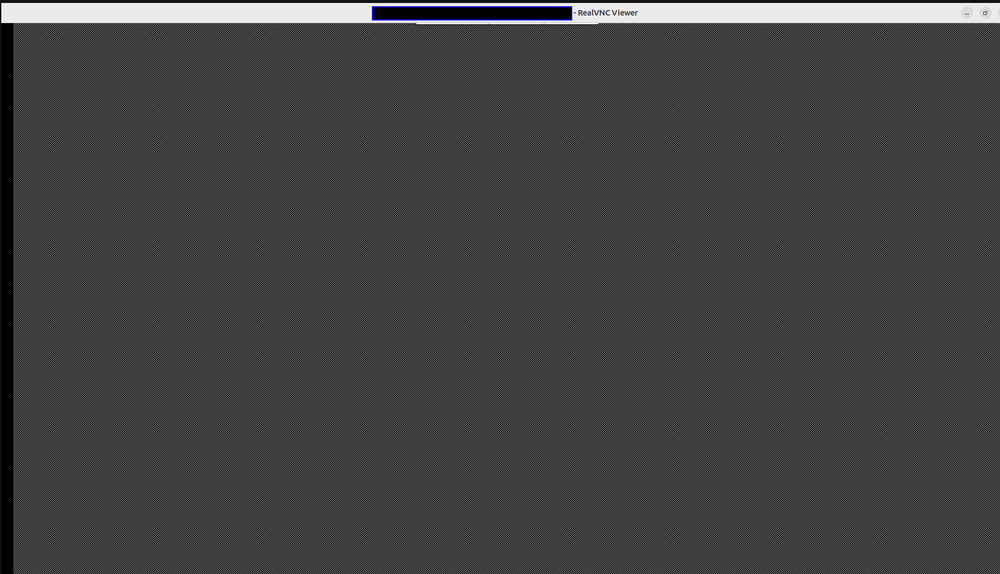
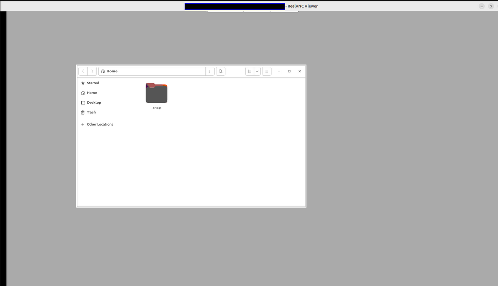
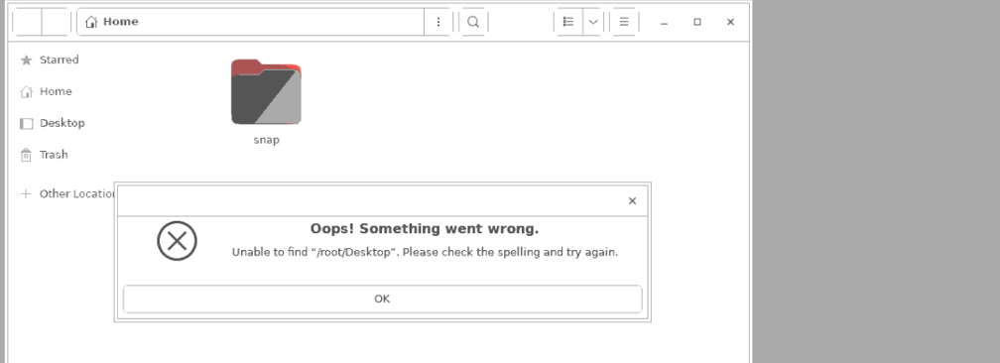
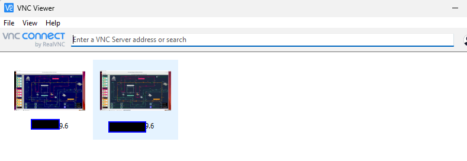
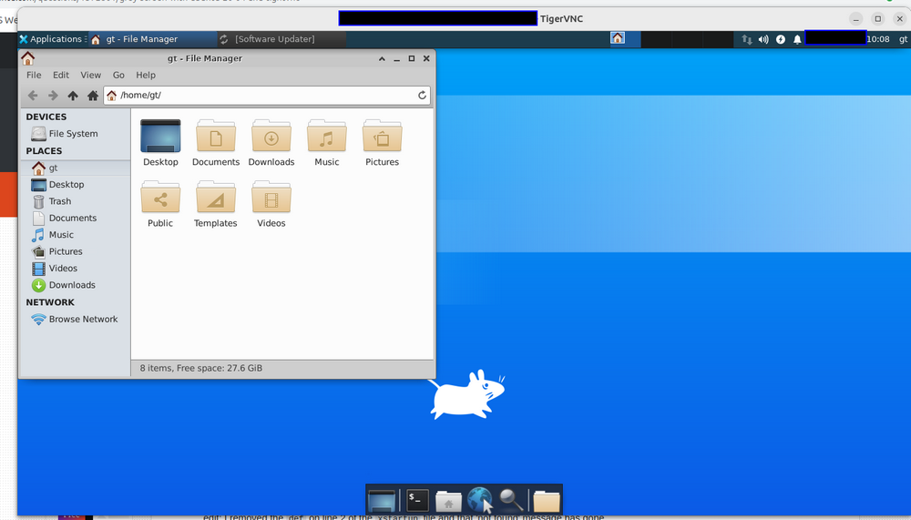

# Steps to Solve the VNC "Gray Screen" Issue on Ubuntu Systems

Graphical desktop-sharing systems such as TeamViewer, AnyDesk, and LogMeIn allow users to remotely control another computer’s screen, keyboard, and mouse. Among these, tools like TigerVNC, TightVNC, and RealVNC use the Virtual Network Computing (VNC) protocol, which relies on the Remote Frame Buffer (RFB) protocol to transmit graphical updates and input events over a network. This article will show the detail steps to solve a "Gray Screen" Issue which happens very often when using VNC server.  

```
Author:      Yuancheng Liu

Created:     2025/05/31
Version:     v_0.1.1
Copyright:   Copyright (c) LiuYuancheng
```


[TOC]

------

### Problem Specification 

However, when setting up a VNC server on some Ubuntu systems, users may encounter a frustrating issue: after connecting remotely, the screen displays only a gray background with a cursor that appears as a small black "X", as shown below:



In other cases, the desktop background turns gray with only a single file explorer window (like Files or Nautilus) visible:



And when you click the desktop you may got the unable to find Desktop error even the Desktop folder is shown there:  



This issue is typically caused by problems in initializing the desktop environment during the VNC session. Common causes include:

- A missing or misconfigured desktop environment (e.g., GNOME, XFCE, or MATE)
- Incorrect display index settings in the VNC server
- Improper permissions or ownership of critical configuration files
- Running the VNC server as root, which may lead to environment conflicts

While there are many online tutorials offering various fixes, this article provides a step-by-step guide for resolving the gray screen issue, starting from a clean Ubuntu System. The solution works even when the VNC server is run as root and has been tested on Ubuntu 18.04, 20.04, and 22.04.


------

### Detail Steps to Solve the Issue (Root Access Supported)

This section provides a complete, step-by-step solution to resolve the **gray screen issue** in TightVNC on Ubuntu systems. The solution configures a lightweight XFCE desktop environment or GNOME Flashback session and enables VNC to function properly — even when running under the root user. 

 

#### Step 1: Install the XFCE Desktop Environment

XFCE is a lightweight desktop environment that works well with VNC.

```bash
sudo apt-get update
sudo apt-get install xfce4 -y
```

Also install XFCE goodies (optional tools and utilities):

```
sudo apt-get install xfce4-goodies
```


####  Step 2: Install TightVNC and GNOME Flashback Session

TightVNC is the VNC server used in this setup. GNOME Flashback provides a simpler session suitable for remote access.

```
sudo apt-get install tightvncserver -y
sudo apt-get install gnome-session-flashback -y
```

The XFCE or GNOME Flashback ensures lightweight, compatible desktops for VNC sessions.


#### Step 3: Disable Wayland (Enable X11)

Ubuntu uses Wayland by default, which is not compatible with many VNC configurations.

Edit the GDM3 configuration:

```
sudo nano /etc/gdm3/custom.conf
```

Uncomment or modify the following line:

```
WaylandEnable=false
```

Save and close the file. This ensures X11 is used after reboot. When Wayland is disabled, allowing VNC to operate under X11.


#### Step 4: Prepare VNC Configuration Files (As Root)

This guide configures VNC for the root user for demonstration. For normal usage, it’s recommended to configure under a regular user.

```
sudo mkdir -p /root/.vnc
sudo chmod 0644 /root/.vnc
```

Set VNC password:

```
sudo touch /root/.vnc/passwd
sudo chmod 0600 /root/.vnc/passwd
sudo bash -c 'echo "<your password>" | tightvncpasswd -f > /root/.vnc/passwd'
```


#### Step 5: Initialize VNC and Create xstartup Script

Start VNC to initialize config files:

```
vncserver
```

Then stop it for the next step :

```
vncserver -kill :1
```

Create or overwrite the `xstartup` file:

```
sudo touch /root/.vnc/xstartup
sudo chmod 0600 /root/.vnc/xstartup
sudo nano /root/.vnc/xstartup
```

Paste the following content:

```
#!/bin/sh
autocutsel -fork
xrdb $HOME/.Xresources
xsetroot -solid grey
export XKL_XMODMAP_DISABLE=1
export XDG_CURRENT_DESKTOP="GNOME-Flashback:Unity"
export XDG_MENU_PREFIX="gnome-flashback-"
unset DBUS_SESSION_BUS_ADDRESS
gnome-session --session=gnome-flashback-metacity --disable-acceleration-check --debug &
```

Make sure the file is executable:

```
chmod +x /root/.vnc/xstartup
```

The xstartup script explicitly starts the graphical session and disables DBUS conflicts.


#### Step 6: Create a Systemd Service to Autostart VNC

Create the VNC service file:

```
sudo nano /etc/systemd/system/tightvncserver.service
```

Add the following contents:

```
[Unit]
Description=TightVNC Server
After=syslog.target network.target

[Service]
Type=forking
User=root
ExecStartPre=-/usr/bin/tightvncserver -kill :0
ExecStart=/usr/bin/tightvncserver -geometry 1920x1080 -depth 24 :0
ExecStop=/usr/bin/tightvncserver -kill :0

[Install]
WantedBy=multi-user.target
```

Set permissions:

```
sudo chmod 0600 /etc/systemd/system/tightvncserver.service
```

Enable and start the service:

```
bashCopyEditsudo systemctl daemon-reexec
sudo systemctl enable tightvncserver
sudo systemctl start tightvncserver
```

The Systemd service ensures VNC starts automatically on boot.


#### Step 7: Reboot and Connect via VNC

Now, reboot the machine:

```
sudo reboot
```

After reboot, use a VNC client like **TigerVNC Viewer** or **RealVNC** to connect to:



```
<your-ip-address>:5900
```

Or if using display `:1`:

```
<your-ip-address>:1
```

You should see a fully functional desktop like the following:




------

> Last edit by LiuYuancheng(liu_yuan_cheng@hotmail.com) at 20/09/2023